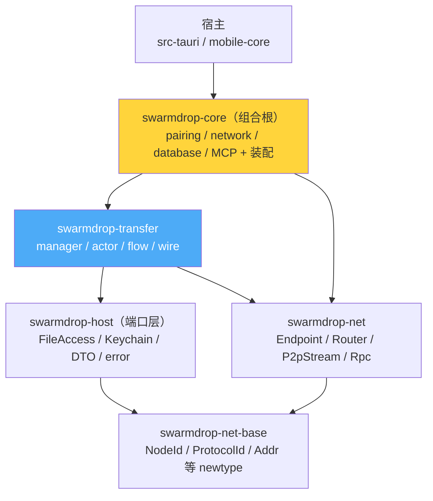

# 传输域抽成独立 crate：六层分层

> **本篇讲什么**：把文件传输逻辑从「埋在 `swarmdrop-core` 里」重构成一个独立 crate
> `swarmdrop-transfer`，以及由此形成的六层分层架构。
>
> **为什么重要**：这是「单一职责」从口号变成编译期约束的一步。抽成独立 crate 之后，「传输域不该
> 依赖 sea-orm/pairing/network」就不再靠自觉，而是**编译器强制**——依赖表里没有，就是没有。

上一篇（[00 dumbpipe 形状](00-dumbpipe-shape.md)）说到：选了 dumbpipe 形状，传输业务只向下依赖
裸管道，于是它**能**被切成独立 crate。这一篇讲怎么切。

## 起点：传输逻辑埋在 core 里

重构前，`swarmdrop-core` 是一个大 crate，传输的 manager / actor / flow / wire 全在
`crates/core/src/transfer/` 下，和 pairing、network、database、host 混在同一个编译单元里。问题：

- **无法约束依赖方向**——transfer 的代码可以随手 `use crate::database::...`、
  `use sea_orm::...`，没有任何边界拦着。
- **无法单独编到 wasm**——core 拖着 sea-orm 的 tokio runtime，整个撞 wasm 硬墙。
- **Web 端无法复用**——想让浏览器跑同一份传输逻辑，必须先把它从 core 的平台依赖里剥出来。

## 终点：六层分层

重构后是一条清晰的依赖链。每层只依赖它下面的层，箭头永不回头：



依赖箭头由各 crate 的 `Cargo.toml` 强制（真实可核对）：

| crate | 角色 | 关键依赖 | **不依赖** |
|---|---|---|---|
| `swarmdrop-net-base` | 类型底座 | —— | 一切 |
| `swarmdrop-net` | 网络内核 | net-base, libp2p | transfer / core |
| `swarmdrop-host` | 端口层 | net-base, entity, sea-orm（**仅类型宏**）| net / transfer / core |
| `swarmdrop-transfer` | 传输域 | net, host, entity | **sea-orm / pairing / network** |
| `swarmdrop-core` | 组合根 | net, host, transfer, sea-orm, entity | —— |
| 宿主 | 平台壳 | core | —— |

注意 `swarmdrop-transfer` 那一行：它依赖 `entity`（数据模型）和 `swarmdrop-host`（端口 trait），
但**不依赖 sea-orm、不依赖 core 的 pairing/network 模块**。这怎么做到的——不是靠约定，是靠
[02 依赖倒置](02-dependency-inversion-ports.md) 讲的端口 trait。本篇先只看分层本身。

## 为什么值得抽出来

**① Web 复用 / 双 target 可编。** transfer crate 的 `Cargo.toml` 顶部写明它经端口 trait 依赖倒置、
**wasm 双 target 可编**。CI 的 `scripts/check-wasm.sh` 直接把它列进检查清单：

```bash
# scripts/check-wasm.sh —— 五 crate 双门（check + clippy -D warnings）
CRATES=(-p swarmdrop-net-base -p swarmdrop-net -p swarmdrop-host -p swarmdrop-transfer -p swarmdrop-web)
cargo clippy "${CRATES[@]}" --target wasm32-unknown-unknown -- -D warnings
cargo check "${CRATES[@]}" --target wasm32-unknown-unknown
```

抽成独立 crate 之后，「transfer 能不能编到浏览器」变成一条每次 PR 必跑的门禁——**回归立刻可见**，
不用等真跑起来才发现拖了个 wasm 编不过的依赖。

**② 单一职责成为编译期事实。** 抽出来后，transfer 想引用 sea-orm 会直接编译失败（依赖表里没有）。
「传输域不认识 ORM」从 code review 靠肉眼盯，升级成 `cargo build` 靠不过。

**③ 平台中立。** 桌面（Tauri）、移动（uniffi）、Web（wasm）三端共享**同一份** transfer 逻辑。
文件读写、持久化、事件发射这些有平台差异的部分，全被推到端口 trait 后面（见 02/03）。

这个「一份逻辑、三端复用」不是愿景，是已经落地的物理事实：

| 端 | 怎么用到 transfer | 改一次 transfer 的影响 |
|---|---|---|
| 桌面 | `src-tauri` → `swarmdrop-core` → `swarmdrop-transfer` | 立即生效 |
| 移动 | `mobile-core`（uniffi）以 path 依赖引 `crates/core` → transfer | `cargo check --workspace` 一并覆盖 |
| Web | `swarmdrop-web`（wasm）复用同一份 transfer | `check-wasm.sh` 门禁保证可编 |

改一处传输逻辑，`cargo check --workspace` 三端一起过或一起挂——**没有「桌面改了忘了同步移动端」
的窗口**。这正是把它从 core 里剥成独立 crate、而不是复制三份的全部意义。

## 迁移手法：git rename 保留历史

传输域是从 `crates/core/src/transfer/` 整体挪到 `crates/transfer/src/` 的。用 `git mv` 而非
删+建，历史随之延续——`git log --follow` 能一路追到重构前：

```
$ git log --oneline --follow -- crates/transfer/src/actor/sender.rs
9323d4f  feat(transfer): bao-tree 逐块验证——文件收完前每块可验签
95ea56a  refactor(transfer): 传输域独立 crate + 持久化端口 trait（依赖倒置）  ← 抽 crate 这一刀
5ce6be3  refactor(net)!: 重写网络内核为 iroh 风格 API + wire v2 全栈迁移
d8d6234  refactor(transfer): SendSession→SenderActor 全局重命名          ← 抽 crate 之前
7f2e5f0  refactor(transfer): 模块按功能分层 actor/flow/wire              ← 更早
```

`95ea56a` 是抽 crate 那一刀，它之前的 commit（`d8d6234`、`7f2e5f0`）都是传输逻辑还在 core 里时的
改动——`--follow` 照样追得到。**跨文件移动不该丢历史**，这是重构的基本卫生。

## 兼容层：core 用 alias 桥接命名空间

迁出前，core 里到处是 `crate::transfer::*`、`crate::host::*`、`crate::{AppError, AppResult}`。
逐处改路径成本高、diff 噪音大。解法是在两处加 `pub use` alias，让老路径继续解析：

```rust
// crates/core/src/lib.rs
pub use swarmdrop_transfer as transfer;   // crate::transfer::* 仍有效
```

```rust
// crates/transfer/src/lib.rs
//  迁出前这些模块内写的是 crate::host:: / crate::error:: / crate::{AppError, AppResult}；
//  下沉后统一解析到 swarmdrop-host，避免逐处改路径。
pub use swarmdrop_host as host;
pub use swarmdrop_host::{AppError, AppResult, device, error};
```

`swarmdrop-core` 里 `crate::transfer::manager::TransferManager` 这样的路径一个字不用改——alias 把
新 crate 名映射回老命名空间。**重构的表面积应该尽量小**：改的是物理边界（crate），不是每一处引用。

## 组合根：谁把六层接起来

分层只规定「谁能依赖谁」，不负责「谁来实例化谁」。真正的装配发生在 `swarmdrop-core`——它是
**组合根**（composition root），在这里把端口的具体实现注入进 transfer：

```rust
// crates/core/src/runtime.rs（装配三协议入站 Router）
Router::builder(endpoint.clone())
    .accept(PAIRING_PROTOCOL, PAIRING.handler(PairingService(pairing.clone())))
    .accept(TRANSFER_CTRL_PROTOCOL, TRANSFER_CTRL.handler(TransferCtrlService::new(
        transfer.clone(), pairing, endpoint.clone(), notifier,
    )))
    .accept(TRANSFER_DATA_PROTOCOL, TransferDataHandler::new(transfer))
    .spawn()
```

组合根是**唯一**知道全部具体类型的地方：它知道 `SqlSessionStore` 用 SeaORM、`PairingManager`
实现了 `PeerDirectory`、`CoreTransferEvents` 把事件转成 `CoreEvent`。transfer 自己一概不知——它
只见 trait。

这套「消费方定义接口、组合根注入实现」的手法，就是下一篇的主题。

**下一篇** → [02 依赖倒置：端口 trait 定义在消费方](02-dependency-inversion-ports.md)
