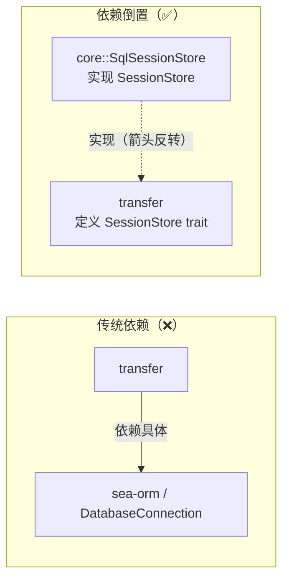

# 依赖倒置：端口 trait 定义在消费方

> **本篇讲什么**：`swarmdrop-transfer` 如何做到「不依赖 sea-orm、不依赖 pairing/network 模块」——
> 它不去依赖那些具体实现，而是**自己定义一组端口 trait**，由 `swarmdrop-core` 实现并注入。
>
> **为什么重要**：这是依赖倒置原则（DIP）在真实代码里的样子。精髓不是「用了 trait」，而是
> **接口归消费方所有**——是 transfer 说「我需要一个能存会话的东西」，而不是 transfer 去迁就
> sea-orm 的形状。

上一篇（[01 六层分层](01-crate-extraction.md)）留了个问题：transfer 依赖表里没有 sea-orm，但它
分明要往 SQLite 写会话、写 checkpoint。这怎么可能？答案就是依赖倒置。

## 问题：断点续传需要持久化，但持久化是平台细节

传输域要做断点续传，就得把会话、文件 checkpoint、outboard 落库。桌面/移动端用 SeaORM + SQLite，
Web 端将来用 IndexedDB/OPFS。如果 transfer 直接 `use sea_orm::DatabaseConnection`：

- Web 端编不过（sea-orm 的 tokio runtime 撞 wasm 硬墙，见 `storage-abstraction.md`）；
- 传输域和一个具体 ORM 焊死，违背单一职责。

传统写法是 transfer 依赖 database 模块（高层依赖低层的具体实现）。依赖倒置把这个箭头**掉过来**。



关键：`SessionStore` 这个接口**定义在 transfer 里**（消费方），实现放在 core 里（低层）。低层
反过来依赖高层定义的接口——这就是「倒置」。

## 端口清单：transfer 自己开出的需求单

transfer 把它对外界的全部需求，收敛成几个端口 trait，**大部分**定义在自己的 crate 内（`SessionStore`/`InboxStore`/`PeerDirectory`/`TransferEventSink`/`TransferRuntime` 是 transfer 自有；`FileAccess` 因是宿主通用能力端口——桌面/移动/Web 都要读写文件——定义在 `swarmdrop-host`，transfer 只消费）：

| 端口 trait | 位置 | 抽象的能力 | core 侧实现 |
|---|---|---|---|
| `SessionStore` / `InboxStore` | `store.rs` | 会话/文件/checkpoint/outboard 持久化 | `SqlSessionStore`（SeaORM）|
| `PeerDirectory` | `peer.rs` | 按 NodeId 查已配对设备 | `PairingManager` |
| `FileAccess` | `swarmdrop-host/ports.rs` | 读源文件 / 写落盘文件 | 桌面 path_ops / RN SAF |
| `TransferEventSink` | `events.rs` | 发射域内事件 | `CoreTransferEvents`（见 [03](03-event-cycle-breaking.md)）|
| `TransferRuntime` | `runtime.rs` | shutdown 时驱动清理任务 | `TransferManager` 自身 |

transfer 的核心结构体 `TransferManager` 只持有这些 trait 对象，**不认识任何具体类型**：

```rust
// crates/transfer/src/manager.rs
pub struct TransferManager {
    pub(crate) endpoint: Endpoint,
    pub(crate) events: Arc<dyn TransferEventSink>,   // 事件端口
    pub(crate) store: Arc<dyn TransferStore>,        // 持久化端口
    pub(crate) file_access: Arc<dyn FileAccess>,     // 文件端口
    pub(crate) coordinator: Arc<TransferCoordinator>,
    // ... DashMap 会话簿记
}
```

`Arc<dyn TransferStore>` 的背后是 SeaORM 还是 IndexedDB，`TransferManager` 一无所知也不关心。

## 精髓：接口归消费方所有

依赖倒置最容易被误解的地方：**不是「用了 trait 就叫依赖倒置」**。如果 trait 定义在 database
模块里、transfer 去 import 它——那 transfer 还是依赖 database，箭头没倒。

倒置的标志是**接口的所有权在消费方**。`SessionStore` 的方法签名，是按 transfer 的**用例**长出来的，
不是按 SQL 表长出来的：

```rust
// crates/transfer/src/store.rs
#[async_trait]
pub trait SessionStore: Send + Sync {
    /// 创建传输会话 + 关联文件记录（策略快照随建会话一次写入）。
    async fn create_session(&self, input: CreateSessionInput<'_>) -> AppResult<()>;
    /// 更新文件 range checkpoint 和已传输字节数（数据面）。
    async fn update_file_checkpoint_ranges(&self, /* ... */) -> AppResult<()>;
    /// 持久化发送方某文件的 bao outboard（逐块验签 Merkle 树）。
    async fn save_file_outboard(&self, session_id: Uuid, file_id: i32, outboard: Vec<u8>) -> AppResult<()>;
    // ...
}
```

## 用例级粒度：事务是实现细节

注意 `create_session` 而不是 `insert_session_row` + `insert_file_row`。这是刻意的**用例级粒度**
（`storage-abstraction.md` 的关键决策）：

- trait 上**永不出现** `begin` / `commit`。「一次建会话要原子地写 session 行 + N 个 file 行」是个
  事务需求——但事务怎么实现是端口内部的事。SQLite 用 SeaORM 事务，IndexedDB 用它的微任务窗口。
- 粒度贴着**业务动作**（「创建一个传输会话」），不贴着**存储操作**（「插一行」）。这样两端存储引擎
  的事务语义差异，被挡在实现里，透不到 trait 上。

## core 侧实现：委托既有 ops 函数

core 的 `SqlSessionStore` 持有 `DatabaseConnection`，方法体只是把调用**委托**给既有的 `ops` 函数
（函数本体一行不动）：

```rust
// crates/core/src/database/store.rs
pub struct SqlSessionStore { db: Arc<DatabaseConnection> }

#[async_trait]
impl SessionStore for SqlSessionStore {
    async fn create_session(&self, input: CreateSessionInput<'_>) -> AppResult<()> {
        ops::create_session(&self.db, input).await          // 委托，不重写
    }
    async fn save_file_outboard(&self, session_id: Uuid, file_id: i32, outboard: Vec<u8>) -> AppResult<()> {
        ops::save_file_outboard(&self.db, session_id, file_id, outboard).await
    }
    // ... 逐方法委托
}
```

抽端口**不需要重写持久化逻辑**——`ops.rs` 里那 20 多个 `db: &DatabaseConnection` 首参的函数原样
保留，`SqlSessionStore` 只是给它们套了个 trait 的壳。改动被压到最小。

## 合并端口 + blanket impl

`TransferManager` 想用一个 `Arc` 同时拿到会话和收件箱两种能力，于是有个合并端口，靠 blanket impl
自动满足：

```rust
// crates/transfer/src/store.rs
pub trait TransferStore: SessionStore + InboxStore {}
impl<T: SessionStore + InboxStore + ?Sized> TransferStore for T {}
```

`SqlSessionStore` 只需分别 impl `SessionStore` 和 `InboxStore`，`TransferStore` 自动就有了。
transfer 注入时用 `Arc<dyn TransferStore>` 一把拿全。

## 证据：边界 grep 零 sea_orm

依赖倒置做没做到位，不靠感觉，靠 grep：

```
$ grep -rn "sea_orm\|DatabaseConnection" crates/transfer/src/ | wc -l
0
$ grep -rn "swarmdrop_core\|crate::pairing\|crate::network" crates/transfer/src/ | wc -l
0
```

**零命中**。传输域整个 crate 里没有一个 `sea_orm`、没有一个 `DatabaseConnection`、没有一处引用
core 的 pairing/network 模块。这不是纪律，是编译期事实——依赖表里根本没有它们，想引用也引用不到。

## 顺带解掉的两个耦合

抽端口时还顺手解掉了两处 transfer 对 core 的隐式依赖：

- **`PeerDirectory`**（`peer.rs`）——`incoming.rs` 判断「offer 来自已配对设备吗」原本要摸 core 的
  配对管理器。抽成端口后，transfer 只声明「我需要按 NodeId 查设备」，`PairingManager` 在 core 侧
  `impl PeerDirectory`。
- **`FileAccess`**（`swarmdrop-host`）——读写文件本就是平台差异最大的地方，早已是 trait，桌面走
  `.part` 重命名、移动走 SAF document URI，transfer 只见 `read_source_chunk` / `write_sink_chunk`。

## 还剩一个端口没讲：事件

端口清单里的 `TransferEventSink` 被我略过了。它值得单独一篇——因为它解的不是「解耦第三方依赖」，
而是一个**真实的循环依赖**：`CoreEvent` 反向引用了 transfer 的 wire 类型，transfer 若直接依赖
`CoreEvent` 就会成环。同样的依赖倒置手法，这次是拿来**解环**。

**下一篇** → [03 打破事件循环依赖：TransferEventSink](03-event-cycle-breaking.md)
