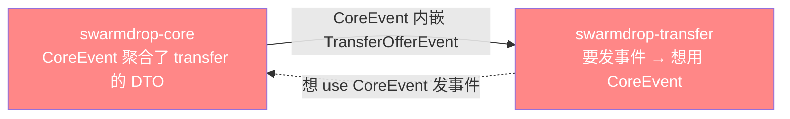
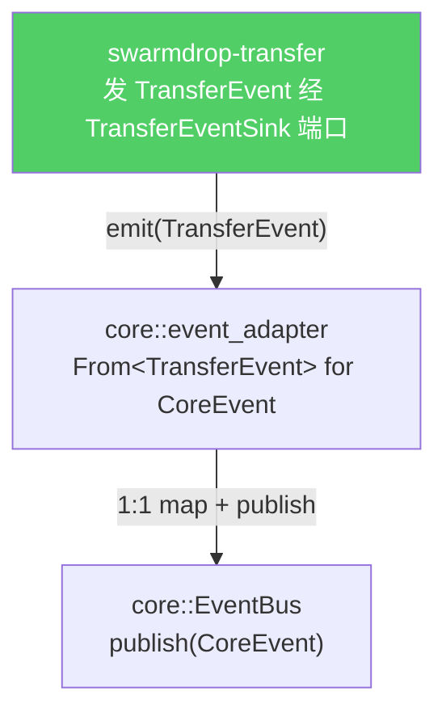
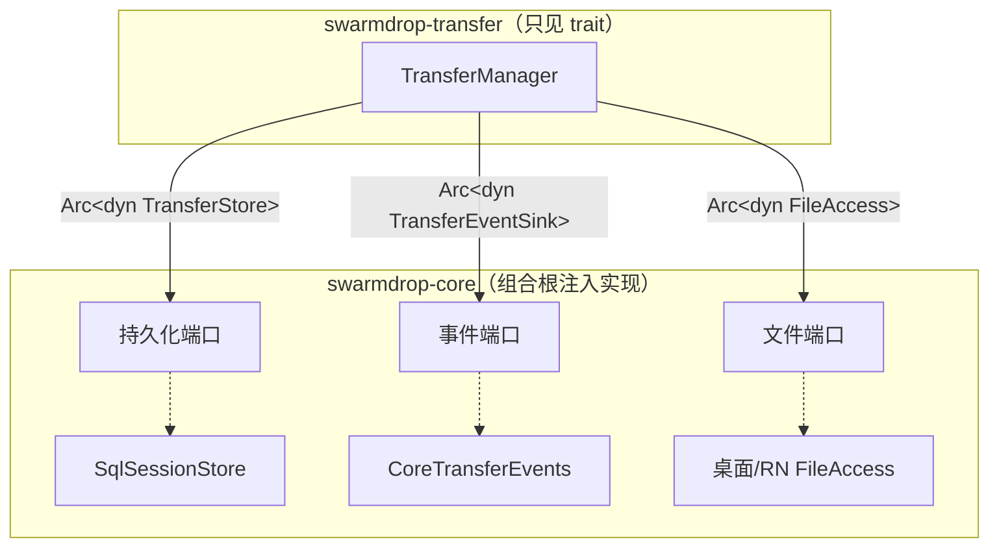

# 打破事件循环依赖：TransferEventSink

> **本篇讲什么**：抽 crate 时撞到的一个真实**循环依赖**——`CoreEvent` 反向引用 transfer 的 wire
> 类型，于是 transfer 无法依赖 `CoreEvent` 来发事件（一依赖就成环）。解法是让 transfer 发自己的
> `TransferEvent`，core 侧适配器再 1:1 映射进 `CoreEvent`。
>
> **为什么重要**：上一篇的 store 端口解的是「解耦一个第三方依赖」；这篇解的是「打破一个不可能
> 同层共存的环」。是同一个手法（依赖倒置），但动机不同——它是「依赖倒置解环」的教科书案例。

上一篇（[02 依赖倒置](02-dependency-inversion-ports.md)）的端口清单里，我故意跳过了
`TransferEventSink`。因为它不是「为了优雅」抽出来的，是**不抽就编不过**。

## 环从哪来

传输过程中，transfer 要不停向前端发事件：offer 到了、进度更新了、传输完成了。宿主统一走一个聚合
事件总线 `EventBus`，它的消息类型是 `CoreEvent`——一个把 network / pairing / transfer 各域事件
汇到一起的大枚举：

```rust
// crates/core/src/host.rs
pub enum CoreEvent {
    NetworkStatusChanged { status: NetworkStatus },     // network 域
    PairingRequestReceived { /* ... */ },               // pairing 域
    TransferOfferReceived { offer: TransferOfferEvent }, // ← 引用 transfer 的类型！
    TransferProgress { event: TransferProgressEvent },   // ← 引用 transfer 的类型！
    // ...
}
```

看第三、四行：`CoreEvent` 的变体**直接内嵌了 transfer 域的 DTO**（`TransferOfferEvent`
定义在 `crates/transfer/src/incoming.rs`，`TransferProgressEvent` 在 `progress.rs`）。也就是说：

> **`CoreEvent` 依赖 transfer**（要引用它的 wire 类型来组装聚合枚举）。

那么如果 transfer 为了发事件去 `use crate::host::CoreEvent`，就变成：

> **transfer 依赖 `CoreEvent`（进而依赖 core）**。

两条箭头一对撞，环就成了：



Rust 的 crate 依赖图必须是 DAG——**这个环让 `swarmdrop-transfer` 根本无法编译**。

## 为什么不把 CoreEvent 下沉到 host 层了事

自然会想：把 `CoreEvent` 和 `EventBus` 一起下沉到端口层 `swarmdrop-host`，不就没环了？

不行。`CoreEvent` 聚合的是 network / pairing / transfer **多个域**的 DTO——它引用的类型分散在
比 host 更高的层。把它塞进 host 层，host 就得反过来依赖 transfer 和 network，**环只是换了个位置**。
host crate 的模块注释把这条讲得很清楚：

```rust
// crates/host/src/lib.rs
//! 事件聚合（CoreEvent / EventBus）与测试用 MemoryHost 不在本 crate——它们引用
//! network / transfer 域的 DTO（含 transfer wire 类型），下沉到端口层会成环，
//! 故留在 swarmdrop-core。
```

聚合层天生在上层。真正该动的不是它的位置，而是**transfer 发事件的方式**。

## 解法：transfer 发自己的事件，core 做适配

依赖倒置再用一次。transfer 不去认识 `CoreEvent`，而是**定义一个自己的事件枚举 + 一个发射端口**：

```rust
// crates/transfer/src/events.rs
/// transfer 域事件（变体名与 payload 与 CoreEvent 的 transfer 变体一一对应）。
pub enum TransferEvent {
    TransferOfferReceived { offer: TransferOfferEvent },
    TransferProgress { event: TransferProgressEvent },
    TransferCompleted { event: TransferCompleteEvent },
    // ... 只含 transfer 自己域内的变体
}

/// transfer 事件发射端口。core 侧适配器实现，把 TransferEvent 转 CoreEvent。
#[async_trait]
pub trait TransferEventSink: Send + Sync {
    async fn emit(&self, event: TransferEvent) -> AppResult<()>;
}
```

`TransferEvent` 只含传输域自己的变体（没有 network、没有 pairing），它引用的全是 transfer 内部的
类型——**没有对 core 的任何依赖**。`TransferManager` 持 `Arc<dyn TransferEventSink>`，发事件时只调
`self.events.emit(TransferEvent::...)`。

然后在 core 的组合根，一个适配器把 `TransferEvent` **1:1 映射**进 `CoreEvent`，再走真正的
`EventBus`：

```rust
// crates/core/src/event_adapter.rs
pub struct CoreTransferEvents(pub Arc<dyn EventBus>);

#[async_trait]
impl TransferEventSink for CoreTransferEvents {
    async fn emit(&self, event: TransferEvent) -> AppResult<()> {
        self.0.publish(event.into()).await   // TransferEvent → CoreEvent → EventBus
    }
}

impl From<TransferEvent> for CoreEvent {
    fn from(e: TransferEvent) -> Self {
        match e {
            TransferEvent::TransferOfferReceived { offer } => CoreEvent::TransferOfferReceived { offer },
            TransferEvent::TransferProgress { event }      => CoreEvent::TransferProgress { event },
            // ... 逐变体平移
        }
    }
}
```

环断了。依赖箭头现在全部朝下：



`CoreEvent` 仍然内嵌 `TransferOfferEvent` 这些 DTO（这个方向的依赖没问题，core → transfer 是正向），
但 transfer **不再反向依赖 `CoreEvent`**——它只认识自己的 `TransferEvent`。回头的那条箭头被端口
切断了。

## 为什么 1:1 映射不算浪费

有人会觉得 `TransferEvent` 和 `CoreEvent` 的 transfer 变体长得一模一样，写一遍 `From` 是重复劳动。
但这正是解环的代价，而且代价很小：

- **变体一一对应、payload 完全复用**——`TransferOfferEvent` 这些 DTO 本身没有复制，两个枚举内嵌
  的是**同一个类型**。重复的只是变体标签，`From` 就是纯粹的搬运。
- **它买到的是一条断开的环**——用几十行机械的 match，换传输域可以独立编译、独立测试、独立编到 wasm。

这和 store 端口是同一味药：**消费方定义接口，组合根注入实现**。区别只在于，store 端口解的是「不想
依赖 sea-orm」，事件端口解的是「不能依赖 CoreEvent，否则成环」。前者是洁癖，后者是硬约束——但用的
是同一个依赖倒置。

## 三个端口，一张全图

到这里，transfer 对外界的全部依赖都被端口化了。把 [02](02-dependency-inversion-ports.md) 和本篇
合起来看：



传输域是一座只留了几个插座的孤岛：给它插上具体实现就能跑，插什么由组合根决定。桌面插 SeaORM +
Tauri 事件，Web 将来插 IndexedDB + wasm 事件——**同一份 transfer 代码，两套宿主**。

下一篇转向能力本身：dumbpipe 形状让我们自持一切，但也意味着「逐块验签」这个能力得自己补。那正是
bao-tree 的用武之地。

**下一篇** → [04 bao-tree 逐块验证：文件收完前每块可验](04-bao-tree-verified-streaming.md)
