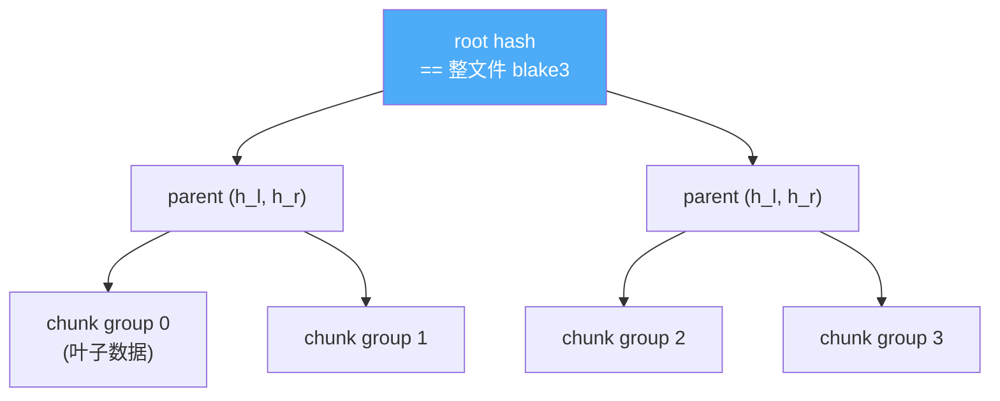

# bao-tree 逐块验证：文件收完前每块可验

> **本篇讲什么**：给传输域补上「文件收完前每一块都可独立验签」的能力。这是整个 iroh 生态调研里
> 认定的**唯一一处真实能力差**——用纯算法 crate `bao-tree` 补，不引 iroh 网络栈。
>
> **为什么重要**：它纠正一个极具迷惑性的认知陷阱——「我已经在用 blake3 了，所以不缺这个能力」。
> 用的是同一个哈希函数，但**不是同一个东西**。

前面几篇（[00](00-dumbpipe-shape.md)~[03](03-event-cycle-breaking.md)）把 dumbpipe 形状「自持一切」
的代价一一落地：帧、offer、续传都自己写。但有一样东西 dumbpipe 形状**没白送**——逐块验签。这篇补它。

## 认知陷阱：blake3 ≠ verified streaming

SwarmDrop 一直在用 blake3：prepare 阶段对每个文件算一个 blake3 校验和，放进 `FileInfo.checksum`。
很容易以为「已经在用 blake3，完整性有保障了」。**错。**

我们的 blake3 是**扁平的整文件 hasher**：

```rust
// crates/transfer/src/flow/prepare.rs（简化）
let mut hasher = blake3::Hasher::new();
for chunk in file {           // 逐块喂进同一个 hasher
    hasher.update(&chunk);
}
let checksum = hasher.finalize().to_hex();   // 一次性拿到整文件 hash
```

这个 checksum 只有在**整个文件收完**之后才能拿来验证——它是一个终点。后果：

- 收到第 5 块，无法判断它对不对，得等整文件收完、算完 hash 才知道；
- 续传时，磁盘上已有的半个文件**无法证明没被篡改**——只能选择信任对端。这就是旧栈的现状：
  **续传建立在「信任对端」之上**。

> ⚠️ verified streaming 的价值**不在哈希算法，在 outboard 这棵 Merkle 树**。用同一个 blake3，
> 有没有那棵树是天壤之别（`iroh-migration.md` 把这条列为「被推翻的旧认知」第一条）。

## bao-tree 是什么：把整文件 hash 拆成一棵可验树

blake3 内部本就是一棵 Merkle 树。bao-tree 把这棵树的**分支哈希**单独存出来，叫 **outboard**
（与原文件分离，原文件一字节不改）。有了 outboard，任意一段 range 都能**独立验签**：



验一块的原理：发送端把「这块 → root 的**兄弟路径**」一起发过来（这就是 Merkle proof），接收端
自底向上重算到 root，与已知 root 比对。三个概念：

- **outboard**——树的分支哈希，`outboard_size ≈ 文件 0.39%`（16 KiB chunk group 下）。
- **chunk group**——验证粒度。iroh 定的 `BlockSize::from_chunk_log(4)` = 16 KiB，我们照抄。
- **proof / bao 切片**——`encode_ranges_validated` 产出的「size header + 交错的 Parent/Leaf」，
  decode **必然验签，没有 skip 选项**（`bao-tree` 原话：跳过验证就违背了 verified streaming 的目的）。

（bao-tree / iroh-blobs 的通用机制详见 `.claude/skills/iroh/references/03c-blobs.md`；本篇只讲我们
的落地。）

## 落地决策一：root == checksum，零新字段

最省事的一条。`FileInfo.checksum` 已经是 prepare 流式算出的**标准 blake3 hex**。而在
`BlockSize::from_chunk_log(4)` 下——**bao 树根恰好等于标准整文件 blake3**（chunk group 只影响
outboard 的深度，不影响 root）。

于是验证 root 直接用现成的 checksum 解析，**FileInfo / wire 不加任何字段**：

```rust
// crates/transfer/src/bao.rs
pub const BLOCK_SIZE: BlockSize = BlockSize::from_chunk_log(4);  // 16 KiB，同 iroh IROH_BLOCK_SIZE

/// 把 FileInfo.checksum（blake3 hex）解析回验证 root。
pub fn root_from_checksum(checksum: &str) -> AppResult<blake3::Hash> {
    blake3::Hash::from_hex(checksum) /* ... */
}
```

单元测试把「root == 扁平 blake3」钉成不变量：

```rust
// crates/transfer/src/bao.rs（测试）
assert_eq!(root, blake3::hash(data), "bao root 必须等于扁平 blake3");
```

`CHUNK_SIZE`（256 KiB 传输块）是 16 KiB chunk group 的整数倍，fetch_plan 天然对齐；文件尾部非对齐
的零头由 bao 依 `file_size` 自处理。**验证粒度和传输粒度解耦，互不干扰。**

## 落地决策二：Approach B —— proof 携带完整 bao 切片，data 置空

wire 帧 `BlockData` 有两个字段：`data`（明文块）和 `proof`（证明）。有两种塞法：

- **Approach A**：Parent 进 proof、Leaf 数据进 `data`——需要手动交错拆/组 bao 流。但 bao-tree
  **没有稳定的公开迭代顺序 API**，手写易错，且叶子会出现两次（2x 冗余）。
- **Approach B（我们选的）**：`proof` 直接放 `encode_ranges_validated` 产出的**完整 bao 切片**
  （size header + Parent/Leaf 交错，含叶子明文），`data` 字段**恒置空**。叶子只在 proof 出现一次，
  **无 2x 冗余**（wire 开销 ≈ 明文 + parents ≈ 0.4%），且全走库的 encode/decode，**不手写 Merkle 验证**。

```rust
// crates/transfer/src/wire/data_frame.rs
BlockData {
    session_id: Uuid,
    epoch: i64,
    range: FileRange,
    /// 明文块数据。**bao 验证启用后恒为空**——叶子数据已在 proof 的 bao 切片内。
    data: Vec<u8>,
    /// 逐块完整性证明：encode_ranges_validated 产出的完整 bao 切片。
    /// None / 验签失败 = 协议违规 → 断流走 Interrupted 恢复。
    proof: Option<Vec<u8>>,
}
```

wire 布局兼容：proof 是 opaque bytes，用一个 `u8` 标志 + 可选 len-prefixed bytes 编码，**在 wire
v2 内启用，未 bump 版本号**（M3.5 预留的扩展位）。

## 落地决策三：发送端流式建 outboard，与 checksum 同源

发送端在 prepare 阶段建 outboard。用 **post-order** outboard——它是单遍流式构建的自然产物，
且两条构建路径（`build_outboard` 同步 + `build_outboard_from_source` 流式，`bao.rs:62-63`）产出同序，
`encode_proof` 用同一个 `PostOrderOutboard` 重建即可。经 iroh-io 的 `AsyncSliceReader` 适配 async 的
`FileAccess`——**内存有界，不整文件入内存**：

```rust
// crates/transfer/src/bao.rs
pub async fn build_outboard_from_source(
    file_access: &Arc<dyn FileAccess>, source_id: &FileSourceId, size: u64,
) -> AppResult<(blake3::Hash, Vec<u8>)> {
    let reader = FileAccessReader { /* 把 read_at 映射到 read_source_chunk */ };
    let ob = PostOrderOutboard::<Vec<u8>>::create(reader, BLOCK_SIZE).await?;
    Ok((ob.root, ob.data))     // root 必等于 checksum
}
```

在 `prepare` 里，它和 checksum 是**同一遍语义、同源构建**，debug 下断言二者一致：

```rust
// crates/transfer/src/flow/prepare.rs
let checksum = hasher.finalize().to_hex().to_string();
let (root, outboard) = crate::bao::build_outboard_from_source(&self.file_access, &entry.source_id, entry.size).await?;
debug_assert_eq!(root.to_hex().to_string(), checksum, "bao root 必须等于扁平 blake3 checksum");
```

发送每块时，从 outboard 现算该 range 的 proof：

```rust
// crates/transfer/src/actor/sender.rs
let root = crate::bao::root_from_checksum(&file.checksum)?;
let proof = crate::bao::encode_proof(&file.outboard, root, file.size, offset, &plaintext)?;
// → BlockData { data: Vec::new(), proof: Some(proof), .. }
```

## 落地决策四：接收端不建 outboard

接收端**不建自己的 outboard**。因为我们不做再分发（不当别人的源），只需要「验过就写盘」。decode
时用一个**一次性的 throwaway outboard**，只承载 root 供验签，写进去的 parents 用完即弃：

```rust
// crates/transfer/src/actor/receiver.rs — verify_block
let root = crate::bao::root_from_checksum(&file_info.checksum)?;
let data = crate::bao::decode_and_verify(&proof, root, file_info.size, range.offset, range.length)?;
// proof 为 None 或验签失败 → Err（协议违规）→ 走 Interrupted 恢复
```

推论：**逐块验签通过 → 写盘可信 → checkpoint bitmap 本身可信**。续传时信任本地磁盘上已验过的块
（本地篡改不在传输威胁模型内），不再「信任对端」——旧栈那条信任假设被彻底拿掉。

## 落地决策五：outboard 存 SessionStore

发送端建好的 outboard 落库，供 resume 免重算。它不进 checkpoint 表的 range 列，而是
`transfer_files` 新增的独立 BLOB 列（`m20260718_000001_transfer_file_outboard.rs`），存取只经
[02](02-dependency-inversion-ports.md) 的持久化端口——**transfer 零 sea_orm**：

```rust
// crates/transfer/src/store.rs（SessionStore 端口）
async fn save_file_outboard(&self, session_id: Uuid, file_id: i32, outboard: Vec<u8>) -> AppResult<()>;
/// 无记录（旧会话 / 接收方）返回 None（发送端重算回存）。
async fn load_file_outboard(&self, session_id: Uuid, file_id: i32) -> AppResult<Option<Vec<u8>>>;
```

## 坏块被拒的证据

能力对不对，看测试。`bao.rs` 里篡改一字节就必败，用错 root 也必败：

```rust
// crates/transfer/src/bao.rs（测试）
#[test] fn tampered_block_is_rejected() {
    let mut proof = encode_proof(&outboard, root, size, offset, block).unwrap();
    proof[last] ^= 0xFF;                                    // 翻转 proof 里一个 leaf 字节
    let err = decode_and_verify(&proof, root, size, offset, len).unwrap_err();
    assert!(err.to_string().contains("bao 逐块验证失败"));   // 篡改块必须被拒
}
#[test] fn wrong_root_is_rejected() {
    let wrong_root = blake3::hash(b"different");
    assert!(decode_and_verify(&proof, wrong_root, size, 0, size).is_err());
}
```

还有 `roundtrip_tail_unaligned`（尾部非 16 KiB 整数倍）、`empty_file_roundtrips`（空文件）、
`streaming_build_matches_in_memory_and_flat_blake3`（流式 root == 扁平 blake3）——覆盖每一个边角。

## 一个悬念

既然现在每一块都能独立密码学验签、坏块必被拒——那为什么同一次重构里，我们把**应用层加密**
（XChaCha20-Poly1305）整块删掉了？这两件事看着矛盾：一个在加强完整性，一个在减防护。

其实不矛盾，而且它们互为因果：root == checksum 这条设计的前提是 **checksum 是明文 blake3**。一旦
在应用层加密，checksum 就成了密文哈希，bao 验证赖以成立的「root == 明文 blake3」就塌了。加密和
verified streaming 之间有一条真实的张力线——下一篇讲清楚。

**下一篇** → [05 删掉应用层加密：加密应该在哪一层](05-removing-encryption-layer.md)
