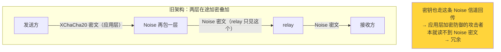

# 删掉应用层加密：加密应该在哪一层

> **本篇讲什么**：wire v2 重构删掉了整个 XChaCha20-Poly1305 应用层加密层。本篇讲**为什么删**
> （它在传输层加密之下是冗余的自引用），加密与内容寻址/逐块验签之间的张力，以及删掉后如何补上
> 它隐式承担的一件事——归属校验。
>
> **为什么重要**：这是「加密应该放在哪一层」的一个真实决策。多一层加密不等于多一层安全——放错层
> 的加密只是冗余的复杂度。
>
> ⚠️ **本篇取代旧文 [`transfer/end-to-end-encryption.md`](../transfer/end-to-end-encryption.md)**
> ——那篇描述的是重构前的架构（每次传输一把 XChaCha20 密钥）。旧文的密码学讲解仍有价值，但它描述
> 的加密层**已不存在**。

## 旧架构：应用层再加一层 AEAD

重构前，SwarmDrop 在 libp2p 传输层加密**之上**，又自己加了一层应用层加密：接收方生成一把
256-bit 密钥，握手时经 `OfferResult` 回传给发送方，之后每个 256 KiB 块用 XChaCha20-Poly1305 加密、
nonce 由 `(session_id, file_id, chunk_index)` 用 blake3 派生。旧文把这套讲得很细。

它的动机写在旧文开头：「数据在 P2P 网络中裸奔，任何 relay 中继节点都有机会看到传输内容」。听起来
天经地义。但把这句话和 libp2p 的实际行为对照，就会发现它站不住。

## 为什么它是冗余的：三个事实

**事实一：在途已经端到端加密了。** libp2p 的每一跳连接都是 Noise/TLS 加密的。跨网时数据经
circuit relay v2 转发，而 **relay 只转发 Noise 密文——它看不到明文**。iroh 官方文档把同样的性质
说得更直白：relay 服务器只中转加密流量，解不开任何东西。所谓「relay 能看到内容」，在 Noise/QUIC-TLS
之下并不成立。

**事实二：密钥和密文走同一条信道，对攻击者零增益。** 那把 256-bit 密钥是接收方生成后，经
`OfferResult` **沿同一条 libp2p Noise 信道**回传给发送方的。也就是说，密钥和它保护的密文，走的是
**同一条已加密的管道**。一个能看到密文的攻击者，必然也能看到密钥——两者在同一条 Noise 信道里。
这是**自引用**：你用信道 X 分发一把密钥，再用这把密钥去防御「能读信道 X 的人」。防了个寂寞。

**事实三：它不承担 at-rest 职责。** 这层加密的密钥只存内存、从不落库，落盘文件是**明文**。所以它
不是「存储加密」，纯粹是「在途加密」——而在途已经有 Noise 了。



一句话结论（`iroh-migration.md` 的推论）：**应用层加密在传输层加密之下是冗余的**，删掉它对网络
攻击者零损失。

## 更深一层：加密与逐块验签的张力

删加密还有一个来自 [04](04-bao-tree-verified-streaming.md) 的正面理由。bao-tree 逐块验签的整个设计
建立在一条不变量上：

> **root == checksum == 明文文件的标准 blake3。**

一旦在应用层加密，`checksum` 就得变成**密文的哈希**（否则验不了收到的密文块）。于是：

- bao 验证赖以成立的「root == 明文 blake3」塌了；
- 更根本地，加密和**内容寻址**天生对立——加密后 hash 变密文哈希，而 nonce 基于
  `(session_id, file_id, chunk_index)` **每接收方不同** → 同一文件对不同接收方是不同密文 →
  hash 不同 → **去重/复用价值归零**（`iroh-migration.md` 的「加密冲突」条）。

我们虽然没走内容寻址，但这条张力解释了为什么加密层和 verified streaming**不能共存**：留着加密，
04 那套「root == 明文 blake3、每块可独立验签」根本做不成。二者只能选一个，我们选了逐块验签。

## wire v2：整块删除

于是 wire v2 把 `crypto` 模块整文件删掉，控制面不再携带传输密钥，数据面直接传明文（外面还裹着
Noise）：

```rust
// crates/transfer/src/protocol.rs（模块文档）
//! wire v2 删除了应用层 XChaCha20 加密：Noise/TLS 在途已加密，relay 只见密文，
//! 密钥经同一加密信道分发是自引用——故 OfferResult / ResumeCommit 不再携带传输密钥。
```

```
$ grep -rniE "xchacha|chacha|poly1305|TransferCrypto" crates/transfer/src/
crates/transfer/src/protocol.rs:  // 注释：说明为何删除
crates/transfer/src/wire/mod.rs:  // 注释：crypto 整文件移除
```

生产代码里**零加密原语**，只剩两处解释「为什么删」的注释。`OfferResult` 从此不带 `key` 字段
（对比旧文里的 `OfferResult { accepted, key: Option<[u8;32]>, .. }`）。

## 补偿：删掉加密，别丢了归属校验

这是删加密时**必须回答的一个问题**：旧的应用层加密除了保密，还隐式承担了一件事——**归属证明**。
接收方能解密，某种程度上证明了「对面确实是握手时那个发送方」（密钥是点对点交换的）。删掉加密，
这个隐式保证也没了：一条冒充的数据面流理论上可以往你的接收会话里灌数据。

补偿方式：数据面流入站时，**显式校验流的远端身份**。而这一点，dumbpipe 形状天然给得起——因为
`P2pStream::remote()` 是**传输层认证过的对端身份**（Noise 握手鉴权，不可伪造）：

```rust
// crates/net/src/stream.rs
/// 传输层身份即归属证明：数据面协议必须校验 stream.remote() == session.peer
/// （取代已删除的应用层加密所隐式承担的归属校验）。
pub fn remote(&self) -> NodeId { self.remote }
```

数据面 handler 读完 Hello 后，第一件事就是核对归属，不匹配立即断流：

```rust
// crates/transfer/src/wire/data_plane.rs — handle_inbound_data_stream
// 归属校验：传输层身份即归属证明（取代已删除的应用层加密所隐式承担的归属校验）。
if stream.remote() != receive.peer_id {
    return Err(AppError::Transfer(format!(
        "data stream 归属校验失败: session={session_id}, remote={}, expected={}",
        stream.remote(), receive.peer_id
    )));   // 不发 Abort，不泄露
}
```

**传输层身份即归属证明**——这比「靠能否解密来隐式推断身份」直接得多，而且它是网络内核已经算好的
东西，业务层白拿。（配对层的授权判定另有一道，见 [02](02-dependency-inversion-ports.md) 的
`PeerDirectory`：offer 只接受已配对设备。E2E 加密 ≠ 授权，两者正交。）

## 加密应该在哪一层

把这个决策提炼成一条通用原则：

> **加密应该放在职责所在的那一层，且只放一次。**
>
> - **在途保密**是**传输层**的职责（Noise / QUIC-TLS）——它已经端到端加密，relay 只见密文。
>   在它之上再加一层应用层 AEAD，防御的是同一批攻击者，是冗余。
> - **静态保密**（at-rest）是**存储层**的职责。旧的应用层加密根本不落库，压根没在做这件事。
> - **归属/授权**是**应用层**的职责——但它要的是**身份校验**（`stream.remote()` + 配对目录），
>   不是再加一层数据加密。

旧架构的错误不在「加密写得不对」——旧文里的 XChaCha20-Poly1305 用法密码学上无懈可击。错在**放错了
层**：把一件传输层已经做完的事，在应用层又做了一遍，还引入了「密钥走同一信道」的自引用。删掉它，
架构反而更诚实——每一层只做自己该做的事。

## 系列回顾

至此，传输域的架构抽象走完一条完整的线：

- [00](00-dumbpipe-shape.md) 选 dumbpipe 形状 → 业务自持一切；
- [01](01-crate-extraction.md) 抽成独立 crate → 六层分层，单一职责成编译期事实；
- [02](02-dependency-inversion-ports.md) / [03](03-event-cycle-breaking.md) 依赖倒置 → 端口解耦、
  解环；
- [04](04-bao-tree-verified-streaming.md) 补齐逐块验签 → 不再信任对端；
- [05]（本篇）删掉冗余加密 → 每层只做该做的事。

一条主线：**让每一块代码待在它该待的层，依赖只朝一个方向流。**

← 返回 [系列导航](README.md)
