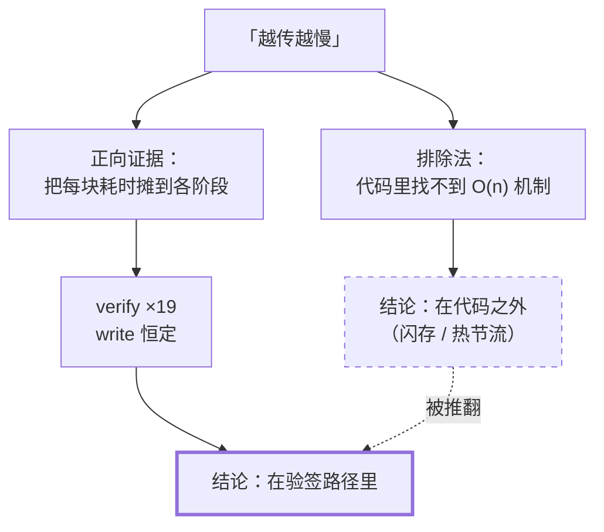

# 序：当「我没找到」被当成「它不存在」

> 一份很认真的诊断报告，得出了一个错误的结论。这篇讲它错在哪里——
> 不是错在某一步推理，而是错在**证据的种类**。

## 一个从 v0.10 就在的怪毛病

传大文件的时候，速度会越来越慢。

不是网络抖动那种忽快忽慢，是**单调下滑**：开头 50 MB/s，传到一半 20 MB/s，快结束时只剩
7 MB/s。重启应用、换文件、换网络，症状照旧。

这个现象在 SwarmDrop 里挂了好几个版本，内部代号「症状 B」。

## 上一轮：一次教科书式的排除法

2026 年 8 月上旬做过一轮系统性诊断。方法论相当规范：

- 七个维度并行侦察（发送、接收、验签、网络、存储、事件、UI）
- 三十条候选逐条对抗性验证
- 推翻其中十条
- 每条结论都带 `file:line` 和实测/推算数字

核心那一问是：**代码里有没有「随已完成量增长」的机制？**

因为「越传越慢」在算法上只有一种形状——某个操作的成本正比于已经传完的量。找出它，问题就解决了。

于是把所有嫌疑逐个量化：

| 候选 | 量级 |
|---|---|
| 进度事件的滑动窗口 | O(1)，窗口定长 |
| bitmap 扫描 | O(块数)，但每 10 块一次，且是位运算 |
| checkpoint 落库 | 定长 BLOB，SQLite 覆盖写 |
| 已完成文件列表 | 文件数级别，不是块数级别 |
| …… | …… |

**加总小于 0.1%。**

结论顺理成章：既然代码里找不到量级足够的机制，那它就在代码之外。报告写道：

> 主根因在**接收设备的物理侧**——闪存 pSLC 缓存耗尽后掉速、SoC 与 Wi-Fi 芯片热节流。

这个结论听起来很有说服力。手机闪存的 pSLC 缓存写满后掉速是真事，持续满负荷十分钟后热节流
也是真事。两者都能产生「单调下滑」的形状。

报告自己也标注了：**这是排除法得出的，不是正向证据**。它诚实地写着「没找到永远弱于找到了」。

## 它错了

一个月后，同样的场景，同样的文件，同样的两台设备——只是这次日志里多了一样东西：
**逐阶段耗时探针**。

探针做的事简单到近乎粗暴：把每一块的壁钟时间，摊到它经过的每个阶段上。

```
传输探针 role="recv" kind="window" blocks=512 mb_s=42.93
          stages=wait=1234ms verify=13ms write=34ms ckpt=207ms
```

然后取**桌面机**作对照组——它散热无忧，用的是 NVMe，压根没有 pSLC 缓存这回事。

按照上一轮的结论，桌面接收侧**不应该劣化**。

结果是这样的：

| 累计块 | 吞吐 | `verify` | `write` |
|---|---|---|---|
| 512 | 42.93 MB/s | **13 ms** | 34 ms |
| 15616 | 25.42 MB/s | **89 ms** | 36 ms |
| 28416 | 16.19 MB/s | **247 ms** | 35 ms |

三件事同时成立：

1. **桌面也劣化了**，42.93 → 16.19 MB/s
2. `verify`（纯 CPU 的验签）涨了 **19 倍**
3. `write`（真正的闪存/NVMe 写入）**全程恒定**，34 → 35 ms

第 3 条是致命的。如果问题真出在存储介质上，`write` 必须先动——**它没动**。
如果问题出在热节流，散热无忧的桌面机不该比手机劣化得更厉害——**它更厉害**（手机是 4.6 倍）。

上一轮那个结论，被一张三行的表格推翻了。



## 错在哪一步？

回头看，上一轮的每一条排除都是对的。三十条候选，条条属实，加总确实小于 0.1%。

**错的不是任何一步推理，是证据的种类。**

排除法的结论形如：「我检查了 A、B、C……都不是，所以是 D。」
它成立的前提是**候选集合完备**——你得先确信 A 到 C 就是全部可能。

而真正的元凶藏在哪儿？藏在 `positioned_io` 这个第三方 crate 对 `Vec<u8>` 的 `WriteAt` 实现里
（详见 [01](01-the-hidden-quadratic.md)）。那是一段**没人会去读的依赖代码**，它不在任何一份
候选清单上，因为没人想得到要把它列进去。

候选集合从一开始就不完备。而排除法**没有任何机制能告诉你这件事**——它只会在你把已知的都
划掉之后，把剩下的那个选项递给你，无论它是不是真的。

正向证据没有这个弱点。探针不需要你事先知道嫌疑人是谁，它只是**把时间花在哪儿测出来**。
`verify` 涨了 19 倍这件事，不依赖任何人的假设。

## 那个探针长什么样

它比想象中简单得多。核心是一个泛型结构：

```rust
pub(crate) struct StageProbe<const N: usize> {
    labels: [&'static str; N],
    total: [Duration; N],   // 会话累计
    window: [Duration; N],  // 自上次报告以来
    mark: Instant,          // 上一次打点
}

impl<const N: usize> StageProbe<N> {
    /// 结算一段：把上次打点到现在的时间计入 stage，并**就地重新打点**。
    pub(crate) fn lap(&mut self, stage: usize) {
        let now = Instant::now();
        self.total[stage] += now.saturating_duration_since(self.mark);
        self.mark = now;   // ← 关键：就地推进
    }
}
```

`lap` 里那句「就地推进 `mark`」是整个设计的支点：相邻两段之间没有间隙，于是**各阶段之和
恒等于壁钟时间**。这条性质带来一个附赠的能力——如果某次报告里各阶段占比加起来只有 90%，
那 10% 就是**没被任何阶段覆盖的开销**，它本身就是线索。

四条设计约束值得抄走：

- **三端通用**。时间源不能用 `std::time::Instant`（wasm 上直接 panic），要走一个跨平台抽象。
- **长期留在代码里**，日志级别 `info!`，默认 filter 就放行。排障时让用户把日志发过来即可，
  不需要「你能不能改个环境变量重跑一次」。
- **不要做成 feature 门控**。那样它在用户机器上永远是关的，而这类问题只在用户机器上出现。
- **汇总由 `Drop` 打，不是调用方显式收尾**。传输的失败路径有十几个 `?`，而**恰恰是失败的
  会话最需要这份数据**——「传到 60% 断了」的现场只存在于那一次。靠调用方在每条路径上记得
  收尾是不现实的，交给 `Drop` 则一条都漏不掉。

最后这条是我最喜欢的一个细节。它把「记得收尾」这件事从人的纪律变成了类型系统的保证。

## 可迁移的教训

**当你的结论是「问题在代码之外」时，先问一句：我的候选清单完备吗？**

这个结论有一种危险的舒适感——它把责任推给了不可控的外部因素（硬件、网络、运气），
从而终止了调查。而终止调查恰恰是它最大的代价。

判据很简单：**排除法的结论，强度上限等于候选清单的完备性**。而你永远无法证明一份清单是
完备的。所以：

- 排除法适合**缩小范围**，不适合**下最终结论**
- 一旦你要归因到某个具体机制，就得拿出**正向证据**：一个直接测量它的数字
- 如果拿不出，那就先造一个能测出来的工具——通常比继续猜便宜得多

这个探针二十行，写它花了大概一小时。上一轮的排除法诊断，花了整整一天。

---

**下一篇**：[01 — 越传越慢：一个藏在 `Vec<u8>` 里的 O(n²)](01-the-hidden-quadratic.md)
