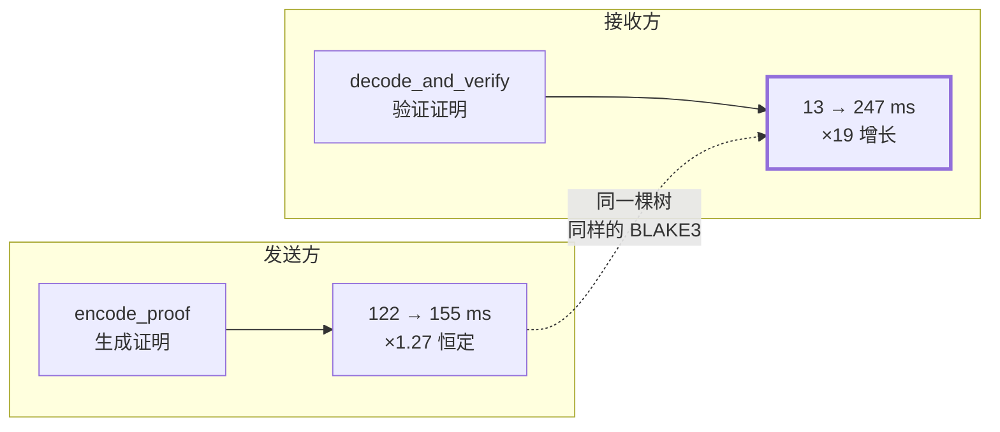
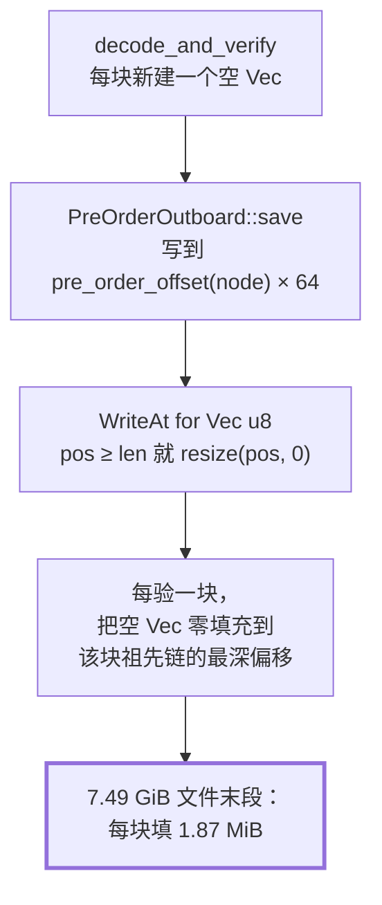

# 越传越慢：一个藏在 `Vec<u8>` 里的 O(n²)

> 三个数字锁死了元凶：验签涨 19 倍、写盘全程恒定、发送侧的对称路径纹丝不动。
> 而真凶是一行谁都不会去读的依赖代码。

## 从三个数字开始

接上一篇。探针给出的对照表是这样的（每行是 256 块 = 64 MiB 的窗口）：

**桌面接收侧**（散热无忧，NVMe）

| 累计块 | 吞吐 | `verify` | `write` | `ckpt` |
|---|---|---|---|---|
| 512 | 42.93 MB/s | **13 ms** | 34 ms | 207 ms |
| 15616 | 25.42 MB/s | **89 ms** | 36 ms | 321 ms |
| 28416 | 16.19 MB/s | **247 ms** | 35 ms | 251 ms |

**移动端接收侧**（同一份 7.49 GiB 文件）

| 累计块 | 吞吐 | `verify` | `write` | `ckpt` |
|---|---|---|---|---|
| 512 | 17.98 MB/s | **168 ms** | 297 ms | 378 ms |
| 28416 | 10.68 MB/s | **765 ms** | 366 ms | 420 ms |

读出三件事：

1. `verify` 单调增长——桌面 **19 倍**，移动端 **4.6 倍**
2. `write`、`ckpt` 全程基本恒定
3. 桌面涨得**比手机还厉害**

第 3 条尤其反直觉。手机的 CPU 弱、闪存慢、还会热节流，凭什么它的劣化幅度只有桌面的四分之一？

答案在后面。先做一个更关键的对照。

## 决定性的对照：发送方在算同一棵树

`verify` 干的事是 **bao 逐块验签**：拿着发送方给的一小段 Merkle 证明，对着文件的根哈希，
验证这 256 KiB 确实属于这个文件。

而发送方有一个**完全对称**的操作——`proof`，生成那段证明。同一棵树、同样的遍历、同样的
BLAKE3 运算。

同一台移动端，做发送方时：

| 累计块 | `proof` |
|---|---|
| 512 | 122 ms |
| 28416 | **155 ms** |

**1.27 倍。基本恒定。**

这一下就把范围锁死了：



树一样、哈希算法一样、树深度一样——那么两边**共有的东西**全都可以排除：BLAKE3 本身没问题，
树遍历没问题，proof 的长度也没问题（它是 O(log n)，两边一致）。

问题只可能在**接收侧独有的那几行代码**里。

那几行是这样的：

```rust
pub fn decode_and_verify(proof: &[u8], root: blake3::Hash, ...) -> AppResult<Vec<u8>> {
    let tree = BaoTree::new(file_size, BLOCK_SIZE);
    let ranges = round_up_to_chunks(&ByteRanges::from(offset..end));

    // 接收端不建 outboard（不做再分发）：throwaway outboard 只承载 root 供验签，
    // decode 写进去的 parents 用完即弃。
    let mut outboard = PreOrderOutboard {
        root, tree,
        data: Vec::<u8>::new(),          // ← 每块新建一个空 Vec
    };
    let mut target = OffsetWriteAt {
        base: offset,
        data: vec![0u8; expected_len],   // ← 每块零填充 256 KiB
    };
    decode_ranges(Cursor::new(proof), &ranges, &mut target, &mut outboard)?;
    Ok(target.data)
}
```

十行代码，没有循环，没有递归，没有任何看起来像 O(n) 的东西。

注释甚至已经写明了「用完即弃」。

## 真凶在依赖库里

`decode_ranges` 是 `bao-tree` 提供的解码函数。它要求你传两个「写入目标」：一个接明文
（`target`），一个接 Merkle 树的中间节点（`outboard`）。

我们不做再分发，所以那些中间节点纯属浪费——但函数签名要求你给，于是给了个空 `Vec`。

现在看 `bao-tree` 拿到这个 `Vec` 之后做什么：

```rust
// bao-tree: PreOrderOutboard::save
fn save(&mut self, node: TreeNode, hash_pair: &(blake3::Hash, blake3::Hash)) -> io::Result<()> {
    let offset = self.tree.pre_order_offset(node)? * 64;   // ← 偏移随节点位置增长
    let mut content = [0u8; 64];
    // …填充 content…
    self.data.write_all_at(offset, &content)              // ← 往 offset 处写 64 字节
}
```

再看 `positioned_io` 对 `Vec<u8>` 的 `WriteAt` 实现：

```rust
// positioned-io: impl WriteAt for Vec<u8>
fn write_at(&mut self, pos: u64, buf: &[u8]) -> io::Result<usize> {
    // Resize the vector so pos <= self.len().
    if pos >= self.len() {
        self.resize(pos, 0);      // ← 零填充到 pos
    }
    // …然后才写…
}
```

**找到了。**

把三段拼起来：



一次 **64 字节**的写入，触发了一次 **1.87 MiB** 的零填充。

而那个偏移量随文件位置增长——传到越后面，`pre_order_offset` 越大，填的越多。
整场传输累积下来就是 **O(n²)**。

算一下对不对得上：7.49 GiB 文件有 30690 块，outboard 全长 = (30690 − 1) × 64 ≈ **1.87 MiB**。
桌面末段每块 `247 ms / 256 块 ≈ 0.96 ms`，移动端 `765 / 256 ≈ 2.99 ms`——正是零填充
1.87 MiB 在两类设备上的量级。

**桌面为什么涨得比手机厉害？** 因为它的基线太低了。桌面首窗 `verify` 只有 13 ms，
零填充的增量一加上去就是 19 倍；手机首窗本来就有 168 ms（CPU 弱），同样的增量摊上去只有
4.6 倍。**倍数是相对量，绝对增量其实差不多。**

而发送侧为什么不受影响？看它用的 outboard：

```rust
let outboard = PostOrderOutboard {
    root, tree,
    data: outboard_bytes,    // ← &[u8]，只读，预先就是完整长度
};
```

**只读切片，永远不需要扩展。** 那组对称对照数字的机制解释，就在这一行。

## 修法一：给它一个更快的桶（不好）

第一反应是：既然那些中间节点用完即弃，那给它一个「丢弃写入」的假对象不就行了？

```rust
struct Sink;
impl WriteAt for Sink {
    fn write_at(&mut self, _pos: u64, buf: &[u8]) -> io::Result<usize> { Ok(buf.len()) }
}
impl ReadAt for Sink { /* … */ }
```

能跑，O(n) 消失。但它**加了代码**：一个新类型、两个 trait 实现，全都是为了骗过一个函数签名。

而且它保留了 `PreOrderOutboard` 这个概念上根本不需要的东西。下一个读这段代码的人还是会问：
「为什么解码要传一个 outboard 进去？」

## 修法二：换一层抽象（好）

退一步问：**为什么我们非得用 `decode_ranges`？**

它的契约是「解码，并把 outboard 与数据双双持久化」——服务的是「边收边建一份可再分发的
outboard」这个场景。我们不做再分发。**我们从一开始就用错了抽象层级。**

翻一下 `bao-tree` 的公开 API，下面这一层正好合适：

```rust
pub fn new(root: blake3::Hash, tree: BaoTree, encoded: R, ranges: &ChunkRangesRef) -> Self
```

`DecodeResponseIter` **根本不需要 outboard 对象**，只要 root 和 tree。它的契约恰好是
「产出已验证的内容项」——正是我们要的东西。

而且更妙的是，`decode_ranges` 自己的实现就是拿它写的：

```rust
let iter = DecodeResponseIter::new(outboard.root(), outboard.tree(), encoded, ranges);
for item in iter {
    match item? {
        BaoContentItem::Parent(Parent { node, pair }) => outboard.save(node, &pair)?,  // ← 只 save
        BaoContentItem::Leaf(Leaf { offset, data }) => target.write_all_at(offset, &data)?,
    }
}
```

看清楚这个循环体：**它从头到尾没有调用过 `outboard.load()`**。

也就是说，写进去的那些中间节点**从来没有被读回来过**。验签是 `DecodeResponseIter` 内部
对着 `root` 独立完成的，`save` 纯粹是「顺便帮你持久化」的副作用。对不做再分发的接收端，
它是 100% 的浪费。

于是新实现：

```rust
let mut block = Vec::with_capacity(expected_len as usize);
for item in DecodeResponseIter::new(root, tree, Cursor::new(proof), &ranges) {
    match item? {
        BaoContentItem::Parent(_) => {}                    // 只参与验签，不落地
        BaoContentItem::Leaf(Leaf { offset: at, data }) => {
            let want = offset + block.len() as u64;
            if at != want { return Err(/* 叶子不连续 */); }
            block.extend_from_slice(&data);
        }
    }
}
```

连带**删掉**了整个 `OffsetWriteAt` 适配器（它只有这一个用户）。净减少约 25 行代码。

三项收益，只有第一项是本来的目标：

| | 之前 | 之后 |
|---|---|---|
| outboard 零填充 | **O(已完成)**，末段每块 1.87 MiB | 消失 |
| 目标缓冲 | `vec![0u8; 256KiB]` 零填充后被完全覆写 | `with_capacity`，不填充 |
| 概念数量 | 2 个假的写入目标 + 1 个适配器 | 0 |

**O(n²) 是选对抽象层级的副产品，不是靠 trick 绕过的。** 这是我认为修法二比修法一好的
核心理由——它让代码变短了。

## 一个额外的收获

新实现依赖「叶子按偏移递增且首尾相接」。这在 bao 的前序遍历里天然成立，但那是**实现事实，
不是它承诺的契约**。

所以代码里没有默认它成立，而是写成显式判据：

```rust
let want = offset + block.len() as u64;
if at != want {
    return Err(AppError::Transfer(format!("bao 叶子不连续: 期望 offset {want}，实得 {at}")));
}
```

顺带修掉了一个旧实现掩盖的隐患：原来预分配 `vec![0u8; expected_len]`，如果 proof 提前结束，
**缺失的部分会以零字节「成功」返回**——而调用方正是按 `range.length` 去记完成位图的。
现在它是明确的 `Err`。

## 可迁移的教训

**当你为了迎合某个库函数的签名，去造一个假对象时，先停一下。**

那通常是「抽象层级选错了」的信号。假对象不解决问题，它只是把问题包装得更难看见——
更糟的是，它会让下一个人以为那个假对象是必要的。

正确的动作是往上翻一层 API：**这个库有没有暴露一个更贴合我需求的入口？**
很多库都有，只是文档不显眼——`decode_ranges` 的文档在最前面，`DecodeResponseIter` 藏在
后半页，而后者才是我们要的。

第二条，也是更普适的一条：

**留意「按偏移写 + 偏移可能很大 + 容器是 `Vec`」这个组合。**

`positioned_io` 的行为并不是 bug——它文档里写得清清楚楚。危险在于成本模型
**与直觉相反**：你以为写 64 字节就是 64 字节，实际是 O(最大偏移)。

而且这类缺陷有个恶劣的性质：**它不会表现为内存异常**。末态的 Vec 大小完全合理（就是
outboard 该有的长度），你查内存查不出任何问题。它只表现为「吞吐随进度衰减」——
一个太容易被归因给硬件、网络、运气的形状。

上一篇讲的就是有人真的这么归因了。

---

**上一篇**：[00 — 序：当「我没找到」被当成「它不存在」](00-probe-over-elimination.md)
**下一篇**：[02 — 同一台手机，走 QUIC 12 MB/s，走 WebRTC 0.36 MB/s](02-two-crypto-stacks.md)
