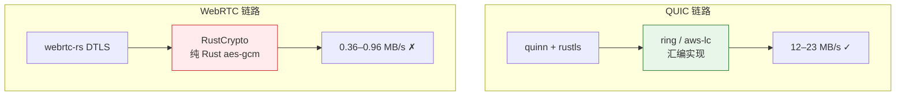
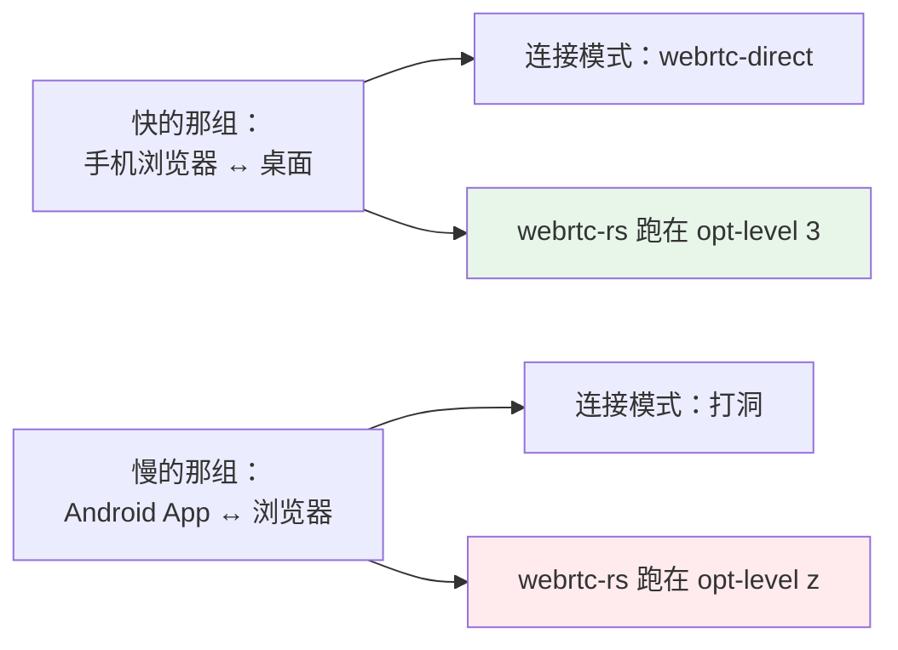

# 同一台手机，走 QUIC 12 MB/s，走 WebRTC 0.36 MB/s

> 一条链路慢了 30 倍，而两端的 CPU 都在闲着。
> 答案藏在「依赖树里同时躺着两套加密实现」这件事上。

## 一组说不通的数字

三台设备，同一个局域网（`192.168.1.0/24`），传同样的文件：

| 链路 | 吞吐 |
|---|---|
| 桌面 App ↔ Android App（QUIC） | **12–23 MB/s** |
| Android App ↔ 浏览器（WebRTC 打洞） | **0.36–0.96 MB/s** |

差 **30 倍**。

第一反应当然是「WebRTC 慢」。但探针的数据不支持这个解释——它显示两端的**应用层几乎全程在闲着**：

| 侧 | 阶段分解 |
|---|---|
| 浏览器（发送） | read 1% · proof 1% · **write 77%** · ack 20% |
| Android（接收） | **wait 95%** · verify 1% · write 1% · ckpt 1% |

`write` 是「把帧写进流」，包含传输层背压等待。77% 的时间卡在这里，意味着**数据写不出去**。
而接收端 95% 在等，意味着**数据没到**。两边都不忙，中间那条管道细得可怜。

更精确的对比来自**同一台移动端做发送方**时的 `write` 每块耗时：

| 目标 | write 每块 |
|---|---|
| → 桌面（QUIC） | **0.054 ms** |
| → 浏览器（WebRTC） | **296 ms** |

**5500 倍。** 同一个进程、同一份代码、同一块数据，只是换了条链路。

## 用户的一个对照实验

正当准备去查 ICE 选路和 SCTP 参数时，用户自己跑了一组对照：

> 手机用浏览器，连接电脑上的桌面端：手机 → 电脑 6 MB/s，电脑 → 手机 10 多 MB/s。

这下有意思了。同样是「浏览器 ↔ 原生端」，同样是 WebRTC，这次却有 **6–10 MB/s**。

把两组摆在一起：

| 组合 | 原生那一侧是谁 | 吞吐 |
|---|---|---|
| 手机浏览器 ↔ **桌面 App** | 桌面 | **6 / 10+ MB/s** |
| **Android App** ↔ 电脑浏览器 | Android | **0.36 / 0.96 MB/s** |

**变量是「原生端跑在哪台设备上」。**

而 Android 的网络本身没问题——它走 QUIC 的时候有 12–23 MB/s。

所以问题变成：**为什么 Android 上的 WebRTC 特别慢，而同一台 Android 上的 QUIC 不慢？**

## 依赖树里有两套加密

答案在一条 `cargo tree` 里。

先看 WebRTC 那条栈用什么加密：

```
$ cargo tree -p webrtc --target aarch64-linux-android | grep -iE "ring|aes|sha2"
aes v0.8.4
aes-gcm v0.10.3
sha2 v0.10.9
ring v0.17.14
```

`aes` / `aes-gcm` 是 **RustCrypto 的纯 Rust 实现**。DTLS 的记录层——也就是每一个字节都要过的
那一层——走的是它们。（`ring` 也在，但只用于证书和椭圆曲线，不在按字节的热路径上。）

再看 QUIC 那条：quinn + rustls，加密走 **ring / aws-lc-rs**，那是**汇编实现**。



**汇编实现不受 Rust 编译器优化等级影响。纯 Rust 实现受，而且受得厉害。**

现在看移动端的编译配置：

```toml
[profile.mobile-release]
inherits = "release"
lto = "thin"
codegen-units = 1
opt-level = "z"        # ← 包体优先
strip = "symbols"
```

`opt-level = "z"` 是「优化体积」——它会**关掉内联和循环展开**。

而 RustCrypto 的 AES-GCM 和 GHASH 恰恰是**高度依赖内联与展开**的那类代码：轮函数要展开、
状态要留在寄存器里、GHASH 的表查询要内联。`-Oz` 一上，这些全没了。

整条因果链闭合了：

| 链路 | 加密实现 | 受 `-Oz` 影响 | 实测 |
|---|---|---|---|
| Android ↔ 桌面（QUIC） | ring（asm） | **否** | 12–23 MB/s |
| Android ↔ 浏览器（WebRTC） | RustCrypto（纯 Rust） | **是** | 0.36–0.96 MB/s |
| 手机浏览器 ↔ 桌面（WebRTC） | RustCrypto，但跑在 `opt-level = 3` 的桌面 | 否 | 6–10+ MB/s |

三行数据，一个解释全部覆盖。

## 这不是第一次了

翻 `Cargo.toml`，发现同一个坑之前已经冒头过一次：

```toml
# blake3 例外：整个 profile 的 `opt-level = "z"` 会一路传到它 build.rs 里的 cc 调用
# —— aarch64 上 blake3 走的是 C NEON intrinsics，实测 clang 拿到的是 `-Oz`。
[profile.mobile-release.package.blake3]
opt-level = 3
```

那次的机制更隐蔽：`-Oz` 不只影响 Rust 代码，它还**穿透 Rust 边界**——`cc` crate 会把
profile 的 `opt-level` 原样翻译成给 clang 的 `-Oz`，而 blake3 在 arm64 上走的是 C 写的
NEON intrinsics。被按住的不是几 KB Rust 代码，是那份 intrinsics 的内联与展开。

所以第一反应是照方抓药，再开一组单包例外：

```toml
[profile.mobile-release.package.aes]        opt-level = 3
[profile.mobile-release.package.aes-gcm]    opt-level = 3
[profile.mobile-release.package.ghash]      opt-level = 3
[profile.mobile-release.package.polyval]    opt-level = 3
[profile.mobile-release.package.universal-hash] opt-level = 3
[profile.mobile-release.package.cipher]     opt-level = 3
[profile.mobile-release.package.crc]        opt-level = 3
```

七个包。能跑。然后用户看了一眼说：

> 这感觉有点丑陋，能否移动端都换成 opt-level 3？

## 打地鼠的终结

他是对的，而且理由比「丑」更硬：

**判据本身没问题**——「按字节计费的热点该开例外」是对的。问题是这类热点**遍布整棵依赖树**：
哈希、AEAD、GHASH、CRC、分片、编解码……你今天列出七个，明天真机实测又会冒出第八个。

更糟的是维护性：半年后再看这份清单，「为什么偏偏是这七个包」会变成一笔谁也不敢动的糊涂账。
删一个怕出事，加一个没依据。

而收益那边呢？这些包编出来都只有几十 KB。**用体积换速度在这里是纯亏**——这句话本来就写在
blake3 那条例外的注释里，只是当时没意识到它的适用范围有多大。

传输吞吐是这个 App 的**核心功能**。它不是可以拿来换几 MB 安装包的东西。

于是七条例外全删，整个 profile 改成：

```toml
[profile.mobile-release]
inherits = "release"
lto = "thin"
codegen-units = 1
opt-level = 3          # ← 从 "z" 改回来
strip = "symbols"
```

体积由另外三项承担：`lto = "thin"` + `codegen-units = 1` + `strip = "symbols"`。
这三项都**不牺牲运行速度**——前两项还会提升。真正在换体积的只有 `opt-level`，而它换错了东西。

## 一条必须说出口的免责声明

**这个结论还没有定案。**

因为那两组对照里，**同时变了两个东西**：



桌面有 webrtc-direct 监听端口，浏览器同网直接拨得到；Android 没有，只能打洞。
所以「连接模式」和「优化等级」这两个变量是**绑在一起变的**，现有数据分离不了它们。

`opt-level` 的假说有机制层面的支持（加密实现确实分裂成两套），但**机制合理不等于它就是主因**。

判定方法很干净：改完 `opt-level` 之后**重测同一条打洞链路**——连接模式不变，只有优化等级变了，
这才是单变量实验。若吞吐显著提升，定案；若纹丝不动，那就是打洞本身的问题，把配置回退。

这条注意事项写进了 `Cargo.toml` 的注释里，附带一句：

> 若实测证明与吞吐无关，回退前请先把结论写回那份报告——别让它变成又一条没人知道为什么存在的配置。

## 可迁移的教训

**「同一个进程里，同一件事可能有两套实现」比想象中常见。**

加密尤其如此：Rust 生态里 `ring`、`aws-lc-rs`、RustCrypto 三家并存，而一个中等规模的项目
很容易同时依赖上其中两家——一家来自 TLS 栈，一家来自 WebRTC 栈，谁也不知道对方存在。

它们对编译器优化的敏感度**差着数量级**，于是同一个 profile 配置在两条路径上会产生完全不同的
后果。而这种差异在单元测试里根本看不出来（测试跑的是 dev 或 release，不是 `mobile-release`），
只在真机的特定链路上显形。

**排查这类问题的入手点是 `cargo tree`**——不是读代码，是先看清楚「这条路径上到底链的是谁」。
一条 `cargo tree -p webrtc | grep -i aes` 就够了，比读一天源码有效。

第二条教训关于**例外清单**：

当你发现自己在往配置里加第二个、第三个「特例」时，停下来问一句——
**这个清单会不会永远列不完？** 如果会，那说明默认值选错了，该改的是默认值，不是清单。

---

**上一篇**：[01 — 越传越慢：一个藏在 `Vec<u8>` 里的 O(n²)](01-the-hidden-quadratic.md)
**下一篇**：[03 — 双方都在等对方：停等流控的隐藏账单](03-both-sides-waiting.md)
