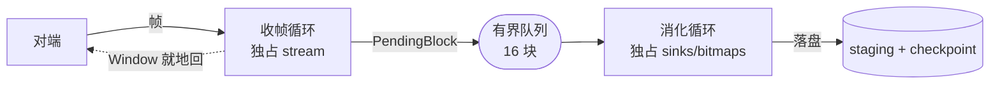

# 双方都在等对方：停等流控的隐藏账单

> 发送侧 88% 的时间在等，接收侧 67% 的时间也在等。
> 这两个数字放在一起是个矛盾——除非它们从不重叠。

## 一个自相矛盾的观测

局域网里传 7.49 GiB，桌面 → 手机，实测 12.54 MB/s。

探针给出两侧的分解：

| 侧 | 分解 |
|---|---|
| 桌面（发送） | read 2% · proof 0% · write 0% · **ack 88%** |
| 手机（接收） | **wait 67%** · verify 9% · write 6% · ckpt 8% · rest 9% |

`ack` 是「发满一窗后等对端确认」，`wait` 是「等下一帧到达」。

**两边加起来 155% 的时间在等对方。**

这在物理上当然可能——只要两条路径**从不重叠**。而代码注释里写的恰恰相反：

> 稳态吞吐由接收端的验签落盘速率决定（**发送端在等 Window 时接收端正忙着**），窗口本身不是瓶颈。

这句话假设了两者是流水线式重叠的。如果真重叠，不可能双方等待都占大头。

**所以这条注释是错的。** 而且它已经在代码里躺了很久，没人质疑过——它听起来太合理了。

## 停等流控长什么样

SwarmDrop 的数据面有一个应用层流控：发送方每推 16 块（`WINDOW_CHUNKS`，4 MiB）就停下来，
发一帧 `Window`，等对端回一帧同样的 `Window`，然后才继续。

接收方那边是一个**单循环**：

```rust
loop {
    let frame = read_frame(&mut stream).await?;      // 读一帧
    match frame {
        BlockData { .. } => {
            handle_block_data(...).await?;            // 验签 → 落盘 → checkpoint
        }
        Window { .. } => {
            write_frame(&mut stream, &Window { .. }).await?;   // 回确认
        }
        // …
    }
}
```

注意：**读帧和处理帧在同一个循环里，严格串行。** 所以当接收方读到那帧 `Window` 时，
前面 16 块必然已经全部验签落盘完毕。

代码注释把这一点说得很明白，还特意强调了不能改：

> 「读到 Window」与「窗内块全部消化完」是同一件事，回帧即释放对端下一窗。
> **不能提前回、也不能异步回**：那会让确认与实际消费速率脱钩，在途量重新失控。

于是一个窗口周期就长这样：

```mermaid
gantt
    title 一个窗口周期（16 块 = 4 MiB）
    dateFormat X
    axisFormat %s
    section 发送方
    读+proof+写 16 块  :a1, 0, 9
    发 Window          :milestone, 9, 0
    空等              :crit, a2, 9, 291
    读+proof+写 16 块  :a3, 300, 9
    section 接收方
    空等              :crit, b1, 0, 9
    收 16 块 + 逐块验签落盘 :b2, 9, 285
    回 Window          :milestone, 294, 0
    空等              :crit, b3, 294, 6
```



红色的都是空等。**两条路径完美错开，零重叠。**

发送方在等接收方消化，接收方在等发送方开推。88% 和 67% 就是这么来的。

## 把账单拆开

流水线的总时间不是各段之和，而是各段的 **max**（如果真能重叠的话）。所以先看看这三段各占多少：

**7.49 GiB / 611.9 s，桌面 → 手机**

| 段 | 耗时 | 占比 |
|---|---|---|
| 发送方处理（读文件 + 算证明 + 写流） | 17.5 s | 2.9% |
| **接收方处理（验签 + 落盘 + checkpoint）** | **201.0 s** | **32.8%** |
| 网络（含 1918 次 RTT） | 393.4 s | 64.3% |

串行时是**求和** = 611.9 s → 12.54 MB/s
流水线时是**取 max** = 393.4 s → **19.5 MB/s**（+56%）

反方向（手机 → 桌面，7.49 GiB / 325.6 s）算下来是 196 s → **39 MB/s**（+66%）。

顺带澄清一个直觉：**磁盘根本不是瓶颈**。那 201 s 里真正写盘只有 39.7 s
（手机 193 MB/s，桌面 1.8 GB/s）。剩下的是验签 56 s、checkpoint 47.5 s、簿记 57.7 s。

## 先否掉最直觉的方案

看到「每 16 块停一次」，第一反应通常是：**把窗口调大不就行了？**

算一下：

```
停顿总时间 = (总块数 / W) × (W × 每块处理时间 + RTT)
           = 总块数 × 每块处理时间  +  (总块数 / W) × RTT
             └─── 与 W 完全无关 ───┘    └── 只有这项能被 W 摊薄 ──┘
```

第一项——也就是「等接收方消化」那部分——**与窗口大小无关**。窗口翻倍，停顿次数减半，
但每次要等的消化量也翻倍，一进一出正好抵消。

能摊薄的只有 RTT 项，而它是 1918 × 20 ms ≈ 38 s，占全程 **6%**。窗口翻 4 倍最多省 4.5%，
还得同步抬高接收缓冲上限（否则会撞上越限重置）。

**治标不治本。** 真正要消除的是那个「求和」——让三段重叠起来。

## 拆成两条并发路径

改动的核心只有一句话：**把「读帧」和「消化」拆开，中间放一条有界队列。**



- **收帧循环**：读帧 → 入队 → 读到 `Window` 就**立即回**，不等消化
- **消化循环**：出队 → 验签 → 落盘 → checkpoint → 收齐即发布

`Window` 的语义从「我消化完了」变成「**我还有缓冲位**」——这就是标准的信用制流控。

于是时间线变成：

```mermaid
gantt
    title 流水线化之后
    dateFormat X
    axisFormat %s
    section 发送方
    推块（持续）  :a1, 0, 290
    section 接收方 收帧
    收块（持续）  :b1, 5, 290
    section 接收方 消化
    验签落盘（持续） :c1, 10, 290
```



三条路径同时在跑。

## 三个不显然的决定

### 一、职责用所有权钉死，不靠约定

```rust
struct Digested {
    sinks: HashMap<u32, FileSinkId>,
    bitmaps: HashMap<u32, Vec<u8>>,
}
```

这两张表**只有消化循环碰得到**，收帧循环连引用都拿不到；反过来 `stream` 整条归收帧循环，
消化循环碰都碰不到。

并发代码里最容易出的问题是「两条路径都摸同一份状态」。用编译器来禁止它，比写一行注释
「请不要在这里改 bitmap」可靠得多。

### 二、没有 split 流，也没有 spawn

有人会问：为什么不把 stream `split` 成读半边和写半边，让两个任务各持一半？

因为这个仓踩过那个坑：

> `futures::AsyncReadExt::split` 的 BiLock reader half 在 wasm 下、数据到达 muxer 后
> **不唤醒读端**（native 多线程掩盖，浏览器单线程显形）。

而这次的结构**压根不需要 split**——`stream` 从头到尾归收帧循环一个人，消化循环只认队列和存储。
那条 wasm 的坑不会被勾出来。

同样地，两条路径用 `futures::future::join` 在**同一个任务**里交错驱动，不 `spawn`：

- 不需要 `Send` 约束（wasm 上很多东西不是 `Send`）
- 单线程一样成立——消化循环每个 await 点（写盘、落库）都会让出，收帧循环随即推进

**「并发」不等于「并行」。** 我们要的只是前者。

### 三、背压闭环必须留在应用层

这一条我最初写错了，值得单独讲。

第一版的注释是这么写的：

> 队列满 → `send` 挂起 → 不再读流 → **对端被传输层回压**。

听起来天经地义：我不读了，TCP/SCTP 的接收窗口就会收缩，对端自然发不动。

**在浏览器上这是错的。** 项目里另一处代码早就写明了：

> 浏览器的 `RTCDataChannel` **没有接收侧背压**——`onmessage` 一触发就把字节交给 JS 并释放
> SCTP 接收缓冲，于是 SCTP 的接收窗口**永不收缩**、逐跳流控永不触发，对端能发多快就堆多快。
> 这是 W3C 承认了十余年的 API 缺口。

所以「不读流」在 Web 端**回压不了任何人**。数据会继续堆进读缓冲，直到撞上上限、子流被重置。

正确的闭环全程在应用层：

```
队列满 → send 挂起 → 读不到下一帧 Window → 不回确认 → 对端停在窗口边界
```

每一步都是我们自己的代码，不依赖传输层的任何性质。

顺带纠正我另一个误判：一度以为在途量翻倍了、读缓冲余量从 4× 收窄到 2×。实际上**读缓冲峰值
没变**——对端拿到一次确认后最多再推一窗（4 MiB，和以前一样），新增的 4 MiB 是本进程内
已读出待消化的队列，那部分在应用内存里，不占读缓冲。

## 探针也得跟着拆

改完之后，原来那个接收侧探针**语义上就错了**。

`StageProbe` 有一条支柱性质：各阶段之和恒等于壁钟时间。它只在**单条串行路径**上成立。
两条并发路径的耗时会重叠，加总必然超过壁钟，占比之和越过 100% 之后，
「差值 = 未计入的开销」这条读法就彻底失效。

所以拆成两个：

| 探针 | 阶段 | 它回答什么 |
|---|---|---|
| `FrameProbe` | `wait` · `enqueue` | `enqueue` 占大头 → **消化跟不上** |
| `DigestProbe` | `queue` · `verify` · `write` · `ckpt` · `rest` · `publish` | `queue` 占大头 → **链路喂不饱** |

两者都小，才说明流水线是满的。

这比拆之前更有判别力——以前只有一个 `wait`，它同时混着「链路没送来」和「我自己忙不过来」
两种含义，恰恰分不出最想知道的那件事。

## 可迁移的教训

**当你在一份性能数据里看到「双方都在等对方」，那不是矛盾，是串行的指纹。**

`ack 88% + wait 67%` 这种加起来远超 100% 的组合，只可能出现在两条路径完全错开的时候。
一旦看到它，就该去找那个把两边焊在一起的同步点——通常是某个「等对方确认」的往返。

第二条，关于**代码注释的可信度**：

那句「发送端在等 Window 时接收端正忙着」在代码里躺了很久。它不是谎言，是一个**从未被验证的
合理推测**——写的人觉得应该是这样，读的人觉得听起来对，于是它就成了事实。

这类注释比没有注释更危险：它会**阻止**后来者去测量。谁会去验证一句看起来显然正确的话呢？

判据也许可以这么定：**凡是断言运行时行为的注释（「这里不是瓶颈」「稳态由 X 决定」），
要么附一个实测数字，要么明确标注它是推测。** 前者能被证伪，后者至少诚实。

---

**上一篇**：[02 — 同一台手机，走 QUIC 12 MB/s，走 WebRTC 0.36 MB/s](02-two-crypto-stacks.md)
**下一篇**：[04 — 一个组合子的代价](04-the-cost-of-a-combinator.md)
