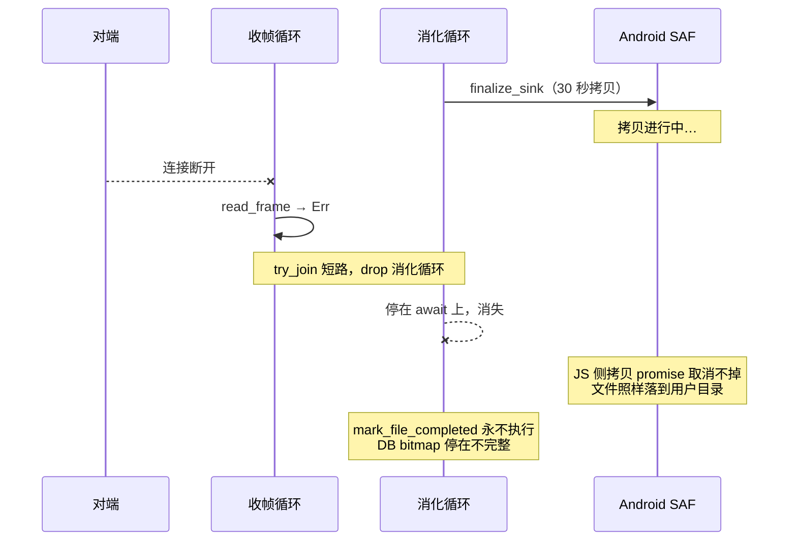

# 一个组合子的代价：`try_join` 如何重新打开了一扇焊死的门

> 代码通过了全部门禁：113 个测试、workspace 检查、clippy、wasm 双 target。
> 然后 code review 说：你把 `try_join` 换成 `join` 试试。

## 一行看起来完全正确的代码

上一篇把接收侧拆成了两条并发路径，用这行代码把它们组合起来：

```rust
let (end, digested) = futures::future::try_join(
    self.run_frame_loop(&mut *stream, epoch, block_tx),
    self.run_digest_loop(block_rx, &progress, bitmaps, is_resume),
)
.await?;
```

`try_join` 是标准做法：并发跑两个 future，任一出错就返回错误。

它通过了所有检查。测试全绿，wasm 门禁全绿，clippy 没话说。

然后 code review 给出这样一条：

> `futures::future::try_join` short-circuits on the first `Err` and **drops the other future**,
> so a frame-loop read error now cancels an in-flight `publish_file` mid-await — a window that
> previously could not exist.

## 「drop 一个 future」意味着什么

这是 Rust async 里一个容易被忽略的语义：**drop 一个正在执行的 future，等于在它当前的
await 点上永久取消它。**

它不会 panic，不会返回错误，不会执行任何清理逻辑（除非你写了 `Drop` impl）。
它就是**停在那里，然后消失**。

`try_join` 的契约正是如此：第一个 `Err` 一到，立刻返回，另一条 future 直接 drop。

平时这没问题。但这次那条被 drop 的 future 里，有这么一段：

```rust
// 消化循环 → handle_block_data → publish_file
self.file_access.finalize_sink(&sink_id, ...).await?;   // ← 可能停在这里
self.store.mark_file_completed(...).await?;             // ← 然后这句永远不执行
```

在 Android 上，`finalize_sink` 是一次 **SAF 全量字节拷贝**——把暂存文件搬到用户选定的
目录。6 GB 的文件要写 12 GB，耗时以**几十秒**计。

## 失败链条



关键在于**宿主那侧的拷贝取消不掉**。Rust 侧 drop 掉 future，只是不再 await 那个 promise；
JS 引擎里的拷贝任务照跑不误，文件最终会完整地出现在用户目录里。

但 `mark_file_completed` 再也不会执行了。于是：

- 用户目录：**有一个完整的文件**
- 数据库 bitmap：**这个文件还没收完**

下次恢复传输时，程序按 bitmap 判断——「这个文件还差得远」——于是整个文件重新传一遍，
然后**再发布一次**。用户目录里多出一个 `foo (1).ext`，和旁边那个完整的一模一样。

## 这个状态本该不可达

最刺人的是：`publish_file` 的文档里**早就描述过这个状态**，并且断言它只有强杀进程才能到达。

改动之前，publish 内联在单循环里，`cancel_token` 只守着 `read_frame` 那一处 await：

```rust
let frame = tokio::select! {
    _ = self.cancel_token.cancelled() => return Ok(false),
    frame = read_frame(&mut *stream) => frame?,     // ← 只有这里能被取消
};
```

一旦进入 `handle_block_data`，它就会一路跑完——中间没有任何取消点。所以「publish 跑到一半
被中断」这件事，**在旧代码里确实只有 SIGKILL 能做到**。

而我用一个组合子，把这扇门重新打开了。

代码全绿，是因为**没有任何测试覆盖「传输中途连接断开」这个场景**——它需要一个能在指定
await 点上中断的 mock 传输层，而 `ReceiverActor` 依赖四个 trait，至今没有单测。

## 换成 `join`

修复只有一个词的差别：

```rust
let (frame_result, digest_result) = futures::future::join(
    self.run_frame_loop(&mut *stream, epoch, block_tx),
    self.run_digest_loop(block_rx, &progress, bitmaps, is_resume),
)
.await;

// 消化端的错误先抛
let digested = digest_result?;
let end = frame_result?;
```

`join` **不短路**：它等两条都收敛，然后把两个 `Result` 都交给你。

于是失败路径变成：

1. 收帧循环出错 → 返回 `Err`，`block_tx` 随之 drop
2. 消化循环的 `queue.next()` 返回 `None`（发送端已关闭）
3. 消化循环**把队列里剩下的块处理完**，正常返回
4. `join` 拿到两个结果，我们再决定抛哪个

`publish_file` 不会再被中途取消——它总能跑完。

多花的时间以队列深度为上限（≤ 一个窗口 = 16 块），换掉的是一整类恢复期的重复发布。

### 解包顺序也有讲究

```rust
let digested = digest_result?;   // ← 先抛这个
let end = frame_result?;
```

顺序反过来会**盖掉归因**。想想消化端出错时会发生什么：

- 消化循环报出真实原因（验签失败 / 写盘失败 / 磁盘满…），`block_rx` 被 drop
- 收帧循环下一次 `send` 立即失败，报一句「消化端已退出，无法继续收块」

那句话是**次生的**。如果先抛 `frame_result`，用户看到的错误就是「消化端已退出」——
一句正确但毫无信息量的话，真正的原因被永远丢掉了。

## 为什么 review 抓到了而门禁没抓到

值得掰开看一下这两者的分工。

**门禁验证的是「代码在我设想的路径上是对的」。** 113 个测试覆盖的都是设想过的场景——
正常传输、续传、空文件、损坏的 proof。它们全都通过，因为这次改动在这些路径上确实没问题。

**review 问的是「有没有我没设想到的路径」。** 具体到这条，它问的是：
「`try_join` 出错时另一条 future 会怎样？那条 future 里有没有不能被中断的东西？」

这个问题**不需要运行代码就能回答**，但需要有人主动去问。而写代码的人往往问不出来——
因为如果他想到了，他一开始就不会那么写。

顺带一提，同一轮 review 还指出了两条更小的问题，都在同一份改动里：

- **`ensure_sink` 的耗时被计进了 `write` 桶**。它夹在 `verify` 和 `write` 两个打点之间，
  于是每个文件首块的 sink 创建（Android 上是一次 SAF 文档创建，慢路径）被算作了写盘时间。
  而 `write` 这一桶的全部价值就在于「只」反映闪存代价——「几万个小文件」的会话会因此显示
  出一个根本不存在的写盘瓶颈，正好误导这个探针存在的目的。
- **`verify_block` 每块克隆一整个 `FileInfo`**（三个 `String`）。7.49 GiB 会话约 3 万块，
  就是 9 万次无谓堆分配，而下游全部按引用读。改成返回 `&FileInfo` 即可，借用检查一次通过。

三条都修了。

## 可迁移的教训

**async 组合子的取消语义，是它接口的一部分——而且是最容易被忽略的那部分。**

`join` 和 `try_join` 的差别，在文档里只有一句「short-circuits on error」。听起来像个
效率优化：既然已经失败了，何必再等另一个？

但对于**带副作用的 future**，「不再等」和「取消」是两回事。前者是调度决定，后者会
**中断一个正在进行的世界状态改变**。

所以选组合子之前，先问一句：

> 被 drop 的那条 future，里面有没有**「开始了就必须跑完」的东西**？

如果有——外部资源的写入、跨进程的操作、任何取消不掉的宿主调用——那 `try_join` 就是错的，
无论它看起来多自然。

第二条，关于**「只有强杀进程才能到达」这类断言**：

它们通常写在文档里，作为「这个边界情况不用处理」的理由。而它们的成立依赖于**当前的控制流
结构**——哪些地方有 await、哪些地方能被取消。

**重构控制流的时候，这些断言会静默失效。** 没有编译错误，没有测试失败，因为它们从来就不是
用代码表达的，只是一句话。

如果你在文档里读到「这个状态不可达」，重构完之后值得回去再确认一次：它现在还可达吗？

---

**上一篇**：[03 — 双方都在等对方：停等流控的隐藏账单](03-both-sides-waiting.md)
**回到**：[系列索引](README.md)
