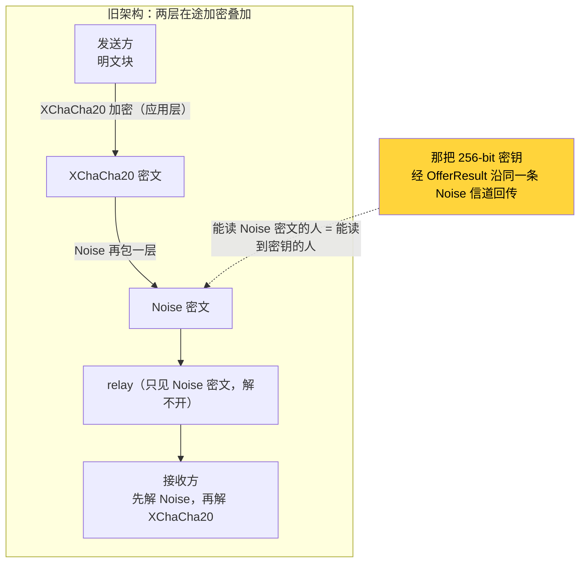

# 删掉 XChaCha20：在已加密信道上再加密，是自引用的冗余

> transfer 子系列开篇。wire v2 重构把整层 XChaCha20-Poly1305 应用层加密**删掉了**——本篇论证
> 为什么删它不降低安全：在 libp2p Noise 已经端到端加密的信道之上再套一层 AEAD，密钥还经同一条已加密
> 信道分发，攻击者要么两层都破、要么都破不了，多出来的只是冗余的复杂度。删除后要补的不是"再加密"，
> 而是把加密曾经**隐式**承担的一件事——数据面的归属校验——显式做出来。

## 结论先行

删掉这层加密后，**威胁模型一个字没变**：

- 网络窃听者、恶意 relay 面对的仍然是 Noise/QUIC-TLS 密文，删的这层 AEAD 从来没为他们多挡一分；
- 恶意对端往你会话里灌数据这件事，过去靠"没有密钥就解不开"**隐式**挡住，现在靠数据面 handler
  显式核对 `stream.remote() == session.peer_id` 挡住——同样挡住，而且更直接；
- 完整性（防篡改）从 Poly1305 认证标签换成了 BLAKE3 逐块验签（下一篇），且顺带解锁了内容寻址。

净变化是：**去掉一层冗余 + 把一个隐式保证显式化**。这不是"少了一层加密所以更不安全"，恰恰相反——
放错层的加密只是复杂度，不是安全。

被删的代码在提交 `5ce6be38`（`refactor(net)!: 重写网络内核为 iroh 风格 API + wire v2 全栈迁移`）
里整文件移除，删除前位于 `crates/core/src/transfer/wire/crypto.rs`（244 行）。

## 被删的是什么：一层教科书级正确的 AEAD

先说清楚：删掉的这层加密，**密码学上无懈可击**。它不是写错了才删，是放错了层才删。

老实现每次传输由接收方生成一把 256-bit 密钥，用 XChaCha20-Poly1305 逐块（256 KiB）加密，
nonce 由 `(session_id, file_id, chunk_index)` 经 BLAKE3 `derive_key` 确定性派生——这套设计
支持乱序、并发、重试，无需同步计数器，是很干净的做法：

```rust
// 删除前 crates/core/src/transfer/wire/crypto.rs（git show 5ce6be38^）
fn derive_nonce(session_id: &Uuid, file_id: u32, chunk_index: u32) -> [u8; 24] {
    let mut input = [0u8; 24];
    input[..16].copy_from_slice(session_id.as_bytes());
    input[16..20].copy_from_slice(&file_id.to_be_bytes());
    input[20..24].copy_from_slice(&chunk_index.to_be_bytes());
    let hash = blake3::derive_key("swarmdrop-transfer-nonce-v1", &input);
    hash[..24].try_into().expect("blake3 output >= 24 bytes")
}
```

关键在**密钥怎么到发送方手里**。接收方接受 offer 时现场 `generate_key()`，把它塞进
`OfferResult` 回给发送方：

```rust
// 删除前 crates/core/src/transfer/flow/receive.rs:151-158（git show 5ce6be38^）
let key = generate_key();
let response = AppResponse::Transfer(TransferResponse::OfferResult {
    accepted: true,
    key: Some(key),   // ← 256-bit 密钥经控制面回传给发送方
    reason: None,
});
self.client.send_response(offer.pending_id, response).await
```

这条 `send_response` 走的是 libp2p 的 request-response 控制面——**一条已经被 Noise 加密的
信道**。记住这一点，它是后面"自引用"论证的全部根据。

发送方拿到 key 后每块加密（`sender.rs:373` `encrypt_chunk`），接收方每块解密
（`receiver.rs:365` `decrypt_chunk`）。密钥只存内存、传完即毁、**从不落库**——落盘的文件是明文。
这个细节很重要：它证明这层加密**不承担 at-rest（静态）职责**，纯粹是"在途加密"。

## 关键一问：这层加密到底防的是谁

任何"该不该加密"的争论，先把威胁模型摆上桌。SwarmDrop 的数据在途会遇到三类潜在对手：

| 对手 | 它能看到什么 | 老文档给的理由 |
|---|---|---|
| 被动网络窃听者（同一 WiFi / 上游 ISP） | 链路上的字节 | "数据在 P2P 网络裸奔" |
| 恶意 relay 中继节点 | 它转发的字节 | "任何 relay 都有机会看到传输内容" |
| 恶意对端（别的 peer 冒充发送方灌数据） | 能向你的会话开流 | 隐含在"端到端"诉求里 |

老实现的动机写得理直气壮："数据在 P2P 网络中裸奔，任何 relay 中继节点都有机会看到传输内容。"
听起来天经地义。但把这句话和 libp2p 的**实际行为**对照，前两行立刻站不住——因为在途保密
早就被下面一层做完了。

## Noise 已经把在途保密做完了

SwarmDrop 的每一跳连接都跑 Noise（TCP 上）或 QUIC-TLS（QUIC 上）。看传输装配就一目了然——
每种 transport 都强制 `noise::Config::new` 做认证握手：

```rust
// crates/net/src/transport.rs:36-44
let swarm = SwarmBuilder::with_existing_identity(keypair)
    .with_tokio()
    .with_tcp(tcp::Config::default(), noise::Config::new, yamux::Config::default)?
    .with_quic()                              // QUIC 自带 TLS 1.3
    // ……with_relay_client(noise::Config::new, ...)、with_websocket(noise, ...) 亦然
```

wasm 端也一样（`transport.rs:107` websocket 手动 `.authenticate(noise::Config::new(key)?)`，
webrtc-websys 自带 noise）。**没有任何一条 transport 是明文的。** Noise 握手给了三样东西：

1. **端到端加密** —— 每一跳都是密文，链路上抓包只能拿到 Noise 帧。
2. **前向保密** —— Noise 用一次性 ephemeral DH 派生会话密钥，事后即使长期私钥泄露，也解不开
   历史流量。这一点是老 AEAD **给不了**的：那把 256-bit 传输密钥现场生成、经明文逻辑分发，
   它的保密性完全寄生在承载它的信道上。
3. **身份绑定** —— Noise 的 static key 就是节点身份。SwarmDrop 的 `NodeId` 是 libp2p `PeerId`
   的 newtype，而 ed25519 `PeerId` 是 identity multihash（公钥 protobuf 直接内嵌、不经哈希，
   见 `crates/net-base/src/node_id.rs:62-65`）——**握手对端是谁，是密码学证明的，不是自报的。**

至于恶意 relay：SwarmDrop 跨网走 circuit relay v2，而 **relay 只转发 Noise 密文，它解不开任何
东西**（`dev-notes/knowledge/net-kernel.md` 的信任模型；iroh 官方文档对自家 relay 也是同款措辞）。
所谓"relay 能看到内容"，在 Noise 之下根本不成立——中继看到的和网络窃听者看到的一样，都是密文。



## 自引用：密钥和密文走的是同一条信道

把上面的图压成一句话，就是这层加密冗余的核心论证：

> 你用信道 X（Noise）分发一把密钥 K，再用 K 去加密同样走信道 X 的数据，
> 试图防御的是"能读信道 X 的攻击者"。

这是**自引用**。一个能读到 XChaCha20 密文的攻击者，意味着他已经攻破了 Noise（否则他看到的是
Noise 密文）；而密钥 K 也在这条 Noise 信道里（`OfferResult` 回传）——所以他**同时**拿到了 K，
XChaCha20 那层对他等于不存在。反过来，攻不破 Noise 的攻击者，既读不到密文也读不到密钥，
XChaCha20 那层对他**多余**。

两种情形穷尽了所有攻击者：**要么两层都破，要么两层都不破，中间态不存在。** 应用层这层 AEAD
在任何一种情形下都不改变结果。它防的攻击者，恰好是 Noise 已经防住的那一批。

（真正能让"应用层再加一层"有意义的模型是：密钥经**带外**信道分发——比如二维码、预共享秘密、
不同的传输通道。老实现不是这样，它把密钥和密文塞进了同一条管道。）

## 补偿一：把隐式的归属校验显式化

删加密不是"减掉一段代码"就完事——必须回答：这层加密除了保密，**有没有顺带承担别的职责**？
有一个，隐蔽但关键：**归属证明**。

老实现里，密钥是接收方点对点交给发送方的。所以"对端能用正确的密钥加密出我能解开的块"这件事，
隐式证明了"对端确实是握手时那个发送方"——别的 peer 没有这把密钥，灌进来的数据解密必然失败。
删掉加密，这个隐式保证也一起没了：一条冒充的数据面流，理论上可以往你的接收会话里塞数据。

补偿方式不是"再加密回来"，而是**把这件事显式做出来**——数据面 handler 读完 Hello 的第一件事，
就是核对流的远端身份。而这一步几乎白拿，因为 `P2pStream::remote()` 是**传输层认证过的对端身份**
（Noise 握手鉴权，不可伪造）：

```rust
// crates/net/src/stream.rs:58-63
/// 传输层身份即归属证明：数据面协议必须校验
/// `stream.remote() == session.peer`（取代已删除的应用层加密所隐式
/// 承担的归属校验，见迁移计划 §XChaCha20 删除的补偿项）。
pub fn remote(&self) -> NodeId {
    self.remote
}
```

```rust
// crates/transfer/src/wire/data_plane.rs:135-143 — handle_inbound_data_stream
// 归属校验：传输层身份即归属证明（取代已删除的应用层加密所隐式承担的归属校验）。
// 流的远端必须与会话记录的发送方一致，不匹配立即断流（不发 Abort，不泄露）。
if stream.remote() != receive.peer_id {
    return Err(AppError::Transfer(format!(
        "data stream 归属校验失败: session={session_id}, remote={}, expected={}",
        stream.remote(),
        receive.peer_id
    )));
}
```

注意 `remote()` 的语义：它不是流里自报的字段，而是 Noise 握手鉴权后由网络内核填进 `P2pStream`
的对端身份（`crates/net/src/stream.rs:31` `remote: NodeId`）。冒充者伪造不了 Noise static key，
就伪造不了 `remote()`。**"靠能否解密来隐式推断身份"，被换成了"直接读传输层已经算好的身份"**——
后者更直接，而且是内核白送、业务层零成本。

一个容易混淆的边界：这道归属校验管的是"这条流是不是那个发送方开的"，**不管授权**。
"这个发送方有没有资格给我发"是配对层的另一道门（offer 只接受已配对设备）。E2E 身份校验 ≠ 授权，
两者正交，都保留。

## 补偿二：完整性交给 BLAKE3 逐块验签（下一篇）

老 AEAD 还给了第三样东西：**防篡改**。Poly1305 认证标签让接收方能拒绝被改过的密文块
（`decrypt_chunk` 先验标签再解密，`crypto.rs` 的 `tampered_ciphertext_rejected` 测试）。删掉它，
篡改检测也要有个交代。

答案是 BLAKE3 逐块验签，实现在 `crates/transfer/src/bao.rs`（2026-07-18 启用）。每个
`BlockData` 帧的 `proof` 字段（`crates/transfer/src/wire/data_frame.rs:75`）携带 bao-tree 切片，
接收端解码时**必然验签**，验证 root 就是 `FileInfo.checksum`（标准 blake3）。它比 Poly1305 更强——
Poly1305 只保证"用这把密钥加密的没被改"，bao-tree 保证"收到的每一块都对得上文件的 blake3 根"，
**在文件收完之前就能逐块验**，不必先信任对端再事后校验。

还有一层更深的理由：加密和内容寻址/逐块验签**天生对立**。一旦在应用层加密，`checksum` 就得变成
密文的哈希，而 nonce 基于 `(session_id, file_id, chunk_index)` **每个接收方不同** → 同一文件对
不同接收方是不同密文 → hash 不同 → 去重/复用价值归零。"root == 明文文件的 blake3"这条 bao-tree
赖以成立的不变量，和加密层不能共存。删加密，逐块验签才做得成——这是下一篇的正题。

## 诚实账：威胁模型到底变没变

工程师复盘最该做的是把账算清，不含糊。删除前后，逐个对手过一遍：

| 对手 / 职责 | 删除前 | 删除后 | 变化 |
|---|---|---|---|
| 被动网络窃听者 | Noise 挡住（XChaCha20 冗余叠加） | Noise 挡住 | **无变化** |
| 恶意 relay | 只见 Noise 密文（XChaCha20 冗余叠加） | 只见 Noise 密文 | **无变化** |
| 恶意对端灌数据 | 隐式：无密钥则解密失败 | 显式：`remote()` 归属校验 | 隐式 → **显式**（更直接） |
| 块级篡改检测 | Poly1305 认证标签 | BLAKE3 逐块验签（更强，收完前可验） | **增强** |
| 前向保密 | 只有 Noise 层有；AEAD 密钥寄生同信道 | Noise 层有 | 无实质变化 |
| at-rest（落盘保密） | 没做（文件明文落盘） | 没做（同上） | **无变化** |

结论很清楚：**删掉的那一层，从来没有独立守住任何一个格子。** 保密由 Noise 独占，篡改检测被 bao
接手且更强，归属校验从隐式转显式。唯一"少"的，是那层自引用的冗余复杂度和它带来的
"每接收方不同密文"对内容寻址的封锁。

老架构的错不在密码学，在**分层**：把一件传输层已经做完的事，在应用层又做了一遍，还顺手引入了
"密钥走同一信道"的自引用。删掉它，架构反而更诚实——保密归 Noise，完整性归 bao，身份归传输层
`remote()`，每一层只做自己那件事，只做一次。

## 小结

- **在途保密是传输层（Noise/QUIC-TLS）的职责，且已做完**：端到端加密 + 前向保密 + 身份绑定，
  relay 只见密文。在它之上再加一层应用层 AEAD，防的是同一批攻击者。
- **自引用是删除的核心论证**：密钥经同一条 Noise 信道分发，攻击者要么两层都破、要么都破不了，
  应用层那层不改变任何一种情形的结果。
- **删除的补偿不是"再加密"，是把隐式保证显式化**：`stream.remote() == session.peer_id` 的归属
  校验（`data_plane.rs:137`），加上 BLAKE3 逐块验签（`bao.rs`）——前者拿的是 Noise 认证过的身份，
  后者比 Poly1305 更强还解锁了内容寻址。
- **威胁模型不变**：删的是冗余，不是安全。放错层的加密只是复杂度。

完整性那块只在这里点到为止。下一篇把它展开——为什么 bao-tree 能"文件收完前每块可验签"，
以及"已经在用 blake3 了"为什么是个陷阱：[01 — bao-tree 逐块验证](01-bao-tree-per-chunk-verify.md)。
