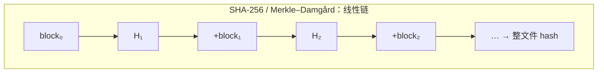
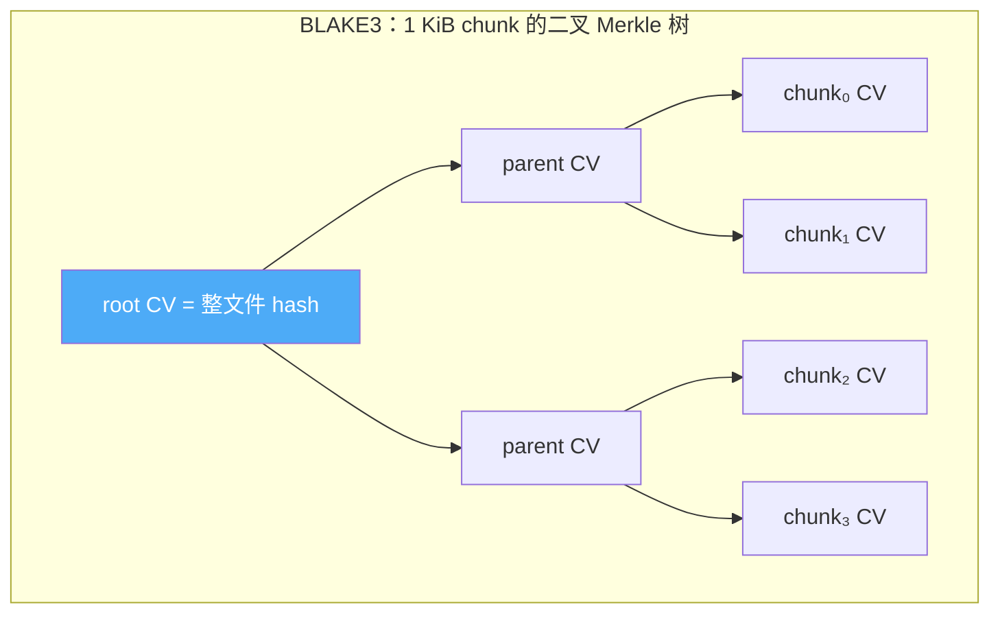
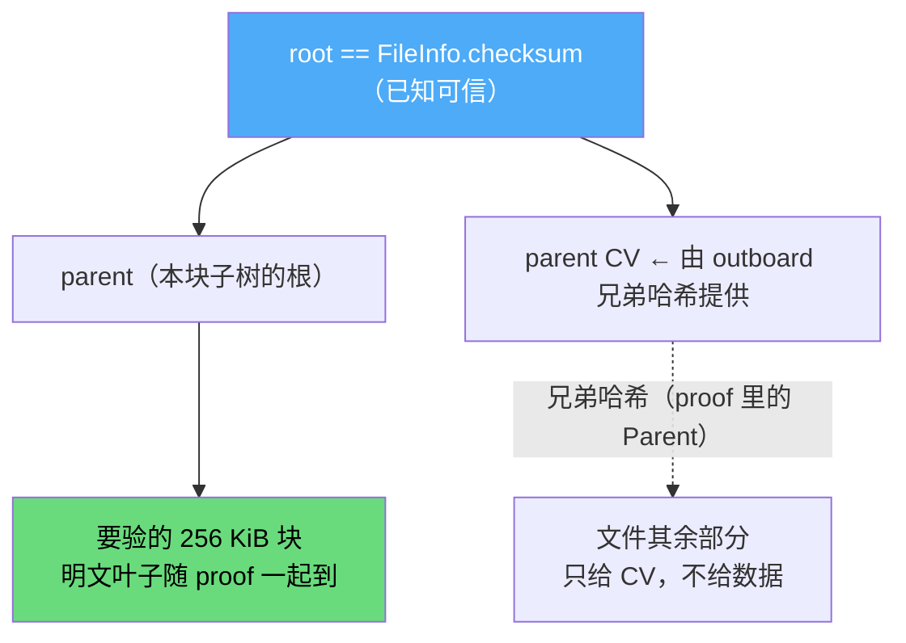

# bao-tree 逐块验证：为什么 BLAKE3 的树能边收边验，SHA256 不能

> transfer 子系列第 2 篇，接住上一篇（[删 XChaCha20](00-remove-xchacha20-crypto.md)）末尾留下的那句
> 「完整性交给 BLAKE3 逐块验签」。上一篇讲了删掉加密后完整性要**显式承担**，本篇讲承担它的引擎
> 到底怎么转——为什么同样是 blake3，「整文件收完算一次 hash」和「每收一块立刻验一块」差的不是
> 算法，而是你有没有把那棵树的**内部节点**存下来。
>
> 一句话主旨：verified streaming 的能力全在 BLAKE3 的**二叉树结构**里，SHA256 那种线性哈希天生
> 给不了——这不是「blake3 更强」，是结构不同。

## 结论先行

- 传统「整文件收完再算一次 hash」是**终点式校验**：坏了一个字节，要等整个文件收完、算完 hash
  才知道，整段白传；续传时磁盘上已有的半个文件**无法自证没被篡改**，只能信任对端。
- bao-tree（BLAKE3 的 Bao 编码）让接收方**每收一个 256 KiB 块就凭 outboard 立即验签**——边收边验、
  坏块当场发现、续传信任的是本地已验过的块而非对端。
- 能这么做的根本原因只有一句：**BLAKE3 本身是一棵二叉 Merkle 树**，任意子树可以脱离其它子树、
  只凭一条到根的兄弟哈希路径独立验证；而 SHA256 是线性的 Merkle–Damgård 链，第 N 块的哈希咬死
  在第 N-1 块的中间状态上，**验不了半个文件**。
- **outboard 就是「把这棵树的内部节点单独存出来」的产物**（≈ 文件的 0.39%），它随传输/存储走，
  验一个块需要的正是它里面那条兄弟路径。

下面按「为什么能（结构）→ 靠什么验（outboard）→ 粒度怎么定（chunk group）→ 替掉了什么」四步展开。

## 一、线性哈希 vs 树形哈希：能不能验半个文件，是结构决定的

先把「blake3 陷阱」（上一篇和调研都点过：「我已经在用 blake3 了，所以不缺这个能力」是错的）**从结构上**讲透——为什么用同一个哈希函数，有没有那棵树是天壤之别。

SHA-256、SHA-1、MD5 都是 **Merkle–Damgård 构造**：把消息切成固定大小的块，一块接一块喂进同一个压缩函数，每一块的输出是下一块的输入状态：

```
H₀ = IV
Hᵢ = f(Hᵢ₋₁, blockᵢ)     // 严格串行，后一块咬死前一块的中间状态
整文件 hash = Hₙ
```

这条链**天生串行**。想知道「前 N 个字节」的哈希，必须把前面每一块都折叠一遍——不存在「一个可以脱离上下文独立验证的子区间」这种东西。（顺便说一句，长度扩展攻击就是这种线性结构的一个症状。）后果直接：**你收到第 5 块，手里那个整文件 checksum 帮不上任何忙**，它是一个只有把最后一块也折进去才成立的终点。

BLAKE3 是另一种东西——它内部就是一棵**二叉 Merkle 树**：输入按 1 KiB 切成 chunk（叶子），每个 chunk 压成一个 256-bit 的链值（chaining value, CV），CV 两两合并成父 CV，一路向上并到唯一的 root CV，root 就是整文件哈希。





关键性质：**每个子树的哈希，只由它自己覆盖的那段字节（和它在文件里的位置）决定，不牵连任何别的子树。** 于是给你一个可信的 root，再给你某个子树到 root 一路上的**兄弟 CV**，你就能把这个子树自底向上重算到 root、和已知 root 比对——**这就是一个 Merkle proof，只不过 BLAKE3 原生就长这样，不用外挂。**

所以「verified streaming」是 BLAKE3 的**结构红利**，不是算法红利。换成 SHA256，你得在它外面**另搭一棵 Merkle 树**才能获得同样能力。而 `bao-tree` 对 BLAKE3 做的事，**不是搭树，是把 BLAKE3 本来就有的那棵树的内部节点存出来**——这就是下一节的 outboard。

## 二、outboard：把树的内部节点搬到文件外面

**outboard = 这棵树的内部（parent）节点集合。** 每个内部节点存的是它一对子节点的哈希——`(左 CV, 右 CV)`，共 64 字节。它和文件数据**分开存放，原文件一字节不改**（"outboard" 就是「不在数据里、挂在外面」的意思）。

节点数量是确定的：`blocks - 1` 个 pair（`blocks = ceil(文件大小 / chunk group)`），每个 pair 64 字节。16 KiB chunk group 下，1 GiB 文件 = 65536 blocks → 65535 × 64 B ≈ 4 MiB ≈ **0.39%**。这个比例后面会解释为什么是它。

我们有两条构建路径，产出同序（post-order），`crates/transfer/src/bao.rs`：

```rust
// crates/transfer/src/bao.rs:47 —— 同步、整文件入内存（供单测/小数据）
pub fn build_outboard(data: &[u8]) -> (blake3::Hash, Vec<u8>) {
    let tree = BaoTree::new(data.len() as u64, BLOCK_SIZE);
    let mut outboard = Vec::new();
    let root = outboard_post_order(&mut Cursor::new(data), tree, &mut outboard)
        .expect("in-memory outboard build never fails");
    (root, outboard)
}

// crates/transfer/src/bao.rs:64 —— 流式、内存有界（生产路径）
pub async fn build_outboard_from_source(
    file_access: &Arc<dyn FileAccess>, source_id: &FileSourceId, size: u64,
) -> AppResult<(blake3::Hash, Vec<u8>)> {
    let reader = FileAccessReader { /* read_at → read_source_chunk */ };
    let ob = PostOrderOutboard::<Vec<u8>>::create(reader, BLOCK_SIZE).await?;  // bao-tree tokio_fsm
    Ok((ob.root, ob.data))
}
```

流式那条经 `iroh-io` 的 `AsyncSliceReader` 适配 async 的 `FileAccess`（`bao.rs:81-100` 的 `FileAccessReader`），**不把整文件读进内存**——1 GiB 文件也只按需分块读。这解决了「async 文件端口 ↔ sync outboard 构建」的桥接，且 `bao-tree`/`iroh-io` 都是纯算法路径，wasm 双 target 可编、无 `cfg`（`Cargo.toml:38-39`：`bao-tree = "0.16"` + `iroh-io = "0.6"`，均 `default-features = false`）。

### 验一个块，到底有什么东西在传

验证 `[offset, offset+len)` 这一段，接收端需要两样东西：**这段的叶子数据** + **它到 root 的兄弟 CV 路径**。发送端用 `encode_ranges_validated` 把两者打成一个「完整 bao 切片」——size header + 交错排列的 `Parent`（64 字节兄弟哈希对）/`Leaf`（明文数据），排列顺序正是接收端 decode 时需要的顺序：

```rust
// crates/transfer/src/bao.rs:106 —— 发送端为一个 range 生成证明切片
pub fn encode_proof(
    outboard_bytes: &[u8], root: blake3::Hash, file_size: u64, offset: u64, block: &[u8],
) -> AppResult<Vec<u8>> {
    let outboard = PostOrderOutboard { root, tree: BaoTree::new(file_size, BLOCK_SIZE), data: outboard_bytes };
    let ranges = round_up_to_chunks(&ByteRanges::from(offset..offset + block.len() as u64));
    let mut proof = Vec::new();
    encode_ranges_validated(OffsetReadAt { base: offset, data: block }, outboard, &ranges, &mut proof)?;
    Ok(proof)   // size header + 交错 Parent/Leaf
}
```

接收端把整段喂 `decode_ranges`，它自底向上重算、逐个 parent 核对、最后核 root——**必然验签，没有 skip 选项**（`bao-tree` 原话：跳过验证就违背了 verified streaming 的目的）：

```rust
// crates/transfer/src/bao.rs:141 —— 接收端解码并验证，返回验证过的明文
pub fn decode_and_verify(
    proof: &[u8], root: blake3::Hash, file_size: u64, offset: u64, expected_len: u64,
) -> AppResult<Vec<u8>> {
    // 接收端不建自己的 outboard：throwaway PreOrderOutboard 只承载 root 供验签，
    // decode 写进去的 parents 用完即弃（我们不做再分发）。
    let mut outboard = PreOrderOutboard { root, tree: BaoTree::new(file_size, BLOCK_SIZE), data: Vec::<u8>::new() };
    let mut target = OffsetWriteAt { base: offset, data: vec![0u8; expected_len as usize] };
    decode_ranges(Cursor::new(proof), &ranges, &mut target, &mut outboard)?;  // 验证失败 → Err
    Ok(target.data)
}
```



### 为什么不把叶子塞进 `data`、只把 parents 塞进 proof

wire 帧 `BlockData` 有 `data` 和 `proof` 两个字段（`crates/transfer/src/wire/data_frame.rs:61`）。直觉上应该 Parent 进 `proof`、Leaf 明文进 `data`——但 `bao-tree` **没有稳定的公开迭代顺序 API** 来拆/组这个交错流，手动交错易错，而且叶子会在 `data` 和切片里各出现一次（2x 冗余）。所以我们选 **Approach B**：`proof` 直接放完整切片（含叶子），`data` **恒置空**：

```rust
// crates/transfer/src/actor/sender.rs:364 —— 发送每块
let root = crate::bao::root_from_checksum(&file.checksum)?;
let proof = crate::bao::encode_proof(&file.outboard, root, file.size, offset, &plaintext)?;
// → BlockData { data: Vec::new(), proof: Some(proof), .. }
```

叶子只出现一次，wire 开销 ≈ **明文 + 少数几个 64 字节兄弟哈希 ≈ 0.4%**（一个 256 KiB 块在大文件里的兄弟路径长度是 O(log 块数)，几个 pair 而已，主体还是明文）。全程走库的 encode/decode，**零手写 Merkle 验证**。proof 是 opaque bytes，`u8` 标志 + 可选 len-prefixed bytes 编码（`data_frame.rs:208-215`），**在 wire v2 内启用，未 bump 版本号**。

## 三、chunk group：验证粒度的旋钮，为什么拧在 16 KiB

上面一直说「chunk group」而不是「BLAKE3 的 1 KiB chunk」。这里是全篇唯一一个需要「拍参数」的地方。

`BlockSize::from_chunk_log(4)` = 2⁴ = 16 个 BLAKE3 chunk = **16 KiB**（`crates/transfer/src/bao.rs:41`）。它的含义是：**树在 16 KiB 这一层就「封底」**——group 以下那 16 个 1 KiB chunk 由 BLAKE3 内部一口气算成一个叶子 CV，outboard 不再为它们单独存节点。所以 chunk group 就是「你愿意为多细的粒度保留可独立验证的证明节点」这个旋钮。

两端都难受：

| chunk group | outboard / 文件 | 最小可验单元 | 代价 |
|---|---|---|---|
| 1 KiB（`BlockSize::ZERO`） | 64/1024 = **6.25%** | 1 KiB | outboard 膨胀、树更深、每块 proof 的兄弟哈希更多 |
| **16 KiB（我们选的）** | 64/16384 ≈ **0.39%** | 16 KiB | 平衡点 |
| 64 KiB | ≈ 0.098% | 64 KiB | 存得更省，但必须缓冲满 64 KiB 才能验/拒一次 |

- **拧太小**：outboard 直接膨胀到 6.25%（存开销约等于 `64 / group_bytes`），树更深，每传一块要带的兄弟哈希也更多。
- **拧太大**：验证粒度变粗——接收端必须先把**一整个 group** 缓冲齐才能验、才能拒，「坏块当场发现」的即时性被拖钝。

16 KiB 是 `bao-tree` 源码注释里点名的「a good default for most cases」，也是 iroh 的 `IROH_BLOCK_SIZE`。我们照抄，外加一条自己的理由：**传输块（`CHUNK_SIZE = 256 KiB`，`crates/transfer/src/lib.rs:40`）恰好是 16 KiB chunk group 的整数倍**——`256 KiB = 16 × 16 KiB`。于是 fetch_plan 的分块边界天然对齐 chunk group 边界，**验证粒度（16 KiB）和传输粒度（256 KiB）彻底解耦、互不干扰**；文件尾部那点非 16 KiB 整数倍的零头，由 bao 依 `file_size` 自处理。

### 一个白拿的不变量：root == checksum

chunk group **只影响 outboard 的深度，不影响 root**——不管封底在 1 KiB 还是 16 KiB，root 始终是对全部 1 KiB chunk 算出来的那棵完整树的根，也就是**标准的整文件 blake3**。而 `FileInfo.checksum` 正是 prepare 阶段流式算出的标准 blake3 hex。两者相等，于是验证 root 直接解析现成的 checksum，**FileInfo / wire 一个字段都不加**：

```rust
// crates/transfer/src/bao.rs:172
pub fn root_from_checksum(checksum: &str) -> AppResult<blake3::Hash> {
    blake3::Hash::from_hex(checksum) /* ... */
}
```

这条不变量在 prepare 里被 `debug_assert` 钉死（checksum 与 outboard 各走一遍流式读、同源构建，`debug` 下核验两者相等，`crates/transfer/src/flow/prepare.rs:87`），也在单测里钉死：

```rust
// crates/transfer/src/bao.rs:284（测试）
assert_eq!(root, blake3::hash(data), "bao root 必须等于扁平 blake3");
```

## 四、它替掉了什么：从终点校验到边收边验

回到开头那句「终点式校验」。旧栈里，一个文件的完整性锚点只有一个——prepare 阶段算出的整文件 checksum。它带来两个硬伤：

1. **收到第 5 块，判断不了它对不对**，得等整文件收完、算完 hash 才知道；
2. **续传时，磁盘上已有的半个文件无法自证没被篡改**——旧栈的现状就是：续传建立在「信任对端」之上。

（上一篇讲的那层 XChaCha20 的 Poly1305 认证标签虽然逐块，但它绑的是**密钥**、不是**内容**——「用这把密钥加密的没被改」，而不是「这一块对得上文件的 blake3 根」。删掉加密后这块地空了出来，bao 填上，而且是**内容寻址**的。)

现在，每块验过才落 checkpoint。接收端 `verify_block` 是数据面每帧必经的第一道关：

```rust
// crates/transfer/src/actor/receiver.rs:343 —— verify_block（节选）
let proof = proof.ok_or_else(|| AppError::Transfer("BlockData 缺少逐块证明（协议违规）..".into()))?;
let root = crate::bao::root_from_checksum(&file_info.checksum)?;
let data = crate::bao::decode_and_verify(&proof, root, file_info.size, range.offset, range.length)?;
// 验过的明文才继续：写盘 → mark_chunk_completed → 节流刷 checkpoint
```

于是一条干净的推论链成立：**逐块验签通过 → 写盘的是可信明文 → checkpoint bitmap 本身可信 → 续传时信任本地磁盘上已验过的块**（本地篡改不在传输威胁模型内，这条决策记在 `crates/transfer/src/wire/mod.rs` 的模块文档里）。旧栈那条「信任对端」的假设被彻底拿掉。`proof` 为 `None` 或验签失败 = 协议违规，断流走既有的 Interrupted 恢复——发送端恒带 proof，v2 两端同步发布，无渐进兼容需求。

坏块被拒不是口号，是测试钉的（`crates/transfer/src/bao.rs`）：`tampered_block_is_rejected` 翻转 proof 里一个字节就必败，`wrong_root_is_rejected` 用错 root 必败，外加 `roundtrip_tail_unaligned`（尾部非对齐）、`empty_file_roundtrips`（0 字节文件）、`streaming_build_matches_in_memory_and_flat_blake3`（流式 root == 内存 == 扁平 blake3 三源一致）覆盖边角。

剩下三件收尾的工程事实：

| 事 | 做法 | 位置 |
|---|---|---|
| 发送端 outboard 免 resume 重算 | prepare 建好后随会话落 `transfer_files.outboard` BLOB 列（新 migration，≈0.4% 存储），经 `SessionStore` 端口存取 | `migration/…transfer_file_outboard.rs`、`store.rs:96` |
| resume 时 outboard 缺失（旧会话/NULL） | 按源文件流式重算并回存，不逐块现算 | `flow/resume/mod.rs:359` |
| 接收端**不建** outboard | 不做再分发，decode 用 throwaway `PreOrderOutboard` 只承载 root，parents 用完即弃 | `bao.rs:157` |
| 整文件校验没删，降级成 backstop | `finalize_sink` 仍做一次整文件校验，失败则 `reset_file_checkpoint` | `receiver.rs:512-535` |

注意最后一行——**整文件校验没有被 bao 取代，而是被降级**：逐块验签在传输途中挡下所有坏块，整文件 hash 退居最后一道兜底。两者不重叠：一个管「边收边验、坏块当场发现」，一个管「落盘那一刻再确认一次」。

## 小结

- **verified streaming 是 BLAKE3 的结构红利**：它内部是二叉 Merkle 树，任意子树凭一条到 root 的兄弟哈希路径独立可验；SHA256 的线性 Merkle–Damgård 链验不了半个文件。用同一个哈希函数，有没有那棵树是天壤之别。
- **outboard 就是这棵树的内部节点**（64 字节的兄弟哈希对，与数据分离，≈0.39%）。验一块传的是「叶子数据 + 兄弟路径」，接收端 `decode_ranges` 自底向上重算核对，**必然验签、无 skip**。
- **chunk group 是唯一要拍的参数**：太小 outboard 膨胀（1 KiB → 6.25%），太大验证粒度变粗；16 KiB 平衡，且让 256 KiB 传输块天然对齐，验证粒度与传输粒度解耦。root 不受它影响，于是 **root == checksum**，零新字段。
- **它把「终点式整文件校验 + 信任对端」换成「逐块内容寻址验签 + 信任本地已验块」**，整文件 hash 降级为落盘 backstop。这正是上一篇删掉 XChaCha20 后腾出的那块地——只不过 bao 填得更强，还因为 checksum 保持明文 blake3 而解锁了内容寻址（加密会让 checksum 变成密文哈希，`root == 明文 blake3` 的不变量当场塌台，两者不能共存）。

这也是当初「保留 libp2p、却照 iroh 重写一遍」那次调研认定的**唯一一处真实能力差**——不引 iroh 网络栈，只借它生态里的纯算法 crate `bao-tree` 补上。为什么不迁 iroh 却要学它，见系列起点：[network-kernel/00 — 保留 libp2p，却要学 iroh](../network-kernel/00-why-not-migrate-iroh.md)。
