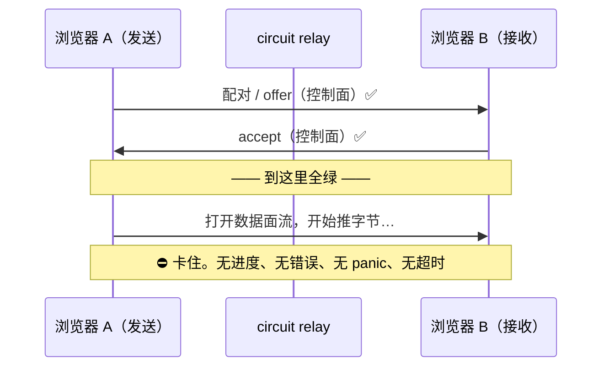

# 症状：全绿，却传不过去

> **本系列**：一个 bug 的十一轮调试复盘。目标是让浏览器（`crates/web`）成为真正的
> SwarmDrop 传输端——**复用桌面字面同一份 `swarmdrop-transfer` 逻辑**，浏览器里 offer /
> accept / 续传 / bao 逐块验证全部走内核。这一篇讲**症状**：为什么这是最难对付的一类 bug。

## 一块信号板，全是绿灯

先看我们手上的仪表盘。落地 `crates/web` 那天，所有传统信号都是绿的：

| 信号 | 状态 |
|---|---|
| native e2e 传输测试 | **16 / 16 全绿** |
| 单元 / 集成测试 | **203 个全过** |
| 五个 crate 编译到 `wasm32-unknown-unknown` | **全过** |
| `clippy -D warnings` | **零告警** |
| 浏览器里配对 / offer / accept（控制面） | **全通** |

按任何一本工程手册，这时候应该收工了。编译过了、测试绿了、类型对了、控制面在真实浏览器
里握手成功——两个浏览器页面经 circuit relay 找到彼此，发起 offer，对方弹出接收确认，点
「接受」。一切都对。

然后**文件字节，一个都过不去**。

不是报错，不是崩溃，不是慢——是**静默地停在那里**。发送端的进度条不动，接收端的落盘不
发生，console 里没有一行红字，也没有任何超时把它兜住。就像往一根管子里灌水，水进去了，另
一头永远不出来，而管子本身看不出任何破洞。

## 为什么这是最难的一类 bug

调试的第一步永远是「顺着信号找」。但这个 bug 的可怕之处在于——**所有信号都在骗你**。

- **编译器不管用**。wasm 是编译目标，`cargo build --target wasm32` 过了只证明「类型和符
  号都对得上」，它对**运行时语义**一无所知。后面四道门里，没有一道能被编译器拦住。
- **native 测试不管用**。同一份 `swarmdrop-transfer` 代码，在桌面 tokio 多线程运行时下
  16/16 全绿。可它掩盖了整整一类问题——多线程运行时会「顺手」把 wasm 单线程下暴露的唤
  醒缺陷盖过去（后面两道门都是这个机理）。**native 全绿对 wasm 行为零信息量。**
- **控制面全通不管用**。offer / accept 走的是 RPC 式的「一问一答」短流，和数据面走的
  「持续推大流」根本是两种流形状。控制面能过，恰恰是后面推理数据面根因的**反例**（见门
  2），但它绝不构成「数据面也能过」的证据。

一句话：**这个 bug 活在编译期完全看不见的第三维里**——wasm 单线程调度语义 + 浏览器 Web
平台约束。`cargo test` / `cargo check` / 类型系统，一个都够不着它。

## 唯一的办法：真实浏览器，逐层剥

既然所有静态信号都失效，那就只剩一条路：**在真实浏览器里把它跑起来，一层一层剥。**

我们的做法是用浏览器自动化驱动两个真实页面，经 circuit relay 互传文件，在关键路径上铺
`info!` 锚点，看字节到底卡在哪一步、卡之前最后一条日志是什么。这个过程走了**十一轮**。

十一轮听起来像是在原地打转，其实不是。**每修一层，卡点就往前挪一步**——这是判断「方向没
错、正在收敛」的核心信号：

> 注意上面「信号板全绿」与进度图起点「offer 都不通」的表面矛盾：**信号板是门 1（std::time panic）
> 跨过之后的状态**——门 1 未修时 prepare 阶段就 panic，连 offer 都发不出。信号板的「控制面全通」
> 描述的是 offer/accept 能跑通的那个阶段，数据面的坑还在后面四道门里。

每一次前移，背后都是撞开了一道 wasm 运行时的门。一共四道，按我们踩到的顺序：

| # | 门 | 一句话症状 | 根因 |
|---|---|---|---|
| 1 | `std::time` panic | prepare 阶段直接炸 | wasm 无系统时钟，`Instant::now()` 运行时 panic |
| 2 | split 的 reader half 不唤醒 | 字节到了 muxer，读循环不推进 | 单线程下 `split()` 的 BiLock reader half 不被唤醒 |
| 3 | 跨任务 move 的 lost-wakeup | 首帧读到了，后续帧永久 Pending | 流跨任务边界，wake 打给了旧 waker |
| 4 | Web API secure-context gating | 3 块全过，卡在 finalize | 非 secure context 下 `navigator.storage` 不存在，JsFuture 永久 pending |

四道门有一个共同的、令人不安的特征：**它们都不报错**。panic（门 1）算是里面最「响」的一
个了；门 2、3、4 全是静默挂起——最坏的失败模式。

最后的验证：换到 `http://127.0.0.1`（secure context），两个浏览器经 circuit relay 传
2MB，OPFS 落盘 **2097152 字节逐字节一致，耗时 93ms**。浏览器跑的是与桌面**字面同一份**
transfer 逻辑。（提交 `08c8ab0a`，"feat(web): 浏览器传输端 swarmdrop-web + wasm 四道门攻克"。）

## 接下来

这个系列一篇讲一道门，外加一篇方法论。每一篇都从「症状 → 根因 → 怎么修」落到硬技术，
但真正想传递的是那套**在全绿仪表盘下逐层剥 wasm bug 的心智**。

- [门 1：`std::time` 在 wasm 直接 panic](01-gate-1-std-time.md)——最浅的一道，热身。
- [门 2：futures split 的 reader half 不唤醒](02-gate-2-split-wakeup.md)——第一次撞上单线程语义。
- [门 3：accepted 流跨任务 move 的 lost-wakeup](03-gate-3-cross-task-wakeup.md)——最烧脑的一道。
- [门 4：finalize 永久 pending 的真凶](04-gate-4-secure-context.md)——反转，根本不是 transfer 的 bug。
- [方法论：怎么调一个「全绿却不工作」的 wasm bug](05-methodology.md)——把这套打法提炼出来。

先记住这句话，它会贯穿全程：**「native 全绿 + 五 crate wasm 编译全过 + 控制面全通」= 零
保证。** wasm 单线程 + Web 平台的运行时语义，只能真实浏览器逐层剥。
