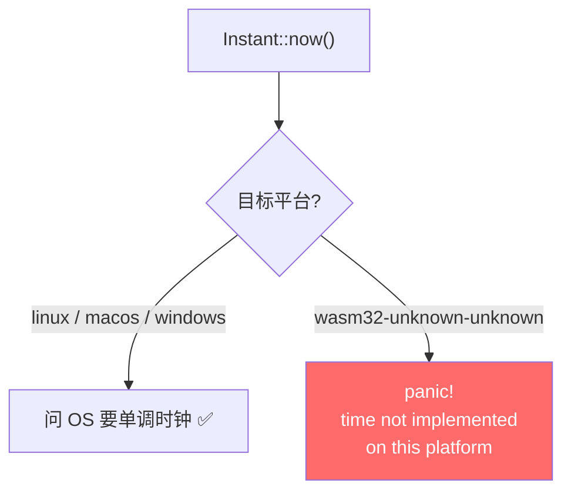

# 门 1：`std::time` 在 wasm 直接 panic

> **这道门**
> - **症状**：传输一进 prepare 阶段就炸，console 里一行 `time not implemented on this platform`。
> - **根因**：`std::time::Instant::now()` 在 `wasm32-unknown-unknown` 上是**运行时 panic**，不是编译错。wasm 没有系统时钟。
> - **修复**：transfer 里 5 处 `Instant` 全换成 `n0_future::time::Instant`（native=tokio，wasm=web_time）。

这是四道门里最浅的一道，拿它热身正好——因为它把整个系列的核心教训摆得最直白：**编译过
了，什么都不代表。**

## 症状：还没开始传，就炸了

前面几道门都是「静默挂起」，唯独门 1 是「响」的——它 panic。而且它出现得很早：传输还在
**prepare 阶段**（算 manifest、初始化进度追踪、准备分块），字节都还没上路，就直接炸了。

console 里的原文是这样一句：

```text
panicked at 'time not implemented on this platform'
```

对第一次搞 wasm 的人来说，这句话是懵的。`std::time` 是标准库啊，标准库怎么会「未实现」？

## 根因：wasm32-unknown-unknown 没有时钟

关键在目标三元组的最后那截：`wasm32-unknown-**unknown**`。第二个 `unknown` 是操作系统
位——意思是**没有操作系统**。没有 OS，就没有人回答「现在几点」这个问题。

`std::time::Instant::now()` 底层要问系统要一个单调时钟读数。在 Linux 上是
`clock_gettime`，在 macOS 上是 `mach_absolute_time`。到了 `wasm32-unknown-unknown`，标
准库找不到任何可以问的宿主，于是它的实现体就是一句 `panic!`——**能编译，一调用就死**。



这就是「编译期看不见的门」最纯粹的样子：**类型对、符号在、`cargo build --target wasm32`
一路绿灯**，因为 `Instant::now()` 这个符号确实存在、签名确实合法。编译器唯一不知道的
是——它的函数体是一颗定时炸弹。

而 transfer 里有 5 处用到 `Instant`，散落在 prepare / 进度追踪 / 收发两端：

```text
crates/transfer/src/progress.rs
crates/transfer/src/manager.rs
crates/transfer/src/actor/sender.rs
crates/transfer/src/flow/prepare.rs
crates/transfer/src/flow/receive.rs
```

它们在桌面上老老实实工作了几个月，在 native e2e 里跑了 16/16——因为 native 有时钟。一进
浏览器，第一处 `Instant::now()` 就把 prepare 掀翻了。

## 修复：换成 n0-future 的 Instant

修法本身极其无聊，就是把 import 换掉：

```rust
// crates/transfer/src/flow/prepare.rs（其余 4 处同）
- use std::time::Instant;
+ // wasm 上 std Instant panic（time not implemented），统一走 n0-future（native=tokio，wasm=web_time）
+ use n0_future::time::Instant;
```

有意思的是**为什么选 `n0_future::time::Instant`**，而不是别的。`n0-future` 是 n0（iroh
组织）维护的通用垫片，它的 `time` 模块设计得非常干净：

```rust
// n0-future 的 time 模块（示意）
#[cfg(not(wasm_browser))]
pub use tokio::time::Instant;   // 原生：就是 tokio 原物，类型等价
// wasm 侧：换成 API 兼容的 web-time 重实现
```

- **在桌面 / 移动端**，`n0_future::time::Instant` 就是 `tokio::time::Instant` 的 re-export
  ——类型等价、行为不变、源码级零改动。native e2e 该怎么绿还怎么绿。
- **在 wasm 上**，它换成基于 `web-time`（走浏览器 `performance.now()`）的实现，有真实的
  单调时钟可用，不再 panic。

`wasm_browser` 这个 cfg 由 n0-future 的 `build.rs` 自动生效（`= all(target_family =
"wasm", target_os = "unknown")`），不用我们手配 rustflag。一次 import 替换，两个平台都对。

> **注意**：`n0-future` 不拖 iroh 进来，它就是个平台垫片。选它而不是自己写 cfg 分叉的
> `web-time`，是因为 transfer 里除了 `Instant` 还有 `timeout` / `sleep` 等一堆 tokio 时
> 间 API 要一起过 wasm（后面门 4 的超时兜底就用到了 `n0_future::time::timeout`），一个
> 垫片全包了。

## 带走的一点

门 1 的技术含量不高，但它是整个系列的「原型」：

> **`cargo build --target wasm32` 通过，只保证符号和类型对得上，不保证函数体在 wasm 运
> 行时不炸。** 标准库里凡是要问宿主环境的东西（时钟、线程、文件、随机数……）在
> `wasm32-unknown-unknown` 上都可能是「能编译、一调用就 panic」的空壳。

排查这类问题的信号很明确：**功能在某个用到平台能力的路径上静默失败或 panic，console 里
有 `... not implemented on this platform` 字样。** 看到它，别怀疑自己的逻辑，先怀疑你踩
到了一个「标准库在 wasm 上没实现」的坑。

热身结束。下一道门，我们第一次撞上 wasm **单线程调度**的语义——它不 panic，它静默挂起。

→ [门 2：futures split 的 reader half 不唤醒](02-gate-2-split-wakeup.md)
