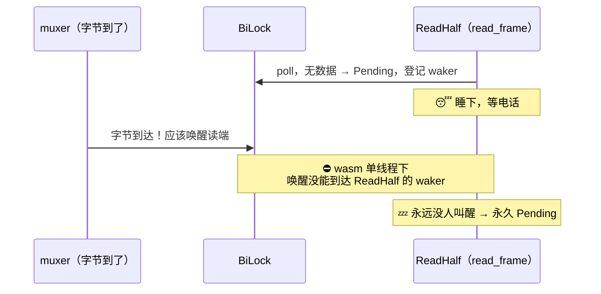

# 门 2：futures split 的 reader half 不唤醒

> **这道门**
> - **症状**：门 1 修完，传输能进数据面了，但**首帧都拉不到**。发送端写出去了，接收端读循环纹丝不动。字节确实到了 muxer，读端就是不推进。
> - **根因**：数据面收发两端都 `channel.split()` 成 reader/writer 并发读写。`futures::AsyncReadExt::split()` 靠 BiLock 分半，wasm 单线程下——字节到达后，**reader half 不被唤醒**。native 多线程掩盖了它。
> - **修复**：去掉 `split()`，整条流顺序读写（本就不重叠，split 纯属多余）。

门 1 是「能编译一调用就炸」，好歹会 panic 给你看。门 2 开始，进入这个 bug 真正阴险的地
带——**它一声不吭地挂在那里**。

## 症状：字节进了管子，读端却在睡觉

修完 `Instant` 之后，卡点前移了一步：prepare 不炸了，传输能走到数据面。但新的卡点是——
**接收端一帧都读不到**。

铺上锚点日志看，画面很诡异：

- 发送端：Hello 帧 `write` 成功，第一个 BlockData 帧 `write` 成功，日志一路往下。
- 接收端：读循环停在**第一次 `read_frame` 之前**，之后再无任何日志。

字节明明进了管子（发送侧 write 返回了 Ok），另一头的读循环却像睡着了一样，**永远不醒**。
没有错误，没有 EOF，没有超时。

## 先看出事的代码长什么样

修复前，数据面的发送端是这么写的（`crates/transfer/src/actor/sender.rs`，节选修复前）：

```rust
let (mut reader, mut writer) = channel.split();   // ← 罪魁

let writer_task = async {
    write_frame(&mut writer, &Hello { ... }).await?;
    for range in plan { self.write_range(&mut writer, epoch, range).await?; }
    write_frame(&mut writer, &Finish { ... }).await
};

let reader_task = async {
    // 等接收方收完回一帧 Finish 作为完成确认
    let frame = read_frame(&mut reader).await?;
    // ...match Finish / Abort...
};

tokio::try_join!(writer_task, reader_task)?;   // ← 两半并发跑
```

接收端对称：也 `stream.split()` 成 reader/writer，一个读循环收 BlockData、末尾往 writer
写一帧 Finish 确认。

设计意图很自然：「一边写一边读，用 `try_join!` 让两半并发」。在桌面上，这套跑得好好的。

## 根因：BiLock 的 reader half 在单线程下不被唤醒

`futures::AsyncReadExt::split()` 把一条流拆成 `ReadHalf` 和 `WriteHalf`，底层用一个叫
**BiLock** 的东西：两半共享同一条底层流，用一把锁在两个 half 之间轮流交出访问权。

问题出在**唤醒**这一环。异步的读是这样运作的：

1. `read_frame` poll 底层流，暂时没数据 → 返回 `Pending`，并**登记一个 waker**（「有数据
   了打这个电话叫我」）。
2. 字节从网络到达 muxer。
3. muxer **打那个 waker 的电话**，把读任务重新塞进调度队列。
4. 调度器再次 poll `read_frame`，这次读到数据。

第 3 步——「打电话」——是整条链的命门。在 `split()` + BiLock 的结构下，reader half 登记
的 waker 隔了一层 BiLock 的转发。**在 wasm 单线程调度下，字节到达 muxer 后，那个唤醒信号
没能正确传到 reader half 登记的 waker**，于是第 4 步永远不发生。读任务登记完 waker 就睡了，
再也没人叫醒它。



**为什么 native 掩盖了它？** 桌面是多线程 tokio 运行时。多线程下有别的力量在「兜底」——
写端任务在另一个线程上推进、runtime 的 park/unpark 机制、`try_join!` 两半交替被 poll……
这些额外的调度活动会「顺手」把读任务重新 poll 一遍，于是即便 BiLock 的唤醒信号丢了，读端
也总会在某次「顺带 poll」里读到数据。**多线程的噪声盖住了唤醒缺陷。** 到了 wasm 单线程，
没有别的线程、没有额外的 poll 噪声，缺陷就赤裸裸暴露：没人叫醒，就真的永远不醒。

## 破案的关键：一个「反例」推理

这道门最难的不是修，是**定位**。字节到了、读端不动、无错误——你怎么知道问题出在
`split()` 而不是别的十几个可疑点？

破案靠的是一次**对照推理**：

> 浏览器里**能工作**的路径（RPC 控制面、offer / accept）和**卡住**的路径（数据面），到
> 底有什么结构差异？

把两类路径摆一起看，差异只有一处、且干净得刺眼：

| 路径 | 流的用法 | 结果 |
|---|---|---|
| RPC / offer / accept（控制面） | **整条流顺序 read/write，从不 split** | ✅ 通 |
| 数据面收发 | `split()` 成两半**并发**读写 | ⛔ 卡 |

能工作的路径全是「一整条流从头顺序用到尾」，唯独卡住的数据面 `split` 了。**当所有变量里
只有一个不同、而它恰好正相关，它就是嫌疑犯。** 这条推理把病灶从「数据面某处」一下收窄到
「`split()` 这一行」。

## 修复：根本不需要 split

回头看数据面的实际读写时序，会发现一个更尴尬的事实——**这里的读和写本来就不重叠。**

发送端的逻辑是：先把 Hello + 所有块 + Finish **全部写完**，然后才读对端回的那一帧 Finish
确认。写阶段和读阶段是**先后**的，不是**并发**的。既然不重叠，`split()` 成两半并发跑就是
**多余**——多余到还引来了一个致命 bug。

于是修法是「拉直」：去掉 split，用整条流顺序写、再顺序读（`crates/transfer/src/actor/sender.rs`
修复后）：

```rust
pub async fn run_data_channel(&self, epoch: i64, mut channel: P2pStream, ...) -> AppResult<()> {
    write_frame(&mut channel, &Hello { ... }).await?;   // 整条流，顺序写

    for range in plan {
        if self.cancel_token.is_cancelled() { return Err(...); }   // 本地取消：每块前查
        self.write_range(&mut channel, epoch, range).await?;
    }
    write_frame(&mut channel, &Finish { ... }).await?;

    // 写完再读对端 Finish 确认（取消用 select! 响应，不必再靠 writer task 兜底）
    let frame = tokio::select! {
        _ = self.cancel_token.cancelled() => return Err(...),
        frame = read_frame(&mut channel) => frame?,
    };
    // ...match Finish / Abort...
}
```

接收端对称改：不再 `stream.split()`，读循环直接读整条 `stream`，末尾往同一条 `stream` 写
一帧 Finish 确认（`crates/transfer/src/actor/receiver.rs`）。代码里留了注释把根因钉死：

```rust
// **整流顺序读写，不 split**（wasm 修复，与发送端对称）：读循环天然顺序、仅末尾写一帧
// Finish 确认，两者不重叠，`split` 本就多余；而 `futures` split 的 BiLock reader half 在
// wasm 下、数据到达 muxer 后不唤醒读端（native 多线程掩盖）——直接用整条流即修。
```

原来那个「取消要靠独立 writer task 兜底」的顾虑也一并消失了——现在取消直接由读循环的
`tokio::select!` 响应，比原来还干净。**去掉 split 不是打补丁，是把一段本就多余的复杂度删
掉，顺带治好了病。**

## 卡点前移

改完再测：接收端**首次能读到帧了**。卡点应声前移——从「首帧拉不到」推进到「拉到首帧」。

但故事没完。拉到首帧之后，读循环又在**下一帧**卡住了。同样的静默、同样的无错误。看起来
像同一个病，其实是另一道门——而且是四道里最烧脑的一道：**流跨了任务边界，唤醒打给了一个
已经不再读它的旧 waker。**

→ [门 3：accepted 流跨任务 move 的 lost-wakeup](03-gate-3-cross-task-wakeup.md)

---

**这道门的教训**：wasm 是**单线程**运行时，它不像多线程那样有「额外调度噪声」替你兜住唤
醒缺陷。任何依赖「总会有人再 poll 我一次」的隐式假设，在单线程下都会现原形。而 `split()`
+ 并发读写这种「看起来很对称很优雅」的写法，一旦读写本不重叠，就是纯粹的风险源——**能顺
序读写时，别 split。**
