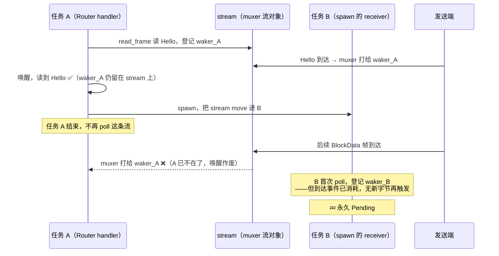

# 门 3：accepted 流跨任务 move 的 lost-wakeup

> **这道门**
> - **症状**：门 2 修完，接收端**能读到首帧（Hello）了**，可紧接着又卡死——后续的数据帧永远读不到。还是那个静默：无错误、无超时。
> - **根因**：Hello 在 Router 的 handler 任务（任务 A）里读，然后整条流被 `move` 进一个独立 spawn 的 ReceiverActor 任务（任务 B）。B 首次 poll 之前，muxer 已经把后续帧的唤醒**打给了 A 的旧 waker**；B 注册新 waker 时，那次唤醒事件已经消耗掉了，发送端也不会再产生新字节——于是永久 `Pending`。
> - **修复**：**入站流不跨任务**。在读 Hello 的同一个 handler 任务里，一路 `await` 到接收结束（iroh「形状 A：在 accept 里跑完」）。

这是四道门里最烧脑的一道。它牵扯到 Rust 异步最底层的一个约定——**waker 到底登记在谁身
上**——而这个约定平时你根本不用关心，因为多线程运行时替你兜住了所有粗糙的边角。到了 wasm
单线程，边角全部暴露。

## 症状：读到 Hello，然后就没有然后了

门 2 之后卡点前移：接收端**首帧能读到了**。锚点日志显示 `read_frame` 成功拿到 Hello 帧，
校验通过。然后读循环开始等**下一帧**（第一个 BlockData）——就在这里，永久停住。

发送端明明把整个文件的块都写出去了（它的锚点一路跑到 Finish）。接收端却像是断了线：Hello
之后，muxer 里的字节再也没被读出来。

和门 2 的症状几乎一模一样，很容易以为是 split 没修干净。但这次流并没有 split。真正的差异
藏在一个更隐蔽的地方——**这条流在读完 Hello 之后，换了一个任务来读。**

## 先看出事的结构

入站数据面流是这样被处理的。Router 为每条入站流起一个 handler 任务（记作**任务 A**），
在里面调 `accept`，进而走到 `handle_inbound_data_stream`——这里读 Hello、做归属和 epoch
校验（`crates/transfer/src/wire/data_plane.rs`）：

```rust
async fn handle_inbound_data_stream(self: Arc<Self>, mut stream: P2pStream) -> AppResult<()> {
    let Some(hello) = read_frame(&mut stream).await? else { ... };   // ← 任务 A 里读 Hello
    // ...校验归属 / epoch / manifest...

    // 出事的旧写法：把 stream move 进一个独立 spawn 的任务
    receive.start_data_channel(epoch, stream, fetch_plan, on_finish);
}
```

而 `start_data_channel` 修复前，内部是 `spawn` 一个新任务（记作**任务 B**）来跑接收循环
（`crates/transfer/src/actor/receiver.rs`，修复前）：

```rust
pub fn start_data_channel<F>(self: Arc<Self>, epoch, stream, fetch_plan, on_finish: F)
where F: FnOnce(&Uuid) + Send + 'static {
    n0_future::task::spawn(async move {              // ← 任务 B：独立 spawn
        let outcome = self.run_data_channel(epoch, stream, fetch_plan).await;   // ← 在 B 里读后续帧
        // ...
    });
}
```

一句话概括这个结构：**流在任务 A 里读了首帧，然后被搬到任务 B 里读剩下的。** 一条流，跨
了任务边界。

## 根因：waker 登记在流上，唤醒是一次性的

要讲清楚为什么这会死，得先把 Rust 异步「读一帧」的机制拆到底。

底层的 muxer 流是这样通知「有数据了」的：

1. 谁想读，就 poll 这条流。没数据时，poll 返回 `Pending`，并把**当前任务的 waker 登记到
   这条流对象上**（「有数据了，打这个电话」）。
2. 字节到达 muxer，muxer **打一次电话**——调用它此刻登记着的那个 waker——把对应任务重新
   塞回调度队列。
3. 被唤醒的任务再 poll，读到数据。

命门有两个，平时都被隐藏得很好：

- **waker 登记在「流对象」上，不在「那次读操作」上。** 你 `read_frame(&mut stream)` 读完
  一帧，那个临时的读 future 就 drop 了，但它登记在 `stream` 上的 waker **留在 stream 上**，
  直到下一次 poll 用新 waker 把它替换掉。
- **唤醒是一次性的（edge-triggered）。** muxer 对「一批字节到达」这个**事件**只打一次电
  话，打给它此刻登记着的那个 waker。电话打完，这个事件就消耗了。

现在把出事的时序串起来：



关键就在**第 5、6 步之间那道竞争**：后续帧到达时，`stream` 上登记着的还是 **waker_A**
（任务 A 读 Hello 时留下的，任务 B 还没来得及 poll、还没替换成 waker_B）。muxer 老老实实
打了这一次电话——打给了 waker_A。可任务 A 早就跑完、把流搬走了，这次唤醒**彻底作废**。等
任务 B 终于第一次 poll、把 waker_B 登记上去，为时已晚：那个「数据到达」的事件**已经被消
耗**，而发送端把该发的都发完了、**不会再产生新的到达事件**去打 waker_B 的电话。任务 B 就
这样抱着一个永远不会响的电话，睡死过去。

这就是经典的 **lost wakeup**（丢失唤醒）：唤醒信号发出了，但发给了一个「过期的听筒」。

## 为什么 native 全绿、浏览器必死

同一份代码，桌面 e2e 16/16 从没露过马脚。差别还是**单线程 vs 多线程的调度确定性**：

- **native 多线程**：任务 B 一 spawn 就可能立刻在另一个线程上被调度、抢先 poll 一次，把
  waker_B 登记上去——赶在后续帧到达之前。竞争窗口极窄，且 runtime 的 park/unpark 噪声还会
  额外补 poll。于是「唤醒打给旧 waker」这个坏情况**几乎不发生**，发生了也被补 poll 救回。
- **wasm 单线程**：只有一条执行线。任务 A 跑完（读完 Hello、spawn 出 B）之前，任务 B 根
  本没机会 poll。等 A 让出执行权，后续帧可能早已到达、唤醒早已作废。顺序是**确定**的，坏
  情况**每次都发生**，也没有别的线程来补 poll。

**多线程把一个真实的竞争条件，用时序噪声长期掩盖成了「从不发生」。** 这正是为什么 native
测试对这类 bug 零保证。

### 一条反例佐证

和门 2 一样，定位靠的是「能工作的路径有什么不同」。浏览器里 RPC / offer / accept 全程可
用——而它们的共同点是：**整条流在同一个任务里从头读到尾，从不跨任务 move。** 唯独数据面
接收把流从 handler 任务搬进了 spawn 的 actor 任务。变量只差这一个，嫌疑犯就是它。

## 一段必须澄清的背景：n0-future 的 wasm 任务语义

有人会问：是不是 `n0_future::task::spawn` 在 wasm 上是假的、根本没真起任务，才导致 B 不
被调度？**恰恰相反。**

n0-future 的**自由函数 `spawn`** 在 wasm 上是**真的 `spawn_local`**（`src/task.rs:606`，
`pub fn spawn<T: 'static>(...) -> JoinHandle<T>`，注意它没有 `Send` 约束）。也就是说任务 B
是一个**货真价实、独立调度**的本地任务——正因为它是真的独立任务、有自己独立的 poll 时机
和 waker 上下文，跨任务的 waker 交接才会真正跨过一道边界，唤醒才会真正丢。**不是 spawn 太
假，是 spawn 太真。**

> **顺带一个同源的坑**（同属 n0-future 的 wasm 任务机制）：它的 `JoinSet` 在 wasm 上不是
> tokio 原物，而是拿 `futures_buffered::FuturesUnordered` 拼的 shim，作者自己在 doc 里标
> 了 TODO 级缺陷——「在 `join_next()` 返回的 future 处于 pending 时往 JoinSet 里 `spawn`
> 新任务，这个新任务可能永远 join 不出来」。这和门 3 是**两个**不同的 wasm 任务陷阱，但它
> 们指向同一句忠告：**wasm 单线程下，任务与唤醒的语义和 tokio 多线程差得远，别凭 native
> 直觉写。**

## 修复：入站流不跨任务，在 accept 里跑完

既然病根是「流跨了任务边界」，最干净的修法就是**不让它跨**——在读 Hello 的同一个 handler
任务里，一路 `await` 到接收结束。

`start_data_channel` 从「spawn 一个任务」改成「一个 `async fn`，由调用方 `await`」
（`crates/transfer/src/actor/receiver.rs`，修复后）：

```rust
// 从 `pub fn ...（内部 spawn）` 改成 `pub async fn ...（内联 await）`
pub async fn start_data_channel<F>(self: Arc<Self>, epoch, stream, fetch_plan, on_finish: F)
where F: FnOnce(&Uuid) {              // ← 不再要 Send + 'static：流不跨任务了
    let outcome = self.run_data_channel(epoch, stream, fetch_plan).await;   // 就在当前任务里跑完
    // ...同样的完成 / 中断处理...
    let _ = self.finished_tx.send(true);
    on_finish(&self.session_id);
}
```

data_plane 里对应地把它 `await` 起来，而不是 fire-and-forget：

```rust
// crates/transfer/src/wire/data_plane.rs（修复后）
// **在当前 handler 任务内 await 到完成，不 spawn**（wasm lost-wakeup 修复）：流不得跨任务
// move，否则 muxer 后续帧的 wake 打给旧 waker、新任务永久 Pending。Router 的 per-stream
// 任务本就设计为可长跑，accept 返回即流生命周期结束（iroh「形状 A：在 accept 里跑完」）。
receive
    .start_data_channel(epoch, stream, fetch_plan, move |sid| {
        actors.remove_receive_if_epoch(sid, epoch);
    })
    .await;
```

注意 trait bound 从 `F: FnOnce(&Uuid) + Send + 'static` **松成** `F: FnOnce(&Uuid)`——
`Send + 'static` 本来就是「要把闭包搬进 spawn 的任务」才需要的。不 spawn 了，约束自然消失。
**代码不是变复杂了，是变简单了。**

### 这为什么也是更对的架构

这个修法不是「为了绕 wasm 打的补丁」，它恰好撞进了 iroh 协议处理的**标准形状**。iroh 的
`ProtocolHandler::accept` 有一句关键约定：

> The returned future runs on a freshly spawned tokio task so it can be long-running. **Once
> `accept()` returns, the connection is dropped.**

也就是说，Router 给每条入站流起的那个 handler 任务，**本来就是设计成可以长跑的**——你完全
不需要再自己 spawn 一层。iroh 把协议分成两种形状：

- **形状 A**：在 `accept()` 里把整条连接/流跑完（blobs、sendme、dumbpipe、一切请求-响应型）。
- **形状 B**：`accept()` 立刻返回，把连接 clone 交给长生命周期 actor（gossip、docs——**要
  参与全局状态机**的协议才用）。

数据面接收是彻头彻尾的请求-响应型：读 Hello、收块、验签、回 Finish，一条流走完就完。它**天
生属于形状 A**。原来那个「读 Hello 后 spawn 出去」的写法，是硬把形状 A 的协议塞进了形状 B
的骨架——多一层任务、多一次 waker 交接，既埋了 lost-wakeup 的雷，架构上也不对。改成在
accept 里跑完，是**回归正道**。

## 卡点前移

改完再测：接收端**3 块全读、全 bao 验证通过、iter 一路推进**。卡点又前移了一大步——从
「首帧后卡死」推进到「3 块全过、卡在 finalize 落盘」。

数据全收到了、密码学验证全过了，只差最后把字节写进浏览器的持久化存储。听起来胜利在望。

结果最后这一步，来了个大反转——**卡住的根本不是 transfer 的 bug，而是浏览器的环境。**

→ [门 4：finalize 永久 pending 的真凶](04-gate-4-secure-context.md)

---

**这道门的教训**：Rust 异步的 waker 登记在**流对象**上、唤醒是**一次性**的——当你把一条
读到一半的流 `move` 到另一个任务，你就在两个 waker 之间制造了一道交接缝，而 muxer 的唤醒
可能恰好落进这道缝里丢掉。多线程运行时的时序噪声长期替你兜住了这道缝；wasm 单线程会让它每
次都裂开。**能在一个任务里读完的流，别跨任务读。**
