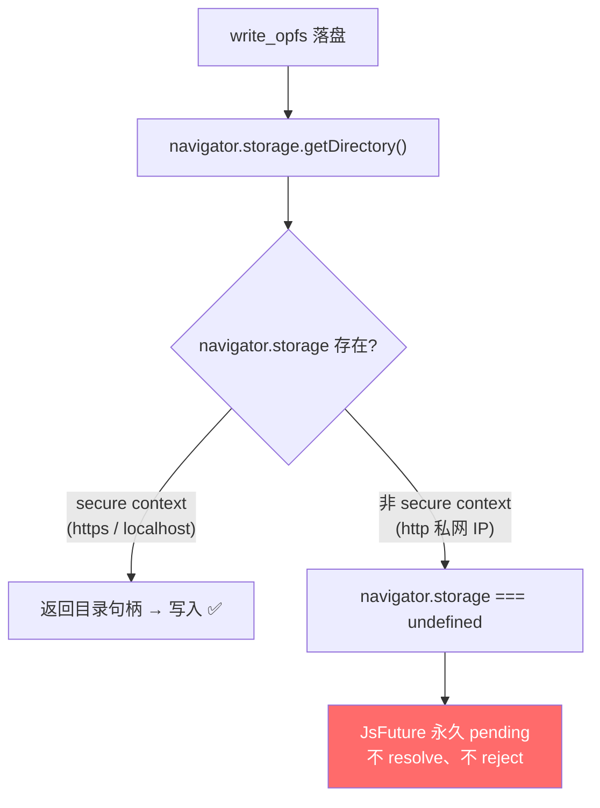

# 门 4：finalize 永久 pending 的真凶

> **这道门**
> - **症状**：门 3 修完，3 块数据全收到、bao 逐块验签全过，只卡在最后一步——finalize 落盘。还是熟悉的静默永久挂起。
> - **根因**：**不是 transfer 的 bug，是环境。** 页面开在 `http://` 私网 IP，不是 secure context。非 secure context 下 `navigator.storage`（OPFS 的入口）整个**不存在**，`write_opfs` 调到 `undefined.getDirectory()`，web-sys 绑定的 `JsFuture` **永久 pending**——不 resolve、不 reject。
> - **修复**：`OpfsFileAccess` 构造/落盘前预检 `isSecureContext` 并明确报错；每个 OPFS `await` 套 5s timeout 兜底。**换到 `http://127.0.0.1`（secure context 即使 http）立即通。**

前三道门是层层递进的 transfer 内部问题，你会顺理成章地以为第四道也一样。**这道门是个反
转**——它教会我们一件事：当你在一个陌生平台上调一个静默挂起的 bug，最危险的假设是「问题
一定出在我的代码里」。

## 症状：数据全对，就是落不了盘

门 3 之后，卡点前移到了让人心痒的地方：

- 3 个数据块**全部收到**。
- 每块的 **bao 逐块 Merkle 验签全部通过**——密码学意义上，字节和发送端的一模一样。
- 接收循环读到了 Finish，进入 **finalize**（把内存缓冲一次性写进浏览器持久化存储 OPFS）。
- 然后……卡住。

就差把已经验证无误的字节写进磁盘这一下。锚点日志停在 `finalize_sink` 里、`write_opfs` 的
第一个 `await` 之后就没有下文了。还是那个招牌症状：无错误、无 panic、无超时。

到这一步，前三道门的经验会误导你——你会本能地继续在 transfer 里找第四个 wasm 陷阱。**但
这次，病根不在 rust 栈里。**

## 转折：一句浏览器探针，绕开整个 rust 栈

反复在 transfer 代码里铺锚点没有产出——因为病灶根本不在那儿。真正定位它的，是一个**跳出
rust、直插浏览器平台层**的动作：用浏览器自动化 `evaluate`，直接在页面上下文里问几个最底层
的问题。

```js
// 绕开整个 wasm / rust 栈，直接问浏览器
({
  isSecureContext: window.isSecureContext,
  storage: navigator.storage,
  subtle: crypto.subtle,
})
```

一句话，答案就水落石出：

```text
isSecureContext: false
navigator.storage: undefined
crypto.subtle:     undefined
```

页面开在 `http://192.168.x.x`（私网 IP over http）——**它不是 secure context**。而
`navigator.storage`（OPFS 的唯一入口）和 `crypto.subtle` 在非 secure context 下**整个不存
在**，是 `undefined`。

`write_opfs` 的第一步是 `navigator.storage.getDirectory()`。当 `navigator.storage` 是
`undefined` 时，这个调用打到了空气上——web-sys 绑定拿到的 `JsFuture` **既不 resolve 也不
reject，永久 pending**。



这是**最坏的失败模式**：`Promise` reject 至少还能捕获成错误，`await` 挂久了至少还盼来个超
时。永久 pending 什么都不给你——它就是干净利落地、无声无息地，什么都不做。

## 为什么这个根因格外隐蔽

有一个细节让这道门比它本该有的更难查：**连接是好的，只有落盘坏。**

libp2p 的 Noise 握手和 blake3 在 wasm 上用的是**自带的纯 Rust 实现**，**不依赖
`crypto.subtle`**。所以即便页面开在 `http://` 私网 IP、`crypto.subtle` 是 undefined——

- 网络照通：配对、offer、accept、经 circuit relay 建流、传字节、bao 验签，全绿。
- 只有落盘炸：唯独 `navigator.storage`（OPFS）这一处 Web 平台 API 被 secure-context 门禁挡住。

于是你看到的画面是「**网络全绿、数据全对、密码学全过，只有最后一步存储静默挂死**」。这个
画面强烈地把你往「transfer 的 finalize 逻辑有 bug」引，而真相是——**环境从一开始就残废，
只是它残废得非常局部，局部到把网络栈整个放过了。**

## 验证：换个 origin,立即就通

secure context 有一份明确的白名单：

| origin | secure context? |
|---|---|
| `https://任意域名` | ✅ |
| `http://localhost` / `http://127.0.0.1` | ✅ **（即使是 http）** |
| `file://` | ✅ |
| **`http://192.168.x.x`（私网 IP）** | ❌ **不在内** |

注意那条反直觉的：`http://127.0.0.1` **是** secure context——secure context 看的不是
「有没有 TLS」，而是「来源可不可信」，而 loopback 被无条件信任。

于是最干净的对照实验：**别的什么都不改，只把页面 origin 从 `http://192.168.x.x` 换成
`http://127.0.0.1`。** 结果——立即通。两个浏览器经 circuit relay 传 2MB，OPFS 落盘
**2097152 字节逐字节一致，耗时 93ms**。

一个变量（origin），一刀切开了「是环境问题还是代码问题」。这就是[方法论篇](05-methodology.md)
里「对照实验切分变量」和「浏览器探针直插平台层」的合体——门 4 是这两招最漂亮的一次收官。

## 修复：预检 + 超时兜底,绝不让 JsFuture 永久挂起

定位到「换 origin 就好」还不够。这是个平台约束，生产环境总会有人用非 secure context 打开
（比如图省事让局域网 helper 用 http 托管页面）。工程上的正确姿势是：**碰 Web 平台 API 的
端口实现，绝不能让 undefined 的 JsFuture 永久 pending。**

两层防护，都落在 `crates/web/src/file_access.rs`：

**第一层——构造/落盘前预检 `isSecureContext`，明确报错**：

```rust
fn ensure_secure_context() -> AppResult<()> {
    let win = web_sys::window().ok_or_else(|| AppError::Transfer("无 window".into()))?;
    if !win.is_secure_context() {
        return Err(AppError::Transfer(
            "OPFS 不可用：当前页面非 secure context，navigator.storage 缺失。\
             请用 https 或 localhost / 127.0.0.1 访问（而非 http 私网 IP）。".into(),
        ));
    }
    Ok(())
}
```

**第二层——每个 OPFS `await` 套 5s 超时封顶**，无论底层因何不响应都在有限时间内落成 `Err`：

```rust
async fn opfs_root() -> AppResult<FileSystemDirectoryHandle> {
    ensure_secure_context()?;
    let storage = web_sys::window()?.navigator().storage();
    // secure context 下仍加超时兜底：任何底层不 resolve 都在 5s 内明确失败，绝不永久挂起。
    let root = match n0_future::time::timeout(
        Duration::from_secs(5),
        SendWrapper::new(JsFuture::from(storage.get_directory())),
    ).await {
        Ok(r) => r.map_err(js_to_err)?,
        Err(_) => return Err(AppError::Transfer(
            "OPFS getDirectory 5s 超时——navigator.storage 未响应（非 secure context？）".into())),
    };
    root.dyn_into::<FileSystemDirectoryHandle>().map_err(...)
}
```

预检负责「早失败、给人话」，超时负责「就算漏了预检、就算别的 OPFS 调用因任何原因卡住，也
封顶 5s 变成错误」。两者叠加，把「永久 pending」这个最坏模式从代码里连根拔掉。

> 顺带一提，`export_blob_url`（读回 OPFS 建下载链接）也吃过同一个亏——team-lead 实测到它
> 挂死 **1800 秒+** 都没返回。同样用 5s 超时封顶，并留了一条回归测试：对未就绪的文件路径，
> 它**必须返回 `Err`，绝不永久挂起**（测试自身能跑完，就证明了不挂死）。

## 两条工程后果

这道门不只是「换个 URL」的花边，它固化成两条硬约束：

1. **生产 Web 端必须以 secure context 部署**——https，或走 `localhost` / `127.0.0.1`。别
   图省事让局域网 helper 用 `http://` 私网 IP 托管页面，那样会同时丢掉 `crypto.subtle` 和
   OPFS，而 OPFS 正是 Web 端落盘与断点续传的地基。
2. **任何碰 Web 平台 API 的端口实现，构造时就要预检能力存在性并明确报错**，且给每个 JS
   `await` 套 timeout 兜底。undefined 的 JsFuture 永久 pending 是 Web 平台的默认恶意，不主
   动防它，它就会在最不该挂的地方挂给你看。

（secure context 的完整平台机制、白名单细节、以及它和 `crypto.subtle` / OPFS 的连带关系，
另见 `browser-platform/` 系列的 secure-context 一篇。）

## 四道门,到此走完

换到 `http://127.0.0.1`、补上预检和超时之后，最终的验证板全绿：

> `http://127.0.0.1`（secure context），浏览器 ↔ 浏览器经 circuit relay 传 2MB，OPFS 落盘
> **2097152 bytes, bytewise_identical, elapsed 93ms**——浏览器跑的是与桌面**字面同一份**
> `swarmdrop-transfer` 逻辑。

从「全绿却传不过去」，到逐字节一致，中间隔着四道编译期完全看不见的门：一道 panic、两道
wasm 单线程唤醒、一道 Web 平台 secure-context。四道门没有一道能被 `cargo test` /
`cargo check` / 类型系统拦住。

它们怎么被一道道剥开的——那套方法本身，值得单独讲一篇。

→ [方法论：怎么调一个「全绿却不工作」的 wasm bug](05-methodology.md)

---

**这道门的教训**：在陌生平台上调静默挂起的 bug，**最贵的假设是「问题在我的代码里」**。当
rust 栈里怎么铺锚点都没产出时，跳出整个语言栈、用一句探针直接问平台——`isSecureContext`、
`navigator.storage`、`crypto.subtle` 是不是存在——往往一刀就切开了「环境 vs 代码」。而
Web 平台 API 的静默失败模式（undefined 的 JsFuture 永久 pending）是所有失败模式里最坏的一
种，防御它必须是碰这类 API 时的默认动作，不是事后补丁。
