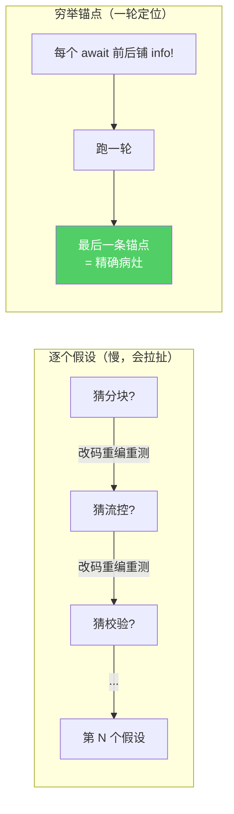
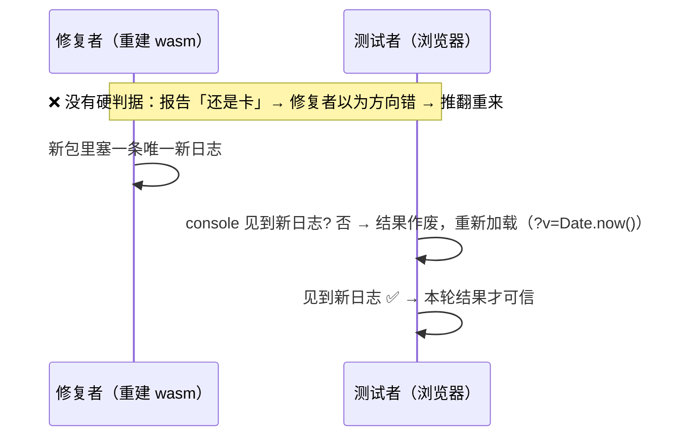

# 方法论：怎么调一个「全绿却不工作」的 wasm bug

> **这道门是给调试者的**。前四篇是四个具体根因；这一篇把剥开它们用到的**打法**抽出来，好
> 让下一个「全绿却不工作」的 bug 少花十一轮。核心心智一句话：**wasm 单线程 + Web 平台，是
> 编译期完全看不见的第三维——`cargo test` / `check` / 类型系统一个都够不着，只能真实浏览
> 器逐层剥。**

回顾一下整场战役的形状：native e2e 16/16、五 crate wasm 编译全过、控制面全通，数据面却静
默传不过去。花了十一轮真实浏览器实测，撞开四道门，最终逐字节一致。十一轮不是在原地打转——
每一轮都在往前挪。下面五招，是让它「往前挪」而不是「来回拉扯」的关键。

## 招式一：穷举锚点 > 逐个假设

**这是全场最重要的一招。**

面对一个静默挂起的 bug，最自然的反应是「猜」：会不会是分块大小？会不会是流控？会不会是
epoch 校验？然后逐个去验证。**这条路会让你来回拉扯**——我们前几轮就是这么过的。每个假设
都要改代码、重编 wasm、重测，验证一个否掉一个，慢且容易钻牛角尖。

真正高效的做法是反过来:**先把卡点稳定住，再穷举锚点。**

1. 先确保 bug **每次都在同一个地方卡**（稳定复现是前提）。
2. 在可疑路径上，**每一个 `await` 的前后**都铺一条 `info!` 锚点日志。
3. 跑**一轮**实测，看日志——**最后一条打印出来的锚点，就是精确病灶**。它之后的那个
   `await` 就是挂起点。



一个假设可能对可能错，验一个只排除一个；一排锚点把整条路径**同时**观测，一轮就把病灶收窄
到一个 `await`。门 2、门 3 都是这么定位到「卡在某个 `read_frame` 之前」的——不是猜出来的，
是锚点日志的「最后一条」指出来的。

> **要点**：锚点要铺在 `await` 的**两侧**（「进入 X 之前」+「X 返回之后」）。只有成对，你
> 才能区分「卡在 X 里」和「根本没走到 X」。

## 招式二：对照实验切分变量

静默挂起最折磨人的地方是「不知道该往哪个方向查」。对照实验的作用，是用**一个变量的差异**，
把「可能的原因空间」一刀劈成两半。整场战役里用过三组对照，每组都切掉了一大类假设：

| 对照实验 | 切掉的变量 | 切分结论 |
|---|---|---|
| **小文件 vs 大文件** | 分块 / 流控假设 | 大小无关 → 不是切帧或背压问题 |
| **换 origin**（私网 IP → `127.0.0.1`） | secure context | 一换就好 → 是环境不是代码（门 4） |
| **native e2e vs 浏览器** | wasm 特有 vs 逻辑 | native 全绿 → 是 wasm 运行时语义，不是业务逻辑 |

最后一组是贯穿全程的元对照：**同一份 `swarmdrop-transfer` 代码，native 绿、wasm 死。** 这
一条从一开始就把「transfer 业务逻辑有 bug」这个方向整个排除了——剩下的必然是 wasm 特有的
运行时语义（时钟、单线程唤醒、Web 平台）。方向对了一半，就是靠这组对照定的。

## 招式三：浏览器探针直插平台层

当 rust 栈里怎么铺锚点都没产出时——**跳出整个语言栈**。

用浏览器自动化的 `evaluate`，直接在页面上下文里跑一小段 JS，问最底层的平台问题，**绕开你
所有的 rust / wasm 代码**：

```js
({ isSecureContext: window.isSecureContext,
   storage: navigator.storage,
   subtle: crypto.subtle })
// → isSecureContext:false, storage:undefined, subtle:undefined
```

门 4 就是这么**一句**定位的。锚点告诉你「卡在 `write_opfs` 的 `getDirectory()`」，但为什么
卡、是不是你的 rust 逻辑写错了——探针一句话回答：`navigator.storage` 压根是 undefined，跟
你的代码毫无关系。**探针的价值是「切分环境 vs 代码」**：它跑的不是你的代码，所以它的结果
是关于环境的纯净证据。rust 栈里查不下去时，别在 rust 里死磕，换个维度直接问平台。

## 招式四:卡点前移是正确收敛的信号

十一轮里怎么知道自己没白干、方向没跑偏?看**卡点有没有往前挪。**


每修一层，卡点就往下游挪一格——这是**收敛**的确证。如果修了一层卡点没动、甚至跳回上游，
那说明要么没修对、要么引入了新问题。**「卡点前移」是这类多阶段 bug 唯一可靠的进度条**：它
不保证你离终点还有几步，但它保证每一步都在朝终点走。反过来,如果你改了很多却说不清「卡点
现在在哪、比上轮前进了没」,那多半是在逐个假设里空转（见招式一）。

## 招式五：多方协作的「新包硬判据 + 缓存破坏」

这一招是血泪教训，专治**协作调试**里最坑的一类假象。

场景：一个人改 rust、重建 wasm 包，另一个人在浏览器里测、写报告回传。两条线是异步的，时序
一交错就出事——**「测了旧包，却以为测的是新修复」。** 报告里说「还是卡」，改代码的人以为
自己的修复没用、推翻方向重来；实际上测试用的根本是上一版没修的包。这种假象能让整个团队集
体走进死胡同，而且极难自查——因为每个人看自己那一环都没错。

两个动作根治它：

1. **加载新包的硬判据**。每次重建时，在新代码里塞一条**独一无二的新日志**（比如一句带本
   轮标记的 `info!`）。测试方在 console 里**看到这条新日志**，才算「确实加载了新包」；看不
   到就是还在跑旧包，测试结果一律作废。**用一条可观测的事实，取代「应该是新的吧」的默契。**
2. **缓存破坏**。浏览器 / 打包器会缓存 wasm 和 JS。加载时给资源 URL 挂上
   `?v=Date.now()`（或等价的 cache-bust），强制每次都拉最新，杜绝「浏览器悄悄用了缓存的
   旧包」。



**协作调试里，「我们测的是同一个东西」不能靠默契,要靠一条双方都能看到的硬证据。**

## 收束:一句心智模型

把五招收进一句话:

> **wasm 单线程 + Web 平台，是一个编译期完全看不见的「第三维」。** 你的类型对、测试绿、控
> 制面通,全部只覆盖了「逻辑」和「native 运行时」两个维度;第三维里的东西——时钟能不能读、
> 单线程下 waker 会不会丢、Web 平台 API 在当前 context 存不存在——**没有任何静态工具能提前
> 告诉你**,只能在真实浏览器里,用锚点 + 对照 + 探针,一层一层剥。

四道门的顺序（panic → split 唤醒 → 跨任务唤醒 → secure context）不是偶然——它正是「卡点
前移」把你一步步往下游领的路径。你不需要一开始就看清全部四道门,你只需要:稳住卡点、铺满锚
点、切分变量、必要时跳出语言栈问平台,然后确认卡点又往前挪了一格。剩下的,交给下一轮。

---

← [回到系列首页](README.md)
