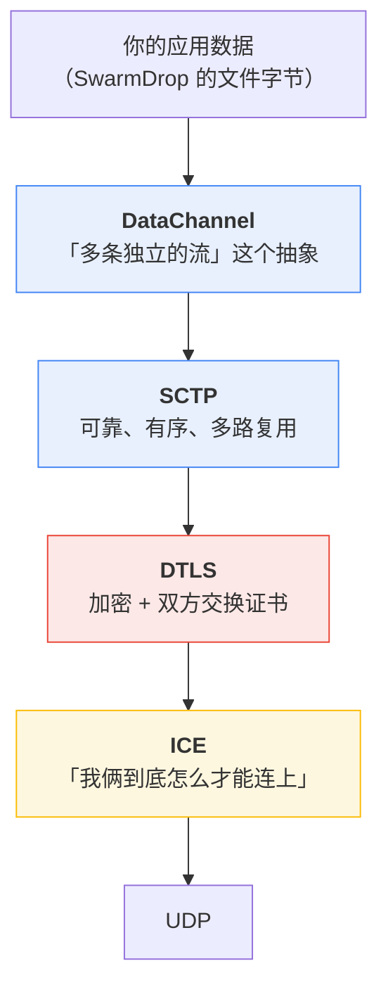
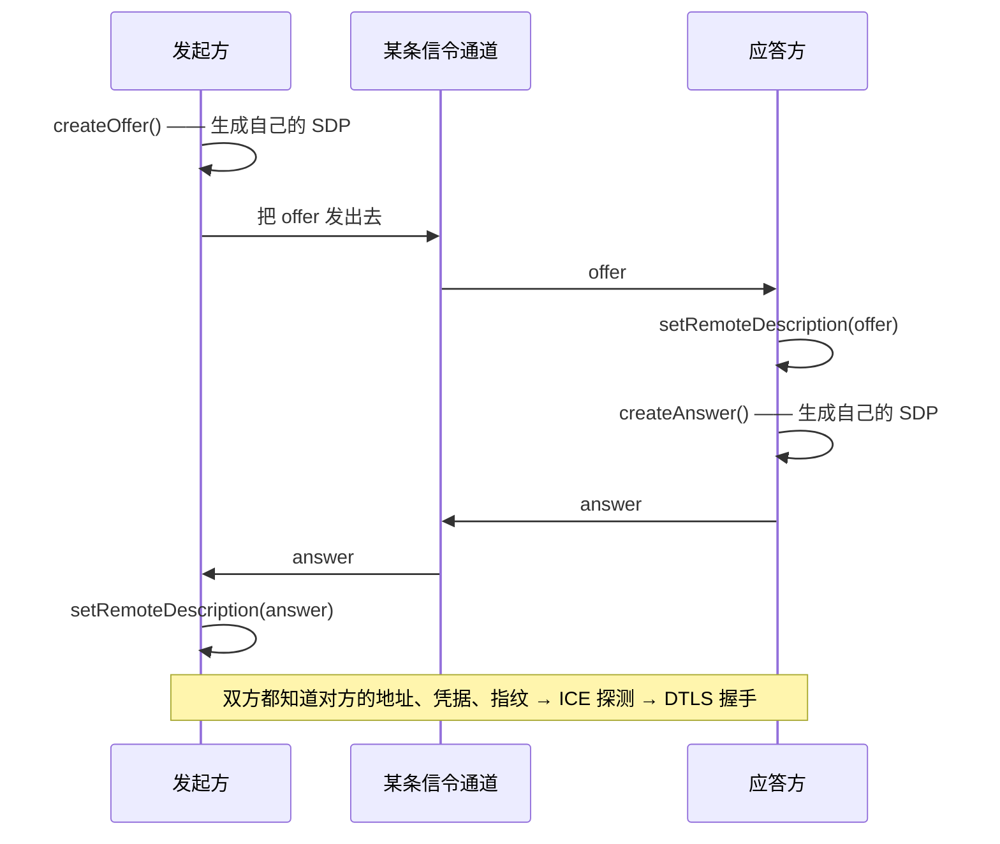

# WebRTC 到底是什么：从零开始的一层层拆解

> 本系列第 0 篇。**不预设任何 WebRTC 背景。** 读完这篇，后面每一篇踩坑复盘里出现的
> ICE、DTLS、SCTP、SDP、offer/answer、DataChannel、certhash 都会有着落。

## 先破除一个误解：它不是「视频通话技术」

搜 WebRTC，铺天盖地是「浏览器里做视频会议」。这是它最出名的用途，但对 SwarmDrop 来说
完全无关——我们一帧视频都不传。

WebRTC 真正的定义要朴素得多：

> **它是浏览器里唯一能建立点对点连接的东西。**

浏览器给 JS 开放的网络能力就三样：`fetch`（HTTP）、`WebSocket`、`RTCPeerConnection`
（WebRTC）。前两样都必须连到一台**服务器**——浏览器不能监听端口，不能接受入站连接，
也不能直接拨另一个浏览器的 IP。只有第三样能让两台设备**直接**交换字节。

对一个「无账号、无服务器、跨网络传文件」的产品来说，这句话就是全部理由：

- 桌面端和移动端可以用 TCP、QUIC，随便挑
- **浏览器端只有 WebRTC 这一条路**

所以 SwarmDrop 的 Web 端从第一行代码起就绑在 WebRTC 上。你现在读到的这一整个系列——
五个上游补丁、一个自研 crate——本质上都是这句话的代价。

## 它是一个「协议栈」，不是一个协议

这是理解后面所有坑的关键。WebRTC 不是某个单一协议，而是**四层东西叠起来**的总称。
每一层解决一个独立的问题，也各自会用各自的方式失败：



下面逐层拆。

### ICE —— 两台都躲在路由器后面的机器，怎么找到对方

家里的电脑没有公网 IP。它在路由器后面，地址是 `192.168.x.x`，外网**拨不进来**。
对面那台也一样。两个都拨不进来的机器要直连，这就是 NAT 穿透问题。

ICE（Interactive Connectivity Establishment）是 WebRTC 解决它的办法。思路很朴素：
**把所有可能的地址都列出来，然后挨个试**。

每个「可能的地址」叫一个 **candidate（候选地址）**，通常有三类：

| 类型 | 是什么 | 怎么拿到 |
|---|---|---|
| **host** | 本机网卡地址，如 `192.168.0.5:54321` | 直接读网卡 |
| **srflx**（server reflexive） | 「从外面看，我长什么样」，如 `1.2.3.4:60001` | 问一台 **STUN** 服务器：「你看到的我是谁？」 |
| **relay** | 一台中转服务器上的地址 | 向 **TURN** 服务器申请 |

两端把各自的 candidate 列表交换给对方，然后两两配对、互相发探测包，**哪一对先通就用哪一对**。
同一个局域网里 host↔host 立刻就通；跨网络时要靠 srflx 打洞；实在打不通就走 relay 中转。

> 后面会看到，SwarmDrop 的 `direct` 模式把 ICE 用得极简：服务端只有一个公网地址，
> 客户端只需要拨过去。这叫 **ICE-lite**——服务端不主动探测，只被动应答。

### DTLS —— UDP 上的 TLS，顺便解决「你是谁」

ICE 只负责「包能到」，不负责安全。连通之后，两端在这条 UDP 路径上跑一次 **DTLS 握手**
（就是 TLS，只不过跑在 UDP 上，所以多了个 D = Datagram）。

握手做两件事：**协商出加密密钥**，以及**交换双方的证书**。

这里有个 WebRTC 特有的设计，非常重要，是后面两篇踩坑的根源：

> **WebRTC 用的是自签证书，没有 CA。**

网页 HTTPS 的证书要由权威机构（CA）签发，浏览器验签。但 WebRTC 两端都是普通设备，
没人给它们签证书——所以每个 `RTCPeerConnection` 自己现场生成一张自签证书。

自签证书任何人都能造，那怎么防中间人？答案是**指纹（fingerprint）**：

1. 对证书做一次 SHA-256，得到 32 字节的指纹
2. 把指纹**经另一条信道**告诉对方
3. DTLS 握手时，检查对面出示的证书，算出的指纹是否与预期一致

那条「另一条信道」是什么，决定了整个安全模型是否成立。这正是
[第 01 篇](01-libp2p-webrtc-direct.md) 的核心。

### SCTP 与 DataChannel —— 「多条独立的流」

DTLS 之上跑的是 **SCTP**。这是一个不太出名的传输协议，但它有 TCP 没有的一个能力：
**一条连接里可以开很多条独立的流（stream），互不阻塞**。

`RTCDataChannel` 就是 SCTP 流的浏览器 API 封装。你调
`pc.createDataChannel("foo")`，底下就开了一条 SCTP 流。

它还有几个可调项，后面第 03、04 篇正是栽在这上面：

- **ordered**：消息是否保证按序到达（默认应当是 `true`）
- **negotiated**：这条通道是「一方开、另一方被通知」，还是「双方各自开、约好用同一个 id」
- **maxMessageSize**：单条消息的大小上限

开一条**非** negotiated 的通道时，SCTP 流上会先发一条叫 **DCEP**（Data Channel
Establishment Protocol）的控制消息 `DATA_CHANNEL_OPEN`，告诉对面「我开了一条叫 foo 的通道」。
对面收到才会触发 `on_data_channel` 回调。**记住这个握手**——第 04 篇讲的正是应用数据
抢在这条控制消息前面到达会发生什么。

### SDP 与 offer/answer —— 把上面这些参数摊开来协商

最后一层是「怎么把上述所有信息告诉对方」。WebRTC 用的格式叫 **SDP**
（Session Description Protocol），一段纯文本，长这样：

```text
v=0
o=- 0 0 IN IP4 1.2.3.4
s=-
c=IN IP4 1.2.3.4
t=0 0
a=ice-lite
m=application 4003 UDP/DTLS/SCTP webrtc-datachannel
a=ice-ufrag:AbCdEfGh
a=ice-pwd:AbCdEfGh
a=fingerprint:sha-256 A1:B2:C3:...:F0
a=setup:passive
a=sctp-port:5000
```

每一行是一个参数：`c=` 是地址，`a=ice-ufrag` / `a=ice-pwd` 是 ICE 探测包的凭据，
**`a=fingerprint` 就是上面说的证书指纹**，`a=setup` 说明谁当 DTLS 的客户端。

标准流程叫 **offer/answer**：



**注意中间那个「某条信令通道」**——WebRTC 规范**不管**这一段。offer 和 answer 怎么送到
对方手里，是应用自己的事。视频会议网站用自己的服务器转发；libp2p 有两种更有意思的做法，
见下一篇。

## 为什么这一层的 bug 特别难查

把上面五层合起来看，会发现一个不幸的性质：**每一层都可能静默失败**。

| 层 | 一种典型的静默失败 |
|---|---|
| ICE | 候选地址全试完都不通 → 连接状态停在 `checking`，没有错误 |
| DTLS | 指纹不匹配 → 握手中止，但错误在 UDP 那头，本地只看到「没连上」 |
| SCTP | 流还没建立就 send → **本系列第 03 篇：返回 `Ok(())`，数据蒸发** |
| DCEP | 应用数据抢在控制消息前 → **第 04 篇：对端丢弃，日志说「未知的 PPID」** |
| API 层 | 回调把本端开的通道当成对端开的回报 → **第 05 篇：拿到一个永远不出事件的死句柄** |

传统的排查手段在这里几乎全部失灵：类型系统管不着，`cargo test` 测不出，日志里
（如果有的话）指向的往往是错误的一层。这就是为什么本系列后面五篇每一篇都要花很长
篇幅讲「怎么定位到真正的那一行」——**定位比修复难十倍**。

## 小结

- WebRTC 是浏览器里**唯一**的 P2P 手段，这是 SwarmDrop 绑定它的全部理由
- 它是四层协议栈：**ICE**（找路）→ **DTLS**（加密与证书）→ **SCTP**（多流可靠传输）→
  **DataChannel**（应用 API）
- 上面还有 **SDP + offer/answer** 用来协商，但**信令怎么送不归它管**
- 安全模型的地基是**证书指纹经另一条信道传递**——那条信道可不可信，决定了整个模型成不成立

下一篇讲 libp2p 怎么把这套东西用出两种完全不同的形态，以及为什么其中一种**必须**在
DTLS 之上再跑一次握手。

---

**下一篇**：[libp2p 的两种 WebRTC：打洞与 direct](01-libp2p-webrtc-direct.md)

**相关**：浏览器为什么不能 listen —— [`browser-platform/02-webrtc-websocket-in-browser.md`](../browser-platform/02-webrtc-websocket-in-browser.md)
