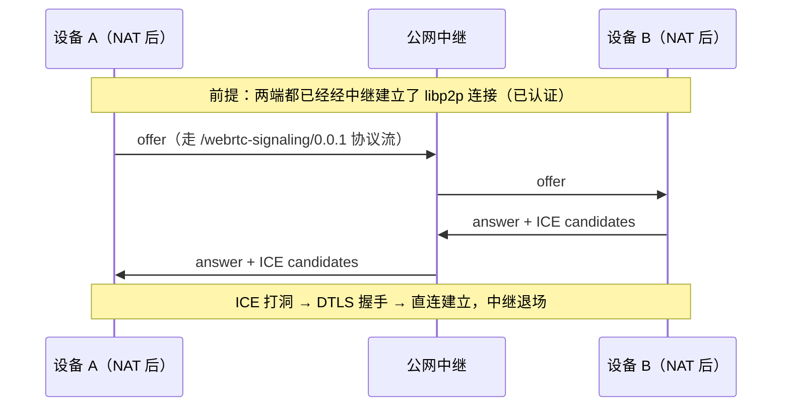
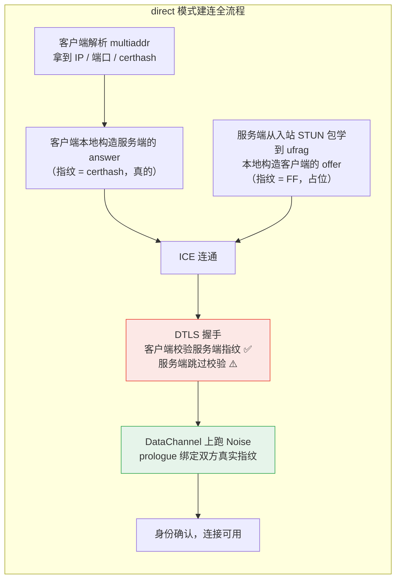

# libp2p 的两种 WebRTC：打洞与 direct

> 本系列第 1 篇。前置：[00 WebRTC 到底是什么](00-what-is-webrtc.md)。
>
> 这一篇解释 SwarmDrop 的 `crates/webrtc-p2p` 在做什么，以及后面四篇踩坑复盘的**场景**
> 从哪来。不懂这一篇，后面「服务端为什么要关掉指纹校验」这类问题会完全看不懂。

## 从上一篇留下的问题开始：信令谁来送

上一篇结尾说，WebRTC 规范不管 offer/answer 怎么送到对方手里。视频会议网站的答案是
「用我们自己的服务器转发」——但 SwarmDrop **没有服务器**。

libp2p 给出了两个不同的答案，对应两种传输：

| | 打洞模式 | direct 模式 |
|---|---|---|
| multiaddr | `<relay 地址>/webrtc/p2p/…` | `/ip4/…/udp/…/webrtc-direct/certhash/…` |
| 信令怎么送 | 经**已建立的 relay 连接**转发 | **根本不送**——本地算出来 |
| 适用 | 双方**都**拨不进来 | 一端有可达地址 |
| ICE | 完整，双向收候选 | 服务端 ICE-lite，只被动应答 |

两条路径在 `crates/webrtc-p2p` 里**互不复用**——刻意的，不是没来得及重构。它们在
安全语义上有本质差别，摊平合并极容易改错一边。

## 打洞模式：借已有的连接送信令

场景：两台设备都在 NAT 后面，谁也拨不进谁。但它们**都**能连上一台公网中继节点。

那就先各自连中继，然后借这条已经通了的（慢的、中转的）连接，把 offer/answer 送过去，
把 WebRTC 直连建起来，之后走直连（快的）。



这里有个关键的安全性质：

> **信令走的是一条已经认证过的连接。**

libp2p 的中继连接本身经 Noise 或 TLS 认证过——A 确信「电话那头确实是 B 的 PeerId」。
所以 SDP 里那个证书指纹是可信的，DTLS 握手校验它，身份自然绑定。**打洞模式不需要
额外的握手**（这是 libp2p spec FAQ 的第一条）。

⚠️ 但这也意味着「relay 连接必须是认证的」从实现细节升级成了**安全前提**。哪天有人
让信令走一条未认证的信道，整个模型立刻塌掉。

## direct 模式：连信令都不要

场景：一端有可达地址——公网服务器，或者同一个局域网里的桌面端。另一端（通常是浏览器）
直接拨过去。

这时候有个鸡生蛋问题：要拨过去就得先交换 SDP，可交换 SDP 本身就需要一条连接。

libp2p 的解法很漂亮：**双方各自在本地把对方的 SDP 算出来，一个字节都不用传。**

能这么做，是因为建连所需的全部信息要么写在 multiaddr 里，要么由客户端单方面决定：

```text
/ip4/47.115.172.218/udp/4003/webrtc-direct/certhash/uEiDvL8...
     └──── IP ────┘     └端口┘              └── 证书指纹 ──┘
```

| | 谁**真的**生成 | 谁**本地构造** |
|---|---|---|
| 客户端（拨号方） | 自己的 **offer** | 服务端的 **answer** |
| 服务端（监听方） | 自己的 **answer** | 客户端的 **offer** |

客户端拿 multiaddr 里的 IP、端口、certhash，就能把「服务端本该发来的 answer」原样拼出来。
反过来，服务端要构造「客户端本该发来的 offer」——但它缺一样东西。

### 服务端缺的那样东西：客户端的证书指纹

服务端从没见过这个客户端，**不可能知道它的证书长什么样**。而 SDP 里
`a=fingerprint:` 那一行是必填的。

libp2p spec 的处理办法是：**填一个占位值，然后把指纹校验关掉**。

```rust
// crates/webrtc-p2p/src/backend/native/direct/sdp.rs
/// 客户端视角的 offer，由**服务端**本地构造。
///
/// 服务端此刻并不知道客户端的证书指纹（它在 DTLS 握手时才出现），所以这里填一个
/// 占位值 [`Fingerprint::FF`]，并在建连时关掉指纹校验
/// （`disable_certificate_fingerprint_verification`）。真正的身份绑定由随后的
/// Noise 握手完成——这正是 direct 模式必须跑 Noise 的原因。
pub(crate) fn offer(addr: SocketAddr, client_ufrag: &str) -> Result<RTCSessionDescription, Error> {
    let sdp = render_description(CLIENT_SESSION_DESCRIPTION, addr, Fingerprint::FF, client_ufrag);
    RTCSessionDescription::offer(sdp).map_err(|e| Error(e.to_string()))
}
```

`Fingerprint::FF` 就是 32 个 `FF` 字节——一个不可能匹配任何真实证书的值。

**记住这一段。** 本系列 [第 02 篇](02-dtls-fingerprint-dead-switch.md) 讲的就是：
`disable_certificate_fingerprint_verification` 这个开关在 rtc 0.20 里**是死的**，
于是 direct 模式的服务端整个跑不起来。

而 [第 06 篇](06-remote-fingerprint-via-stats.md) 讲的是这条线的另一半：服务端事后
**必须**从 DTLS 握手里把客户端的真实指纹取出来，而 0.20 把取它的 API 弄丢了。

### 为什么 direct 模式必须再跑一次 Noise

打洞模式不用额外握手，direct 却必须。差别在**指纹经什么信道来**：

| | 打洞 | direct |
|---|---|---|
| 指纹信道 | 已认证的 relay 连接 | **multiaddr——不可信** |
| 身份认证 | DTLS 指纹绑定即可 | **必须再跑一次 Noise** |

certhash 写在 multiaddr 里，而 multiaddr 可以经**任何**信道传播——贴在网页上、印在
二维码里、被中间人整个换掉。DTLS 只能证明「对面持有这张证书」，证明不了「这张证书
属于那个 PeerId」。

所以 direct 建连的最后一步，是在 DataChannel 上再跑一次 libp2p 的 Noise 握手，它的
prologue 里绑定了**双方**的 DTLS 指纹：

```text
libp2p-webrtc-noise:<客户端指纹><服务端指纹>
```

两端算出的 prologue 必须逐字节一致，否则握手失败。这样一来：

- 客户端的指纹 → 服务端从 DTLS 握手里取（[第 06 篇](06-remote-fingerprint-via-stats.md)）
- 服务端的指纹 → 客户端从 multiaddr 的 certhash 取
- 谁篡改了 multiaddr，两边的 prologue 就对不上，Noise 当场失败

身份与信道就此绑在一起。



## 为什么要自研，而不是用官方的

rust-libp2p 官方有 `libp2p-webrtc`（native）和 `libp2p-webrtc-websys`（浏览器）。
SwarmDrop 最终把两个都删了，换成自研的 `crates/webrtc-p2p`。三个原因：

**1. 官方的两个 crate 基于不同版本的 webrtc-rs。** `libp2p-webrtc` 用 0.17，
而我们的打洞实现用 0.20。两者并存等于把整套 ICE/DTLS/SCTP **编译两遍**，依赖树里
出现两份同名不同版本的类型。

**2. 官方没有 native 侧的打洞。** 上游 PR #5978 只做了浏览器侧，覆盖 web↔web，
拿不到「浏览器 ↔ NAT 后的桌面端」——而这恰恰是 SwarmDrop 最需要的场景。

**3. 打洞要两端都支持。** 只开一边等于没开。

自研的代价，就是这个系列后面五篇的内容：**官方封装帮你挡掉的坑，现在全部要自己踩、
自己修、自己提上游。**

## 小结

- libp2p 的两种 WebRTC 传输，差别在**信令怎么送**：打洞借已认证的中继连接，direct
  根本不送、本地算
- direct 的服务端**不可能预先知道客户端的指纹**，所以填占位值 + 关掉校验 →
  这是 [第 02 篇](02-dtls-fingerprint-dead-switch.md) 的场景
- 关掉校验之后身份靠 **Noise 握手**补回来，它需要客户端的真实指纹 →
  这是 [第 06 篇](06-remote-fingerprint-via-stats.md) 的场景
- 中间那条 DataChannel 上跑 Noise 握手 → 它的第一条消息静默消失，就是
  [第 03 篇](03-datachannel-silent-send.md)

---

**上一篇**：[WebRTC 到底是什么](00-what-is-webrtc.md) ·
**下一篇**：[一个有 setter 没 reader 的开关](02-dtls-fingerprint-dead-switch.md)

**代码**：`crates/webrtc-p2p/src/lib.rs`（分层与两种模式）、
`backend/native/direct/sdp.rs`（确定性 SDP）、
`backend/native/direct/certificate.rs`（certhash 与证书持久化）
