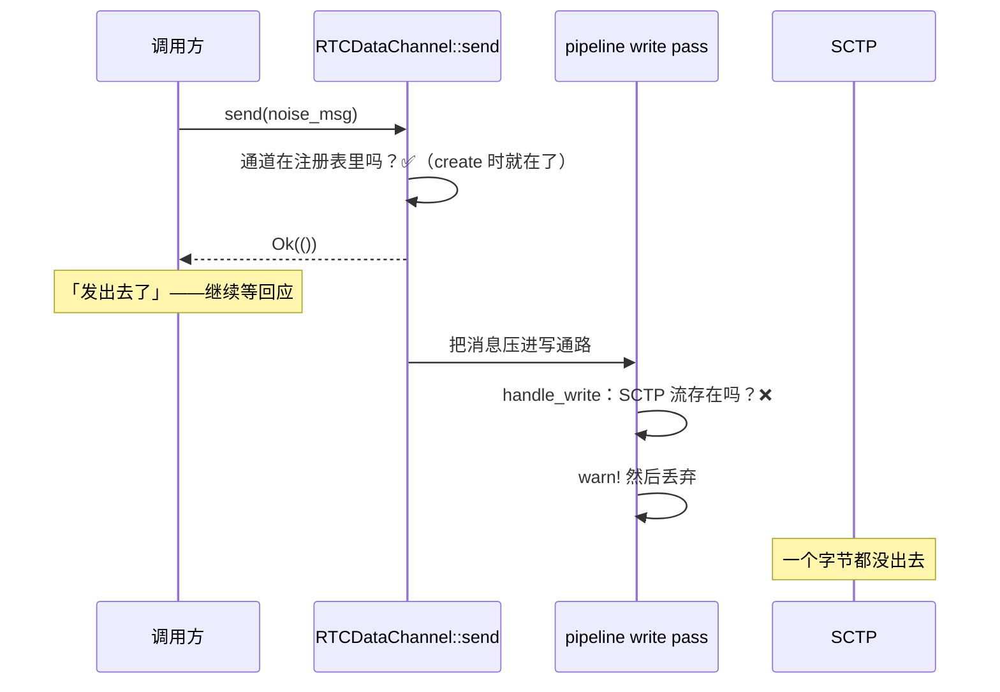

# `send` 返回 `Ok(())`，数据却蒸发了：rtc#138

> 本系列第 3 篇。前置：[00 WebRTC 到底是什么](00-what-is-webrtc.md) 的 SCTP 一节。
>
> 上游 PR：[webrtc-rs/rtc#138](https://github.com/webrtc-rs/rtc/pull/138)（**已合并**）

这是整条 direct 链路上**最贵的一个坑**。它花掉的调试时间比其余四个加起来还多，
原因只有一个：**全链路零报错**。

## 症状：握手莫名挂住

场景是 [第 01 篇](01-libp2p-webrtc-direct.md) 讲的 direct 建连的最后一步——
DTLS 握好了，该在 DataChannel 上跑 Noise 握手了。代码大意是：

```rust
// 等 PeerConnection 报告 Connected
await_connected(&mut state_rx).await?;
// 然后在 DataChannel 上写 Noise 的第一条消息
channel.send(&noise_handshake_msg).await?;   // ← 返回 Ok(())
// 等对面的回应
let response = channel.recv().await?;        // ← 永远等不到
```

`send` 返回 `Ok(())`。对面**什么都没收到**。两端都没有任何错误日志。

这种失败模式最难排：所有你习惯用来定位问题的信号都是正常的。连接是通的，
`send` 是成功的，没有异常，没有超时（超时是我们自己加的），日志是干净的。

我先后怀疑过：Noise 实现写错了、消息编码不对、对端根本没在监听那条通道、
DataChannel 的 label 对不上……**排查方向全错**，因为真正的问题在一个我压根没想过会
出问题的地方——`send` 本身。

## 根因：检查的条件，和决定成败的条件，不是同一个

`RTCDataChannel::send` 检查的是**这条通道有没有被注册**：

```rust
if !self.peer_connection.data_channels.contains_key(&self.id) {
    return Err(Error::ErrDataChannelClosed);
}
```

而通道从你调用 `create_data_channel` 那一刻起就在这个表里了。所以这条检查**几乎总是通过**。

真正决定消息能不能发出去的条件是**底下那条 SCTP 流建立了没有**。这个条件在另一个地方查：

```rust
// DataChannelHandler::handle_write
let data_channel = self.data_channels.get_mut(&channel_id)
    .ok_or(Error::ErrDataChannelNotExisted)?
    .data_channel.as_mut()
    .ok_or(Error::ErrDataChannelNotExisted)?;   // ← 真正失败在这里
```

问题是，`handle_write` 跑在 rtc 的 pipeline 写通路上，那一层的错误处理是这样的：

```rust
// src/peer_connection/handler/mod.rs
if let Err(err) = handler.handle_write(msg) {
    warn!("{}.handle_write got error: {}", handler.name(), err);
}
```

**记一条日志，然后丢掉。**

拒绝确实发生了，只是**传不回给调用方**。在 master 上实测：

```text
send result: Ok(())
[WARN rtc::peer_connection::handler] DataChannelHandler.handle_write got error: data channel not existed
```

调用方被告知消息发出去了。它没有。



### 为什么 `Connected` 了 SCTP 流还不存在

这是最反直觉的一点。`RTCPeerConnectionState::Connected` 意味着 **ICE 通了、DTLS 握好了**——
也就是 [第 00 篇](00-what-is-webrtc.md) 那张分层图里下面两层完成了。

但 **SCTP 是 DTLS 之上的一层**，DataChannel 又在 SCTP 之上。`Connected` 之后，SCTP
关联还要建立、DCEP 的 `DATA_CHANNEL_OPEN` 还要往返一趟，那条流才真正可写。

于是「连接已建立」和「这条通道能发东西了」之间有一个**几十毫秒的窗口**。Noise 握手的
第一条消息恰好落在这个窗口里。

## 三种可能的契约，实现选了最差的那种

一个「通道还没准备好」的 `send`，实现可以有三种反应：

| 契约 | 调用方能做什么 |
|---|---|
| **缓冲**（W3C 规定的） | 什么都不用做，等通道 open 后自动发出去 |
| **报错** | 拿到 `Err`，自己决定重试还是等 |
| **静默丢弃** | **什么都做不了**——它不知道出了事 |

[W3C 对 `RTCDataChannel.send()` 的规定](https://www.w3.org/TR/webrtc/#dom-rtcdatachannel-send)
是第一种：通道处于 `connecting` 时消息应当排队。

前两种都是可恢复的。第三种不是——**它把一个瞬时的时序问题，变成了一个没有任何线索的
永久挂起**。

## 修复：把判据搬到 send 边界

修法很直接：让 `send` 用**和 `handle_write` 完全相同的条件**做检查，在边界上就把它拒掉。

顺带修掉一个副作用：被拒的 send 之前还会错误地累加 `outstanding_bytes`。那些字节从没
进过 SCTP，永远不会被释放——等于**把发送窗口永久缩小了一截**。发得越多，窗口越小。

## 一个反直觉的结论：`await_open` 不能因此删掉

修好之后，很自然会想：既然 `send` 现在会明确报错了，那我们自己那个「等通道 open」的
辅助函数是不是就多余了？

**不是。** 这个补丁改的是**失败的方式**（静默丢弃 → 明确报错），不是「不用等了」。
时序窗口依然存在，你依然必须等。它的价值在于：**当你忘了等的时候，会当场炸，而不是
挂给你看**。

这个区分值得写进注释——不然半年后有人看到「上游修了」就顺手把等待删掉，坑会原样复活。

## 教训

**1. 「返回值成功」不等于「事情做成了」。**
特别是异步 pipeline 架构：入口的检查和真正执行的检查可能在不同的层，中间那段路上的错误
可能根本没有回传的通道。

**2. 遇到「全链路零报错的挂起」，去查最近一次「成功」的调用。**
挂起的位置（等回应）和出问题的位置（发消息）往往差着一步。**最后一个成功的操作是最可疑的。**

**3. `warn!` 掉的错误就是丢掉的错误。**
一个只记日志不上抛的错误处理点，等于在架构里开了一个洞。写库的时候尤其要警惕：
**你 warn 掉的，是调用方唯一能感知到问题的机会。**

**4. 时序窗口要么消除，要么让它响。**
「连接已建立」和「这条通道可用」之间的窗口无法消除（协议决定的），那就必须让踩中它的
代码当场失败——静默是最坏的选择。

---

**上一篇**：[一个有 setter 没 reader 的开关](02-dtls-fingerprint-dead-switch.md) ·
**下一篇**：[首条消息为什么总是丢](04-datachannel-ordered-default.md)

**上游**：[rtc#138](https://github.com/webrtc-rs/rtc/pull/138)（已合并）、
起初误报在 [webrtc#826](https://github.com/webrtc-rs/webrtc/issues/826)（追到 rtc 后转过去）
