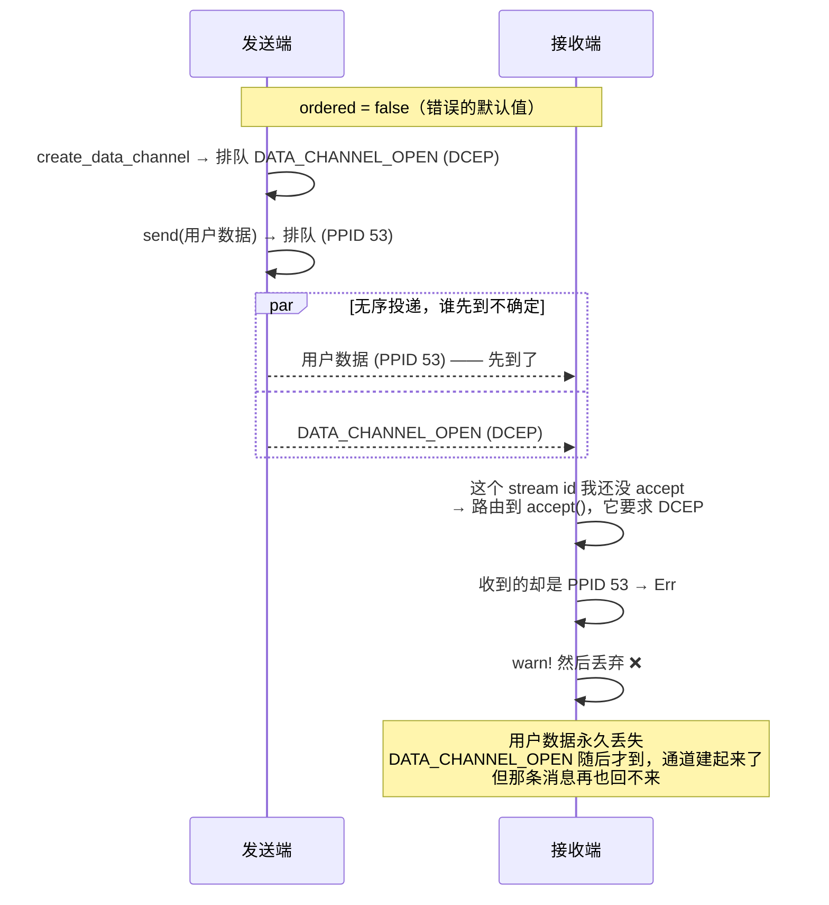

# 每条流的首条消息都丢：rtc#140

> 本系列第 4 篇。前置：[00](00-what-is-webrtc.md) 的 SCTP / DCEP 一节。
>
> 上游 PR：[webrtc-rs/rtc#140](https://github.com/webrtc-rs/rtc/pull/140)（**已合并**）

上一篇的坑修完，Noise 握手通了。然后撞上一个新症状：**每条子流的第一条消息都丢**，
multistream-select（libp2p 协议协商）永远完不成，两端 10 秒后一起超时。

## 线索：一条读起来像在骂对端的日志

这次至少有日志——虽然它指向了错误的方向：

```text
WARN rtc::peer_connection::handler: DataChannelHandler.handle_read got error:
     Unknown PayloadProtocolIdentifier 53
```

「未知的 PPID 53」。听上去像对端发了个非法值。

查一下：**PPID 53 是 `WebRTC Binary`**——DataChannel 传二进制数据的标准值，
再正常不过。对端一点问题都没有，是本端在一个不该收到它的地方收到了它。

> 这条日志是个典型的**归因错位**：错误信息描述的是「我在这里看到了什么」，
> 而不是「为什么会看到」。它把读者推向「对端行为异常」，实际问题在本端的时序。

## 根因：一个 `#[derive(Default)]` 引发的连锁

`RTCDataChannelInit` 是配置 DataChannel 的结构体，它 `derive` 了 `Default`。
Rust 的 `bool` 默认值是 `false`，所以 `ordered` 默认成了 **`false`**。

而它自己的文档注释，就在三行之上：

> The default value of `true` guarantees that data will be delivered in order.

[W3C 的定义](https://www.w3.org/TR/webrtc/#dom-rtcdatachannelinit-ordered)也是
`boolean ordered = true;`。

**文档、规范、实现，三方里实现是那个错的。**

还有第二个独立的错误点：`create_data_channel(label, None)` 传 `None` 时，根本不去查
`RTCDataChannelInit::default()`，而是让参数停在另一个结构体
（`DataChannelParameters`）的 derived default 上——**也是 `false`**。也就是说，
就算把前一处的 `Default` 修好，传 `None` 依然会得到一条无序通道。两处都得修。

## 为什么「无序」会让首条消息消失

直觉上，unordered 只是「消息可能乱序到达」，应用层重排一下就好。**但它的影响比这深得多。**

关键在于：[第 00 篇](00-what-is-webrtc.md) 提过，开一条非 negotiated 的 DataChannel 时，
SCTP 流上会先发一条 DCEP 控制消息 `DATA_CHANNEL_OPEN`，对端收到它才知道「这条流是一个
叫 foo 的 DataChannel」。

**用户数据和这条控制消息走的是同一条 SCTP 流。**

有序时，SCTP 保证 `DATA_CHANNEL_OPEN` 先到；无序时，chunk 绕过 SCTP 的有序投递队列，
**第一条用户消息完全可能超车**：



接收端的判断代码是这样的：

```rust
if ppi != PayloadProtocolIdentifier::Dcep {
    return Err(Error::InvalidPayloadProtocolIdentifier(ppi as u8));
}
```

一个还没被 accept 的 stream id 上来的消息，只可能是 DCEP。收到 PPID 53 就报错——
然后这个 `Err` 在读通路上**又一次**被 `warn!` 掉丢弃。

于是最终的表现是：通道建起来了、后续消息都正常、**只有第一条永远丢**。

对 libp2p 来说这是致命的：每条子流的第一条消息正是 multistream-select 的协议协商包。
协商包丢了，握手就永远停在那里。

## 两个 bug 的共同形状

第 03 篇和这一篇，根因完全不同（一个是检查条件错位，一个是默认值错），但**失败的形状
一模一样**：

```text
真正的错误 → 被 pipeline 的某一 pass 捕获 → warn! → 丢弃 → 调用方毫无感知
```

rtc 的 handler pipeline 有读、写两条通路，两条都是这个模式。这意味着：

> **在这个架构里，任何一个「返回 Err」的地方，都要先确认那个 Err 有没有回传的路。**
> 没有路的话，它和 `unreachable!()` 里写日志没有区别。

这个观察后来直接影响了排查策略：再遇到静默问题，第一件事是**把 rtc 的日志级别开到
`warn` 以上并全量看**——那些被丢弃的错误虽然到不了调用方，至少还留在日志里。

## 修复

- `RTCDataChannelInit` 改成**手写** `Default`，`ordered: true`，并在注释里写明**为什么
  不能 derive**（防止后人「清理」掉）
- `create_data_channel` 改用 `options.unwrap_or_default()`，让 `None` 真正走字典的默认值

## 教训

**1. `#[derive(Default)]` 是个语义陷阱。**
它给的是**类型的**零值，不是**领域的**默认值。当规范规定了默认值（尤其是 `true`），
derive 就是错的。手写 `Default` 并在注释里说明原因。

**2. 错误信息描述现象，不描述原因。**
「Unknown PayloadProtocolIdentifier 53」在字面上完全正确，却把人引向对端。看到指责
对端的日志时，先验证那个值本身是不是合法的——**合法的值出现在错误的地方，说明问题在本端**。

**3. 「只有第一条丢」是极强的信号。**
它几乎必然指向**建连时序**：某个初始化握手和第一条业务数据之间存在竞争。稳定复现、
且只影响第一条的问题，去查建立阶段，别去查数据面。

---

**上一篇**：[`send` 返回 `Ok(())`，数据却蒸发了](03-datachannel-silent-send.md) ·
**下一篇**：[这条通道是谁开的](05-who-opened-this-channel.md)

**上游**：[rtc#140](https://github.com/webrtc-rs/rtc/pull/140)（已合并，修 [#139](https://github.com/webrtc-rs/rtc/issues/139)）
