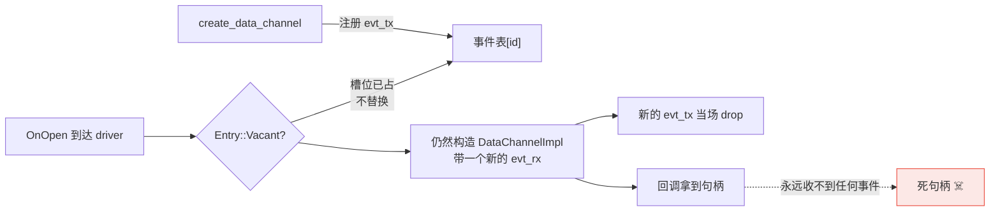

# 这条通道是谁开的：webrtc#825

> 本系列第 5 篇。前置：[00](00-what-is-webrtc.md) 的 DataChannel 一节。
>
> 上游 PR：[webrtc-rs/webrtc#825](https://github.com/webrtc-rs/webrtc/pull/825)（**已合并**）

前四篇都在 `rtc`（sans-io 的核心）里。这一篇往上一层——`webrtc`，它是套在 rtc 外面的
async 门面，提供 `on_data_channel` 这类回调式 API。

## 先说清楚 `negotiated` 是什么

[第 00 篇](00-what-is-webrtc.md)提过 DataChannel 有个 `negotiated` 选项，这里要展开一下，
因为它是这个 bug 的核心。

开一条 DataChannel 有两种方式：

| | **非 negotiated**（默认） | **negotiated** |
|---|---|---|
| 谁来开 | 一端调 `create_data_channel` | **两端各自**调，约好用同一个 `id` |
| 对端怎么知道 | 收到 DCEP 的 `DATA_CHANNEL_OPEN` → 触发 `on_data_channel` | **不需要知道**——它自己也开了一条 |
| 典型用途 | 动态开流 | 建连时就约定好的固定通道 |

[W3C 对 `negotiated` 的定义](https://www.w3.org/TR/webrtc/#dom-rtcdatachannelinit-negotiated)
写得很明确：

> If set to true, it is up to the application to negotiate the channel and create an
> `RTCDataChannel` object with the same `id` at the other peer.

既然两端都自己开，**谁也不该从 `on_data_channel` 回调里听到它**。

libp2p 的 WebRTC 传输正是这么用的：Noise 握手跑在一条 `negotiated: true, id: 0` 的通道上。
两端建连时都知道要开这条，不需要通知。

## 症状：muxer 收到一条它不该看见的流

libp2p 连接建立后，`on_data_channel` 的语义应该是「**对端开了一条新的子流**」——
muxer 收到它，当作一条 libp2p substream 交给上层。

实际发生的是：muxer 收到的**第一条「入站子流」，是本端自己开的 Noise 握手通道**。

后果连锁：muxer 把它交给上层当子流用，上层去读它、去协商协议，而对端**根本不知道有这条
子流存在**（它那边这条通道是 Noise 用的，已经用完了）。

## 根因一：driver 把所有 `OnOpen` 都当成「对端开的」

`PeerConnectionDriver` 收到任何通道的 `OnOpen` 事件，都往 `on_data_channel` 转发一遍——
**包括本端自己 `create_data_channel` 开的**。

于是这个回调的含义从「对端开了一条通道」退化成了「有一条通道 open 了」。对一个
只想知道「有没有新的入站流」的 muxer / router / dispatcher 来说，这是致命的语义差异。

negotiated 通道受害最重，因为按规范它**根本不该出现在回调里**，而现在两端都会收到。

## 根因二：回报的那个句柄本来就是死的

更荒诞的是第二层。就算你在应用层想办法把自己的通道过滤掉，回调给你的那个句柄**也没法用**：

- `create_data_channel` 时，本端已经为这个 id 注册了事件 sender
- driver 走到 `Entry::Vacant` 检查，发现槽位**已被占用**，于是不替换
- 但它仍然构造了一个 `DataChannelImpl` 传给回调——这个实例带的是一份**新的** `evt_rx`，
  而与之配对的 sender 当场就被丢弃了



**这个句柄一个事件都不会产生。** 所以那次多余的回报不仅语义是错的，交出去的东西还是坏的。

## 修复：答案早就在代码里

有意思的是，区分两种情况所需的信息**本来就有**——就是那个 `Entry::Vacant` 检查，
只是它的结论没被用在「要不要回报」这个决定上。

逻辑很干净：

> **槽位空着 = 这条通道是对端开的。**
> 因为本端创建的通道，在它的 `OnOpen` 能到达 driver 之前，就已经被
> `create_data_channel` 注册进表里了。

```rust
let opened_by_peer = {
    let mut data_channels = self.inner.data_channel_events_tx.lock().await;
    match data_channels.entry(channel_id) {
        Entry::Vacant(e) => { e.insert(evt_tx); true }
        // ...槽位已占 → 本端开的 → 不回报
    }
};
```

只回报 `opened_by_peer` 的那些。两个问题一起消失：语义正确了，而且**回报出去的句柄
必然是活的**（因为它的 sender 刚刚才插进表里）。

## 教训

**1. 回调的名字就是它的契约。**
`on_data_channel` 在 W3C 语境里明确指「远端开了一条通道」。一旦本端的也混进来，
所有把它当「入站事件」用的代码——muxer、router、dispatcher——全部会对一条不存在的
对端流采取行动。**回调命名带方向性的，实现必须守住那个方向。**

**2. 判断信息往往已经在手边。**
这个修复没有引入任何新状态：vacancy 检查早就在那儿，只是它的结论被用来做「要不要插入」，
没被用来做「要不要通知」。**一个需要新增状态才能修的 bug，先想想现有状态能不能回答。**

**3. 「多发一个事件」不是无害的冗余。**
直觉上，多回报一次顶多让应用多做一次判断。但这里它同时交出了一个**死句柄**——
应用拿着它等事件，永远等不到。**冗余的通知路径经常伴随没人测过的对象构造。**

**4. 规范里的「不该发生」值得直接引用。**
提 PR 时，与其论证「这样更合理」，不如直接指出 W3C 白纸黑字写了 negotiated 通道
不经回调。**规范原文是最省事的论据**——维护者不需要认同你的架构品味，只需要认同规范。

---

**上一篇**：[每条流的首条消息都丢](04-datachannel-ordered-default.md) ·
**下一篇**：[0.20 把远端证书弄丢了](06-remote-fingerprint-via-stats.md)

**上游**：[webrtc#825](https://github.com/webrtc-rs/webrtc/pull/825)（已合并）
