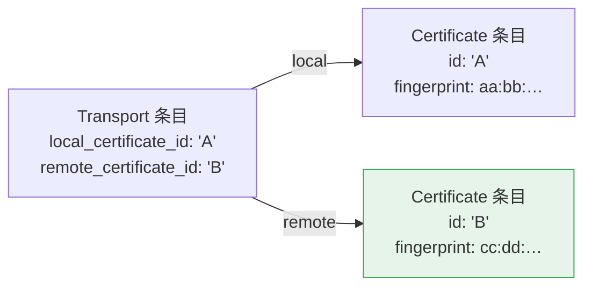

# 0.20 把远端证书弄丢了：webrtc#828 与一次 API 边界之争

> 本系列第 6 篇。前置：[01 libp2p 的两种 WebRTC](01-libp2p-webrtc-direct.md) 的
> 「为什么必须再跑一次 Noise」。
>
> 上游 PR：[webrtc-rs/webrtc#828](https://github.com/webrtc-rs/webrtc/pull/828)（评审中）

## 需求：服务端必须拿到客户端的真实指纹

回顾 [第 01 篇](01-libp2p-webrtc-direct.md)：direct 模式建连的最后一步是 Noise 握手，
它的 prologue 绑定**双方**的 DTLS 指纹：

```text
libp2p-webrtc-noise:<客户端指纹><服务端指纹>
```

两端必须算出**逐字节相同**的 prologue。各自的指纹自己知道；客户端从 multiaddr 的 certhash
知道服务端的。剩下**唯一**没有带外来源的值：**服务端需要客户端的指纹**。

它只存在于一个地方——DTLS 握手时客户端出示的那张证书。

0.17 有一行 API 直接给你：

```rust
// webrtc 0.17
let cert_bytes = conn.sctp().transport().get_remote_certificate().await;
let fingerprint = Fingerprint::from_certificate(&cert_bytes);
```

0.20 重构成 sans-io 之后，**这个 API 没了**。公开 API 里连 `dtls_transport` 模块都不存在，
`PeerConnection` 上也没有任何东西能拿到对端证书。

## 唯一剩下的路：统计报告，外加两道坎

数据其实还在——它跑到了 `get_stats` 返回的统计报告里。但取它有两个障碍。

### 坎一：报告不告诉你哪张证书是谁的

报告里每一侧各有一条 `Certificate` 条目，**条目本身不说自己属于哪边**。区分它们的唯一
线索，在另一种条目上：



所以是个两步查找：先找 `Transport` 条目读出 `remote_certificate_id`，再拿这个 id 回去
匹配 `Certificate` 条目。

**这个查找写反了不会报错。** 把 `remote_certificate_id` 写成 `local_certificate_id`，
代码照常跑，只是 prologue 会拿本端指纹去和本端比——Noise 随后失败，而错因完全看不出来。
更糟的场景：如果有人拿这个函数做证书固定（certificate pinning），**它会把每一个对端都
判定为合法**。

### 坎二：`get_stats` 的参数类型叫不出名字

第二道坎更基础。`get_stats` 是 `PeerConnection` trait 上的公开方法：

```rust
async fn get_stats(&self, now: Instant, selector: StatsSelector) -> RTCStatsReport;
```

而 `StatsSelector` 和 `RTCStatsReport` 在 `webrtc::peer_connection` 里是 `use` 进来的，
**不是 `pub use`**。

于是出现一个尴尬局面：**一个公开的 trait 方法，它的参数类型和返回类型在 crate 外面
没法命名。** 调用方只能自己去依赖底层的 `rtc` crate 才能把这些类型拼出来——而那意味着
在自己的 `Cargo.toml` 里重复声明一个 `webrtc` 已经 pin 好的版本，并手工保持同步
（`rtc` 还在 release candidate 阶段，版本号一直在动）。

## 第一版 PR：加一个便捷方法

于是 PR 提了两样东西：

1. `PeerConnection::remote_certificate_fingerprint(now)` —— 一个默认方法，把两步查找封起来
2. `pub use` 那三个统计类型，让 `get_stats` 本身可用

## 评审：一个我没能反驳的论点

维护者 rainliu 给了 `CHANGES_REQUESTED`：

> `remote_certificate_fingerprint` is not defined in W3C API. we need to make
> PeerConnection's API more compact and compliance to W3C APIs.
> If application needs it, just use get_stats get it by itself, like this function does.

他是对的。`RTCPeerConnection` 在 W3C 规范里确实没有这个方法。一个便捷函数不值得把
公开 trait 撑大——尤其这个 trait 是外部实现者要对齐的契约，加一个默认方法看似无害，
实则是永久的 API 承诺。

## 关键动作：把一个笼统的意见拆成两个问题

`CHANGES_REQUESTED` 是对整个 PR 的。但 PR 里其实有**两样可分离的东西**，它们面对的
是不同的问题：

| | 是什么问题 | 我的回应 |
|---|---|---|
| `remote_certificate_fingerprint` | **API 面**：该不该给 trait 加非 W3C 方法 | **接受，砍掉** |
| 三行 `pub use` | **可用性**：公开签名里的类型能不能命名 | **保留，单独举证** |

W3C 合规这个论点管得住第一样，管不住第二样——re-export 一个**已经出现在本 crate 公开
签名里**的类型，并没有扩大 API 面，它只是让已有的 API 变得可调用。

举证时最有力的一条，是在查证过程中才发现的：

```rust
// src/peer_connection/mod.rs —— 我改的那两行下面几行
pub use rtc::interceptor::{Interceptor, NoopInterceptor, Registry};
pub use rtc::peer_connection::{ ... };
```

**同一个文件里，紧挨着的位置，已经在这么干了。** 还有 `data_channel`、`rtp_transceiver`、
`media_stream` 几个模块，全都 `pub use` 了 rtc 的类型。

这一下论证的性质就变了：不是「请你接受我的一个新主张」，而是「这个 crate 已有的惯例，
在统计类型这里漏了」。**维护者不需要认同我的品味，只需要认同他自己的惯例。**

回复的结尾留了台阶：如果他仍然坚持，我把三行也删掉，只留文档和测试。这不是客套——
**上游的 API 边界是维护者的决定权，我的工作是把信息摆全，不是把结论摆上去。**

## 评审第二轮：两条要求，和一个他没提的东西

他的回应是两条行级评论：

> `revert this comments`（指我加在 `get_stats` 上的那段文档）
>
> `just keep this new integration test to show an example how to extract peer DTLS certificate fingerprint`

两条都照做了。**但他没有提 `pub use`。**

这里有个判断要做。他第一轮明确说过「应用直接 `use rtc::statistics::…` 就行」，
加上这轮「just keep the test」的字面意思，完全可以理解成那三行也该撤。

我没有替他决定，而是先去验证了一件事——**撤掉会怎样**。把 `pub use` 改回 `use`，跑一遍：

```text
error[E0603]: enum `RTCStatsReportEntry` is private
  --> tests/remote_certificate_fingerprint.rs:22:72
error[E0603]: enum `StatsSelector` is private
  --> tests/remote_certificate_fingerprint.rs:23:5
```

`tests/` 下的集成测试看到的就是外部调用者的视角，而 `[dev-dependencies]` 里没有 `rtc`。
所以「保留测试 + 撤掉 re-export」还得往 `Cargo.toml` 加一条 dev 依赖——**那超出了他的
要求**，不该由我擅自决定。

于是回复里把这个事实连同实测报错原样摆出来，并说明：只要他一句话，我就连
`[dev-dependencies]` 一起加上。**把选择权和它的后果一起交回去，比自作主张地删或留都好。**

## 两次自我纠错

这个系列里我栽了两次，值得放在一起看。

**第一次**：写 commit message 时这么论证 re-export 的必要性——

> pre-release 版本互不 semver 兼容，版本不匹配会静默解析出第二份类型。

**错的。** Cargo 对 `^0.20.0-rc.4` 的解析范围是 `>=0.20.0-rc.4, <0.21.0`，rc.5 满足，
会被统一成同一份。不存在「静默分叉」。发现得早，**没进到上游**。

**第二次**：[第 02 篇](02-dtls-fingerprint-dead-switch.md) 里那句「传 `None` 会连带
放行不出示证书的对端」。**也是错的**——DTLS 层的 `RequireAnyClientCert` 自己就拦住了。
这次**进了上游回复**，只能公开纠正。

共同点很扎眼：**两次我都相当确信。** 第一次觉得 pre-release 语义特殊是常识，
第二次觉得「不装回调就没人查空证书」是显然的代码阅读结论。而两次的验证成本都只有几分钟——
查一下 Cargo 的版本解析规则，grep 一下 `flight4.rs`。

所以这条教训比「拿不准的要谨慎」更硬：

> **不是「拿不准的要谨慎」，是「自以为拿得准的也要先跑一遍」。**

上面那个 `E0603` 就是照这条做的：与其断言「撤掉 re-export 测试会编不过」，不如真改回去
跑一次，把报错贴进回复。**同样一句话，一个是推测，一个是证据**——而在别人的仓库里，
只有后者值钱。

## 测试怎么设计：让「写反了」无处藏身

前面说过，这个查找写反了不会报错。所以测试必须**专门针对这个失败模式**。

方法是**双向交叉验证**：

```text
offerer 看到的 remote  ==  answerer 报告的 local
answerer 看到的 remote ==  offerer 报告的 local
```

再加一条守卫：

```rust
// 两端的证书必须不同，否则上面两条断言可以靠巧合通过
assert_ne!(offerer_own, answerer_own, "...");
```

如果实现把 `remote` 写成了 `local`，两条交叉断言会同时失败，并把两个指纹并排打出来。
换成一句「返回值非空」的断言，这个 bug 会毫发无伤地通过。

> 同样的思路在 [第 02 篇](02-dtls-fingerprint-dead-switch.md) 出现过：那里用的是
> 正反双向的测试对。**共同点是——先想清楚「这段代码最可能怎么错」，再设计一个专门
> 能捕获它的判据。**

## 结果：反查逻辑归本仓

方法砍掉后，那段两步查找搬回了 SwarmDrop：

```rust
// crates/webrtc-p2p/src/backend/native/direct/upgrade.rs
async fn remote_fingerprint(pc: &dyn PeerConnection) -> Result<Fingerprint, Error> {
    let report = pc.get_stats(Instant::now(), StatsSelector::None).await;

    let remote_id = report.iter().find_map(|entry| match entry {
        RTCStatsReportEntry::Transport(t) if !t.remote_certificate_id.is_empty() =>
            Some(t.remote_certificate_id.clone()),
        _ => None,
    }).ok_or_else(|| Error::Connection("DTLS 握手后统计报告里没有对端证书".into()))?;

    let value = report.iter().find_map(|entry| match entry {
        RTCStatsReportEntry::Certificate(cert) if cert.stats.id == remote_id =>
            Some(cert.fingerprint.clone()),
        _ => None,
    }).ok_or_else(|| Error::Connection("DTLS 握手后仍拿不到对端证书指纹".into()))?;

    crate::protocol::addr::parse_sdp_fingerprint(&value)
        .ok_or_else(|| Error::Connection(format!("对端证书指纹格式无法解析：{value}")))
}
```

十几行，注释里写清了「取错侧会静默失败」以及「上游为什么不收这段」。而 PR 保留的
`pub use` 让这十几行**能被写出来**——这才是它真正的价值。

## 教训

**1. 公开方法的签名里出现的类型，必须可命名。**
否则那个方法在 crate 外面等于不存在。这是 API 设计的基本卫生，与「要不要加便捷方法」
是两个层次的问题。

**2. 笼统的评审意见，先拆再答。**
一个 `CHANGES_REQUESTED` 可能同时覆盖几个可分离的主张。**接受该接受的，为该保留的
单独举证**，比整包接受或整包争辩都好——也让维护者更容易做决定。

**3. 最强的论据是对方自己的惯例。**
「这个 crate 已经在别处这么做了」比任何设计论证都省事。提 PR 前花五分钟 grep 一下
同类模式，往往能把一场辩论变成一次确认。

**4. 论证里的技术断言会被当成事实。**
拿不准的机制（semver 解析规则、编译器行为、协议细节），宁可用更弱但确定为真的表述。
**一个站不住的理由会连累你其余的论点。**

---

**上一篇**：[这条通道是谁开的](05-who-opened-this-channel.md) ·
**下一篇**：[怎么把踩的坑变成上游补丁](07-upstream-methodology.md)

**上游**：[webrtc#828](https://github.com/webrtc-rs/webrtc/pull/828)（评审中）、
[issue #827](https://github.com/webrtc-rs/webrtc/issues/827) ·
**本仓**：`crates/webrtc-p2p/src/backend/native/direct/upgrade.rs`
