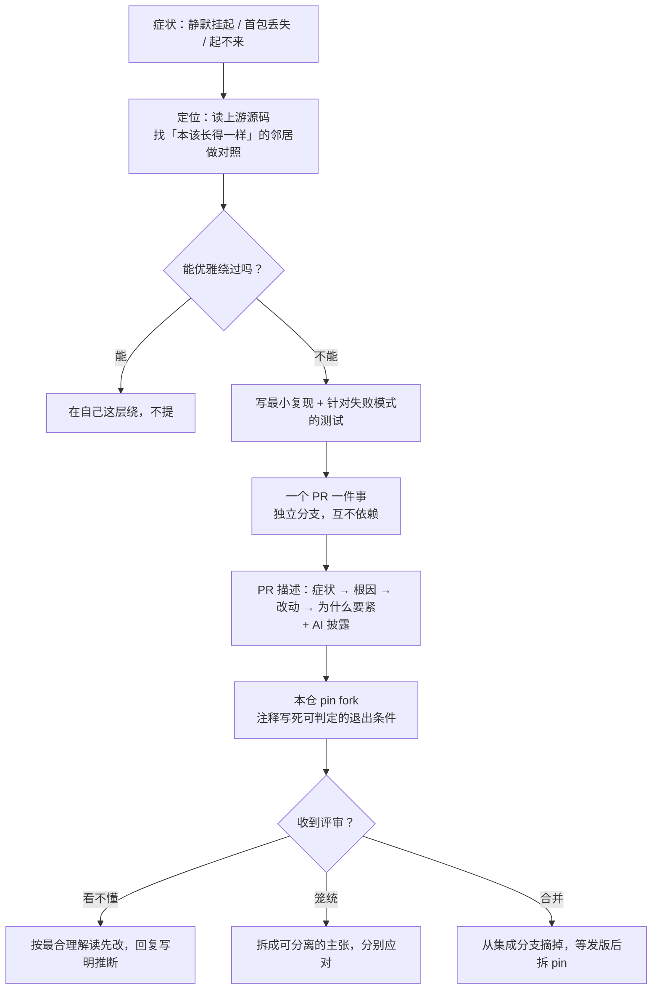

# 怎么把踩的坑变成上游补丁

> 本系列第 7 篇（末篇）。前六篇是六个具体的坑，这一篇把打法收拢成可复用的东西。

## 战果盘点

自研 WebRTC 传输（[第 01 篇](01-libp2p-webrtc-direct.md)）这条线上，一共向三个上游
仓库提了 **11 个 PR**：

| 仓库 | PR | 内容 | 状态 |
|---|---|---|---|
| **rtc** | [#137](https://github.com/webrtc-rs/rtc/pull/137) | 指纹校验开关是死代码（[第 02 篇](02-dtls-fingerprint-dead-switch.md)） | **已合并** |
| | [#138](https://github.com/webrtc-rs/rtc/pull/138) | `send` 谎报成功（[第 03 篇](03-datachannel-silent-send.md)） | **已合并** |
| | [#140](https://github.com/webrtc-rs/rtc/pull/140) | `ordered` 默认值（[第 04 篇](04-datachannel-ordered-default.md)） | **已合并** |
| **webrtc** | [#824](https://github.com/webrtc-rs/webrtc/pull/824) | 抬高读缓冲默认值 | 自行关闭 |
| | [#825](https://github.com/webrtc-rs/webrtc/pull/825) | `on_data_channel` 回报本端通道（[第 05 篇](05-who-opened-this-channel.md)） | **已合并** |
| | [#828](https://github.com/webrtc-rs/webrtc/pull/828) | 统计类型叫不出名字（[第 06 篇](06-remote-fingerprint-via-stats.md)） | **已合并** |
| | [#850](https://github.com/webrtc-rs/webrtc/pull/850) → [#853](https://github.com/webrtc-rs/webrtc/pull/853) | 实现自定义 `AsyncUdpSocket` 所需的两个 helper 是 `pub(crate)`（见文末后记） | 待审 — 改投 `v0.20.x` 后重开为 #853，#850 已关 |
| **rust-libp2p** | [#6558](https://github.com/libp2p/rust-libp2p/pull/6558) | websys 回调重入 panic | 待审 |
| | [#6560](https://github.com/libp2p/rust-libp2p/pull/6560) | 协商 DataChannel 消息上限 | 待审 |
| | [#6570](https://github.com/libp2p/rust-libp2p/pull/6570) | relay 无 reservation 时 panic | 自行关闭 |
| | [#6571](https://github.com/libp2p/rust-libp2p/pull/6571) | `Fingerprint::from_sdp_format` | 待审 |
| | [#6572](https://github.com/libp2p/rust-libp2p/pull/6572) | offer SDP 模板归位 | 待审 |

**webrtc-rs 两个仓库的五个 PR 全部合并**（2026-07-29），另有两个自行关闭、四个在 rust-libp2p
待审。连带关掉了三个 issue：[webrtc#826](https://github.com/webrtc-rs/webrtc/issues/826)、
[#827](https://github.com/webrtc-rs/webrtc/issues/827)、
[rtc#139](https://github.com/webrtc-rs/rtc/issues/139)。

这些不是「顺手做的开源贡献」——**每一个都是 SwarmDrop 的硬阻塞**。#137 不修，direct
服务端起不来；#138 不修，Noise 握手挂住；#140 不修，每条流丢首包。没有绕路可走。

## 判断一：什么时候该提上游，什么时候该忍

不是每个上游缺陷都值得提 PR。判据大致是：

| 情形 | 做法 |
|---|---|
| 能在自己这层绕过，且绕法不难看 | **绕过，不提** |
| 绕不过，但改动只对我们有意义 | 提，但预期是被拒——想好被拒后怎么办 |
| 绕不过，且**任何人**遇到都会踩 | **提，并且值得花时间写好** |
| 上游行为与规范/自己的文档矛盾 | **提**——这是最容易被接受的一类 |

本系列六个坑全在后两类。第 02、04、05 篇甚至属于「实现与自己的文档/规范矛盾」——
这类 PR 的论证成本最低：你不需要说服谁接受一个新设计，只需要指出**它和你们自己写的
不一致**。

反例是 [#824](https://github.com/webrtc-rs/webrtc/pull/824)（抬高读缓冲默认值）。
它属于第二类：改的是全局默认值，只为满足我们当时假定的 16 KiB。后来 libp2p 那边
协商出了连接级的消息上限，我们的假设不成立了——**于是自己把 PR 关掉**，并写明了
原因。留着一个前提已经消失的 PR，是在浪费维护者的时间。

## 判断二：一个 PR 只做一件事

rtc 的两个补丁（#137 指纹开关、#138 send 谎报）都是同一次调试撞出来的，改的是同一个
crate，甚至可以说属于同一条建连路径。但它们走的是**两个独立分支、两个 PR**。

理由很实际：

- **审查成本**：一个五行接线 + 测试的 PR，维护者几分钟就能判断；两个缠在一起就得看半小时
- **合并速度不同**：#138 很快合了，#137 收到评审意见——绑在一起的话，#138 也得等
- **回滚粒度**：本仓的 `[patch]` 可以只 pin 其中一个

推论是：本仓的**集成分支** = `upstream/master` + 每个独立分支的合并，各分支互不依赖。
上游合并一个，就从集成分支里摘掉一个，剩下的照常工作。

## 判断三：测试要针对「最可能怎么错」

六个 PR 每一个都带测试，但更重要的是**测试的判据怎么选**。

| PR | 最可能的错误方式 | 判据设计 |
|---|---|---|
| #137 | 开关又被忽略 | **正反双向**：开了能连 + 不开仍失败 |
| #828 | local / remote 取反 | **双向交叉**：一端的 remote == 另一端的 local，外加「两张证书必须不同」防巧合 |
| #140 | 只测「能收到消息」会漏掉首包丢失 | 专门断言**第一条**消息 |

共同点：**先想清楚这段代码最可能怎么错，再设计一个专门能捕获它的判据。**
一句「返回值非空」的断言，对上面三个 bug 全部无效。

这个原则在本仓自己的代码里同样适用。举个同期的例子：修一个「刷新后要 89 秒才恢复
在线」的退避 bug 时，回归守卫的判据取的是「首次重试排期 **< 一个完整周期**」，
而不是某个具体秒数——这样退避档位以后可以调，但那个 bug 回不来。

## 判断四：怎么接评审意见

本系列里有两次 `CHANGES_REQUESTED`，处理方式不同，但都遵循三个动作：

**1. 看不懂的意见，按最合理的解读先做一遍——并把推断本身写进回复。**
[#137](02-dtls-fingerprint-dead-switch.md) 的评论是「why not move this to line 1135?」，
而那个文件只有 232 行。与其在 PR 里等一轮问答（可能是几天），不如按最合理的推断
（`135`，闭包定义处附近）改完再说。

**这次我推断错了**——他要的是在构造处决定要不要构造闭包，不是在闭包体内早退。但代价
只是再改一次，仍然比空等一轮便宜。**真正救场的是我在回复里写明了「我把 1135 读成了
135」**：他一眼看出我理解偏了，直接贴出想要的代码，一轮就收敛。如果只是默默改完说
「已修复」，还得再来一次。**推断可以错，但推断必须是公开的。**

**2. 笼统的意见，先拆再答。**
[#828](06-remote-fingerprint-via-stats.md) 的意见覆盖整个 PR，但 PR 里有两样可分离的
东西。接受该接受的（砍掉非 W3C 的便捷方法），为该保留的单独举证（re-export 是可用性
问题，不是 API 面问题）。**整包接受和整包争辩都是偷懒。**

**3. 找对方自己的惯例当论据。**
同样是 #828，最有力的一条论据是查证时发现的：**同一个文件里紧挨着的几行已经在
`pub use rtc::…` 了**。这把「请接受我的主张」变成了「你们的惯例在这里漏了一处」。

还有一条隐含的：**改完要说清楚改了什么、为什么**。force-push 之后 GitHub 会把旧评论
标成 outdated，维护者需要重新建立上下文。回复里贴出关键的几行、说明 diff 缩小到了哪里，
能省掉他一次完整的重读。

## 判断五：技术断言必须先验证——包括你确信的那些

给上游提 PR 时，**论证里的每一个技术断言都会被当成事实**。一个听起来很专业但站不住的
理由，比没有理由更糟——它会连累你其余论点的可信度。

这个系列里我栽了两次，而且两次都**不是**「拿不准还硬说」：

| 断言 | 真相 | 验证成本 |
|---|---|---|
| 「pre-release 版本互不 semver 兼容，会静默解析出第二份类型」 | `^0.20.0-rc.4` 的范围是 `>=0.20.0-rc.4, <0.21.0`，rc.5 满足，会统一 | 查一次 Cargo 文档 |
| 「传 `None` 会连带放行不出示证书的对端」 | `RequireAnyClientCert` 让 DTLS 层自己就拦住了，还拦在回调之前 | `grep` 一次 `flight4.rs` |

第一条发现得早，没进上游；第二条写进了回复，只能公开纠正。**两次我都很确信**，
而两次的验证都只要几分钟。

所以正确的规则不是「拿不准的要谨慎」，而是：

> **要写进 PR 的技术断言，先跑一遍再写。**

正面例子来自同一轮：需要说明「撤掉 re-export 会让这个 crate 自己的集成测试编不过」时，
我没有直接断言，而是真把 `pub use` 改回 `use` 编了一次，把报错贴进回复：

```text
error[E0603]: enum `StatsSelector` is private
  --> tests/remote_certificate_fingerprint.rs:23:5
```

同样一句话，一个是推测，一个是证据。**在别人的仓库里，只有后者值钱。**

顺带一提，公开纠正自己**不丢分**。维护者要评估的是「这个人的判断能不能信」，
一次主动、带证据位置的纠错，比一个从不出错但也从不给依据的贡献者更值得信任。

## 判断六：AI 协助要如实披露

本系列的每个 PR 描述里都有一段：

```markdown
## Disclosure

This change was developed with AI assistance (Claude Code). I hit the gap building a
WebRTC-Direct libp2p transport on 0.20 ... I have read every line of the diff and can
explain it in review.
```

rust-libp2p 的 PR 模板甚至把它做成了必填项（工具名 + 一条「我读过每一行」的声明）。

这不只是合规动作。它同时传达了两件维护者真正关心的事：**这个改动来自真实场景**，
以及**有人为它负责**。一个没有场景、作者也答不上细节的 PR，无论质量如何都会消耗信任。

## 判断七：fork pin 是负债，要写好还款条件

**补丁合并 ≠ 能拆 pin。** 五个 PR 都进了上游 master，但 crates.io 上仍是
`0.20.0-rc.4`（不含它们），所以现在是 git rev 临时顶着，等发版再换回版本号。
合并那一刻真正变化的，是两条 pin 的**性质**：

| pin | 合并前 | 合并后 | 还欠什么 |
|---|---|---|---|
| `rtc` | 个人 fork 的集成分支 | **官方 `webrtc-rs/rtc` 的 master commit** | 只欠发版 |
| `webrtc` | 个人 fork（两个功能补丁 + 一行适配） | 个人 fork，**只剩那一行适配** | 发版 + 那行适配（见下） |

第一条已经不算「自有补丁」了——URL 就是上游仓库本身，风险从「我维护着一份分叉」
降到「我在等一次发版」。这个区别值得在注释里写明：**前者需要有人持续照看，后者只需要
定期看一眼版本号。**

libp2p 那条 pin 则原样不动，它的四个 PR 还在待审。

这是**本项目最大的单点依赖风险**，所以治理规则写死在 `Cargo.toml` 的注释里：

**1. 退出条件必须可判定——写成能直接跑的命令。**

```bash
cargo search rtc --limit 1        # 期望 > 0.20.0-rc.4
cargo search webrtc --limit 1     # 期望 > 0.20.0-rc.4
```

不是「等上游修好」这种没法执行的描述，而是任何人（包括半年后的自己）跑一遍就知道
「能不能拆」。合并前那一版写的是 `gh pr view … --jq .state`，同样可判定——
**条件会变，但永远保持可执行**：PR 合并后就把它换成版本号检查，而不是留着一条
已经恒为真的旧条件。

> **后记（2026-08-04）：这条还款条件在 4 天后兑现了。** `rtc` / `webrtc` 双双发布
> 0.20.0 正式版（2026-07-31），上面那两条命令一跑就成立，两条 `[patch.crates-io]`
> 连同这段注释整体删除，依赖回到普通版本号——**本仓的 git pin 从三条降到一条**（只剩
> libp2p）。写下可判定条件的收益就在这一刻：不用重读五个 PR、不用回忆当初为什么 pin，
> 跑两行命令即可确认。
>
> 拆 pin 不是零成本：正式版顺带把 `AsyncUdpSocket` 换成了 quinn 风格的 poll API，
> `udp_mux` 得跟着改。适配过程中还查出**三个既有缺陷**（GRO 合并包一直没拆、瞬时读
> 错误判据漏了 `ConnectionRefused`、读循环没有 burst 上限），前两个影响已发布的
> v0.10.4 Linux 构建。这恰好印证了上面第 3 条（升 rev 必须走独立 PR + 全量测试）：
> 这类改动躲在「换个版本号」背后，混进功能 PR 就再也二分不出来了。
>
> **第 12 个 PR 也是这么长出来的**：修那三个缺陷时发现，正确实现所需的
> `gro_recv_buf_len`（缓冲尺寸公式）与 `is_retryable_socket_recv_error`（错误分类）
> 都是 `pub(crate)`，下游只能照着源码抄——**而我两个都抄错了**（缓冲大 5.5 倍、
> 错误集漏三个变体）。于是提了
> [webrtc#850](https://github.com/webrtc-rs/webrtc/pull/850)。
>
> 它的论据完全长在判断一那张表的最后一行（「上游行为与自己的文档矛盾」）：上游新增的
> `examples/custom-runtime/README.md` 一边承诺「No `#[cfg]` edits, no fork, and **no
> changes to library internals**」，一边把想做 production runtime 的人指向「照着
> `src/runtime/tokio.rs` 抄」——而那份源码依赖的正是这两个私有 item。**自己踩的坑
> 变成了论据本身**：不必论证「这个 API 应该公开」，只需指出「你们承诺了下游不用碰内部，
> 但照文档做就得碰」。
>
> **然后 pin 又回来了——这次是「等 API」而不是「等修复」。** 同一天下午，为了让
> `udp_mux` 直接用上 #850 公开的那两个函数、而不是在下游维护两份复制品，重新 pin 了
> `webrtc`（fork 的 `swarmdrop-integration-0.21` = 上游 master + #850 + 那行老适配）
> 与 `rtc`（官方 submodule commit），两者都是未发布的 0.21.0。
>
> 这不违背「fork pin 是负债」，而是把负债**记在了更划算的一边**：那两份复制品都没有
> 反馈回路（算错了不报错，只静默丢包或关端口），而 pin 有可判定的退出条件、且 CI 每次
> 都在验证。判断二（一个 PR 只做一件事）在这里的对应物是：**PR 分支与 pin 分支必须
>分开**——#850 若被要求改形态，另开分支重建集成分支，绝不 force-push 已被 pin 的那条。
>
> **当天晚上这条预案就兑现了。** 维护者要求把 PR 改投 `v0.20.x`（无 breaking change，
> 该进补丁线；合并后他自行 merge 回 master），于是从上游 `v0.20.x` 拉新分支、
> cherry-pick 同一个 commit、重开为
> [#853](https://github.com/webrtc-rs/webrtc/pull/853)，#850 关闭。
> **集成分支一根手指都没动**，`Cargo.toml` 的 rev 因而不变、构建不受影响——如果当初图省事
> 把 PR 直接开在 pin 分支上，这一步就得 force-push，commit 一游离就被 GC，构建当场断。
>
> 连带一个容易漏的后果：投在 0.20.x 补丁线意味着**很可能先有 0.20.x 补丁版、后有
> 0.21.0**，而集成分支基于 master（0.21.0）。所以退出时 `crates/webrtc-p2p` 的版本号
> 要往**回**走到 0.20.x，不是留着 0.21.0——退出条件里写清楚了这一条。

**2. 每条 pin 都要写清楚「为什么非它不可」。**
注释里记的是症状、根因、以及不修会怎样——而不是「见 PR #137」。链接会失效，
描述不会。

**3. 升 rev 必须走独立 PR + 全量测试。**
包括 `./scripts/check-wasm.sh`（wasm target 的门禁）和 `Cargo.lock` 同步。fork rev 的
变更混在功能 PR 里，出问题时无法二分。

**4. 上游 API 变了，先在自己这层解耦，再升 rev。**
[#828](06-remote-fingerprint-via-stats.md) 评审后砍掉了那个便捷方法，本仓有一处在用。
处理顺序是：**先**把调用改成自己实现（当前 pin 的 rev 两种写法都能编），**再**升 rev。
这样升级那一步就纯粹是 lockfile 的事，不会和代码改动缠在一起。

### 一个具体的坑：`path` 依赖不受 `[patch]` 影响

`webrtc` 仓库里，`rtc` 是以 `path` 依赖引用的：

```toml
rtc = { version = "0.20.0-rc.4", path = "rtc" }
```

`path` 优先于 `version`，而 `[patch.crates-io]` **对 path 依赖无效**。于是当我们把
`webrtc` 换成 git fork 时，它带的是仓库自己的 `rtc` 子目录，而我们声明的 `rtc` 走的是
crates.io + patch——**依赖树里出现两个不同的 rtc 实例**，同名类型互不兼容，报错点在
调用处而不是解析处，极难看懂。

解法是在 fork 分支上加一行「让 rtc 走 crates.io」，并在那个分支的 Cargo.toml 注释里
写明原因。**这一行不能进上游**（上游用 path 指 submodule 是它自己的正确选择），
所以 webrtc 这条 pin 注定比 rtc 那条活得久：rtc 只欠一次发版，它还额外背着这行适配。

## 小结：一条踩坑到补丁的完整链路



最后一句留给最反直觉的那条经验：

> **上游的 bug 不是绕路的理由，但也不是每个都值得提。**
> 判据不是「这个 bug 有多烦人」，而是「**别人会不会也踩到**」——
> 会的话，花两个小时写好它；不会的话，在自己这层挡掉，然后继续干活。

---

**上一篇**：[0.20 把远端证书弄丢了](06-remote-fingerprint-via-stats.md) ·
**回到** [系列目录](README.md)
