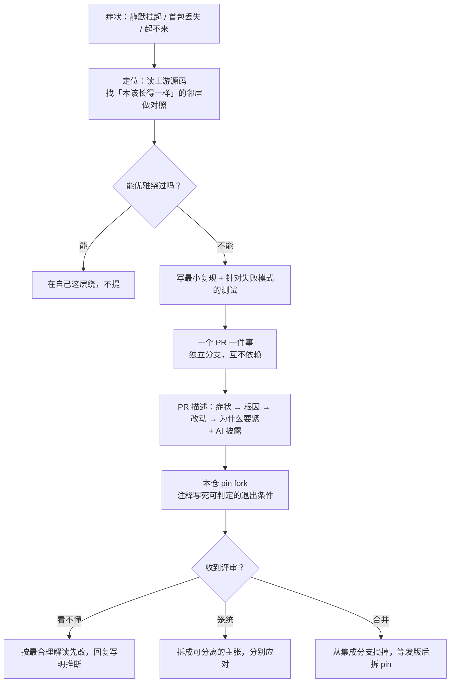

# 怎么把踩的坑变成上游补丁

> 本系列第 7 篇（末篇）。前六篇是六个具体的坑，这一篇把打法收拢成可复用的东西。

## 战果盘点

自研 WebRTC 传输（[第 01 篇](01-libp2p-webrtc-direct.md)）这条线上，一共向三个上游
仓库提了 **11 个 PR**：

| 仓库 | PR | 内容 | 状态 |
|---|---|---|---|
| **rtc** | [#137](https://github.com/webrtc-rs/rtc/pull/137) | 指纹校验开关是死代码（[第 02 篇](02-dtls-fingerprint-dead-switch.md)） | 复审中 |
| | [#138](https://github.com/webrtc-rs/rtc/pull/138) | `send` 谎报成功（[第 03 篇](03-datachannel-silent-send.md)） | **已合并** |
| | [#140](https://github.com/webrtc-rs/rtc/pull/140) | `ordered` 默认值（[第 04 篇](04-datachannel-ordered-default.md)） | **已合并** |
| **webrtc** | [#824](https://github.com/webrtc-rs/webrtc/pull/824) | 抬高读缓冲默认值 | 自行关闭 |
| | [#825](https://github.com/webrtc-rs/webrtc/pull/825) | `on_data_channel` 回报本端通道（[第 05 篇](05-who-opened-this-channel.md)） | **已合并** |
| | [#828](https://github.com/webrtc-rs/webrtc/pull/828) | 统计类型叫不出名字（[第 06 篇](06-remote-fingerprint-via-stats.md)） | 复审中 |
| **rust-libp2p** | [#6558](https://github.com/libp2p/rust-libp2p/pull/6558) | websys 回调重入 panic | 待审 |
| | [#6560](https://github.com/libp2p/rust-libp2p/pull/6560) | 协商 DataChannel 消息上限 | 待审 |
| | [#6570](https://github.com/libp2p/rust-libp2p/pull/6570) | relay 无 reservation 时 panic | 自行关闭 |
| | [#6571](https://github.com/libp2p/rust-libp2p/pull/6571) | `Fingerprint::from_sdp_format` | 待审 |
| | [#6572](https://github.com/libp2p/rust-libp2p/pull/6572) | offer SDP 模板归位 | 待审 |

三个已合并，两个复审中，两个自行关闭，四个待审。

这些不是「顺手做的开源贡献」——**每一个都是 SwarmDrop 的硬阻塞**。#137 不修，direct
服务端起不来；#138 不修，Noise 握手挂住；#140 不修，每条流丢首包。没有绕路可走。

## 判断一：什么时候该提上游，什么时候该忍

不是每个上游缺陷都值得提 PR。判据大致是：

| 情形 | 做法 |
|---|---|
| 能在自己这层绕过，且绕法不难看 | **绕过，不提** |
| 绕不过，但改动只对我们有意义 | 提，但预期是被拒——想好被拒后怎么办 |
| 绕不过，且**任何人**遇到都会踩 | **提，并且值得花时间写好** |
| 上游行为与规范/自己的文档矛盾 | **提**——这是最容易被接受的一类 |

本系列六个坑全在后两类。第 02、04、05 篇甚至属于「实现与自己的文档/规范矛盾」——
这类 PR 的论证成本最低：你不需要说服谁接受一个新设计，只需要指出**它和你们自己写的
不一致**。

反例是 [#824](https://github.com/webrtc-rs/webrtc/pull/824)（抬高读缓冲默认值）。
它属于第二类：改的是全局默认值，只为满足我们当时假定的 16 KiB。后来 libp2p 那边
协商出了连接级的消息上限，我们的假设不成立了——**于是自己把 PR 关掉**，并写明了
原因。留着一个前提已经消失的 PR，是在浪费维护者的时间。

## 判断二：一个 PR 只做一件事

rtc 的两个补丁（#137 指纹开关、#138 send 谎报）都是同一次调试撞出来的，改的是同一个
crate，甚至可以说属于同一条建连路径。但它们走的是**两个独立分支、两个 PR**。

理由很实际：

- **审查成本**：一个五行接线 + 测试的 PR，维护者几分钟就能判断；两个缠在一起就得看半小时
- **合并速度不同**：#138 很快合了，#137 收到评审意见——绑在一起的话，#138 也得等
- **回滚粒度**：本仓的 `[patch]` 可以只 pin 其中一个

推论是：本仓的**集成分支** = `upstream/master` + 每个独立分支的合并，各分支互不依赖。
上游合并一个，就从集成分支里摘掉一个，剩下的照常工作。

## 判断三：测试要针对「最可能怎么错」

六个 PR 每一个都带测试，但更重要的是**测试的判据怎么选**。

| PR | 最可能的错误方式 | 判据设计 |
|---|---|---|
| #137 | 开关又被忽略 | **正反双向**：开了能连 + 不开仍失败 |
| #828 | local / remote 取反 | **双向交叉**：一端的 remote == 另一端的 local，外加「两张证书必须不同」防巧合 |
| #140 | 只测「能收到消息」会漏掉首包丢失 | 专门断言**第一条**消息 |

共同点：**先想清楚这段代码最可能怎么错，再设计一个专门能捕获它的判据。**
一句「返回值非空」的断言，对上面三个 bug 全部无效。

这个原则在本仓自己的代码里同样适用。举个同期的例子：修一个「刷新后要 89 秒才恢复
在线」的退避 bug 时，回归守卫的判据取的是「首次重试排期 **< 一个完整周期**」，
而不是某个具体秒数——这样退避档位以后可以调，但那个 bug 回不来。

## 判断四：怎么接评审意见

本系列里有两次 `CHANGES_REQUESTED`，处理方式不同，但都遵循三个动作：

**1. 看不懂的意见，按最合理的解读先做一遍。**
[#137](02-dtls-fingerprint-dead-switch.md) 的评论是「why not move this to line 1135?」，
而那个文件只有 232 行。与其在 PR 里等一轮问答（可能是几天），不如按最合理的推断
（`135`，那正是闭包定义处）改完，在回复里写明推断依据，并留一句「如果你指的是别处
我再挪」。**推断错了的成本是再改一次，问一轮的成本是几天。**

**2. 笼统的意见，先拆再答。**
[#828](06-remote-fingerprint-via-stats.md) 的意见覆盖整个 PR，但 PR 里有两样可分离的
东西。接受该接受的（砍掉非 W3C 的便捷方法），为该保留的单独举证（re-export 是可用性
问题，不是 API 面问题）。**整包接受和整包争辩都是偷懒。**

**3. 找对方自己的惯例当论据。**
同样是 #828，最有力的一条论据是查证时发现的：**同一个文件里紧挨着的几行已经在
`pub use rtc::…` 了**。这把「请接受我的主张」变成了「你们的惯例在这里漏了一处」。

还有一条隐含的：**改完要说清楚改了什么、为什么**。force-push 之后 GitHub 会把旧评论
标成 outdated，维护者需要重新建立上下文。回复里贴出关键的几行、说明 diff 缩小到了哪里，
能省掉他一次完整的重读。

## 判断五：AI 协助要如实披露

本系列的每个 PR 描述里都有一段：

```markdown
## Disclosure

This change was developed with AI assistance (Claude Code). I hit the gap building a
WebRTC-Direct libp2p transport on 0.20 ... I have read every line of the diff and can
explain it in review.
```

rust-libp2p 的 PR 模板甚至把它做成了必填项（工具名 + 一条「我读过每一行」的声明）。

这不只是合规动作。它同时传达了两件维护者真正关心的事：**这个改动来自真实场景**，
以及**有人为它负责**。一个没有场景、作者也答不上细节的 PR，无论质量如何都会消耗信任。

## 判断六：fork pin 是负债，要写好还款条件

三个上游都还没发布含补丁的版本，所以本仓在 `Cargo.toml` 里 pin 了两处 fork
（rtc 与 webrtc，各自一条 `[patch.crates-io]`），libp2p 则整体 pin 在一个 fork rev 上。

这是**本项目最大的单点依赖风险**，所以治理规则写死在 `Cargo.toml` 的注释里：

**1. 退出条件必须可判定——写成能直接跑的命令。**

```bash
gh pr view 137 --repo webrtc-rs/rtc --json state --jq .state    # 期望 MERGED
gh pr view 138 --repo webrtc-rs/rtc --json state --jq .state    # 已 MERGED
cargo search rtc --limit 1                                       # 期望 > 0.20.0-rc.4
```

不是「等上游修好」这种没法执行的描述，而是任何人（包括半年后的自己）都能跑一遍就知道
「能不能拆」的检查。

**2. 每条 pin 都要写清楚「为什么非它不可」。**
注释里记的是症状、根因、以及不修会怎样——而不是「见 PR #137」。链接会失效，
描述不会。

**3. 升 rev 必须走独立 PR + 全量测试。**
包括 `./scripts/check-wasm.sh`（wasm target 的门禁）和 `Cargo.lock` 同步。fork rev 的
变更混在功能 PR 里，出问题时无法二分。

**4. 上游 API 变了，先在自己这层解耦，再升 rev。**
[#828](06-remote-fingerprint-via-stats.md) 评审后砍掉了那个便捷方法，本仓有一处在用。
处理顺序是：**先**把调用改成自己实现（当前 pin 的 rev 两种写法都能编），**再**升 rev。
这样升级那一步就纯粹是 lockfile 的事，不会和代码改动缠在一起。

### 一个具体的坑：`path` 依赖不受 `[patch]` 影响

`webrtc` 仓库里，`rtc` 是以 `path` 依赖引用的：

```toml
rtc = { version = "0.20.0-rc.4", path = "rtc" }
```

`path` 优先于 `version`，而 `[patch.crates-io]` **对 path 依赖无效**。于是当我们把
`webrtc` 换成 git fork 时，它带的是仓库自己的 `rtc` 子目录，而我们声明的 `rtc` 走的是
crates.io + patch——**依赖树里出现两个不同的 rtc 实例**，同名类型互不兼容，报错点在
调用处而不是解析处，极难看懂。

解法是在 fork 分支上加一行「让 rtc 走 crates.io」，并在那个分支的 Cargo.toml 注释里
写明原因。

## 小结：一条踩坑到补丁的完整链路



最后一句留给最反直觉的那条经验：

> **上游的 bug 不是绕路的理由，但也不是每个都值得提。**
> 判据不是「这个 bug 有多烦人」，而是「**别人会不会也踩到**」——
> 会的话，花两个小时写好它；不会的话，在自己这层挡掉，然后继续干活。

---

**上一篇**：[0.20 把远端证书弄丢了](06-remote-fingerprint-via-stats.md) ·
**回到** [系列目录](README.md)
