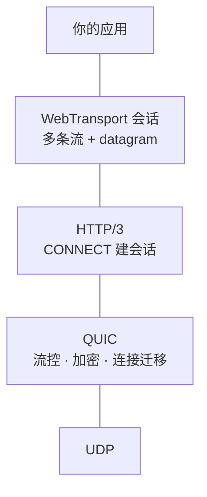

# 00 · WebTransport 到底是什么

> 零基础入门。读完你应该能回答：它和 WebSocket、WebRTC 有什么不同，为什么它是 2026 年
> 才变得有意思的东西，以及它在什么场景下是**唯一**能用的那个。

## 先看浏览器给了 JS 哪些网络能力

| API | 传输层 | 形态 | 能不能连没有域名的机器 |
|---|---|---|---|
| `fetch` / XHR | TCP + TLS | 请求-响应 | ❌ 需要 CA 证书 ⇒ 需要域名 |
| `WebSocket` | TCP + TLS | 单条双向有序字节流 | ❌ 同上 |
| `RTCPeerConnection` | UDP + DTLS + SCTP | 多条流 / 可靠或不可靠 | ✅ 靠指纹，不靠 CA |
| **`WebTransport`** | **UDP + QUIC (HTTP/3)** | **多条流 + 不可靠数据报** | ✅ **靠证书哈希，不靠 CA** |

最后一列是这篇文章的题眼。**浏览器出于安全，默认只信任 CA 签发的证书**，而 CA 只签给域名。
一台家里的笔记本、一个局域网里的手机、一台只有裸 IP 的小服务器——它们都拿不到 CA 证书，
于是前两行的 API 对它们**根本不可用**。

WebRTC 长期是唯一的出路（它用 SDP 里的 DTLS 指纹做校验，绕开 CA）。WebTransport 是第二条。

## 它是什么

一句话：**WebTransport 是浏览器上的 QUIC 客户端 API。**

拆开：

- **QUIC** 是跑在 UDP 上的可靠传输协议，HTTP/3 就建在它上面。它把 TCP+TLS 的两次握手合成
  一次，并且**每条流独立可靠**。
- **WebTransport** 在一条 HTTP/3 连接上开一个「会话」，会话里你可以开任意多条双向/单向流，
  也可以发不可靠的数据报（datagram）。



JS 侧的 API 简单到不像网络代码：

```js
const wt = new WebTransport("https://example.com:4433/path");
await wt.ready;

const stream = await wt.createBidirectionalStream();
const writer = stream.writable.getWriter();
await writer.write(new Uint8Array([1, 2, 3]));

// 不可靠数据报
const dg = wt.datagrams.writable.getWriter();
await dg.write(new Uint8Array([4, 5, 6]));
```

`ReadableStream` / `WritableStream` 是 Web 标准里现成的东西——背压是**语言层面**给的，
不用自己数缓冲区。这一点对比 WebRTC 的 `RTCDataChannel` 简直是两个时代
（那边你得自己盯 `bufferedAmount`，还得自己接 `bufferedamountlow` 事件）。

## 与 WebSocket 的差别：队头阻塞

WebSocket 是**一条** TCP 流。TCP 保证字节按序到达，于是丢一个包，**它后面所有已经到达的
数据都得在内核里等着**——哪怕那些数据属于逻辑上毫不相干的另一件事。这就是队头阻塞
（head-of-line blocking）。

在 WebSocket 上跑多路复用（比如自己做个帧协议，把 N 个逻辑通道塞进一条连接）不会解决它，
只会把问题从应用层挪到传输层：一个丢包卡住的仍然是全部 N 个通道。

QUIC 的流是**各自独立**的。第 3 条流丢了一个包，第 7 条流照常交付。

| | WebSocket | WebTransport |
|---|---|---|
| 流的数量 | 1 | 任意多，互不阻塞 |
| 不可靠模式 | ❌ | ✅ datagram |
| 建连 RTT | TCP 1 + TLS 1~2 | QUIC 1（复用时 0） |
| 中途换网（Wi-Fi→蜂窝） | 断 | QUIC 连接迁移可续 |
| 自签名证书 | ❌ | ✅（有条件，见下） |

## 与 WebRTC 的差别：它不是 P2P

这是最容易搞混的一点。**WebTransport 是客户端-服务器的。** 浏览器只能拨号，不能监听；
两个浏览器之间没有 WebTransport 可言。

| | WebRTC DataChannel | WebTransport |
|---|---|---|
| 拓扑 | P2P（也能 C/S，但很重） | 只有 C/S |
| NAT 穿透 | ✅ ICE 打洞 | ❌ 没有对应机制 |
| 协议栈 | ICE + DTLS + SCTP + SDP | QUIC + HTTP/3 |
| 建连复杂度 | 要信令服务器交换 SDP、跑 ICE | 一个 URL |
| 浏览器能不能监听 | ❌（要靠打洞） | ❌ |

所以两者不是替代关系。**要 P2P 打洞只能 WebRTC；要浏览器高效地连一台确定的机器，
WebTransport 干净得多。**

## 关键的那一条：`serverCertificateHashes`

WebTransport 规范里有个专门为「没有域名的服务器」开的口子：

```js
new WebTransport(url, {
  serverCertificateHashes: [
    { algorithm: "sha-256", value: <32 字节摘要> },
  ],
});
```

给了这个参数，浏览器就**不查 CA 链**，改为校验「服务端出示的证书，其 DER 编码的 SHA-256
是不是等于我给的这个」。等价于把一次性的信任直接钉在这一张证书上。

代价是规范对这条路径加了三道限制：

1. **证书有效期 ≤ 14 天**（Chromium 实现的上限，libp2p spec 也照此写）
2. **不能用 RSA**（实践上是 ECDSA P-256）
3. **只支持 SHA-256**

第 1 条是全篇的伏笔：**你的服务器身份每 14 天必须换一次，而客户端手里那个哈希会随之作废。**
一个本来是静态配置的东西，突然有了生命周期。SwarmDrop 里 WebTransport 实现的绝大部分复杂度
都来自这一行，见 [02 篇](02-certificate-rotation.md)。

## 用在哪

**它擅长的：**

- **低延迟的实时数据**——游戏状态同步、遥测、协作光标。datagram 让你可以主动丢掉过期的数据，
  而不是像 TCP 那样死等重传一个已经没意义的包。
- **多路并行的下行/上行**——比如同时拉几十个分片，一个卡住不影响其他。
- **替代 WebSocket 做长连接**——尤其是连接里跑着多种逻辑通道的时候。
- **浏览器直连自签名服务**——本地开发服务、家用 NAS、局域网设备。这是 `serverCertificateHashes`
  开的那扇门。

**它不擅长的：**

- **P2P**。没有打洞，两端至少有一端要能被拨到。
- **需要长期稳定地址的场景**。自签名那条路径上，地址里带着 14 天一换的哈希（见 02 篇）。
- **UDP 被封的网络**。企业防火墙、某些运营商会直接丢 UDP，此时 QUIC 全家都过不去，
  只有基于 TCP 的方案能活。

## SwarmDrop 为什么要它

SwarmDrop 是「跨网、端到端加密、无账号无服务器」的文件传输，三端：桌面、移动、浏览器。

浏览器端此前只有一条路：WebRTC。而 WebRTC 那一整套（ICE/DTLS/SCTP）为打洞而生，
用来做「浏览器 → 局域网里的一台桌面」这种**明确知道对方在哪**的连接，是拿高射炮打蚊子——
而且它慢：回环实测 72 MiB/s，方差还大到 6.6 倍。

WebTransport 在同一条测试里是 **322 MiB/s，方差 ±7%**。数字与代价见
[03 篇](03-numbers-and-tradeoffs.md)。

但要用上它，得先有人在 Rust 侧**实现服务端**——而上游只有浏览器那一半。这就是
[01 篇](01-libp2p-webtransport.md) 的开头。

---

下一篇：[01 · libp2p 的 WebTransport，和上游缺的那一半](01-libp2p-webtransport.md)
