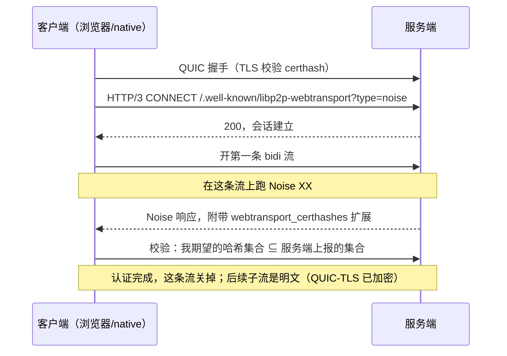
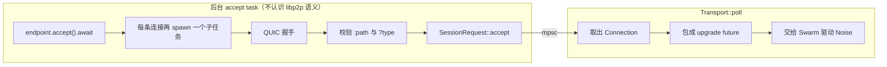

# 01 · libp2p 的 WebTransport，和上游缺的那一半

> libp2p 怎么把「浏览器能连自签名服务器」这件事变成一个正经的 transport；
> 为什么 `rust-libp2p` 里只有浏览器那一半；以及我们补的那一半长什么样。

## 地址里为什么要塞哈希

libp2p 用 multiaddr 描述「怎么连到某个节点」。WebTransport 的形态是：

```
/ip4/47.115.172.218/udp/4004/quic-v1/webtransport/certhash/<h1>/certhash/<h2>/p2p/<PeerId>
```

逐段拆开：

| 段 | 作用 |
|---|---|
| `/ip4/…/udp/4004` | 拨到哪 |
| `/quic-v1` | 底座是 QUIC |
| `/webtransport` | QUIC 之上跑 WebTransport 会话 |
| `/certhash/<h1>/certhash/<h2>` | **当前**与**下一张**证书的 SHA-256，用来代替 CA |
| `/p2p/<PeerId>` | 对方的 libp2p 身份 |

`/certhash/` 段就是 [00 篇](00-what-is-webtransport.md) 里那个 `serverCertificateHashes`：
拨号方从地址里读出哈希，交给浏览器（或 native 的 TLS 校验器），于是不需要 CA。

**为什么是两个哈希？** 因为证书 14 天就会过期。服务端同时持有「当前这张」和「下一张」，
两个都通告出去，客户端手里那条地址才有可能撑过一次轮换。这条推导是
[02 篇](02-certificate-rotation.md) 的全部内容。

## certhash 证明不了身份

这是最容易漏掉的一层。`certhash` 只能证明：

> 「我连上的这台机器，持有哈希为 `h1` 的那张证书的私钥。」

它**证明不了**：

> 「这张证书属于 PeerId `12D3KooW…`。」

证书是自签名的，谁都能生成一张，然后把自己的哈希写进一条冒充别人的地址。所以 libp2p 规定：
**WebTransport 会话建立之后，必须再跑一次 Noise 握手来认证 PeerId。**

流程是这样的：



三处细节值得单独记：

**① endpoint 路径是写死的。** `/.well-known/libp2p-webtransport`，查询参数 `type=noise`。
服务端收到别的路径要拒。这是 spec 的硬要求，不是约定俗成。

**② 第一条流就是 Noise 流，客户端不必等 CONNECT 的响应。** 省一个 RTT。

**③ Noise 只认证，不加密。** 握手拿到 PeerId 之后那条流就关了，后面的子流走明文——
保密由 QUIC-TLS 承担。多套一层就是白白多一遍对称加密。

### 与 webrtc-direct 的机制互斥

本仓同时有 `webrtc-p2p`，两个 crate 长得很像（都是自签名证书 + 哈希进地址 + 之后跑 Noise），
但**认证的绑定方式完全不同**：

| | webrtc-direct | WebTransport |
|---|---|---|
| 把信道绑进 Noise 的方式 | **prologue** = `libp2p-webrtc-noise:` + 双方 DTLS 指纹 | **`webtransport_certhashes` 扩展** |
| 有没有 prologue | 有 | **没有** |

它们是同一目的的两种机制。照抄隔壁 crate 的 prologue 逻辑，握手会在第一条消息就失败——
而症状看起来像「Noise 实现有 bug」，极难归因。这条写在 `noise` 模块的文档里，
就是为了不让下一个人再踩。

### 「子集」这条判据的后果

客户端的校验是：**我从地址里读到的哈希集合，必须是服务端上报集合的子集。**

这看起来是个技术细节，实际上决定了服务端必须保留已退役的证书哈希：

```
客户端持第 0 天的地址，期望集合 {A, B}
服务端已轮换一轮，current = B、next = C
  TLS 层：出示 B，而 B ∈ {A, B}          → 通过 ✅
  Noise 层：上报 {B, C}，{A,B} ⊄ {B,C}   → 失败 ❌
```

**TLS 过了，Noise 仍会挂。** 服务端必须把刚退役的 A 一并上报，`{A,B} ⊆ {A,B,C}` 才成立。
spec 里那句「近期过期的证书哈希也建议带上」不是可选优化，是让上一轮地址真正可用的前提。

## 上游只有浏览器那一半

`rust-libp2p` 里有 `transports/webtransport-websys`——**浏览器侧的拨号器**，编译到 wasm。

没有 native listener。**浏览器能拨，没人能接。**

上游 [PR #4348](https://github.com/libp2p/rust-libp2p/pull/4348) 是维护者本人的 native draft
（三个 commit：transport + certhash 指纹 + 证书生成与过期），自 2023-10 起停在 draft 状态。
它卡在一件具体的事上：**想让 WebTransport 和 libp2p-quic 共用同一个 UDP socket，
而当时的 libp2p API 做不到。**

这个缺口就是 `crates/webtransport-p2p` 存在的理由。我们**不追求共用 socket**——
WebTransport 独占一个 UDP 端口，代价是多占一个端口号，换来的是这件事今天就能跑。

## 我们补的那一半

`crates/webtransport-p2p`，约 3800 行（含测试）。刻意**不带 `swarmdrop` 前缀、零 swarmdrop
依赖**，将来要 subtree split 出去独立发布——与 `webrtc-p2p` 同一个待遇。

### 分层：依赖严格单向

| 层 | 模块 | 依赖 `libp2p-core` | 依赖 `wtransport` | 做 IO |
|---|---|---|---|---|
| L0 纯逻辑 | `addr` | 仅 `Multiaddr` / `Multihash` 类型 | **否** | 否 |
| L0 纯逻辑 | `certificate` | 仅 `Multihash` | 是（借 `Identity` 当容器） | 否 |
| L1 libp2p 语义 | `noise` | 是 | **否**（泛型于流类型） | 是 |
| L1 libp2p 语义 | `muxer` | 是 | 是 | 是 |
| L2 wtransport 绑定 | `listener` / `dialer` / `transport` | 是 | 是 | 是 |

「依赖 wtransport」那一列不是清一色的否，这点要如实看。真正成立的是这条：
**换掉 `wtransport` 时，决定「行为」的那些部分一行都不用动**——轮换状态机、地址解析、
Noise 语义都不认识它。要改的是证书容器层与 L2 那三个文件。

`noise` 泛型于流类型也不只是洁癖：它让 Noise 握手能用内存双工流测，包括那条
**必须红过一次**的 certhash 负向用例。

### 为什么选 `wtransport` 0.7.1

三个候选逐条对照，只有一条是决定性的：

| 验证点 | `wtransport` | `web-transport-quinn` | `h3-webtransport` |
|---|---|---|---|
| 自签名 ECDSA + 取 DER 算 certhash | ✅ 内建 | ⚠️ 要自己接 `rcgen` | — |
| 固定 endpoint 路径 + 拒绝其他 | ✅ | ✅ | — |
| **轮换时不断既有连接** | ✅ `Endpoint::reload_config` | ❌ 无对应 API | — |
| 最近发布 | 2026-04 | 2026-08 | 2025-05 |

第三行是硬前提。库不支持热换证书，就得自己在 quinn 上重做一层 HTTP/3 + 会话管理。

代价如实记着：`wtransport` 不暴露底层 quinn `Connection`，**拿不到 RTT / 丢包 / 拥塞窗口**。
本仓刚做完一轮吞吐调研，这些数字将来可能有用——列为已知负债，由「wtransport 类型不出公共
API」这条设计兜底：真要换，换的是 L2 三个文件。

### 不做 `Backend` 抽象

`webrtc-p2p` 有一层 `Backend` trait，因为 native 的 webrtc-rs 和浏览器的
`RTCPeerConnection` 毫无共同点，必须抽象。

WebTransport 没有这个问题——**浏览器侧直接用上游的 `libp2p-webtransport-websys`**。
本 crate 整个是 native-only，wasm 双 target 门禁靠 `crates/net` 侧的 cfg 分派解决：

```toml
[target.'cfg(not(target_family = "wasm"))'.dependencies]
webtransport-p2p = { path = "../webtransport-p2p" }

[target.'cfg(wasm_browser)'.dependencies]
libp2p-webtransport-websys = { workspace = true }
```

为一个只有一个实现的抽象污染整层签名，是 YAGNI。

### 监听：两条边界



两条纪律：

- **后台 task 不碰任何 libp2p 语义**——它不认识 `PeerId`、不跑 Noise。于是它的失败模式只有
  一种（endpoint 挂了），生命周期与 listener 一一对应。
- **Noise 握手不在这个 task 里跑**，而是包进 `TransportEvent::Incoming` 的 upgrade future
  交给 Swarm。握手的驱动权因此在 Swarm 手里，我们的 task 只管收连接。

**为什么每条连接还要再 spawn 一次**：`IncomingSession.await` 是完整的 QUIC 握手，
`SessionRequest::accept().await` 还要一个 RTT。放在 accept 循环里直接 await，
**一个慢客户端（或故意不完成握手的攻击者）就能把整个监听端口堵死**。

但 spawn 也要有闸，而且**不能指望 mpsc 的容量**：

> ⚠️ `mpsc::channel(n)` 的真实容量是 `n + Sender 个数`——每 clone 一个 Sender 就多一个
> 保证槽位。accept 循环给每条连接 clone 一个 Sender 的话，每条都有自己的免排队槽位，
> 那个数字形同虚设。

这个文件的第一版就是这么写的。真正的上限改由一个信号量给（64 个在途握手），
外加每条握手的超时。

## 已知边界

- **不与 libp2p-quic 共用 UDP 端口。** 两者的 rustls 配置本就不同（QUIC 用 libp2p TLS 扩展
  证书，WebTransport 用普通自签名证书），而 `wtransport` 也不接受已绑定的 socket。
  这正是上游 PR #4348 卡住的地方。
- **不解决通告地址的稳定性。** 地址随证书轮换而变，因此**不适合独自承担「第一个联系点」
  的角色**——理由见 [03 篇](03-numbers-and-tradeoffs.md) 里「为什么 4003 不能下线」。
- **native-only。**

---

上一篇：[00 · WebTransport 到底是什么](00-what-is-webtransport.md)
下一篇：[02 · 重心不在传输层：证书轮换引入的时间维度](02-certificate-rotation.md)
