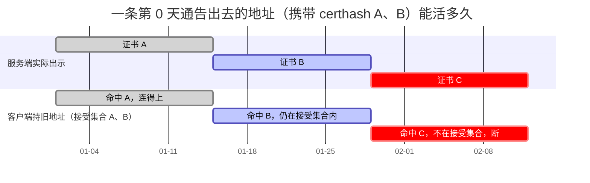
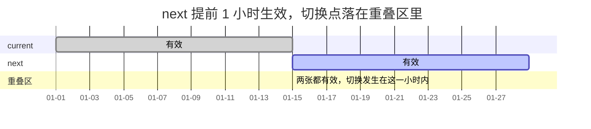
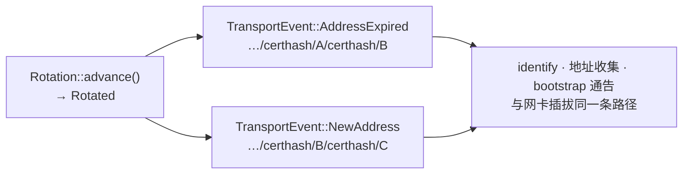

# 02 · 重心不在传输层：证书轮换引入的时间维度

> 传输层几乎是把 `wtransport` 的 async API 翻译成 libp2p 的 poll API，机械劳动。
> 真正有状态、有时钟、驱动外部可见行为的只有证书那一块——而它的复杂度全部来自
> [00 篇](00-what-is-webtransport.md) 里那一行「有效期 ≤ 14 天」。

## 先看这个 crate 的复杂度长在哪

把它和本仓另一个自研传输 `webrtc-p2p` 逐条摊开：

| 维度 | `webrtc-p2p` | `webtransport-p2p` |
|---|---|---|
| 模式数 | 2（打洞 + direct），打洞要状态机 + `NetworkBehaviour` | **1**——没有 NAT 穿透 |
| 建连协商 | SDP 构造、ICE、DTLS 角色、ufrag 学习 | **无**，QUIC 握手是库的事 |
| socket 复用 | 自写 1100 行 `UdpMux` | **无**，独占端口 |
| 子流 | DataChannel + 自做 framing + `init` 通道陷阱 | QUIC 流**本身就是流**，muxer 极薄 |
| 后端抽象 | 必须（native / wasm 两套栈） | 不需要 |
| 证书 | 一张，**永不改变** | **两张，会过期，14 天轮换，通告地址随之变化** |

**只有最后一行变复杂。** 而它引入了一个 `webrtc-p2p` 里完全不存在的维度：**时间**。

结论直接决定了模块划分：证书生命周期必须是一个**真子系统**，不能塞进 `transport.rs`
当成几个字段。全 crate 最复杂的一个文件因此是 `certificate/rotation.rs`。

## 为什么要同时持有两张证书

spec 要求通告地址携带两个 certhash。把时间轴画开就明白了：



**一条通告地址的实际寿命是两个轮换周期（28 天），不是一个。**

这条推论不只是文档里的一句话——它直接决定了上层「多久要刷新一次 bootstrap 清单」，
并且由一条叫 `advertised_addr_survives_one_rotation` 的测试钉死。

## 两张证书必须**重叠**，不能首尾相接

这是最容易写错、而且错了会周期性发作的地方。

轮换由 poll 里一个定时器驱动（当前 10 分钟一检查），所以「该换了」和「真的换了」之间
**必然有最长一个检查周期的滞后**。

如果判据写成「`current` 已经过期才换」：

```mermaid
gantt
    title 判据写成「已过期才换」时，每 14 天出现一次的空窗
    dateFormat HH:mm
    axisFormat %H:%M
    section current 证书
    仍然有效 :done, 00:00, 1m
    已过期，但还没轮换 :crit, 00:01, 10m
    section 新连接
    正常 :done, 00:00, 1m
    全部 TLS 失败，只报「证书不受信」 :crit, 00:01, 10m
    section 轮换检查
    下一次检查才发生在这里 :milestone, 00:11, 0m
```



浏览器和 native 的校验器都会直接判 `Expired`，而错误信息只说「证书不受信」。
**每 14 天来一次，持续最多 10 分钟。** 这种周期性、短暂、无明显归因的故障最难查。

解法是让 `next` **提前**生效，并在 `current` 过期**之前**就切过去：



重叠量取 1 小时——必须远大于检查间隔（10 分钟），又远小于 14 天（否则白白缩短有效覆盖）。

## 退役的哈希必须留着，而且必须持久化

[01 篇](01-libp2p-webtransport.md) 里那条「子集」判据的直接后果：服务端 Noise 上报的集合里，
必须包含刚退役的那些哈希，否则持上一轮地址的客户端会**过了 TLS、挂在 Noise**。

于是 `Rotation` 里有一个 `retired` 队列，保留最近 2 张。为什么存整张证书而不是只存哈希？
因为它得跟着 PEM 一起落盘——多段 PEM 格式里没有「裸哈希」这种段。

**而落盘这件事本身也是一条不变量**：

> 退役证书只活在内存里的话，**一次重启就把「旧地址能撑过一整轮」这条契约打掉**。
> TLS 仍会通过（服务端出示的 current 在客户端接受集合内），Noise 却会失败。

这种 bug 的形状是：重启之后，一部分老客户端连不上，另一部分（拿到新地址的）没事，
而日志里 TLS 层一切正常。

## 时钟从参数进来，不从系统读

`Rotation` 是**纯逻辑**：不持有时钟、不做 IO、不认识 libp2p 的 `Transport`。
所有需要「现在几点」的方法都把 `now: SystemTime` 当参数收。

**这不是审美选择，是验收标准可测性的硬约束。**

`current` 的有效期是 14 天。如果这个模块内部读 `SystemTime::now()`，那么「跨过期切换」
这条行为只能靠三种方式验证：等 14 天、改系统时钟、或者干脆不测。而这个项目要求
**护栏测试必须能红**——手测做不到这件事。

时钟注入把它变成一次调用：

```rust
let mut r = Rotation::bootstrap(t0)?;
assert_eq!(r.advance(t0 + days(15))?, Advance::Rotated { .. });
```

代价是调用方必须记得推进它。这由 `Transport::poll` 每轮顺带完成。

### `advance` 的三条路径

| `current` 在 `now` 有效？ | `next` 在 `now` 有效？ | 结果 |
|---|---|---|
| 是 | — | `Idle` |
| 否 | 是 | `next` 提升为 `current`，生成新 `next` |
| 否 | 否 | **整体重建** |

第三行覆盖两种真实情况：**设备关机超过 28 天**，以及**系统时钟被拨到证书生效之前**。

判据统一写成「`current` 在 `now` **有效**吗」，而不是「过期了吗」——时钟倒退因此自动落进
重建分支，不必单独判一次。这类「把两种异常收敛成同一条判据」的写法，比逐个 if 更不容易漏。

整体重建而不是链式推进，是因为关机 28 天以上时链式推进要生成任意多张中间证书，
而它们**没有任何一个对端见过**，白白浪费。

## 轮换怎么告诉外面

**不发明任何新机制。** `libp2p_core::TransportEvent` 里本来就有 `AddressExpired` 和
`NewAddress`——轮换要说的正是这件事：



上层（identify、地址收集、bootstrap 通告）走的是与**网卡插拔完全相同**的路径，
不需要为「证书」这件事写任何特殊分支。

这里有一个隐蔽的坑，写在 `Advance::Rotated` 的文档里：

> `retired` 那个字段**仅供日志**，它**不是** `AddressExpired` 的事实源。
> 那个必须用 listener 记下的**实际发出去的那一份**地址——因为网卡列表可能在两次通告之间
> 变过，事后由 certhash 重算会算出一条**从未通告过**的地址。

撤销一条从未通告过的地址，上层的地址集合就会漏掉一条真该撤的。

## 定时器由 poll 驱动，但不是每次 poll 都读时钟

决策是**不起后台定时任务**——多一个 task 就多一处生命周期与泄漏风险，而 `webrtc-p2p` 那轮
的教训正是「别把 transport 驱动和别的东西绑在额外的 task 上」。

但也不能退化成「每次 poll 都 `SystemTime::now()`」：poll 在空闲连接上每秒可达上千次，
而轮换周期是 14 天。

中间隔一个 10 分钟的 `Delay`，**由 poll 自己驱动，不是 task**。它顺带解决了纯「顺带检查」
方案的短板：`Delay` 会注册 waker，因此**完全空闲时也保证被唤醒**，不必指望恰好有别的事情
触发一次 poll。

## 持久化：格式、原子性、以及不许降级

存的是**多段 PEM**——证书段与私钥段按同一顺序各自罗列，**没有任何自定义元数据**。
有效期本来就编码在 X.509 里，再存一份就是第二事实源。

还原时按 `not_before` 升序确定谁是 `current`：写入顺序万一被外部工具打乱，凭有效期仍能
恢复出正确的角色。

三条落地纪律：

**① 还原不完整必须立刻回写。** `from_pem` 返回一个 `bool` 表示「是否完整还原」。为 `false`
时说明内容不足、有东西是现生成的，调用方必须马上写回去。否则那份不完整的数据会**自我延续**：
每次启动都补生成一张不同的 `next`，通告地址的第二个 certhash 每次都变，
而上一轮通告出去的地址会在 Noise 阶段失败。

**② 写盘必须原子，而且顺序有讲究。**


- **同目录**：跨文件系统的 rename 会 `EXDEV` 失败。
- **`sync_all` 在替换之前**：rename 的原子性只覆盖**元数据**，ext4/xfs 上完全可能出现
  「替换生效了、数据块还没落盘」，崩溃后目标是零长度或垃圾。
- **父目录也要 fsync**：否则 rename 这条目录项本身可能没落盘，崩溃后目标路径退回**上一轮**
  的证书对——而那时 `current` 可能已接近过期，表现为一段时间谁都拨不进来。
- 权限（unix `0600`）、随机名、`O_EXCL`、异常路径清残留交给 `tempfile`。自己搓最容易漏的是
  最后一条：**提前返回时留下的临时文件里是私钥。**

**③ 读失败不许降级成「还没有证书」。**

```rust
Err(e) if e.kind() == NotFound => Ok(None),   // 首启的正常路径
Err(e) => Err(...),                            // 其他一律报错
```

把读失败吞成 `Ok(None)`，内核会随即生成一对新证书**并覆盖原文件**——**一次瞬时 IO 故障
（权限、坏块）就永久换掉了 certhash**，而用户只看到「浏览器突然连不上这台设备了」。

这条和本仓身份文件的纪律是同一条（见 `CLAUDE.md` 里桌面身份那段），
两处各有一条护栏测试看守。

## 这个端口为什么不挂在 `KeychainProvider` 上

宿主侧的持久化走一个 `CertificateStore` 端口，桌面写 `app_local_data_dir/`、
移动端写 `data_dir/`，同名 `webtransport-cert.pem`；浏览器传 `None`，只拨号不监听。

本仓已经有一个管密钥的端口 `KeychainProvider`，**刻意没有复用它**：那个 trait 的方法都是
「读一次就完」的形状，而这份证书要 14 天轮换并**回写**。顺带也就不必动 uniffi 的跨 FFI 契约。

**启用判据是「宿主给没给证书端口」，不是「是不是原生端」**——这让同一份 `crates/net` 代码
在三端走同一条路径，没有 `cfg(target_os)` 分叉。

---

上一篇：[01 · libp2p 的 WebTransport，和上游缺的那一半](01-libp2p-webtransport.md)
下一篇：[03 · 数字与取舍](03-numbers-and-tradeoffs.md)
