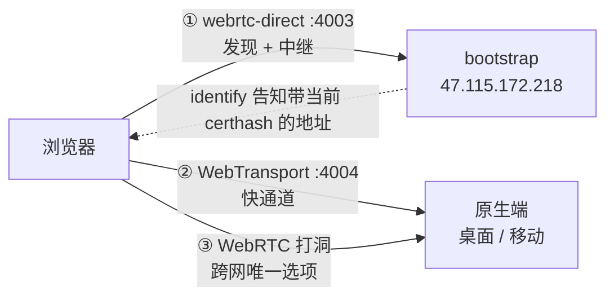

# 03 · 数字与取舍

> 回环 4.5 倍、真机 20 MB/s、以及一个即使有了这些数字也**不能下线**的旧入口。
> 这篇把所有实测数字和它们的边界一次说清，包括三处「没查清」。

## 回环：同机、同应用层、只换 transport

64 MiB，**6 次取中位数**：

| transport | 中位数 | 区间 |
|---|---|---|
| TCP + Noise + yamux | 933 MiB/s | 927–1149 |
| **WebTransport** | **322 MiB/s** | 286–326（±7%） |
| QUIC | 266 MiB/s | 248–276 |
| WebRTC-direct | 72 MiB/s | 43.7–288（**6.6 倍**） |

两条结论各自独立：

1. **吞吐是 webrtc-direct 的 4.5 倍。**
2. **方差小一个数量级。** 对「传这个大文件还要多久」这种用户能感觉到的东西，
   第二条可能比第一条更重要——一个稳定的 300 MiB/s 比一个在 44 和 288 之间跳的
   「平均值差不多」体验好得多。

⚠️ **WebTransport 比裸 QUIC 还快 21%，这一点没查清。** 理论上它是 QUIC + HTTP/3 一层，
不该更快。可能是 quinn 配置差异，也可能是 libp2p-quic 的 stream 包装层开销。
**别把它当已知结论引用。**

⚠️ 回环的瓶颈是 CPU，局域网的瓶颈是 Wi-Fi 带宽与协议栈开销。**这个 4.5 倍不能外推到真机。**

## 真机：局域网，Android ↔ 桌面 Chrome

单文件 2 GB，走 WebTransport：

| 方向 | 吞吐 |
|---|---|
| 手机 → 浏览器 | **~20 MB/s**（≈160 Mbps） |
| 浏览器 → 手机 | **~9 MB/s** |

20 那个数落进了 native↔native QUIC 的区间（12–23 MB/s）。这句话的分量在于：

> **浏览器在接收方向上已经不是瓶颈了。**

这是回环那个「4.5 倍」外推不出来的结论，也是这次真机测试真正的收获。

### 这个倍数不要拿去除

拿 20 MB/s 除以本仓 WebRTC 的 0.36 MB/s 会得到「快 56 倍」——**那个数是错的**。
分母来自一个**不同的构建**：0.36–0.96 MB/s 是在移动端 release profile 还用
`opt-level = "z"` 时测的，而 WebRTC 的 DTLS 走 RustCrypto 的纯 Rust AES-GCM，
`-Oz` 关掉内联后它慢一个数量级（那正是把 profile 改回 `opt-level = 3` 的理由）。
改完之后 WebRTC 那条**没有重新在真机上测过**。

**能说的**：WebTransport 在这条链路上跑到了 20 MB/s，与原生 QUIC 同一量级。
**不能说的**：具体几倍。要那个数就得做干净的 A/B——同一构建、同一台手机、同一个局域网、
只切 transport。

### 20 vs 9 的方向不对称

浏览器**作为接收方**比**作为发送方**快 2.2 倍，而且用户独立确认这个差异是**能感觉到**的。

归因不是传输层：**接收端的数据面早已流水线化（收帧 ‖ 消化两条并发路径），
而发送端一直是 `读 → 算 → 写` 的串行链。** 串行本身两端都有，但代价只在浏览器那侧显形——
Android 的「读+算」是原生文件读加 NEON blake3，相对网络几乎免费；浏览器的是
`File.slice().array_buffer()` 的 promise 往返加没有 SIMD 的 wasm blake3，
而且这段时间**完全不与网络写重叠**。

发送端已于 2026-08-12 补上（备块 ‖ 发帧 + 有界队列 + `join`），详见
[`transfer-throughput/05`](../transfer-throughput/05-the-other-half.md)。

⚠️ **收益的天花板是 blake3。** `join` 给的是并发不是并行，而 wasm 是单线程——
生成 bao proof 是主线程上的同步 CPU，谁也压不住。**实际提升多少至今没量。**

## 为什么 webrtc-direct 不能下线

有了上面这些数字，「把 4003 端口关掉、只留 WebTransport」看起来很诱人。**不行**，
而且理由与吞吐完全无关：

**① 在 bootstrap 上，webrtc-direct 是发现路径。**
浏览器**不写死** WebTransport 地址——它先用 webrtc-direct 连上 bootstrap，
经 identify 学到那条**带当前 certhash** 的地址。这天然绕开了
[02 篇](02-certificate-rotation.md)的核心问题：证书 14 天一换，写进客户端清单的地址会过期。
砍掉 4003，就得把一条会过期的地址硬编码进客户端。

**② 打洞只有 WebRTC 有。** WebTransport 至今没有对应的 NAT 穿越机制。两者覆盖的路径不同，
而这次只测了局域网——**跨网那一格还是空的**。

所以现在的形态是两条浏览器入口并存，各司其职：

## 端口与启用判据

| 端 | WebTransport 端口 | 判据 |
|---|---|---|
| bootstrap | **4004**（固定） | 部署配置 |
| 桌面 | 系统分配 | 宿主给了证书存储端口 |
| 移动 | 系统分配 | 同上 |
| 浏览器 | — | 传 `None`，只拨号不监听 |

**判据是「宿主给没给证书端口」，不是「是不是原生端」。** 这让 `crates/net` 三端走同一条
代码路径，没有 `cfg(target_os)` 分叉；将来若有第四种宿主，接一个 `CertificateStore` 就行。

## 代价清单

诚实地列一遍这次引入的负债：

| 代价 | 现状 |
|---|---|
| 多占一个 UDP 端口 | 不与 libp2p-quic 共用 socket，理由见 [01 篇](01-libp2p-webtransport.md) |
| 通告地址 28 天就会失效 | 因此**不能独自当第一联系点**，必须有 ① 那条发现路径 |
| 拿不到 RTT / 丢包 / 拥塞窗口 | `wtransport` 不暴露底层 quinn `Connection`；真要用得换 L2 三个文件 |
| 多一份需要原子写的私钥文件 | 与身份文件同一套纪律（原子写 + `0600` + 读失败不降级） |
| 新增约 3800 行需要自己维护的传输代码 | 零 swarmdrop 依赖，将来 subtree split |

## 还没做的

按价值排序，写在这里而不是藏着：

1. **跨网实测**——局域网的 20 MB/s 说明不了中转/打洞路径，而那正是「打洞只有 WebRTC 有」
   这条限制真正起作用的地方。
2. **同构建的 WebTransport vs WebRTC A/B**——有了它才能写下倍数。
3. **iOS + Safari；Firefox（Gecko）**——至今未测。本仓只实测过 Chrome 的完整链路，
   Safari / Edge 只验到准入层。
4. **发送方向流水线化后的实际收益**——探针已经拆成两条打在浏览器 console 上，读一次就有。

---

上一篇：[02 · 重心不在传输层](02-certificate-rotation.md) ·
回到 [README](README.md)
