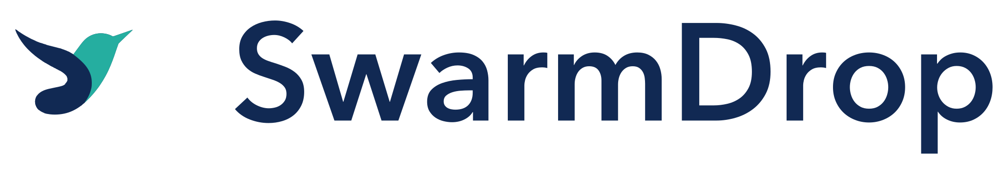

# SwarmDrop 品牌 / Logo 使用规范

> 版本 v1.0 · 2026-07-01

## 1. 品牌理念

- **使命/定位**：SwarmDrop 是去中心化、跨网络的端到端加密文件传输工具——"跨网络版 LocalSend"。无账号、无服务器，基于 libp2p 的点对点网络，支持局域网与跨网络场景下的直连传输。同时面向 AI 时代场景：作为设备与设备之间的数据通道（人与 AI agent 均可使用），本地 MCP server 让 AI agent 能够发送文件、检索收件箱。
- **目标受众**：注重隐私的技术用户、开发者/极客群体、需要跨设备跨网络传输文件的用户、构建 AI agent 工作流的开发者
- **品牌人格（3-5 个形容词）**：去中心化、极客、克制、可信赖、直接高效
- **语调 Voice & Tone**：技术直白，不过度营销化；用词精准，不夸大宣传

## 2. Logo 总览

| 全彩版 | Lockup 版 |
|---|---|
|  |  |

- **类型**：图标部分是 **Pictorial Mark**（象形标），完整版本是 **Combination Mark**（图标+wordmark），参见 `design-principles-guide.md` 第一章
- **构成说明**：图标由品牌名首字母 **S** 和 **D** 的笔画重塑而来，而不是另起炉灶画一只独立的鸟——D 的竖直笔画削尖成鸟喙、半圆弧线构成头部与背线（青绿色）；S 的两段弧线拉伸成身体与后掠的翅膀（深靛蓝色）。振翅前倾的姿态同时传达"多个点对点节点协同"（swarm）与"数据正在传输中"（drop）两层含义。图标经过多轮 AI 生成迭代 + 人工评审筛选 + 矢量化清理产出，详细过程见 `references/ai-generation-guide.md`。

未使用正式的几何网格系统起草这版设计（是 AI 发散 + 人工收敛评审选出的方向，而非从网格反推），因此本文档不包含"构造网格"一节——如实说明这一点，而不是事后包装一套网格来显得"更科学"（参见 `design-principles-guide.md` 2.4 节的提醒）。

## 3. 安全间距 Clear Space

- **单位 X 的定义**：图标的整体高度
- **四周最小留白**：≥ **0.5X**（默认起点，来自行业惯例，非绝对标准）

## 4. 最小使用尺寸

| 场景 | 最小尺寸 |
|---|---|
| 印刷 · 完整 Logo | ≥ 20–25mm（经验默认值，尚未实际打样验证） |
| 印刷 · 仅图标 | ≥ 6–10mm（经验默认值，尚未实际打样验证） |
| 数字 · 完整 Logo | ≥ 60–80px |
| 数字 · 仅图标 / favicon | ≥ 16px（**已用 `scripts/size_preview.py` 实测**，16px 下轮廓依然清晰可辨——这版图标因为是实心正形剪影、没有细笔画/小镂空，小尺寸表现明显优于本次调研中尝试过的负空间/字母镂空等技法） |

低于最小尺寸时，切换到第 7 节的简化图标版，不要无限缩小主版本。

## 5. 色彩规范

| 层级 | 名称 | CMYK（近似值） | RGB | Hex |
|---|---|---|---|---|
| 主色 1 | Deep Indigo Navy 深靛蓝 | 80, 51, 0, 67 | 17, 41, 83 | `#112953` |
| 主色 2 | Warm Teal 暖青绿 | 79, 0, 8, 32 | 37, 174, 160 | `#25AEA0` |

> CMYK 数值是从 RGB 按标准公式近似换算得出，**未经过专业印刷打样和 ICC 色彩配置文件校准**，仅供参考；Pantone 专色编号需要用实体色卡比对确定，本文档暂未提供，正式印刷前请勿凭空编号。

- **明背景适配**：0–20% 深度背景使用全彩版或纯黑版（`swarmdrop-logo-bird-black.svg`）
- **暗背景适配**：60–100% 深度背景必须使用反白版（`swarmdrop-logo-bird-white.svg`）
- **禁止事项**：不擅自调整以上色值；不叠加渐变/阴影/发光等未授权效果；两色仅按图中分布使用，不互换、不新增第三色

## 6. 字体规范

- **Logo 专用字体/处理**：wordmark "SwarmDrop" 基于 **Avenir Next Demi Bold** 字重，已转曲为矢量路径交付（`swarmdrop-lockup-*.svg` 内文字部分是路径而非可编辑文本），不依赖该字体是否安装在使用者设备上
- **字距**：未额外调整 tracking，使用字体默认字符间距
- **字体授权**：Avenir Next 是 macOS 系统自带字体；由于 wordmark 已转曲交付，后续使用本 SVG 不产生字体授权问题。若未来需要"活文本"形式使用品牌名（例如网页 `<h1>` 直接打字而非用图），需单独确认该字体的 Web 授权范围，或换用开源替代字体

## 7. 版本变体

| 版本 | 触发场景 | 文件 |
|---|---|---|
| 完整 Lockup 版 | 官网首屏、README、海报 | `swarmdrop-lockup-color.svg` |
| 简化图标版 | App 图标、社交头像、水印 | `swarmdrop-logo-bird-color.svg` |
| Favicon 套件 | 16/32/48/180/192/512px | `favicon/icon-*.png` |
| 纯黑版 | 单色印刷、浅色背景 | `swarmdrop-logo-bird-black.svg` / `swarmdrop-lockup-black.svg` |
| 纯白反白版 | 深色背景 | `swarmdrop-logo-bird-white.svg` / `swarmdrop-lockup-white.svg` |

验收标准：去掉文字后，仅凭图标版是否仍能认出品牌？——本版图标已实测通过（`design-principles-guide.md` 7.4 节的验收标准）。

## 8. 错误示范 Misuse / Don't

> 沿用 `design-principles-guide.md` 第六章的通用禁止行为清单，未做项目专属增减。

- [ ] 禁止拉伸/压缩变形
- [ ] 禁止旋转/倾斜
- [ ] 禁止改变图标与文字之间的相对比例、位置或排列顺序
- [ ] 禁止添加阴影、描边、渐变、3D、发光等特效
- [ ] 禁止改变官方配色，或对图标两个色块做非官方配色/渐变填色
- [ ] 禁止在低对比度或视觉杂乱的背景上使用
- [ ] 禁止破坏安全间距、与其他图形/文字拥挤放置
- [ ] 禁止拆解、重组图标内部的鸟形构成元素

## 9. 实际应用场景

- 桌面应用图标（macOS/Windows/Linux，用 `favicon/icon-*.png` 系列派生）
- GitHub 仓库 README 头图、Release 页面
- 文档站点（Astro + Starlight）导航栏 / favicon
- SwarmHive 更新服务器的应用展示图标

## 10. 治理与联系方式

- **商标/版权声明**：图标初稿由 AI（GPT-image）生成，经过多轮人工评审筛选、方向迭代精修、专业矢量化清理与色彩规范化——按 `references/ai-generation-guide.md` 5.4 节的建议，这属于"对 AI 输出做实质性人工编辑"，有助于后续主张版权保护；但**正式商用/申请商标注册前，仍建议做商标近似检索**（视觉/读音/概念三维度），本文档不构成法律结论。
- **使用授权范围**：SwarmDrop 项目官方物料使用
- **素材下载**：本仓库 `dev-notes/design/brand/` 目录
- **联系方式 / 审批流程**：项目维护者 yexiyue
