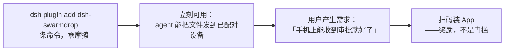
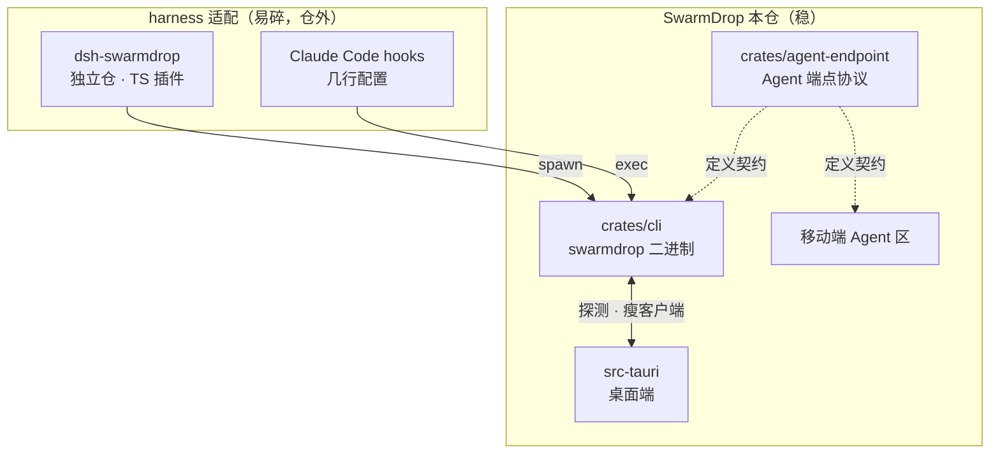
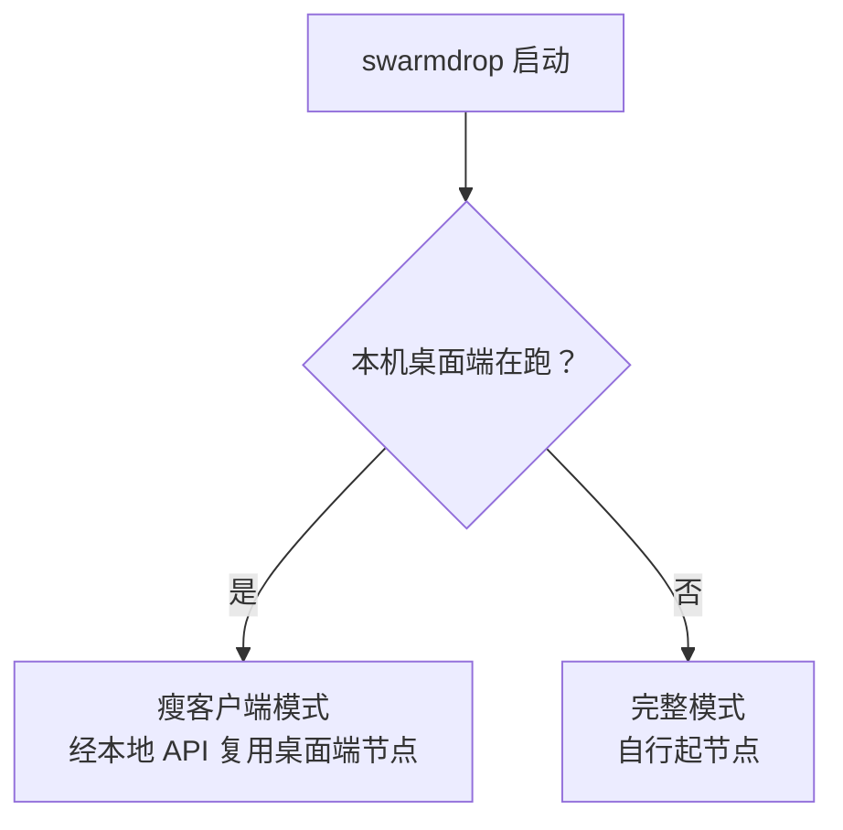

# 功能企划：Agent 端点（Agent Endpoint）

> **状态**：企划待评审（2026-08-18，同日修订一次）。决定做 M0；后续以真实信号为准。
>
> **一句话**：让一个 AI agent 成为 SwarmDrop 网络里**一个可配对的对端**——它能主动找到你、
> 你能回它一句、产出的文件直接落到你手上，全程不需要公网 IP、不需要任何第三方账号。
>
> ⚠️ **同日修订**：新增 **§5.4「CLI 优先」** 并据此重排里程碑。`swarmdrop` CLI 从
> 「M1 的可选实现方案之一」提为**独立的 M1**，Agent 端点降为它的一个子命令
> （`swarmdrop agent`）。理由是 CLI 同时解决了本企划的最大风险（安装漏斗）、
> 兑现了一份既有规划、并且**自身的分发潜力可能高于 dsh 插件一个数量级**。
>
> 事实底座见 [`2026-08-18-deepseek-harness-integration.md`](2026-08-18-deepseek-harness-integration.md)
> （dsh 生态与架构调研）。本文只讲**为什么做、做什么、怎么做**。

---

## 1. 问题陈述

### 1.1 真实处境

| | |
|---|---|
| SwarmDrop | **18 ★ / 5 fork / 1 watcher**，建仓 2026-01-30，7 个月 |
| 已交付 | 12 个 crate、自研 libp2p 传输栈、三端已发布、5 个 webrtc-rs 上游补丁 |
| `dsh-pocket`（往 dsh 塞了段反代） | **121 ★**，建仓 2026-08-15，**3 天** |

**瓶颈不是技术，是分发。**「Web 端没人气」不是 Web 端的问题，是整个项目没有被任何场景带到人面前。

### 1.2 为什么文件传输带不来人

文件传输是**「推」的场景**：用户已经有 AirDrop / 微信 / 网盘，不会主动去搜一个新工具。
你必须先让他知道你存在，他才可能试——而「让人知道」正是最贵的一步。

而「**我在跑 agent，它卡在一个审批上，我人不在电脑前**」是**「拉」的场景**：用户会主动
去 Google、去翻插件列表。dsh 的 awesome 列表专门开了 **Remote & Mobile 分类、26 家在抢**，
就是这个需求真实存在的硬证据。

**这是 SwarmDrop 第一次有机会站在一个有人主动来找的场景里。**

### 1.3 为什么是现在

DeepSeek Harness（dsh）2026-08-13 开源，5 天 15.6 万 star，官方明确「万物皆插件」。
它同时**把远程访问自己封死了**（`packages/client/connection/README.md` 原文）：

> `dsh web --host 0.0.0.0` is **intentionally unsupported until remote access has an
> authentication layer**. … the Web carrier provides no authentication layer.

官方缺的那块叫 **authentication layer**。SwarmDrop 手里的不是「再加一个 token」，
是 **Ed25519 设备身份 + 一次性签名邀请配对 + 传输层强制校验 peer** —— 密码学设备认证。

---

## 2. 产品定义

**Agent 端点**：一个正在运行的 AI agent（harness）注册成 SwarmDrop 网络里的一个对端。
它出现在你的设备列表里，跟你的 iPad、笔记本并列——**只不过它会主动找你说话**。

三个方向的能力：

| 方向 | 内容 |
|---|---|
| agent → 人 | 审批请求、向人提问、任务完成通知、**产出文件直接投递到手上** |
| 人 → agent | 审批决定、问题答案、一段指令、**手机上的照片**、任意文件 |
| agent → 设备 | agent 主动把文件发到你的某台设备（现有 MCP 能力已覆盖） |

### 2.1 一个具体画面

> 你在家开着 dsh 跑长任务，出门了。
> 路上手机响：**「agent 想执行 `rm -rf node_modules && pnpm install`，允许吗？」** 点「允许」。
> 二十分钟后又响：**「跑完了，产出 3 个文件」** —— 直接在手机上收下来。
> 回程路上拍了张白板照片发过去：**「按这个改一下布局」**。
>
> 全程**没有打开任何 dsh 界面，也没有暴露任何端口**。

### 2.2 三种形态，同一条通道

| 形态 | 谁在用 | 状态 |
|---|---|---|
| 桌面 / 移动 / Web App | 人 | 已发布 |
| **`swarmdrop` CLI** | **开发者 + 任何能执行命令的 harness** | **本企划新增（M1）** |
| Agent 端点 | AI agent | 本企划新增（M2），是 CLI 的一个子命令 |

### 2.3 它**不是**什么

- **不是**「远程访问 dsh Web UI」。那是 26 家在抢的红海，本企划**明确不做**（见 §6 M3）。
- **不是**一个独立产品。它是 SwarmDrop 已有能力（配对 / 传输 / 收件箱 / 三端 App）
  接到一个新场景上，**边际成本低**是它的核心优势。
- **不是**只服务 dsh。抽象是「Agent 端点协议」，dsh 是第一个实现；
  dsh 仓里有 `hooks-claude-code` 与 `hooks-codex`，说明 hook 语义跨 harness 通用。

---

## 3. 市场调研

### 3.1 dsh 生态：真实规模 vs 表面数字

`topic:dsh-plugin` 共 **7,131 个仓库**。但排名靠前的**全是存量项目蹭 tag**：

| 仓库 | ★ | 建仓 | 真相 |
|---|---|---|---|
| nexu-io/open-design | 88,676 | **2026-04-28** | 4 个月前的老项目 |
| amruthpillai/reactive-resume | 40,940 | **2020-03-25** | 简历生成器，与 dsh 无关 |
| esengine/DeepSeek-Reasonix | 34,746 | 2026-04-21 | 老项目 |
| volcengine/OpenViking | 28,997 | 2026-01-05 | 老项目 |
| awesome-dsh-plugin | 8,254 | 2026-08-13 | **真实**，5 天涨起来 |
| **shaobeichen/dsh-pocket** | **121** | **2026-08-15** | **新生插件的真实天花板** |

> **结论：一个从零做的 dsh 插件，现实天花板是一百多 star。不要按 15 万星去估收益。**
>
> 但 `awesome-dsh-plugin` 5 天 8 千星说明**人们确实在主动找插件**——需求侧是真的。

### 3.2 竞品：26 家，路线高度同质

awesome 列表 **Remote & Mobile 分类已有 26 条**，抽样：

| 插件 | ★ | 路线 | 前提条件 |
|---|---|---|---|
| shaobeichen/dsh-pocket | 121 | 局域网 + 公网 + 扫码 | 公网可达 |
| flymysql/dsh-remote | 22 | SSH | 可达的 SSH |
| liguobao/deepseek-harness-remote | 17 | **Noise IK + "WebRTC-ready"** | —（**路线最接近**） |
| JUANWANG-BUAA/dsh-full-remote | 15 | token 反代（破 fence 拿特权面） | 公网可达 |
| Blank-not-black/dsh-Remote | 9 | LAN / Tailscale + `/fs/*` 传输 | Tailscale 账号 |
| godchen520/dsh-web-remote | 4 | Cloudflare Quick Tunnel | CF 账号 |
| 其余 ~20 家 | 0–5 | `0.0.0.0` + token / frp / 反代 / 移动端 CSS | 公网 VPS 或第三方账号 |

**三条判读**：

1. **全部要么依赖公网可达，要么依赖第三方账号**（Cloudflare / Tailscale / VPS / SSH）。
   SwarmDrop 不需要——这不是「做得更好」，是**前提不同**。
2. 唯一路线接近的 `liguobao/deepseek-harness-remote` 在**从零手写 Noise 握手**，
   WebRTC 尚未落地，17 star。SwarmDrop 是把跑了一年的传输栈接上去。
3. **26 家做的全是「人 → 机器」（我去连它）。「机器 → 人」（它来找我）无人做。**
   相关搜索：`topic:dsh-plugin+p2p` 仅 2 个仓库（其一 0 star）；
   file-transfer 类 5 个，全是 S3 / FTP / SSH。
   零星的推送插件**清一色单向**——往微信/QQ 推一条文本，**回不来，更收不到文件**。

### 3.3 官方留下的两个缺口

| 缺口 | 官方原文出处 |
|---|---|
| **远程用户拿不到 agent 产出的文件** | `ui-deliverables`：「Show in folder」only while the page is loopback；「direct remote Web and headless/container Linux Hosts **omit the action by default**」 |
| **附件只收图片，泛型文件是 deferred work** | `attachment`：只接受 PNG / JPEG / WebP / GIF；「Generic files, audio, video … require separate lifecycle and provider contracts」 |

第一条正是 SwarmDrop 的本行。第二条意味着**手机拍照恰好落在 dsh 唯一支持的入站附件类型上**。

---

## 4. 收益分析

### 4.1 分级说明（**不要合并看**）

| 层级 | 内容 | 现实预期 |
|---|---|---|
| **主要收益** | **从「推」转向「拉」**——第一次进入用户会主动搜索的场景 | 定性，无法量化，但是本企划唯一真正的理由 |
| **次要收益** | 叙事升级：脱离「文件传输工具」类目 | 「跨网版 LocalSend」永远是「那个像 LocalSend 的」 |
| **量化收益** | star / 装机 | **几十到一两百 star**。对 18 star 的项目是 10 倍，但绝对值不大 |
| **用户质量** | 带场景来的真实用户 | 比路人 star 值钱得多；现有 18 star 里可能零真实用户 |
| **非收益** | 钱 | 项目无商业模式，不要用收入衡量 |

### 4.2 为什么「10 倍但绝对值不大」仍然值得

从 18 到 150 的意义不在数字，在于**把项目从「没有人」变成「有一些人在真实使用」**。
一个有真实用户的项目才会有 issue、有反馈、有第二个贡献者——而这些是 18 star 状态下
永远不会自己发生的。

### 4.3 被低估的杠杆之一：CLI 这个品类

| 项目 | ★ | 建仓 | 形态 |
|---|---|---|---|
| **schollz/croc** | **39,874** | 2017-10 | CLI 传文件（Go，口令 + 公共中继） |
| **magic-wormhole** | **22,824** | 2015-02 | CLI 传文件（Python，PAKE 口令 + 中继） |
| n0-computer/sendme | 1,153 | 2023-12 | CLI 传文件（iroh，每次生成 ticket） |
| 新生 dsh 插件天花板 | ~120 | — | 插件 |
| **SwarmDrop** | **18** | 2026-01 | 桌面 + 移动 + Web，**唯独没有 CLI** |

**「命令行传文件」这个品类的天花板比 dsh 插件高两个数量级。** 而 SwarmDrop 把三个 GUI 端
都做了，偏偏缺了开发者最容易接受、分发摩擦最低的那个形态。

**与 croc / wormhole 的差异（不是「做得更好」，是不同的东西）**：

| | croc / magic-wormhole / sendme | SwarmDrop CLI |
|---|---|---|
| 模型 | **陌生人之间传一次**（ad-hoc 口令 / ticket） | **自己的设备之间常态传**（持久配对） |
| 每次操作 | 念一串口令 / 传一个 ticket | `swarmdrop send f.zip --to phone` |
| 有没有「设备」概念 | 无 | **有**——这是 agent 端点能存在的前提 |
| 类比 | 网盘临时链接 | AirDrop |

最后一行是关键：**croc 做不了 agent 端点，因为它没有持久设备身份**。SwarmDrop 有。

### 4.4 被低估的杠杆之二：内容

`dev-notes/blogs/` 里躺着 webrtc 上游补丁复盘、传输吞吐真机实测、WebTransport 证书轮换
设计——**这些是别人写不出来的硬货，目前零曝光**。

> 「我给 AI agent 造了一条不需要公网 IP 的私有通道」这个技术故事，配上已有的实测数据和
> 上游 PR 记录，**传播力大概率超过插件本身**。
>
> **M0 的交付物里，那篇文章的权重不低于代码。**

---

## 5. 可行性分析

### 5.1 技术可行性：高

每一处需要的扩展点都是 dsh **官方文档化**的：

| 需要什么 | dsh 提供什么 | 稳定性 |
|---|---|---|
| agent 问人要审批 | `ctx.approval` 的 **answerer waterfall**；「UI channels may provide human answerers」，ACP bridge 已有机器 answerer 先例 | 高（文档化 seam） |
| agent 向人提问 | `UserQuestionProvider`，provider-neutral 词汇表，**前向兼容内建**（不认识的 intent 降级成通用列表） | 高 |
| 把照片送进上下文 | `ctx.attachments.saveImages()` → `agent.inject()` | 高 |
| 注册模型可调工具 | `ctx.tools.register()` | 高 |
| 在 Web UI 加界面 | `ctx.slots.register()` + client 半边（lazy CJS 模块表，支持 HMR） | **中**（类型面大） |
| 换掉整条传输层 | 替换 `ctx.connection` carrier | **低**（内部包，`apply()` 里硬编码选择） |

SwarmDrop 侧的三条既有资产直接可用：

- **MCP server 已是 streamable-http**（`src-tauri/src/mcp/server.rs`，默认端口 **19527**），
  dsh 的 `mcp-client` 原生支持该 transport → **M0 零代码**。
- **`crates/bootstrap` 已是独立 binary**（`[[bin]] name = "swarm-bootstrap"`）
  → 边车二进制方案**有现成模板**，不需要新发明分发方式。
- **`InboxItemContent` 是 tagged enum** → 收件箱内容类型可扩展（代价见 §7.3）。

### 5.2 分发可行性：原本是最大风险，**CLI 把它解掉了**

| | 竞品 | SwarmDrop（无 CLI） | **SwarmDrop（有 CLI）** |
|---|---|---|---|
| 安装 | `dsh plugin add xxx` | 装桌面端 → 装手机 App → 配对 | **`dsh plugin add dsh-swarmdrop`** |

`dist` 能产出 **npm installer**（§7.7），于是 dsh 插件用 `optionalDependencies`
按平台拉二进制——**esbuild 模式，用户零感知**。装 App 只在用户想要「手机上收审批」时才发生。

这条差别大到足以改变企划的重心，是 §5.4 把 CLI 提为 M1 的首要理由。

漏斗仍应按「先零摩擦、后扫码」设计：



**第一步必须零摩擦**（这也是 M0 必须先于 M1 的原因）。参照 WhatsApp Web / Telegram：
扫码发生在用户已经想要它之后。

### 5.3 维护可行性：靠分仓隔离

dsh 是 developer preview，**明确声明会有破坏性变更**（5 天大的项目）。
应对方式是**把易碎的一半推到仓外**（§7.1）：上游改了 slot API，改一个独立仓；
本仓的配对、传输、收件箱**一行不动**。

### 5.4 为什么 CLI 应该提为 M1（**本次修订的核心判断**）

五条理由，任意两条都不足以支撑，五条叠加则成立：

1. **它解掉了本企划的最大风险**（§5.2）。没有 CLI，Agent 端点的安装漏斗是
   「装桌面端 + 装 App + 配对」；有了 CLI，是一条 `dsh plugin add`。
2. **它自身的分发潜力高于 dsh 插件一到两个数量级**（§4.3）。croc 39.8k★ / wormhole 22.8k★，
   而新生 dsh 插件天花板 ~120★。**CLI 不依赖 dsh 是否长期存在。**
3. **它是接入其他 harness 的唯一稳定底座**（§7.8）。dsh / Claude Code / Codex 的扩展机制
   各不相同，唯一的公约数是「能执行一条命令」。Claude Code 的接入因此可以是**零代码**。
4. **它兑现了一份既有规划**。`dev-notes/architecture/future-openspec-candidates.md` §5
   `mcp-cross-host`：「让 MCP server 不再绑死在桌面端，能在 RN 端或独立 CLI 上以 sidecar
   形式运行」。本企划不是新方向，是把它接上了一个具体场景。
5. **它会逼出真正干净的 host 端口分层**。`src-tauri/src/host/` 现在的实现是桌面专用的；
   CLI 需要一套 headless 实现。**两者能共享多少，就是分层质量的客观度量**——
   共享得多说明端口设计对，共享不了就暴露了耦合。这个副产品的价值独立于本企划成败。

**反面**：CLI 是 ~2 周的实打实工作量（新建 crate + 五个 host adapter + 命令面 + 分发流水线），
不是「顺便」。它必须以自身价值成立，**不能靠 Agent 端点来论证**——所以 §6 把它列为
独立里程碑，有独立的验收标准。

---

## 6. 功能清单与里程碑

> **修订说明**：CLI 从「M1 的实现方案之一」提为独立 M1（理由见 §5.4），
> 原 M1 遥控器层顺延为 M2，并因 CLI 的存在**不再依赖桌面端**。

### M0 —— 信号验证（**1–2 天，零 Rust 改动**）

| # | 交付物 | 说明 |
|---|---|---|
| M0-1 | `dsh-swarmdrop` bundle 包 | 一个 `dsh.bundle` 包，patch 里插一行 `mcp-client` 指向 `127.0.0.1:19527`。`dsh plugin add` 即可用 |
| M0-2 | 英文 README + 中文文档站页面 | 对着 dsh 用户写：「让你的 agent 把文件直接发到你手机」 |
| M0-3 | 提交 `awesome-dsh-plugin` 收录 | 收录门槛是「装得上 + 描述属实」，M0 满足 |
| M0-4 | **一篇技术文章** | 见 §4.4。权重不低于代码 |

M0 复用现有 20 个 MCP tool（`send_files` / `list_paired_devices` / `list_inbox` …），
**依赖用户已装桌面端**——这是 M0 作为一次性探针可以接受、而长期不可接受的妥协，M1 解掉它。

**验收**：`npx @deepseek-ai/dsh web` + `dsh plugin add` 后，在 dsh 里说
「把这个文件发到我手机」能成功。

### M1 —— `swarmdrop` CLI（**~2 周；独立价值，不由 Agent 端点论证**）

| # | 交付物 | 落点 |
|---|---|---|
| M1-1 | 新 crate `crates/cli`，binary 名 `swarmdrop` | 与 `crates/bootstrap`（`swarm-bootstrap`）同为 workspace 内的独立 bin |
| M1-2 | headless host adapter | `identity_store`（文件实现，**可与桌面端共享**）/ `device_config`（JSON）/ `file_source` / `file_sink` / `notifier`（headless = 结构化日志） |
| M1-3 | 命令面 | `pair` / `devices` / `send` / `recv` / `inbox` / `status` |
| M1-4 | **双模式**（§7.6） | 检测到桌面端在跑 → 自动降为瘦客户端；否则自行起节点 |
| M1-5 | `dist` 分发流水线 | shell / powershell / homebrew / **npm** 五种 installer（§7.7） |
| M1-6 | 第三条版本线 `cli-v*` | 与 `v*`（桌面）、`mobile-v*`（移动）并列；CLAUDE.md 版本管理节需同步 |

**独立验收**（不涉及任何 harness）：一台没装过 SwarmDrop 的机器，
`brew install` 或 `npx` 之后，`swarmdrop pair` → `swarmdrop send f.zip --to phone` 成功。

### M2 —— Agent 端点（**~2 周，M0 有信号才启动**）

| # | 交付物 | 落点 |
|---|---|---|
| M2-1 | **Agent 端点协议**（DTO + 状态机） | 新 crate `crates/agent-endpoint`（平台中立、wasm-clean，体例参照 `crates/invite`） |
| M2-2 | `swarmdrop agent` 子命令 | 常驻端点模式 + 本地 API（§7.4）。**桌面端同时暴露同一组路由**，两条路都通 |
| M2-3 | 待办的持久化与领域规则 | 见 §7.3 的两个方案，需定稿 |
| M2-4 | 移动端「Agent」区 | 待办列表 + 审批卡 + 提问卡 + 回复；与现有收件箱同一心智 |
| M2-5 | 逐设备授权位 | `allow_agent_control`，**默认关**，镜像 `allow_mcp_send_to_device` 体例 |
| M2-6 | dsh 插件 Node 半边 | 独立仓；**spawn CLI**（npm optionalDependencies），注册 approval answerer + `UserQuestionProvider` + 完成时投递 deliverables |
| M2-7 | Android 实时通知 | 复用既有前台服务（`with-android-foreground-service`）+ 本地通知 |

**明确不做**：iOS 实时推送（见 §7.10）。

### M3 —— 多 harness 与 Web UI 集成

| # | 交付物 | 说明 |
|---|---|---|
| M3-1 | **Claude Code 适配** | hooks 里调 `swarmdrop agent ...`，**零代码，只是配置**（§7.8） |
| M3-2 | Codex 适配 | 同上体例 |
| M3-3 | dsh 设置卡 | cookbook `adding-a-settings-card.md` |
| M3-4 | deliverables 行加「发到手机」 | `conversation.chat.turnTail` hole |
| M3-5 | 「从手机收到 N 个文件」→ 一键插入对话 | composer 附近（`dsh-file-upload` 等已有先例） |
| M3-6 | 手机 → agent 的照片/文件入口 | 图片走 `ctx.attachments`；其他文件落 workspace 后 `inject` 一句 |
| M3-7 | 原生 tools 取代 MCP 转发 | `ctx.tools.register()`，去掉 `mcp__swarmdrop__` 前缀与一跳 HTTP |

> **明确不做**：dsh 里的完整文件管理面板。要管传输就打开 SwarmDrop App，
> dsh 里只保留「此刻这个上下文需要的那个动作」。

### M4 —— 完整台面层（**建议不做**）

替换 `ctx.connection` carrier，让手机/浏览器加载**从对端拉来的** dsh 前端 dist
（App 变成「P2P 专用浏览器」，UI 零维护、白嫖上游全部 UI 插件）。

**为什么建议不做**：① 26 家在抢的正是这一层；② 依赖 dsh 内部包，最易碎；
③ 手机上看完整 IDE 界面本来就不好用。它真正的价值场景是「借来的电脑上用 Web 端」——
等 dsh API 稳定、且 M2 被验证有人用之后再议。

---

## 7. 技术调研与架构

### 7.1 仓库边界



**边界落在协议与二进制上**：本仓出协议和 `swarmdrop` 可执行文件，
仓外的 harness 适配层只负责「用它自己的方式调这条命令」。
换 harness 不换底座；某个 harness 凉了，删掉一个适配层，本仓一行不动。

独立仓的理由：dsh 插件是 TS 项目、走 npm 发布、要进 awesome 列表、README 得用英文写；
塞进本仓这个 Rust workspace 只会污染发版流程。

### 7.2 协议草案

```
AgentEndpoint { id, device_id, harness, label, workspace? }
  —— 一台设备可有多个端点（多 workspace / 多 harness）

AgentTask（agent → 人）           # tagged enum，调用方穷尽匹配
  id, endpoint_id, created_at, expires_at?
  ├ Approval  { tool_name, reason?, call_id? }
  ├ Question  { items: [{ id, question, detail?, options?, multi_select? }] }
  └ Completed { summary, deliverables: [FileRef] }

AgentReply（人 → agent）
  task_id
  ├ Approval  { outcome: allowed_once | rejected }
  └ Question  { answers: [{ id, selected: [String] }] }

AgentInput（人 → agent，主动发起，不属于 task/reply 对）
  endpoint_id
  ├ Text   { body }
  ├ Images { refs }   → ctx.attachments.saveImages() → agent.inject()
  └ Files  { refs }   → 落 workspace 后 inject 一句「文件在 ./xxx」
```

**四条不变量**（实现时不能破）：

1. **待办必须能进终态**。dsh 的 `ApprovalRequest` 带 `AbortSignal`，撤回即 `cancelled`；
   插件必须把撤回推过来，否则待办**永久挂在收件箱**且用户点了会失败。
2. **回复一次性**。一个 task 只接受一次回复，重复回复是明确错误而非静默覆盖。
3. **手机不在线不得阻塞 agent**。answerer waterfall 的语义是「能答就答，答不了 `next()`」——
   手机离线时必须让位给本地 UI；`ApprovalOutcome::unavailable` 本身 fail-closed，不会误开闸。
4. **端点控制权默认关**，逐设备开启。一条 P2P 通道后面挂着能执行 shell 的 agent，
   授权粒度不能与「传个文件」共用。

### 7.3 收件箱扩展的成本

`InboxItemContent` 是 `#[serde(tag = "kind")]` 的 tagged enum，注释明写
「调用方必须穷尽处理」。加一个 `AgentTask` 变体会波及：
三端 UI 的穷尽匹配点 + `storage-sql` + `crates/web` 的 IndexedDB 实现
（**换记录格式要提 `DB_VERSION` 并改 `STORES` 的格式版本**，否则旧行会「成功」反序列化）。

替代方案：**待办不进收件箱表，走独立领域模型，仅在 UI 层并入同一个视图**。
待办有 TTL、要回复、会撤回——与「已收到的文件」语义差别足够大，倾向独立建模。
**此处需在 M1 设计阶段定稿。**

### 7.4 本地 API 的方向问题（桌面端与 CLI 同一组路由）

现有 MCP server 的方向是 **agent → 设备**（`send_files` 那批，模型主动调）。
遥控器需要的是 **dsh Host → 手机 → 回一个决定**，是相反方向，且**不经过模型**。

因此不复用 MCP，在同一个 axum server 上加一组路由：

| 路由 | 语义 |
|---|---|
| `POST /agent-endpoint/register` | 插件启动时注册端点，返回 endpoint_id |
| `POST /agent-endpoint/ask` | 推一条待办并**阻塞等回复**（带 timeout）——正好匹配 answerer 的调用形状 |
| `POST /agent-endpoint/deliver` | 投递产出文件到指定设备 |
| `GET  /agent-endpoint/inbound` | 拉取/订阅手机主动发来的输入（SSE） |

### 7.5 Node 侧节点：**已由 CLI 定案**

原先列的三条路（转发到桌面端 / 边车二进制 / napi-rs）现在合并为一条：
**dsh 插件 spawn `swarmdrop` CLI**。npm `optionalDependencies` 按平台拉二进制（esbuild 模式），
`dist` 直接产出 npm installer（§7.7）。

napi-rs 方案**明确否决**：它等于在 wasm / uniffi / native 之外再开第四套宿主端口实现，
维护面 +1，而换来的只是「少一个子进程」。子进程边界反而是好事——CLI 崩了不会拖垮 dsh。

### 7.6 CLI 双模式：不与桌面端抢身份

CLI 与桌面端**默认共享同一份身份与配对表**（`app_local_data_dir` 下的 `identity.json` +
`paired-devices.json`），`--data-dir` 可隔离。

但两个进程同时以**同一个 `NodeId`** 上线会冲突：DHT presence 互相覆盖、relay reservation
重复、配对表并发写。因此 CLI 启动时探测本机桌面端：



于是「起自己的节点」和「转发到桌面端」不是二选一，而是**同一个二进制的两种模式**——
装了桌面端的用户零冲突，纯 CLI 用户功能完整。

⚠️ **单实例保护不能只靠探测**：两个 CLI 进程同时启动同样会撞。需要 data-dir 上的
文件锁，语义与探测结果一致（拿不到锁 = 已有实例 = 转瘦客户端）。

### 7.7 分发：`dist`（原 cargo-dist）

**维护状态已核实**（2026-08-18）：`axodotdev/cargo-dist` 未归档，2,099★，
**当天仍有 push**；最新 release `v0.32.0`（2026-05-22）。工具已更名为 `dist`。

支持的 installer：**shell / powershell / npm / homebrew / msi**，并**自己生成 CI 脚本**。
`npm` 那条正是对接 dsh 插件的关键。

**三个必须提前处理的坑**：

1. **与既有 `release.yml` 冲突**。本仓已有 Tauri 的 `.github/workflows/release.yml`
   （四目标 + SwarmHive），而 `dist init` 默认生成同名文件。**必须先改名或指定输出**，
   否则会覆盖桌面发版流水线。
2. **第三条版本线**。本仓已有 `v*`（桌面，真源 `tauri.conf.json`）与 `mobile-v*`
   （移动，真源 `mobile/app.json`）。CLI 需要 `cli-v*`（真源 `crates/cli/Cargo.toml`）。
   dist 支持 monorepo 的 `<package>-v<version>` tag 格式。
   **CLAUDE.md 的「Version management」小节要同步**，否则又是一次文档漂移。
3. **分发渠道与桌面端不同**。桌面 / 移动走自托管 SwarmHive；CLI 应走 **GitHub Release**
   —— 开发者预期从那里装，且 dist 的 host/announce 就是围绕它设计的。两条线不要强行统一。

### 7.8 多 harness 接入模型：CLI 是公约数

各 harness 的扩展机制互不相同，唯一的公约数是**「能执行一条命令」**：

| harness | 接入方式 | 要写什么 |
|---|---|---|
| **dsh** | 插件（Node 半边 + Client 半边） | 独立仓 TS 包，spawn CLI |
| **Claude Code** | **hooks**（Notification / PreToolUse / Stop）+ MCP | **几行 `settings.json`**，调 `swarmdrop agent ...`——**零代码** |
| **Codex** | 同类 hook 机制（dsh 仓有 `hooks-codex` 佐证协议可对齐） | 同上 |

> **推论**：接入成本最低的其实是 Claude Code（配置几行）而非 dsh（要写 TS 插件）。
> 若 M2 的开发遇阻，**先出 Claude Code 适配拿信号**是更省的路径——但 dsh 的流量更大，
> 两者不冲突，都建立在同一个 CLI 上。

这正是「做成 Agent 端点而不是 dsh 集成」这个抽象的兑现：**换 harness 不换底座**。

### 7.9 副产品：host 端口分层会被逼出来

`src-tauri/src/host/` 现在的六个 adapter 是桌面专用的。CLI 要一套 headless 实现，
其中 `identity_store`（文件 + 原子写 + 读失败不降级）与 `device_config`（JSON 文件）
**逻辑上与桌面端完全一致**，理应共享而非复制。

**能共享多少，就是端口设计质量的客观度量**——共享得多说明分层对，共享不了就暴露了耦合。
这个收益独立于本企划的成败。

### 7.10 已知技术限制

1. **照片能否进上下文取决于模型**。dsh 原文：图片成为 durable image block
   「only when `ctx.attachments` is mounted **and the exact calling model route explicitly
   declares image input**」。纯文本模型下静默失效——**UI 必须说清楚**，不能让用户发了照片
   以为 agent 看见了。
2. **iOS 收不到后台推送**。`mobile/app.json` 的 `UIBackgroundModes` 为空，且无
   expo-notifications / firebase / notifee 依赖。Android 有前台服务可实时；
   **iOS 只能做「打开即见」**。
   补齐需要 APNs + 一台 push server，与「无账号无服务器」叙事有张力
   （可用「空信封」缓解：push 只送「你有待办」，内容仍走 P2P 拉取）。
   **M1 明确不承诺 iOS 实时**，卖点相应下调为「**你的 agent 在手机上有个收件箱**」——
   这个说法反而与 SwarmDrop 本行贴得更紧。
3. **dsh 会 breaking**。M2 的 Client 半边耦合最深，靠独立仓隔离。

---

## 8. 风险与检验点

| 风险 | 等级 | 应对 |
|---|---|---|
| ~~安装漏斗~~ | ~~高~~ → **中** | **CLI 解掉了主要部分**（§5.2）：dsh 侧变成一条 `plugin add`。剩余部分是「手机收审批仍需装 App」——按「先零摩擦、后扫码」设计 |
| **M1 是 2 周纯基建，期间无对外信号** | **中高** | 故 M1 设了**独立于 Agent 端点的验收标准**（§6）：CLI 自身能 pair/send 即算达成，可单独发布获取反馈 |
| 主线被拖住（Web 端收敛、三端真机传输） | **高** | M0 上限 2 天；M1 需信号才启动 |
| dsh 破坏性变更 | 中 | 易碎部分全在独立仓 |
| 生态泡沫（大数字全是蹭 tag） | 中 | 收益按「一百多 star」估，不按 15 万估 |
| 赛道已有 26 家 | 中 | 不进「人→机器」那一层；只做无人做的「机器→人」 |
| iOS 实时缺失削弱卖点 | 中 | 卖点定为「收件箱」而非「随叫随到」 |
| 安全面扩大（通道后面是能跑 shell 的 agent） | **高** | 逐设备授权、默认关；远程不给配置面 |

### 可证伪的检验点

> **M0 发布后两周**，若同时满足以下三条中的**零条**，则**停止本方向**，不进 M1：
>
> 1. 有人实际安装并反馈（issue / discussion / star 来源可追溯到 dsh 生态）
> 2. 有人问「手机能不能收 / 能不能远程审批」
> 3. 那篇技术文章产生可观测传播

**不要顺着架构美感一路做到 M1。**

---

## 9. 待定稿清单

### 进 M1（CLI）前必须回答

1. **CLI 与桌面端共享身份的默认值**——默认共享（`app_local_data_dir`）还是默认隔离？
   倾向共享 + `--data-dir` 逃生口，但要先确认单实例锁的语义（§7.6）。
2. **`dist init` 的 workflow 落点**——如何避免覆盖既有 `release.yml`（§7.7 坑 1）。
3. **CLI 的 crate 名与 bin 名**——bin 必须是 `swarmdrop`；crate 名建议 `swarmdrop-cli`
   以便 dist 的 `<package>-v<version>` tag 成立。
4. **headless adapter 与桌面端共享到什么程度**（§7.9）——共享代码提到哪个 crate。

### 进 M2（Agent 端点）前必须回答

5. 待办**进不进**收件箱表（§7.3 两个方案）
6. 一台设备多个 agent 端点在 UI 上如何区分（多 workspace / 多 harness）
7. 配对复用现有 PairInvite（倾向复用）+ 新增一位 `allow_agent_control` 的具体语义
8. M2 是否包含「手机主动发指令」——它与「被动响应审批/提问」是不同的交互面

### 产品层面

9. 对外一句话是否正式从「跨网版 LocalSend」改为「设备间私有通道」。
   ⚠️ **注意**：`dev-notes/ai-era-product-directions.md`（2026-06-27）开篇已经写着
   「把 SwarmDrop 从『跨网络文件传输工具』推进为『人、AI agent、应用之间的可信数据通道』」
   ——**定位不是要改，是一份两个月前的规划终于要兑现**。要改的只是对外文案
   （README / 文档站 / 应用商店描述）。

## 附：与既有文档的关系

| 文档 | 关系 |
|---|---|
| [`ai-era-product-directions.md`](../ai-era-product-directions.md)（2026-06-27） | **上位规划**。本企划是它「AI agent 通道」那条线的具体形态。差异：那份里 AI 是**调用方**（用 MCP 发文件），本企划新增**反方向**（agent 主动找人 + 人回复） |
| [`architecture/future-openspec-candidates.md`](../architecture/future-openspec-candidates.md) §5 `mcp-cross-host` | **被本企划的 M1 兑现**：「让 MCP server 不再绑死在桌面端，能在独立 CLI 上以 sidecar 形式运行」 |
| [`2026-08-18-deepseek-harness-integration.md`](2026-08-18-deepseek-harness-integration.md) | **事实底座**：dsh 生态数据、架构、竞品、官方缺口的一手材料 |
| [`incubation/agent-sandbox/`](../incubation/agent-sandbox/README.md) | 无重叠。那是已否决的**独立项目**构想（给 agent 加内核级约束），本企划是 SwarmDrop 的功能 |
