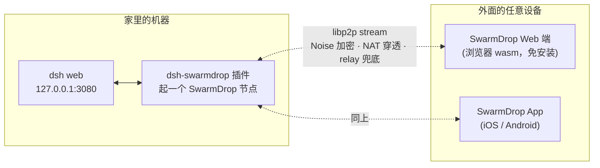
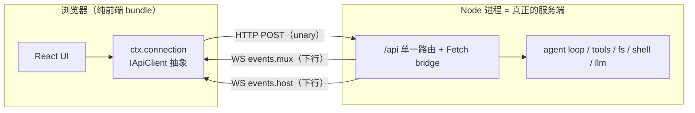

# 接入 DeepSeek Harness（dsh）生态评估

> **状态**：调研完成，**方向待决策**；对外定位已定为「设备间私有通道」（2026-08-18）。
> 本文只回答「能不能接、从哪接、值不值」，不含实现方案。
>
> ⚠️ **第 §2③ 的技术判断已于同日修正**：不做 HTTP 隧道，做第四种 carrier。见 §3.5。
>
> **一句话**：dsh 是 5 天涨到 15.6 万星的 agent harness，插件生态已有 7000+ 仓库、官方 awesome
> 列表已经开出「Remote & Mobile」分类。SwarmDrop 能接，而且**最锋利的切口不是文件传输，
> 是给 dsh 当「无账号 P2P 远程接入层」**——那正好是 SwarmDrop Web 端目前缺的「非它不可」的任务。

## 一、dsh 是什么（本次调研的事实底座）

| 事实 | 值 | 出处 |
|---|---|---|
| 仓库 | `deepseek-ai/deepseek-harness` | GitHub API，2026-08-18 拉取 |
| 创建时间 | **2026-08-13** | 5 天前 |
| Star / Fork | **156,717 / 16,275** | 同上 |
| 语言 / 许可 | TypeScript / MIT | 同上 |
| 状态 | developer preview，**明确声明会有破坏性变更** | README |
| 插件框架 | [Cordis](https://github.com/cordiverse/cordis)，「万物皆插件」 | docs/architecture.md |
| 运行形态 | `npx @deepseek-ai/dsh web` → 本地 Node 进程 + `127.0.0.1:3080` Web UI | README |
| 生态规模 | `topic:dsh-plugin` **7,131 个仓库** | GitHub search API |

架构上和本仓无冲突的三点：

1. **插件 = 一个导出 `apply(ctx)` 的 TS 模块**，用 `dsh.bundle` 声明成 npm 包，
   `dsh plugin add` 安装（也支持 `github:user/repo` 直装）。门槛极低。
2. **能力是「seam」**：`ctx.fs` / `ctx.shell` / `ctx.sandbox` / `ctx.tools` / `ctx.attachments`
   都是可换实现的接缝，官方自己用 e2b 做了远程 fs/subprocess 的第二实现（`packages/e2b/`）。
3. **已内置 MCP client**（`packages/mcp/mcp-client`），支持 `stdio` 与 **`streamable-http`**，
   工具以 `mcp__<server>__<tool>` 注册进 `ctx.tools`。

## 二、三个可接入点（成本从低到高）

### ① MCP 直连——**今天就能用，零代码**

SwarmDrop 桌面端的 MCP server 本来就是 **streamable-http**
（`src-tauri/src/mcp/server.rs`，rmcp `StreamableHttpService` + axum，监听 127.0.0.1），
而 dsh 的 mcp-client 正好吃这个 transport。用户在 `cordis.yml` 写：

```yaml
- id: mcp-swarmdrop
  name: '@deepseek-ai/dsh-mcp-client'
  config:
    serverName: swarmdrop
    transport: streamable-http
    url: http://127.0.0.1:8765/
```

dsh 里的 agent 立刻拿到 20 个工具（`send_files` / `list_paired_devices` / `list_inbox` / …）。
**这不需要写任何插件**，只需要一篇文档 + 一个 20 行的 bundle 包（把上面这段 yaml 打包成
`dsh plugin add dsh-swarmdrop` 一条命令）。

- 收益：`awesome-dsh-plugin` 收录门槛是「装得上 + 描述属实」，这条能立刻拿到收录。
- 代价：要求用户已装 SwarmDrop 桌面端——对 SwarmDrop 是**获客**，对 dsh 用户是门槛。
- 定位：**引流入口，不是护城河**。

### ② 交付物投递——补 dsh 一个已知的空缺

两处官方文档承认的缺口：

- `packages/attachment/attachment` 的 Known Limitations：**只收 PNG/JPEG/WebP/GIF**，
  「Generic files, audio, video … require separate lifecycle and provider contracts」。
- `packages/client/ui-deliverables`：agent 每轮产出的文件渲染成 chip 行，但
  「Show in folder」**只在页面是 loopback 时可用**，「direct remote Web and headless/container
  Linux Hosts omit the action by default」——**远程访问 dsh 的用户，拿不到 agent 产出的文件**。

SwarmDrop 正好在 `conversation.chat.turnTail` 这个挂载点上有话可说：每个 deliverable chip
旁边加一个「发到我的手机」。这是 dsh 生态里**没有第二家能做**的（现有 5 个 file-transfer 类
插件全是 S3 / FTP / SSH，没有设备间直投）。

### ③ P2P 远程接入层——**最锋利，也最重**

dsh 官方 HTTP carrier 的原话（`docs/subsystems/web-server.md`）：

> `host` accepts only `127.0.0.1` and `0.0.0.0` … **there is no TLS, auth, or origin policy**,
> so a non-loopback bind exposes the server to that network.

于是「怎么在手机上用家里那台 dsh」成了社区第一大自建需求。现状见下节——**26 个插件在抢，
但技术路线高度同质**。

设想的形态：



对 SwarmDrop 的战略意义：**Web 端第一次有了「非它不可」的任务**。
浏览器里免安装接入一张 P2P 网络，只有 wasm 版做得到——桌面端和手机 App 都替代不了它。
今天 Web 端的处境是「浏览器里传文件」，那件事有 Snapdrop / wormhole 一堆替代品；
「在任意一台电脑的浏览器里，安全地连回我家里的 agent」没有。

## 二·五、dsh 是标准 C/S，且传输层可换（**修正上一节 ③ 的技术判断**）

Web UI 只是前端 bundle，所有能力在 Node 侧。前后端之间**只有一个 `/api` 路由 + 两条纯下行
WebSocket**（`/api/events.mux`、`/api/events.host`）：一个 unary RPC 通道 + 两条单向事件流。



**carrier 已经有三种实现**（`packages/client/connection/README.md`）：

| carrier | 传输 | 用途 |
|---|---|---|
| browser | HTTP POST + 2 条下行 WS | `dsh web` |
| in-process | 同构的两流抽象（SSE codec） | headless / 测试 |
| **Electron** | **`file://` 加载 + IPC bridge，完全不用 HTTP server** | 桌面壳 |

`AbstractApiClient` / `IApiClient` 是公开导出的抽象（`@deepseek-ai/dsh-host-apiproxy/client`）。

> **因此 ③ 的正确形态是第四种 carrier，不是 HTTP 隧道。** 把「unary + 两条下行流」架在
> libp2p stream 上，正好命中本仓已有的 `RpcService` 抽象（`crates/transfer` 在用）。
> 原先设想的「Service Worker 拦 fetch」是绕路——**而且它根本拦不到 WebSocket**，
> 那条路本来就要靠 monkey-patch `window.WebSocket` 才能走通。

### 官方自己封死了远程访问，缺的正是「认证层」

`packages/client/connection/README.md` 原文两句：

> `dsh web --host 0.0.0.0` is **intentionally unsupported until remote access has an
> authentication layer**.
>
> The fence is a reachability policy, not authentication; **the Web carrier provides no
> authentication layer.**

且特权方法——`settings.*` / `credentials.*` / `host.openPath` / `host.pickDirectory` /
`agentPreset` 授权面——**只对 loopback 开放**，声明了 `trustedHosts` 也够不到
（"these stay loopback-local until a real authentication layer exists"）。

三条推论：

1. §3 里那 26 个远程插件**全在绕这道官方闸门**。`dsh-full-remote` 特意宣传
   "full server-side API access (`settings.*` / `credentials.*`)" —— 那是它在破 fence。
2. 官方缺的就是 **a real authentication layer**。SwarmDrop 拿得出的不是「再加一个 token」，
   是 **Ed25519 设备身份 + 一次性签名邀请配对 + 传输层强制校验 peer** —— 密码学设备认证。
3. carrier 形态下**根本没有开放端口**：没有可伪造的 `Host` 头、没有 DNS rebinding 面、
   没有端口扫描面。它是 Electron IPC carrier 的近亲，IPC 换成 P2P stream。
   对外一句话：**别人是「把 3080 暴露出去再加把锁」，SwarmDrop 是「根本不开门」。**

### 这条路线的三条硬限制

- **carrier 选择是 `apply()` 里硬编码的**（`fixture ? FixtureApiClient : WebApiClient`，
  见 `packages/client/connection/src/client/index.ts`），没有第三方注入点。要换得 patch 掉
  整行 `ctx.connection` 的 config row——dsh 支持这种做法（「没有特权 core」），但等于插件
  要跟一个 5 天大、明说会 breaking 的**内部包**对齐。
- **`isLoopback` 从 `location.hostname` 推**。P2P carrier 下页面从 SwarmDrop 域名加载，
  `isLoopback = false`，特权面自动被禁：远程用户**改不了 settings/credentials、开不了本地路径**；
  会话面、审批、提问、目标、传输进度都在。**这应当被当成特性而不是缺陷**——默认落在保守
  权限面上，对外讲「远程只给会话面，不给配置面」。要不要突破它是产品决策，不是技术决策。
- 上游随时可能改 `IApiClient` 的形状。

## 二·六、客户端形态：分两层，**遥控器层不需要做 UI**

「移动端接入 dsh 要不要再做一套端侧 UI」——不要。dsh 的交互 seam 是 **provider-neutral 的
数据结构**，不是界面：

```ts
ApprovalRequest      { toolName, reason?, callId? }                      // → 一张「允许/拒绝」卡
AskUserQuestionItem  { question, detail?, options?, multiSelect?, intent? } // → 一个选项列表
```

两者都是官方文档化的扩展点，**完全不碰 `ctx.connection`**：

- `ctx.approval` 是一条 **answerer waterfall**，原文「UI channels may provide human answerers」；
  ACP bridge 已经注册了一个机器 answerer 作先例（`docs/subsystems/approval.md`）。
- `user-questions` 是可提供的 `UserQuestionProvider`（`docs/subsystems/user-questions.md`）。
- 前向兼容是官方设计目标：「a UI that does not recognise a tag renders the generic option list」
  —— 上游加新 intent，旧客户端自动降级成通用列表。

| | **遥控器层** | **完整台面层** |
|---|---|---|
| 渲染什么 | 审批卡 / 提问卡 / 会话状态 / 产出文件 | 整个 dsh 界面 |
| 扩展点 | `ctx.approval` answerer + `UserQuestionProvider`（**官方 seam**） | 替换 `ctx.connection` carrier（**内部包**，见 §2.5） |
| 抗上游 breaking | 高 | 低 |
| RN 工作量 | 三四个卡片 | **零**（见下） |

### 完整台面层为什么是「零 UI 工作量」

**不要在 RN 里重画 dsh。把对端的前端 dist 经 P2P 拉过来，扔进 WebView。**
Electron 已经证明这条路成立（`file://` 加载 + IPC bridge，完全不用 HTTP server），
Host 侧本来就有 `packages/host/frontend-static` 在伺服 dist。

App 于是变成一个「**P2P 专用浏览器**」：

- UI 永远与用户自己那台 dsh 的版本一致，上游怎么改都不用跟（无版本漂移）
- dsh 生态里那批 Web UI 插件 / 主题 / 移动端 CSS 适配，全部白嫖
- **与 Web 端完全同构**——Web 端就是浏览器里做同一件事，一套 carrier 代码两端复用

> 推论：**Web 端不是另一个产品形态，是同一机制的免安装版本**，不需要单独的存在理由。
> 这回答了 §5「Web 端还剩什么」。

### 建议：先只做遥控器层

1. **抗风险**——只依赖官方 seam，不与 developer-preview 的内部包绑定。
2. **是真痛点**——长任务跑着而人不在电脑前；awesome 列表里已有人在做 agent-done 推送。
3. **叙事自洽**——「审批 + 收产出文件」在同一界面里，正是 SwarmDrop 的本行。
4. **手机断线不卡 agent**——waterfall 语义是「能答就答，答不了 `next()` 往下传」，
   手机不在线自然落回本地 Web UI；`unavailable` 本身 fail-closed，不会误开闸。

完整台面层等 dsh API 稳定再说；它真正的价值场景在「借来的电脑上用 Web 端」，不在手机。

## 三、赛道现状：拥挤，但路线同质

`awesome-dsh-plugin` 的 **Remote & Mobile 分类已有 26 条**。抽样：

| 插件 | ★ | 技术路线 | 需要什么 |
|---|---|---|---|
| shaobeichen/dsh-pocket | 117 | 局域网 + 公网 + 扫码 | 公网可达 |
| ningbainb/deepseek-harness-desktop | 104 | Windows 桌面壳 | — |
| flymysql/dsh-remote | 22 | SSH | 可达的 SSH |
| liguobao/deepseek-harness-remote | 17 | **Noise IK + "WebRTC-ready"** | — |
| JUANWANG-BUAA/dsh-full-remote | 15 | token 反代 | 公网可达 |
| Blank-not-black/dsh-Remote | 9 | LAN / Tailscale + `/fs/*` 传输 | Tailscale 账号 |
| godchen520/dsh-web-remote | 4 | Cloudflare Quick Tunnel | CF 账号 |
| 其余多数 | 0–5 | `0.0.0.0` + token / frp / 反代 / 移动端 CSS | 公网 VPS 或账号 |

**判读**：

- 绝大多数是「把 3080 端口用某种方式暴露出去 + 加个 token」。**都要么依赖公网可达，
  要么依赖第三方账号**（Cloudflare / Tailscale / VPS）。
- 唯一路线撞车的是 `liguobao/deepseek-harness-remote`（Noise IK + WebRTC-ready）——
  但它是**从零手写握手**，且 WebRTC 尚未落地，17 star。
- 天花板暂时是 117 star，说明这个赛道**尚未出现公认答案**。既是机会，也说明
  「远程访问插件」本身不自动等于爆款。

SwarmDrop 拿得出而别人拿不出的，是**已经在生产里跑了一年的那一整套**：
libp2p + DCUtR 打洞 + relay 兜底 + WebRTC/WebTransport 双浏览器入口 + Noise 传输加密 +
一次性签名邀请配对 + **三端已发布的原生客户端**。竞品是周末项目，本仓是把既有传输栈接上去。

## 四、三条路线的取舍

| | ① MCP 直连 | ② 交付物投递 | ③ P2P 远程接入 |
|---|---|---|---|
| 工作量 | ~1 天（文档 + bundle 壳） | ~1 周（TS 插件 + UI hole） | **数周**（见下） |
| 需要动 Rust | 否 | 否（走桌面端 MCP） | **是** |
| 需要用户装桌面端 | 是 | 是 | 取决于形态 |
| 差异化 | 低（谁都能封装 MCP） | **中高**（无第二家） | **高**（无第二家） |
| 对 Web 端人气 | 无帮助 | 无帮助 | **直接解决** |
| 竞争烈度 | — | 无人做 | 26 家在抢 |

**③ 的真实成本在哪**：dsh 插件是 Node 进程，SwarmDrop 的网络栈是 Rust。三种接法：

- **(a) spawn 一个 Rust 边车二进制**（复用 `crates/bootstrap` 那样的独立 binary 体例），
  插件用 stdio / 本地 socket 跟它说话，npm `optionalDependencies` 按平台分发（esbuild 模式）。
  **推荐**——不引入新的 FFI 层，跨平台分发有成熟先例。
- (b) napi-rs 绑定 `crates/net`，与 `crates/web`（wasm）、`mobile-core`（uniffi）对称。
  最"正"，但等于开第四个宿主端口实现，维护面 +1。
- (c) 不做 Node 侧节点，插件转发到本机已装的 SwarmDrop 桌面端。最省事，但把「装桌面端」
  变成硬前置，且桌面端要新开一条「远程控制 dsh」的授权面。

隧道本身：**已修正为「实现第四种 carrier」，见 §2.5**——不转发 HTTP，直接把
`IApiClient` 的 unary + 两条下行流架在 P2P stream 上。剩余未知数变成三条：
patch 掉 `ctx.connection` 整行是否稳、`isLoopback=false` 下的功能面够不够用、
上游 `IApiClient` 的变更频率。

## 五、诚实的风险清单

1. **dsh 明确声明会有破坏性变更**（developer preview，5 天大的项目）。
   越深的集成（③ 用到 hole / seam / Connection 协议）越容易被上游改断。
   ① 只依赖 MCP 协议，是三者里最抗变的。
2. **借流量 ≠ 解决留存**。接 dsh 能解决「Web 端没人来」，解决不了「来了之后为什么留下」。
   ③ 之所以值得，是因为它顺手给了 Web 端一个留存理由，不是因为它能带流量。
3. **赛道已有 26 家**，且先发者已在积累心智。进去必须一句话说清差异：
   「不要公网 IP、不要 VPS、不要 Cloudflare / Tailscale 账号，两端扫个码就行」。
4. **安全面扩大**。「远程控制 dsh」意味着一条 P2P 通道后面挂着一个能执行 shell 的 agent。
   必须是**逐设备显式授权**（镜像现有 `allow_mcp_send_to_device` / `allow_mcp_accept_from_device`
   的体例），且默认关。这条不能省。
5. Service Worker + P2P 隧道**未验证**，可能存在 iOS Safari 的 SW 生命周期坑。

## 六、待决策

- 先做 ①+② 的引流组合，还是直接压注 ③？
- ③ 走 (a) 边车二进制 / (b) napi / (c) 桌面端转发？
- ~~定位对外怎么说~~ → **已定（2026-08-18）：「设备间私有通道——文件、剪贴板、agent 都走它」**。
  与既有的 AI 时代定位一致。推论：dsh 不是集成目标，而是**通道的第一个非文件载荷**；
  因此内核应做通用（把本机某个 localhost 服务暴露给已配对设备），dsh 只是第一个 preset ——
  但**对外按场景讲**，因为「通用隧道」是 ngrok/frp 的红海且没人为它兴奋。

## 附：本次调研拉取的一手材料

- `README.md` / `docs/architecture.md` / `docs/user/develop/basic/{index,publish}.md`
- `docs/subsystems/web-server.md`（无 TLS/auth 的原话）
- `docs/api-gateway.md`（Typert Remote + Connection）
- `packages/mcp/mcp-client/README.md`（transport 支持面）
- `packages/attachment/attachment/README.md`（只收图片的限制）
- `packages/client/ui-deliverables/README.md`（远程 Host 禁用 Show in folder）
- `awesome-dsh-plugin` 的 Remote & Mobile 全量条目
