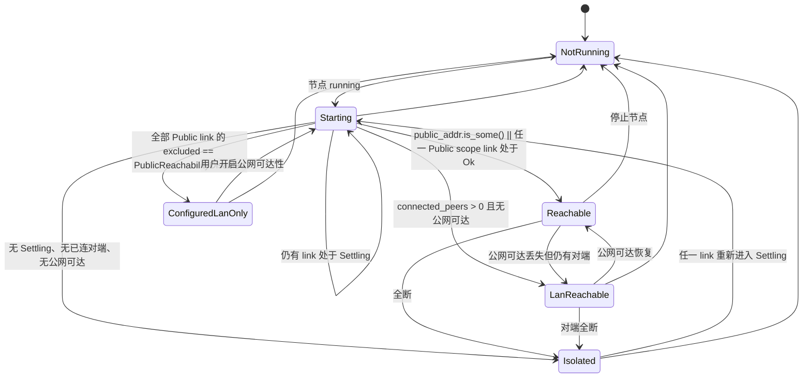

# 三端网络/引导节点状态统一 —— 架构调研与决策

> **决策状态：已落地。** 2026-08-08 提出并于同日实施完毕（openspec change
> `unify-infra-node-status`，99 项中 90 项完成；余下 4 项是需要真机/浏览器的手动验证、
> 1 项是刻意推迟的设计缺口，逐项状态见该 change 的 `tasks.md`）。
>
> **本篇是决策档案，不是现行架构描述。** 它记录的是「当时为什么这么选」，含 16 条被否决
> 方案的完整论证——那些论证不会随实现漂移，价值也正在这里。要查**现在是什么样**，去：
>
> | 想知道什么 | 去哪 |
> |---|---|
> | 三端 UI 必须一致的部分 | `DESIGN.md` 的 `### Node Status Contract (cross-platform)` |
> | `InfraLink` 读模型、`watch_relays` 订阅、`supported_transports` 与提交前校验 | `dev-notes/knowledge/net-kernel.md` |
> | 判据的两个纯函数与它们的 Rust 孪生 | `packages/shared-view/src/network/` + `src-tauri/src/node_health.rs` |
> | 枚举 → 文案不许写三元链 | `dev-notes/knowledge/theme-and-styling.md` |
>
> ⚠️ 正文里的**行号与文件名是撰写时快照**，实施中已漂移。最显眼的两处：
> `stop-node-sheet.tsx` 与 `start-node-sheet.tsx` 已合并为 `node-status-sheet.tsx`；
> `InfraExclusion` 最终只保留了 `PublicReachabilityDisabled` 一个变体（`NotARelay` 渲染
> 不出与 `seedOnly` 的差异，理由写在 `crates/core/src/infra/link.rs` 的类型文档里）。

## 缘起

三端网络设置不一致，四个具体症状：
1. 移动端有「公网引导节点未连接」提示，桌面端与 Web 端没有
2. 桌面端与移动端添加引导节点时不做连通性测试
3. 三端都看不到「哪些引导节点连上了、哪些报错了、报的什么错」
4. 「已连节点」只有数量，点不开看详情

## 已拍板的四条口径

| # | 决策 |
|---|---|
| 1 | 领域模型 + 配置模型一起重做，并清相邻的债（托盘 / MCP / `discovery_mode` / 在途传输防护 / 移动 `Learned` 折叠 bug） |
| 2 | 删掉 `discovery_mode` 设置项（**注**：综合结论建议单独立 change，见 §6 否决 7 与 §7 开放问题 2） |
| 3 | 「已连节点」只列已配对设备的活跃连接 |
| 4 | 「节点生命周期」与「网络健康度」拆成正交两轴 |

## 主线自行核实的关键事实（早于面板结论）

- **`InfraRoles::bootstrap() = { relay: true, kad_server: true }`**（`crates/net/src/endpoint.rs:104-109`）。桌面的引导节点同样持有活的 relay reservation，由 `InfraSupervisor` 1s 收敛环 + 2s→75s 退避维持。
  ⇒ **`docs/app/app/_components/connection-panel.tsx:391-394` 那句「桌面那份是纯静态配置，它的 bootstrap 节点只在启动时用一次，没有持续状态可言」是错的。** 桌面/移动做逐条状态不是 permitted divergence，是纯遗漏。该注释必须删。
- **`discovery_mode` 在生产代码里零消费**：全仓对该枚举无任何 `match`/`matches!`，只有构造与回显。桌面 `getDesktopBootstrapNodes` 与移动 `buildNetworkRuntimeConfig` 都无视它、照样下发公网引导节点。
  两条测试互相矛盾：`config.rs:113` 的 `host_configured_candidate_is_loaded_in_lan_only_mode` 断言 LanOnly **会**加载；`e2e_lan_helper.rs:341` 断言 **不该**加载 —— 后者因 `runtime_config()` 把 `bootstrap_nodes` 写死成空数组而**空跑通过**。
- **`CandidateHealth` 有数据面消费者**：`crates/core/src/presence/supervisor.rs:452-471` 的 `relay_hints()` 按 `RelayReady` 过滤，产出的 `RelayHint` 进 DHT `OnlineRecord`。给它补 `PeerDisconnected` 回写不是 UI 修复，是数据面行为变更。
- **托盘是第四个状态面**：`refresh_tray(app, online, paused)` 的 `online` 只由 `lifecycle.rs:126`（start 成功）与 `:145`（shutdown）写死传入 —— 只反映「`start()` 返回过 Ok」，永不反映降级。它是关窗后唯一可见的状态面。文案走 **rust-i18n**（`src-tauri/locales/*.toml` 的 `[tray.status]`）—— **第四份 catalog，`pnpm i18n:extract` 扫不到**。
- **MCP 是第四份 `NetworkStatus` 投影**：`src-tauri/src/mcp/tools.rs:200-206`，5 字段，`status` 硬编码 `"running"`（`:224` 不读 `status.status`），`nat_status` 用 `format!("{:?}")` Debug 格式。AI agent 是本项目一等用户，它读到的网络状态最不准。

---

# 引导节点 / 网络状态：架构决策

> 全部结论经代码核实，带 `file:line`。四份提案与四轮攻击中的「确定」级指控逐条正面回应。
> 本决策**必须**以 openspec change 落地——它推翻了 5 条现行 spec 的 SHALL（清单见 §7）。

---

## 0. 判决总览

| | 主张 0 | 裁决 | 一句话理由 |
|---|---|---|---|
| M1 | `InfraNode` 读模型 + 删 `CandidateHealth` | **修正** | 聚合根改为 `InfraLink`（关系）；删 health 但换理由、换验收测试；`Dialing`/`Unreachable`/`DhtRole` 无观测面，砍掉 |
| M2 | 删 7 个派生标量 + 派生下沉 shared-view | **推翻** | 7 个里 5 个有 MCP / core 测试 / spec SHALL 消费；shared-view 只收「宽限期状态机 + msgId」，判定留 Rust |
| M3 | 删 `bootstrap_nodes`，全走 intent | **修正（删除部分否决）** | 删启动注册 = `public_reachability=false` 时 kad 全塌；改为**角色降级**。intent IPC 补齐这件事单独提为最高优先级 |
| M4 | 加进去看它变成什么，删测试按钮 | **修正采纳** | 补「提交前同步校验」（含 transport 匹配）；删 UI 入口但保留 `WebNode.connect` 导出（spec 有 SHALL） |
| M5 | 复用 watch 轨，不加边沿事件 | **修正采纳** | 前置补丁：`run_event_loop` 至今没订 `watch_relays`，原生端根本推不出 Connecting/Failed |
| M6 | 四层披露 + `connected_peers` 排除 infra | **修正** | 压成两层；**不要**改 `connected_peers` 口径（LAN Helper 会从设备页消失）；重叠是正确的，加撤销规则 |

---

## 1. 逐条裁决

### M1 — 修正：聚合根是 `InfraLink`（关系），不是 `InfraNode`（节点）

**采纳**：CQRS 读模型、零存储、按需 join、删 `CandidateHealth`。

**修正 1：角色正交是硬事实，扁平 `state` 单枚举建不了模。**
`InfraRoles { relay, kad_server }`（`crates/net/src/endpoint.rs:295-305`）从第一天就是两个独立 bool。`ensure_relay` 只在 `roles.relay` 时进 `infra_relay_peers` / 写 relays map（`crates/net/src/actor.rs:345-346, 479`）；`wants_reservation` 只看 `relay_server`（`crates/core/src/infra/supervisor.rs:71-74`）。纯 kad 候选在内核里**零状态轨道**。

同一概念今天在**五个写入点用了四种角色组合**（我逐条核实）：

| 写入点 | roles | scope |
|---|---|---|
| `crates/core/src/runtime.rs:139` | `InfraRoles::bootstrap()`（kad+relay） | — |
| `crates/core/src/network/config.rs:85-92` | `kad_and_relay()` | 硬编码 `Public` |
| `crates/core/src/network/manager.rs:186-189` | `{kad_server:false, relay_server:true}` | `infer(addrs)` |
| `crates/core/src/network/event_loop.rs:145-155` | `kad_and_relay()` | `Lan` |
| `crates/core/src/infra/supervisor.rs:138-158` | 候选表写 `kad_and_relay()`，即时接线只给 `{kad:true, relay:false}` | 硬编码 `Public` |

每个作者都在**替一个不存在的默认值做决定**。这是「模型没收敛」的最强证据，也是 `InfraLink` 的立论。

**修正 2：`Reach::Dialing` / `Unreachable` / `DhtRole` 全部砍掉——内核没有观测面。**（正面回应攻击「确定」级指控）
- `watch_conns` 只在 `ConnectionEstablished` / `ConnectionClosed` 发布；在途拨号存在 actor 私有的 `self.dials`，`Endpoint` 只外露 `BTreeMap<NodeId, ConnInfo>`（`endpoint.rs:378`），`ConnInfo` 里只有 `path/addr/rtt`（`endpoint.rs:35-41`）。`Dialing` 无源。
- map 里没条目 与「从没试过」完全同形。`Unreachable` 无源。
- kad 侧只处理 `OutboundQueryProgressed`，没有 `RoutingUpdated`；`Dht` 句柄无任何路由表查询面；`kad.add_address`（`actor.rs:342`）是 fire-and-forget。`DhtRole::Seeded` 会是恒真常量——正撞 `DESIGN.md:645-649`「permanently zero 的计数器比没有更糟」。

所以读模型只表达内核**真有**的东西：`connected: bool` + `rtt_ms`（来自 `watch_conns`）、`relay: Option<RelayLinkState>`（来自 `watch_relays`，三态齐全且带 `last_error`）。

**修正 3：`relay: None` 的三义用显式字段消解，不靠注释约定。**
`None` 今天至少承载「无 relay 角色」「有角色但被 `public_reachability` 拦下」「刚 upsert 还没到第一个 1s tick」。加 `excluded: Option<InfraExclusion>` 显式回答第二种，`roles.relay_server` 回答第一种，第三种由 `Connecting` 覆盖（supervisor 一轮内会 `set_relay_connecting`）。

**修正 4：删 `CandidateHealth` 的理由要换，验收测试更要换。**（正面回应攻击「今天补的测试是绿的」）
`event_loop.rs:57-60` 在 `RelayReservationLost` 时同步 `mark_failed`，而 `actor.rs:1118-1119` 的 `set_relay_failed` 与 `emit(RelayReservationLost)` 相邻两行——**ListenerClosed 路径两份存储同原子点更新，那条测试今天是绿的**。攻击方对。

真正会红的是另外三条：
1. `cancel_relay_reservation`（`actor.rs:840-853`）**刻意不发** `RelayReservationLost`（注释：「避免上层把用户取消误判成需要自动恢复的故障」）→ health 永久停在 `RelayReady`。
2. `handle_remove_infra_peer`（`actor.rs:515-556`）同样静默摘 listener → 同上。
3. `set_relay_failed` 的另外 4 条路径（`actor.rs:499 / 770 / 796 / 811` 与 `1019` 的 `OutgoingConnectionError`）**都不发** Lost → `watch_relays=Failed` 而 `health=Connected`。

`CandidateHealth` 的唯一非平凡消费者是 `crates/core/src/presence/supervisor.rs:459` 的 `relay_hints()`——它把 `RelayReady` 的候选写进 DHT `OnlineRecord` 供对端拨号。所以上面三条路径的后果是：**本机在公共 DHT 上发布失效的 relay hint，对端拿去拨号必然失败，日志无痕**。这是非 UI 的真 bug，也是删它的正当理由。

同时它进不了 `NetworkStatus`（`network/mod.rs:9` 只是 re-export），所以「health 让 UI 撒谎」这条**不成立**，别写进 design.md。

**修正 5：不下发 `attempts` / `next_attempt_at`。** `openspec/specs/infra-peer-lifecycle/spec.md` 与 `web-connection-control/spec.md` 双重 SHALL NOT。宽限期状态机改用两个不违反 spec 的锚：`BootstrapCandidate.first_seen`（新增，候选表属性）+ `ever_active: bool`（新增，`RelayLinkState` 的单调位，`RelayReservationAccepted` 置位、候选移除/节点停止清零）。这是**有明确清除条件的显式记忆**，与「忘了更新」的 sticky health 是两回事。

---

### M2 — 推翻删除，收窄下沉

**推翻「删 7 个标量」。** grep 实测：

| 字段 | 消费者 |
|---|---|
| `relay_ready` | `src-tauri/src/mcp/tools.rs:205, 227, 235`（**MCP agent 面 schema**）+ `crates/core/tests/infra_reconcile.rs:146, 156, 176`（**唯一覆盖双向收敛的断言载体**） |
| `lan_helper_count` / `candidate_sources` | `crates/core/tests/e2e_lan_helper.rs:201, 203, 346` |
| `bootstrap_connected` | 口径是**扫全部已连 peer 的 agent 前缀**（`device_manager.rs:338-346`），与候选表是不同集合——候选表有 `MAX_LEARNED_CANDIDATES = 4` 与 `usable_public_addrs` 非空两道闸（`supervisor.rs:130-137`）。改成派生会静默翻转这一位 |

且 `openspec/specs/bootstrap-candidate-discovery/spec.md` 的「网络状态展示自动候选来源」把 `lan_helper_count` / `bootstrap_connected` / `relay_ready` / `relay_source` 逐条 SHALL 死。

**裁决：`NetworkStatus` 只增不删。** 7 个标量中的 5 个在 Rust 内部改为从 `Vec<InfraLink>` 派生（事实源收敛到一处，线上契约不动）；`bootstrap_connected` 与 `discovered_peers` **保持现实现**（口径不同）。删除留到一个独立的 openspec change，且预期它是空的。

**推翻「派生下沉 shared-view」的大部分。**
- 可达性判定 `public_reachable`（`manager.rs:329-336`：AutoNAT 外部地址 **OR** 任一 `Public` scope relay 持活跃 reservation）含 `CandidateScope` 这条领域知识（`candidates.rs:29-38` 的 `infer` 注释明写「混合地址候选会绕过 `public_reachability` 闸门，这是有意的」）。抬进 TS 等于把闸门规则复制一份；且 `crates/web` 是**第四个消费者**，TS 包救不到它。**留 Rust**。
- **不引入 `Reachability` 单枚举**。今天 `public_reachable` 是析取、不丢信息；而领域里直达与中继是**并存且分别下发**的（`presence/supervisor.rs:610-623` 的 `classify_announce_addrs` 把地址分成 direct / relay 两组一起进 `OnlineRecord`）。压成 `PublicDirect | ViaRelay | LanOnly | Unreachable` 四选一，UI 就再也说不出「直连地址有了、但中继全挂了」这句退避期最常见的话。
- **shared-view 只收两个纯函数**：`deriveInfraLinkState(link, nowMs)` 与 `summarizeNodeHealth(status, links, nowMs) -> { level, msgId, cta }`，**只返回 msgId 不返回文案**（`packages/shared-view/README.md:24-27` 的 `formatTransferRate` 判例）。
- **删掉移动端的「网络状况 良好/受限」合成**（`mobile/src/app/settings/network.tsx:97-112`），不上移。它不满足该包判据 2（只有一端在用）与判据 3（输出跨端一致），且规则里含 `discoveryMode` 分支。
- **顺序不可反**：`DESIGN.md` 契约（L2）先立 → shared-view（L1）才有资格收 → 三端表现层（L3）。

---

### M3 — 修正：拆三件，删除那件否决

**⛔ 否决「删 `NetworkRuntimeConfig.bootstrap_nodes` + 删 runtime.rs:136-147」。** 三份独立攻击命中同一处致命，我核实成立：

`runtime.rs:136-147` 是 HostConfigured 引导节点唯一**无条件**的内核登记点，用 `InfraRoles::bootstrap()`（kad+relay），**不看 `public_reachability`**。删掉它之后唯一入环判据是 `wants_reservation`（`supervisor.rs:71-74`）：`roles.relay_server && (scope == Lan || public_reachability)`，而 `tick` 里是 `if !self.wants_reservation(&candidate) { continue; }`（`supervisor.rs:194-196`）。于是 `public_reachability=false` 时 `add_infrastructure_peer` **一次都不会被调用** → kad 路由表拿不到任何公网种子 → `dht.bootstrap()`（`presence/supervisor.rs:528`）与在线记录发布全塌。救援路径也断（`learn_candidate` 由 `PeerIdentified` 触发，需要先有连接）。

而 `config.rs:24-27` 明写这两个开关**正交**：「与 discovery_mode 正交——LanOnly 只管『不主动连接内置公网引导』」。用户以为关的是「别让我被动可达」，实际关掉的是「跨网还能不能找到人」。同理否决 `wants_reservation → wants_convergence`。

**✅ 改为：角色降级。** `runtime.rs:139` 从 `InfraRoles::bootstrap()` 降为 `InfraRoles { kad_server: true, relay: false }`——与 `learn_candidate`（`supervisor.rs:150-158`，注释「即时 kad 接线；reservation 交给 tick 按 `public_reachability` 决策」）**完全一致**。relay 角色交给 supervisor 收敛。

这一刀顺手修一个既有漏洞：今天 `public_reachability=false` 时启动仍以 `relay:true` 注册公网 bootstrap，**绕过了闸门**。

`EndpointProfile::registers_infra()`（`runtime.rs:61-63`）**保留**——它 gate 的是「浏览器没有内置引导」，仍然对。

**✅ 立刻做 A（最高优先级，零删除零 schema 破坏）：桌面/移动补 intent IPC。**
`ensure_relay_intent` / `remove_relay_intent`（`manager.rs:182, 205`）已经是平台中立 core API，只有 Web 绑了（`crates/web/src/node.rs:769, 780`）。桌面 `src-tauri/src/commands/lifecycle.rs` 只有 `start / shutdown / quit_app / list_devices / get_network_status / install_update`。**「加引导节点需重启」不是内核限制，纯粹是 IPC 缺口。**

**✅ 立刻做 B：scope 判据统一，但要修三处不是两处。**
`upsert` 对 roles 是 `|=` 累加、对 scope 是**直接覆盖**（`candidates.rs:151-154`）。三个调用方给三种 scope（表见 M1），于是一个既被用户手填（含私网地址 → `infer` 出 `Lan`）又被 identify 认出的节点，scope 会在 `Lan/Public` 之间**翻转**，而 `wants_reservation` 直接吃 scope → 收敛环时进时出。

裁决：**scope 不再由调用方传，改由 `upsert` 内部按合并后的全部地址 `CandidateScope::infer` 计算**。一次消灭三种拼法 + 覆盖翻转。副作用：`config.rs:110-125` 的 `host_configured_candidate_is_loaded_in_lan_only_mode` 用 `/ip4/127.0.0.1/`，scope 从 `Public` 变 `Lan`，断言要跟着改。

**✅ 泛化 `ensure_relay_intent` → `ensure_infra_intent(NodeAddr, CandidateRoles)`**，默认 `kad_and_relay()`。内核侧**无需泛化**——`Endpoint::add_infrastructure_peer(NodeAddr, InfraRoles)`（`endpoint.rs:295`）本就是泛化面，`ensure_relay_reservation`（`endpoint.rs:273-282`）只是它的糖。顺带修 Web 今天 `kad_server:false`（`manager.rs:186-189`）的分叉（它现在能进 kad 路由表纯属 `learn_candidate` 经 identify 兜住的意外）。

**✅ 持久化：桌面/移动不动，Web 新增。**
桌面/移动的事实源仍是 preferences（`openspec/specs/bootstrap-node-settings` SHALL），`start(config)` 保留为 **seed**；运行时增删走 intent IPC，并同步写回 preferences（先改内核成功、再写持久化）。Web 端**新增** localStorage 持久化（`docs/app/app/_lib/preferences-store.ts`，不进 IndexedDB——它是本机设置不是运行时状态），存 **custom + removed 两个集合而非 merged 快照**（否则新版本换内置地址时老用户会被永久压住，故障形态是「升级后突然连不上」且无法自查）。

**✅ 重启横幅收窄，不删。** 核实后的实际约束：

| 配置 | 生效方式 | 需重启？ |
|---|---|---|
| `bootstrap_nodes` | → intent，即时收敛 | ❌ 消失 |
| `provide_lan_helper` | **bind 期装配**：`DhtConfig.server_mode`（`runtime.rs:251-254`）+ `relay_server(...)`（`runtime.rs:298-300`） | ✅ **真需要** |
| `public_reachability` | `InfraSupervisor` 的裸 bool（`supervisor.rs:51`） | ⚠️ 可改运行时，本轮不做（见开放问题 1） |
| `auto_discover_lan_helpers` | `event_loop.rs:124` 读 `shared.network_config` | ⚠️ 同上 |

横幅从页级降为**行级**，`needsRestart` 从组件 state（`use-node-restart.ts`）提升到 store。

---

### M4 — 修正采纳

**采纳「加进去看它变成什么」。** 三个副作用核实成立：`connect` 会永久写 address_book（`actor.rs:882-884` `record_addr`）；已连接时直接返回既有连接快照（`actor.rs:874-878`）——所以 Web 现在那颗「测试连通性」对**已连上的**内置节点**永远绿**，一个不可能失败的测试比没有测试更坏；且 `connect` 走的是直连而 relay 的实际用法是 reservation，两条链路不同，测通了也不代表 relay 能用。

**补上 M4 缺的那一半（提案 3 的贡献）：提交前同步校验。** 用户原话「添加的时候没有测试连通性」在添加环节遇到的真实失败绝大多数是打错字 / 格式错 / **传输不匹配**，这些零网络成本、100% 确定：
- multiaddr 可解析 + 含 `/p2p/` + peer id 合法（桌面今天只有 `startsWith('/') && includes('/p2p/')`，Web 连这个都没有）
- **transport 匹配本端能力**：浏览器粘 `/tcp/` 或 `/quic/` 当场说「浏览器需要 `/webrtc-direct/`」。这条今天完全没有，而它是 Web 端最容易踩的
- 与已有条目（含内置）重复检测

「本端支持哪些 transport」的来源：**内核暴露 `Endpoint::supported_transports()`**，不在 shared-view 建第四份。部署配置是**地址清单**，能力是**内核事实**，两件事。

**删 Web 的「测试连通性」UI 入口，但保留 `WebNode.connect` 导出**——`openspec/specs/web-connection-control/spec.md` 有整条 SHALL 覆盖它的 `AbortSignal` 语义与「有限时间内 settle」不变量。删导出要改 spec，不划算；在 spec 里补一句「该方法不用于 relay 可达性判定」即可。

**⛔ 否决 `NetEvent::InfraDialFailed` 替 `actor.rs:355` 那行 debug。**（正面回应「确定」级指控）`actor.rs:353` 的 `swarm.dial(...)` 用默认 `PeerCondition`，peer 已连接或已有在途拨号时**同步**返回 `Err(DialPeerConditionFalse)`——这正是那行 debug 的主要触发场景，本仓两处都明确把它当正常路径（`actor.rs:506` 的注释、`actor.rs:926-931` 把它当「挂等待者」）。照提案实现会让一台**连得好好的** kad-only bootstrap 周期性向 UI 推「拨号失败」。真失败是异步的 `OutgoingConnectionError`（`actor.rs:992`），而 `actor.rs:1012` 用 `infra_relay_peers` 筛选下发对象，kad-only peer 不在其中。

**M3 裁决之后不需要它**：用户手加的节点是 kad+relay，有完整 relay 失败态；内置节点的 kad-only 注册是 relay 兄弟条目的伴随物，其失败由 relay 那条表达 + `bootstrap_connected` 聚合位兜底。

**验收标准**：添加一个不可达地址后 ≤15s 出现带原因的失败态。`public_reachability=false` 时不会有失败态——那正是 `InfraExclusion::PublicReachabilityDisabled` 要显式说出来的（中性色 + CTA=改设置，不是「重试」）。

---

### M5 — 修正采纳（补前置，这是全案性价比最高的一刀）

**核实**：`run_event_loop` 的 select（`crates/core/src/network/event_loop.rs:241-243, 261-266`）**只订了 `addrs_watcher` 与 `nat_watcher`，没有 `watch_relays`**。relay 状态今天只经 `RelayReservationAccepted` / `RelayReservationLost` 两个边沿推（`event_loop.rs:51-63`），而 `Connecting` 与 `Failed{last_error}` **没有对应 NetEvent**。

**所以桌面/移动至今看不到「正在连接」、也永远拿不到 `last_error`。** Web 之所以是三端唯一做到逐条 relay 状态的，正是因为它直接订阅 `relays_changed()`（`node.rs:799-810`）绕过了 core 这一层。

三行补丁，独立一刀：
```rust
let mut relays_watcher = shared.endpoint.watch_relays();
...
Some(_) = relays_watcher.updated() => { publish_network_status(&shared, ...).await; }
```
不会造成风暴：`set_relay_state` 用 `send_if_modified` 做了值相等去重（`actor.rs:559-570`，注释明说动机就是避免放大成 JS 重渲染），supervisor 走 2s→75s 退避而非每 tick 重发。

**同刀收敛 `PingSuccess` 的全量 publish**（`event_loop.rs:66-72` 已有 TODO 自陈）——因为下一刀要往 `NetworkStatus` 里挂 `Vec<InfraLink>`。那条 TODO 从「可选优化」升级为「必做前置」。

---

### M6 — 修正

**✅ 采纳**：删 `showExtra`（`src/components/network/stop-node-sheet.tsx:195` 的 `windowHeight >= 700` 门控了 7 个信息块：`:243, 327, 353, 371, 394, 410, 426`）；新增 `### Node Status Contract`。

⚠️ 引用要收紧：`DESIGN.md:314`「No build may drop a slot because the layout is tight」写在 **Device Card Contract 的信息位表下**，管的是设备卡 slot。它是类比不是直接判例——所以**契约必须与实现同 PR 落地**（`CLAUDE.md:390` 的「三端信息分层一致」已被证伪，就是「先写断言、实现没跟上」的产物）。

**🔄 修正 1：压成两层，不是四层。**
`PRODUCT.md:14` 的四类用户有三类不是极客，`:42` 原则 3 明写「不堆砌引导层级」。四层要开三次才看得全。

- **结论层**（常驻）：状态点+词 · 一句可达性**后果句**（不是「良好/受限/可达」这类无主语形容词）· 已配对 N·在线 M（可点进设备页）· 至多一个 CTA
- **诊断层**（一个 details，默认折叠）：引导节点逐条（状态 · 归因 · 原样 `last_error` + 复制按钮）+ 本机真值（节点 ID / 可达地址 / NAT / 监听地址 / 身份位置）

删掉「已连对端列表」——设备页就是那张列表。运行时长降级进诊断层（它回答不了用户的任何问题）。设置页「引导节点」区 = 诊断层的可编辑版本。

**⛔ 修正 2：`connected_peers` 口径**不要动。**（正面回应「确定」级指控）
`connected_count()` / `discovered_count()`（`device_manager.rs:311-334`）今天用**白名单** `is_swarmdrop_agent`，已经排除了 bootstrap agent。LAN Helper 是 SwarmDrop agent（判据 `is_swarmdrop_agent && has_capability(LAN_HELPER)`，`event_loop.rs:124-135`），**同时**进候选表和 `DeviceManager.peers`——重叠是既有且正确的行为。

**⛔ 不要把判据翻成黑名单（查 intent store）**：`PeerConnected` 先插入 `agent_version: None` 的 PeerInfo，`PeerIdentified` 才填 agent → 黑名单下每个刚连上的对端在 identify 完成前都会闪进设备列表；且 `learn_candidate` 在 `learned_count() >= 4` 或 `usable_public_addrs` 为空时直接 return（`supervisor.rs:130-137`），这两类连着的 bootstrap 会**永久漏进**设备页。fail-open。

**契约必须写死：基础设施是关系的角色，不是节点的类别。** 同一 NodeId 可同时出现在两层，重叠时设备卡加一枚「也是我的中继」标记。不写死这条，三端一定会各自实现成互斥列表。

**🆕 修正 3：重叠带来一条新的撤销规则（本轮唯一的新产品规则，它防的是数据丢失）。**
`remove_infrastructure_peer` 的契约是「**立刻断开**与该节点的全部连接（含中止在途拨号）」（`endpoint.rs:311-316`，`actor.rs:850-853` 的 `disconnect_peer_id`，`openspec/specs/infra-peer-lifecycle` SHALL）。今天不伤人是因为两层不重叠。重叠之后，在一台既是已配对设备又是 LAN Helper 的机器上点「移除中继」会**掐断正在跑的文件传输**；而且 `MdnsLanHelper` 来源的候选下一次 identify 会被 `maybe_register_lan_helper`（`event_loop.rs:143-155`）原样 upsert 回来——点了没反应还把传输搞挂。

**裁决：只有 `HostConfigured` 来源的 link 给移除入口。** `MdnsLanHelper` / `Learned` 的自动候选不给（要关就关 `auto_discover_lan_helpers` 总开关）。`InfraLink.removable` 由来源集合派生。

---

## 2. 最终领域模型

```rust
// ═══ crates/core/src/network/candidates.rs（改）═════════════════════════
// 权威源：期望状态（谁该在、什么地址、什么角色）。只存意图，不存事实。
pub struct BootstrapCandidate {
    pub peer_id: NodeId,
    pub addrs: Vec<Addr>,
    pub sources: Vec<BootstrapCandidateSource>,   // HostConfigured | MdnsLanHelper | Learned
    pub roles: CandidateRoles,                     // { kad_server, relay_server }，upsert 时 |=
    /// **不再由调用方传**：upsert 内部按合并后的全部地址 `CandidateScope::infer` 计算。
    /// 消灭三个写入点的三种拼法 + 覆盖翻转（candidates.rs:154 旧行为）。
    pub scope: CandidateScope,
    /// 新增：宽限期状态机的时间锚。不可变，首次 upsert 时写。
    pub first_seen: DateTime<Utc>,
    pub last_seen: DateTime<Utc>,
    // ⛔ health 字段与 mark_connected/mark_relay_ready/mark_failed 三个方法删除
}

// ═══ crates/core/src/infra/link.rs（新）═════════════════════════════════
/// 一段基础设施关系的**读模型**。零存储——每次 `build_infra_links` 现场 join
/// 三个权威源，与 `build_network_status`（manager.rs:306-376）同体例。
/// 观测值不落任何持久结构，所以「粘死」在物理上不可能发生。
#[derive(Serialize)] #[cfg_attr(feature = "specta", derive(specta::Type))]
#[serde(rename_all = "camelCase")]
pub struct InfraLink {
    // ── 意图侧｜权威源 = BootstrapCandidateManager ──
    pub peer_id: NodeId,
    pub addrs: Vec<Addr>,
    pub sources: Vec<BootstrapCandidateSource>,
    pub roles: CandidateRoles,
    pub scope: CandidateScope,
    pub first_seen: DateTime<Utc>,
    pub last_seen: DateTime<Utc>,
    /// 用户可否在 UI 上移除：只有 sources 全为 HostConfigured 时为 true。
    /// 自动来源给了移除入口 = 断在途传输 + 下次 identify 复活（见 §1/M6 修正 3）。
    pub removable: bool,

    // ── 观测侧｜权威源 = Endpoint 的两条 watch ──
    /// watch_conns。只覆盖「已建立」——内核不外露在途拨号，所以**没有 Dialing 态**。
    pub connected: bool,
    pub rtt_ms: Option<u64>,
    /// watch_relays。`None` = 本 link 在内核里没有 relay 轨道
    /// （`roles.relay_server == false`，或被 `excluded` 拦下从未登记）。
    pub relay: Option<RelayLinkState>,

    // ── 策略侧｜权威源 = InfraSupervisor ──
    /// 本次节点会话内是否曾达到过 Active。宽限期的开关位。
    /// 显式记忆、有清除条件（候选移除 / 节点停止），与 sticky health 不是一回事。
    pub ever_active: bool,
    /// 非 None ⇒ 当前不参与 relay 收敛。**这是「设置」不是「故障」**：
    /// UI 必须中性色 + CTA=改设置，不得升警示色、不得给「重试」。
    pub excluded: Option<InfraExclusion>,
}

/// `RelayState`（endpoint.rs:76-91）的 IPC 投影。**保留 `last_error` 原文**——
/// 这是三端唯一能说清「为什么连不上」的字符串（infra-peer-lifecycle spec SHALL）。
#[serde(tag = "kind", rename_all = "camelCase")]
pub enum RelayLinkState {
    Connecting,
    Active { circuit_addr: Addr },
    Failed { last_error: String },
}

/// 只有两个变体。⛔ 不含 `NodeNotRunning`（build_network_status 里 status 硬编码
/// Running，恒不可达；`NetworkStatus.status` 已有 Stopped）。
/// ⛔ 不含 `LanOnlyMode`（`DiscoveryMode` 零行为效果，见 §6 否决 7）。
#[serde(tag = "kind", rename_all = "camelCase")]
pub enum InfraExclusion {
    /// roles.relay_server == false：纯 kad 种子，内核无 relay 状态轨道
    NotARelay,
    /// scope == Public 且 public_reachability == false（supervisor.rs:71-74）
    PublicReachabilityDisabled,
}

/// 零存储投影。与 build_network_status 同体例。
pub fn build_infra_links<T>(shared: &SharedNetRefs<T>) -> Vec<InfraLink>;
```

**权威源 / 派生对照表**

| 数据 | 权威源 | 写入者 | 是否持久 |
|---|---|---|---|
| 意图（谁·地址·角色·来源·scope） | `BootstrapCandidateManager` | `upsert`（3 处调用点，scope 内部算） | 内存表，跨重启由宿主回放 |
| 连接事实（connected / rtt） | `Endpoint::watch_conns` | actor（`ConnectionEstablished` / `Closed` / ping） | 否 |
| reservation 事实（三态 + last_error + circuit_addr） | `Endpoint::watch_relays` | actor（`set_relay_connecting/failed` 6 条路径 + `RelayReservationAccepted`） | 否 |
| 重试记账（`attempts` / `next_attempt_at`） | `InfraSupervisor.links` | tick + 边沿 | **不下发**（双重 spec SHALL NOT） |
| `ever_active` | `InfraSupervisor.links`（新字段） | `RelayReservationAccepted` | 会话内 |
| `excluded` / `removable` | 现算 | — | — |
| `public_reachable` | `build_network_status`（`manager.rs:329-336`） | — | 保留在 Rust |

**必须同步改的一处非 UI 路径**：`presence/supervisor.rs:452-470` 的 `relay_hints()` 从 `CandidateHealth::RelayReady` 改读 `watch_relays()` 的 `RelayState::Active`。

---

## 3. 三端统一后的接口面

### core 暴露

```rust
// crates/core/src/network/manager.rs
/// 登记一个基础设施节点的常驻意图（幂等）。scope 不接受参数——内部按地址 infer。
pub fn ensure_infra_intent(&self, peer: NodeAddr, roles: CandidateRoles);
/// 撤销意图：清候选表 + 收敛状态 + 内核登记（含断连，见 M6 修正 3）
pub async fn remove_infra_intent(&self, node: NodeId) -> AppResult<()>;

// crates/core/src/network/mod.rs
pub struct NetworkStatus {
    // ── 22 个既有字段全部保留（含 relay_ready / bootstrap_connected / …）──
    // 其中 5 个内部改为从 infra_links 派生；bootstrap_connected 与 discovered_peers
    // 保持现实现（口径是 agent 前缀扫全部 peer，与候选表是不同集合）
    ...
    /// 新增。候选数量级是个位数（MAX_LEARNED_CANDIDATES=4 + host 配置几条）
    pub infra_links: Vec<InfraLink>,
}

// crates/net/src/endpoint.rs（新）
/// 本端点实际装配了哪些 transport。给「提交前 transport 匹配校验」用。
pub fn supported_transports(&self) -> &[TransportKind];
```

### 三条 IPC 投影

| | 桌面 tauri-specta | 移动 uniffi | Web wasm-bindgen |
|---|---|---|---|
| 登记意图 | `ensureInfraIntent(addr: string)` | `ensureInfraIntent(addr: String)` | `infra_ensure(addr)`（原 `relays_ensure`） |
| 撤销意图 | `removeInfraIntent(peerId: string)` | `removeInfraIntent(peerId: String)` | `infra_drop(id)`（原 `relays_drop`） |
| 读 link | 随 `NetworkStatusChanged` 全量推 + `getNetworkStatus()`（今天零调用点，接上） | 同左 + `networkStatus()` 拉取 | `infra_links()` + `infra_changed()` 流（**不接 `NetworkStatus`**） |
| 启动清单 | `start(config)` 保留为 seed，preferences 是持久事实源 | `startNode(config)` 同左 | `spawn()` 零参 + localStorage 回放（**新增持久化**） |
| 支持的 transport | `supportedTransports()` | 同 | `supported_transports()` |

**Web 刻意不接 `NetworkStatus`**：它今天零消费（`docs/app/app` 下只有注释提到这个名字），而 `NetworkStatus` 里绑本机能力的三格（NAT / 监听地址 / 已发现数）在浏览器上本来就不该渲染。给它一个用不上的聚合只会制造一排假状态。

**⛔ 不引入 `NodeCapabilities` 跨 IPC 类型。**（正面回应「确定」级指控）mDNS 不是编译期能力而是**运行时退化**：`crates/net/src/behaviour/mod.rs:108-120` 在 `mdns::tokio::Behaviour::new` 失败时只 `warn!` 然后 `Toggle::from(None)`（注释点名 iOS 的 mDNSResponder 占用、容器/无线网卡缺组播接口），而 `Toggle` 的实际启用状态在 `Endpoint` 上**没有 accessor**。`impl From<EndpointProfile> for NodeCapabilities` 会在一台绑不上 5353 的原生机器上报 `lan_discovery: true`。

改为：**「这一格该不该渲染」由 `DESIGN.md` 的 Degradation 段规定，各端表现层自知自己是什么端**（Web 的 page 本来就只在 Web 跑）。靠契约，不靠字段。

### 平台差异表（哪些是 Option / 整格缺席）

| 概念 | 桌面/移动 | Web（wasm） | 处理 |
|---|---|---|---|
| `nat_status` | 真值 | autonat **编译期不存在**（`behaviour/mod.rs` 的 `cfg(not(wasm_browser))`）→ 恒 `Unknown` | **整格不渲染**（`DESIGN.md:645-649` 原判） |
| `discovered_peers` | mDNS 真值 | 无 mDNS → 恒 0 | **整格不渲染** |
| `listen_addrs` | socket 监听地址 | 非空但语义不同（reservation 后出现 circuit 地址） | 标题分叉：「监听地址」/「可达地址」 |
| `sources = MdnsLanHelper` / `scope = Lan` | 有 | 恒不出现 | 分组自然为空，不特殊化 |
| `provide_lan_helper` 相关 | 有 | 恒 false（Browser preset 永不当 relay server） | 整块不渲染 |
| `relay` / `rtt_ms` | 有 | **信息最完整**（relay 是浏览器唯一入口） | 无需特殊化 |

### uniffi 边界的隐藏工作量（必须写进清单，不是「跟着改即可」）

`mobile/packages/swarmdrop-core/rust/mobile-core/` 全目录 **零 chrono**（已 grep 核实）；所有跨 uniffi 的时间一律转 `i64`（`inbox.rs:72-75`、`history.rs:204-206`）。`InfraLink` 带两个 `DateTime<Utc>`。且 `MobileNetworkStatus`（`network.rs:96-190`）是**手写镜像 + 穷尽解构 drift guard**，不是 codegen 免费产物。

新增镜像类型：`MobileInfraLink` / `MobileRelayLinkState` / `MobileInfraExclusion`（`CandidateRoles` / `CandidateScope` / `BootstrapCandidateSource` 已有镜像）+ 两处时间转换 + RN 侧类型接线。**这是三端里最大的一块工作量。**

---

## 4. 状态机

### 4.1 单条 `InfraLink`

```mermaid
stateDiagram-v2
    [*] --> Absent: 节点未运行 / 候选未进表
    Absent --> Classify: 候选进表（upsert）

    state Classify <<choice>>
    Classify --> SeedOnly: roles.relay_server == false
    Classify --> Excluded: excluded == Some(PublicReachabilityDisabled)
    Classify --> Settling: 进收敛环

    SeedOnly --> Absent: 候选被移除
    Excluded --> Settling: 用户开启公网可达性
    Excluded --> Absent: 候选被移除

    Settling --> Ok: RelayState::Active
    Settling --> Settling: Connecting / Failed 翻转（退避期内）
    Settling --> Unreachable: !ever_active 且 now - first_seen >= GRACE
    Unreachable --> Ok: RelayState::Active
    Unreachable --> Unreachable: 继续退避重试
    Ok --> Lost: RelayState 离开 Active（ever_active == true）
    Lost --> Ok: 恢复
    Ok --> Absent: 节点停止 / 候选移除
    Lost --> Absent: 同上
    Unreachable --> Absent: 同上

    note right of SeedOnly
      「DHT 种子」。**没有失败态**——内核无 relay 轨道，
      拨号失败只有 actor.rs:355 一行 debug。
      UI：中性，只说角色，不给状态点
    end note
    note right of Excluded
      **说的是设置，不是故障**。中性色，
      CTA = 改设置（不得是「重试」）
    end note
    note right of Settling
      中性 +「正在连接…」。**绝不显示成功色**。
      判据：!ever_active && now - first_seen < GRACE
    end note
    note right of Lost
      ever_active == true ⇒ **不吃宽限**，立刻警示 + 原因。
      与 Settling 的区别就是这一位
    end note
```

`ever_active` 是宽限的唯一开关：从未成功过 → 安静；成功过一次再掉下来 → 立刻报警。这既避免启动闪红，也避免真断线被吃掉——而**不需要下发任何轮数或倒计时**。

### 4.2 整体网络健康（结论层那一句话）



**每态的后果句（不是形容词）：**

| 态 | 结论层文案（msgId） | 色 | CTA |
|---|---|---|---|
| `NotRunning` | 「节点未运行」 | 中性 | 启动节点 |
| `Starting` | 「正在连接网络…」 | 中性 | 无 |
| `Reachable` | 「跨网络的设备可以连到你」 | 成功 | 无 |
| `LanReachable` | 「只有同一网络里的设备能连到你」 | **中性**（不是警示——对多数家用用户完全够用） | 无 |
| `ConfiguredLanOnly` | 「你关闭了公网可达性，跨网络的设备找不到你」 | 中性 | 去设置 |
| `Isolated` | 「连不上任何网络，检查引导节点」 | 警示 | 打开诊断层 |

**报警三条件（缺一不可）**：非配置造成 ∧ 过宽限（`ever_active == false` 时才吃宽限）∧ 确实挡住了用户此刻的动作。今天移动端的 `NetworkHint`（`network.tsx:543-568`）三条都不满足。

**可达性提示贴着动作走**：`public_reachable == false` **不产生全局横幅**；它在**生成邀请 / 配对入口**处升级为阻断级就地提示（「这份邀请里没有你的地址，异地设备用不了」）。今天 Web 已经写出了正确那句，但藏在诊断折叠里、而它影响的动作在另一个页面。

---

## 5. 切分（按依赖排序，每刀可独立合入 + 独立验证）

> 排序原则：**先修 bug（可被测试证伪）→ 再补前置 → 再加能力（纯增量）→ 最后 UI**。删除全部推迟到最后且可能为空。

| # | 改什么 | 怎么验 | 合入后三端好吗 | 依赖 |
|---|---|---|---|---|
| **0** | 修移动 NAT 大小写 bug：`net-base/src/status.rs` 给 `NatStatus` 加 `specta::Type` derive、core 去 `specta(type=String)`、mobile-core 改 `MobileNatStatus` uniffi enum（今天 `network.rs:161` 是 `format!("{nat_status:?}")` → `"Public"`，三处 UI 判 `=== "public"`，`network.tsx:146` / `device-info-card.tsx:180` / `node-control-sheet.tsx:229` **从有这功能起就永远显示「未知」**） | core 侧 wire 测试：`serde_json::to_value(NatStatus::Public) == "public"`；移动端 NAT 格出现真值 | ✅ | 无 |
| **1** | `run_event_loop` 加 `relays_watcher`（三行）+ 收敛 `PingSuccess` 的全量 publish（`event_loop.rs:66-72` 的 TODO） | 桌面/移动首次能看到 `Connecting` 与 `Failed{last_error}` | ✅ | 无 |
| **2** | `upsert` 内部按合并后地址算 scope，删三处调用方传参（`config.rs:92` / `manager.rs:183` / `supervisor.rs:144`）；修 `config.rs:110-125` 断言 | 新增单测：①私网 helper 判 `Lan` 且 `public_reachability=false` 下仍进环；②混合地址候选被 `learn_candidate` 二次 upsert 后 scope **不翻回 Public** | ✅ core 内部 | 无 |
| **3** | `runtime.rs:139` 的启动注册从 `InfraRoles::bootstrap()` 降为 `{kad_server:true, relay:false}` | 新增 e2e 断言：`public_reachability=false` 时公网 bootstrap **仍进 kad 路由表**（今天绕过闸门，是既有漏洞）且**不建 reservation**（既有 supervisor 测试） | ✅ | 2 |
| **4** | `ensure_relay_intent` → `ensure_infra_intent(NodeAddr, CandidateRoles)`，默认 `kad_and_relay()`；`remove_relay_intent` → `remove_infra_intent`；Web 内部改调 | **真机验证**：Web 端 presence 宣告不退化（`kad_server` 从 false 变 true，浏览器 kad 查询全跑在 relay circuit 上，路径与今天不同；`QuorumFailed` 是已知旧伤） | ⚠️ 有行为变化，需真机 | 2 |
| **5** | `InfraLink` 读模型 + `NetworkStatus.infra_links`（**只增不删**）+ `MobileInfraLink` 镜像 + chrono→i64 转换 | `infra_reconcile.rs` 三条 `relay_ready` 断言**原样绿**（这正是保留字段的价值）；新增 `infra_links` 里该 peer `relay == Active` 的断言 | ✅ 新字段无人消费 | 1,2,3 |
| **6** | `relay_hints()` 改读 `watch_relays().Active`；删 `CandidateHealth` + 三个 `mark_*` + 四个调用点 | **先补两条今天会红的测试**：①`cancel_relay_reservation` 后 hint 立即消失（`actor.rs:840` 刻意不发 Lost）；②`OutgoingConnectionError` → Failed 后 hint 消失（`actor.rs:1019` 不发 Lost）。⚠️ **不要用 ListenerClosed 那条**——`event_loop.rs:57-60` 与 `actor.rs:1118` 同原子点，今天是绿的 | ✅ core 内部 | 5 |
| **7** | 桌面/移动补 `ensureInfraIntent` / `removeInfraIntent` IPC + 提交前同步校验 + `Endpoint::supported_transports()` | 手动 e2e：运行中加一个引导节点，≤15s 看到状态翻转，**全程不重启**；粘一条 `/tcp/` 到浏览器当场被拒 | ✅ 纯新增命令 | 4 |
| **8** | Web：`infra_links()` + `infra_changed()`；`relays_*` 更名 `infra_*`；localStorage 持久化（custom + removed 两集合） | 刷新后自定义 relay 仍在；移除内置节点后刷新不复活；新版本换内置地址后老用户能拿到新的 | ✅ | 5,7 |
| **9** | `DESIGN.md` 新增 `### Node Status Contract` + `packages/shared-view/src/network/`（`deriveInfraLinkState` / `summarizeNodeHealth`，只返回 msgId）+ 状态机单测 | 单测：宽限只在 `ever_active == false` 生效；`Settling` 不返回成功档；两个 `InfraExclusion` 各一条 | ✅ | 5，**与 10 同 PR** |
| **10** | 桌面 UI：两层分层、**删 `showExtra`**（`stop-node-sheet.tsx:195` 及 7 个门控点）、NAT 三态各说各的、`StartNodeSheet` 删硬编码假数据、行级重启标记、`needsRestart` 提升到 store | 组件测试（`-network-settings-section.test.tsx` 是现成体例）+ 矮窗（<700px）下信息位不丢 | ✅ | 9 |
| **11** | 移动 UI：`NetworkHint` 重写（gate 运行态，修 `network.tsx:382` 把「节点没起来」归因成「公网引导未连接」）、删「网络状况」合成（`:97-112`）、删来源 pill（`:517-534`）、**修 `candidateSourceKey` 的 React key 碰撞**（`network-discovery.ts:45-54` 把 `Learned` 与 `HostConfigured` 折成同值，`network.tsx:528` 与 `node-control-sheet.tsx:397` 各有一处 `key=`，与刚修的 d17f444d 同类） | 关掉节点看 NetworkHint 说的是「未运行」不是「公网引导未连接」 | ✅ | 9 |
| **12** | Web UI：删「测试连通性」按钮（保留 `WebNode.connect` 导出）、加提交前校验、`RelayError` 加 `CopyButton`、修 pill 在「全部 relay failed」时仍显示绿色 | 全部 relay failed 时侧栏 pill 不是绿的 | ✅ | 9 |
| **13** | （条件性）删 7 标量中确已零消费的 | 逐个 grep + 查 openspec SHALL | — | 10,11,12；**预期为空** |

**codegen 连锁面（实测）**：specta 自动重生成，消费方只有 `stop-node-sheet.tsx`（9 个字段引用）；uniffi 的穷尽解构 drift guard（`network.rs:127-150`）会编译期强制处理每个变更——这是好事，但**新增镜像类型不是免费的**（见 §3 末）；wasm 要 `pnpm build:wasm` 并提交 `packages/swarmdrop-web/` 产物。

---

## 6. 被否决的方案与理由（给 design.md）

| # | 方案 | 否决理由（带证据） |
|---|---|---|
| 1 | 删 `NetworkRuntimeConfig.bootstrap_nodes` + 删 `runtime.rs:136-147` 启动注册 | `wants_reservation`（`supervisor.rs:71-74`）+ `tick` 的 `continue`（`:194-196`）使 `public_reachability=false` 时公网候选**一次 `add_infrastructure_peer` 都不发** → kad 路由表空 → `dht.bootstrap()` 与 presence 全塌。而 `config.rs:24-27` 明写两开关正交。改为角色降级（刀 3） |
| 2 | `wants_reservation` → `wants_convergence`（kad-only 也进环） | 同上：把一个正交开关变成总闸。且现有测试 `public_reachability_off_skips_public_candidates` 会在断言不变的情况下含义翻转，绿灯掩盖回归 |
| 3 | 新增 `NetEvent::InfraDialFailed` 替 `actor.rs:355` 的 debug | `actor.rs:353` 用默认 `PeerCondition`，已连接/在途返回 `DialPeerConditionFalse`——本仓两处（`:506` 注释、`:926-931`）明确当正常路径。会把健康态报成失败。真失败在 `:992/:1012`，用 `infra_relay_peers` 筛选，kad-only 不在其中 |
| 4 | `Reach { Idle, Dialing, Connected, Unreachable }` / `DhtRole { Seeded, NotInRoutingTable }` | 内核无观测面：`watch_conns` 只有已建立（`endpoint.rs:378`，`ConnInfo` 无错误无在途）；kad 只处理 `OutboundQueryProgressed`，无 `RoutingUpdated`；`Dht` 句柄无路由表查询。`Seeded` 会是恒真常量 |
| 5 | `Reachability { PublicDirect \| ViaRelay \| LanOnly \| Unreachable }` 单枚举 | 直达与中继在领域里**并存且分别下发**（`presence/supervisor.rs:610-623` 的 `classify_announce_addrs` 分两组进 `OnlineRecord`）。压成互斥四选一会丢「直连有了但中继全挂」这句退避期最常见的话；`LanOnly` 与 `Unreachable` 在桌面上几乎不可区分。保留 `public_reachable` 析取 + `public_addr` + `relay_ready` 三个原子事实分别下发 |
| 6 | `NodeCapabilities { nat_probe, lan_discovery, socket_listen, can_serve_relay }` 跨 IPC 类型 | mDNS 是**运行时退化**不是编译期能力（`behaviour/mod.rs:108-120` 失败只 warn + `Toggle::from(None)`，`Endpoint` 无 accessor），从 `EndpointProfile` 推不出来。改为 `DESIGN.md` 的 Degradation 条款 + 各端自知 |
| 7 | 本轮删 `DiscoveryMode` | 它**确实零行为效果**（`discovery_mode()` / `auto_discover_lan_helpers()` getter 全域零调用；`create_candidate_manager` 不看它，且 `config.rs:110-125` 有测试钉死「LanOnly 照样加载」；`e2e_lan_helper.rs:341` 的 LanOnly 断言跑在空 `bootstrap_nodes` 上）。但它有整条 openspec SHALL + 两端设置开关 + 持久化校验分支 + 两条 e2e。**单独一个 change**。**本轮禁止基于它写任何新逻辑**（`InfraExclusion::LanOnlyMode` 因此否决） |
| 8 | `InfraExclusion::NodeNotRunning` | `build_network_status`（`manager.rs:350`）里 `status` 硬编码 `NodeStatus::Running`，恒不可达；且 `NetworkStatus.status` 已有 `Stopped`。同一事实三个来源、一个永远为假——正是本案要消灭的病 |
| 9 | 移动端「网络状况 良好/受限」上移 `shared-view` | 违反该包判据 2（`README.md:14-17`「至少两端在用」——今天一端独有）与判据 3（规则里含 `discoveryMode` 分支，而那个轴要删）。**删除该合成**，不上移 |
| 10 | `DeviceManager` 分类从白名单（`is_swarmdrop_agent`）改黑名单（查 intent store） | fail-open：`PeerConnected` 先插 `agent_version: None`，identify 完成前每个对端闪进设备列表；`learn_candidate` 的 `MAX_LEARNED_CANDIDATES=4` 与「`usable_public_addrs` 为空」两条 return 使未纳管 bootstrap 永久漏进 |
| 11 | `connected_peers` 口径 = 排除候选表里的节点 | LAN Helper 是 SwarmDrop agent（`event_loop.rs:124-135`），同时进候选表与 `DeviceManager.peers`。按此口径，用户的另一台电脑会因为帮了忙而从设备页消失。重叠是正确的 |
| 12 | 下发 `attempts` / `next_attempt_at` | `openspec/specs/infra-peer-lifecycle`「机制层不产生轮数」+ `web-connection-control`「失败快照含原因不含轮数」双重 SHALL NOT。且 `next_attempt_at: n0_future::time::Instant`（`supervisor.rs:36`）跨 IPC 不可序列化，算成 `retry_in_ms` 在推送模型下立刻过期。改用 `ever_active` + `first_seen` |
| 13 | 删 `WebNode.connect` 导出 | `web-connection-control` spec 有整条 SHALL 覆盖它的 `AbortSignal` 语义与「有限时间内 settle」不变量。删 UI 入口、保留导出、在 spec 补一句「不用于 relay 可达性判定」 |
| 14 | 可达性判定整体下沉 `shared-view` | `crates/web` 是第四个消费者（生成 invite 时判本机可达），TS 包救不到；且 `public_reachable` 含 `CandidateScope` 领域知识（`candidates.rs:29-38`） |
| 15 | 四层披露（连接 / 基础设施 / 本机） | 用户要开三次才看得全；`PRODUCT.md:14` 四类用户三类非极客，`:42` 原则 3「不堆砌引导层级」。「已连对端列表」在设备页已有，弹窗里再摆是同一句话说两遍 |
| 16 | 给 `MdnsLanHelper` / `Learned` 来源的 link 提供「移除」入口 | `remove_infrastructure_peer` 会 `disconnect_peer_id` + 中止在途拨号（`actor.rs:850-853`，spec SHALL），在重叠节点上会掐断在途传输；且 `maybe_register_lan_helper`（`event_loop.rs:143-155`）下次 identify 会原样 upsert 回来——点了没反应还把传输搞挂 |

**必须改的 openspec spec delta（5 条）**：

1. `bootstrap-candidate-discovery`：删「bootstrap 失败 → 标记候选健康状态」SHALL（换成 `watch_relays`）；「网络状态展示自动候选来源」补 `infra_links`；「自动发现模式控制候选来源」标注为待重新实现（见开放问题 2）
2. `bootstrap-node-settings`：「修改引导节点后重启节点」→「即时生效」；`start` 的 `customBootstrapNodes` 保留但语义降为 seed
3. `infra-peer-lifecycle`：补「收敛按角色分档」（kad 无条件、relay 受 `public_reachability` 闸门）+「scope 由合并后地址单点推断」
4. `web-connection-control`：`relays_*` → `infra_*` 更名；快照形状改为 `InfraLink`；补「`connect` 不用于可达性判定」
5. `network-status`：**这条 spec 已严重过时**（仍在说 `src-tauri/src/commands/mod.rs`、`NatStatus{Unknown,Public,Private}`——实际只有 `Public|Unknown` 两变体、`RelayReservation` 事件），顺手重写

---

## 7. 仍需人拍板的开放问题

1. **`public_reachability` / `auto_discover_lan_helpers` 要不要改成运行时可写？** 不做，则同一个设置页里一部分行即时生效、一部分行要重启，比现在「整页都要重启」更难读。做，则要给 `NetworkRuntimeConfig` 的三份副本（`manager.rs:39` 的 `network_config`、每个 `SharedNetRefs` 的克隆、`InfraSupervisor.public_reachability` 的裸 bool）一个共同事实源——本轮清单没有这一项。

2. **`DiscoveryMode` 删还是重新实现？** 删 = 承认一个用户可见开关三个版本没生效（两端设置页都有它）。重新实现 = 要先定义「仅局域网」到底禁什么，以及它与 `public_reachability` 语义重叠多少（后者已经表达了它一半）。附带：Web 硬编码的 `DiscoveryMode::LanOnly`（`node.rs:293-297`）注释描述的机制（「跳过内置 bootstrap 免得空拨刷屏」）在 core 里已不存在，今天没出事只因 Web 传的 `bootstrap_nodes` 是空的。

3. **宽限期 `GRACE` 取值，以及 `ever_active` 在用户手动重启节点后是否清零。** 清零 = 用户刚看到红、重启后变回安静的「正在连接…」，可能被读成「修好了」；不清零 = 一次真实修复后仍显示旧的失败归因。需要实机看。

4. **`last_error` 原文露到什么程度。** 它是 libp2p 内部串，可能含 IP / 端口 / 证书指纹。Web 今天原样显示且注释写着「排查时用户要贴的就是这一句」，但没有复制按钮。分层依据是 `DESIGN.md:317-321` 的 slot 6 判例（证据住在徽标**后面**）——但「后面」到底是折叠层还是二级弹窗，是产品口径。

5. **「引导节点」这个词三端统一叫什么。** 桌面配的是 kad bootstrap、Web 配的是 relay，自建的 `47.115.172.218` 兼任两角。`connection-panel.tsx:186-192` 的注释已论证过「对用户是同一件事」，但那条论证住在代码注释里拦不住第四个人——要不要升进 `DESIGN.md` 契约作为专有名词。三端三份独立 catalog 已实测漂移（Bootstrap Nodes / Bootstrap nodes / 公网引导 / 引导节点）。

6. **`relay_ready` 是 MCP agent 面契约**（`src-tauri/src/mcp/tools.rs:205`，且 `mcp.rs:44` 的 server instructions 要求 agent 先调 `get_network_status` 确认节点已启动）。要不要在同一轮把 MCP 的 `get_network_status` 也升级成带 `infra_links`——还是保持 agent 面稳定、只在人面做改造。

7. **要不要加第五条机器门禁 `pnpm check:network-copy`**（校验三份 catalog 都覆盖 shared-view 导出的那组 msgId）。本仓已有四条同体例脚本，但每条都有维护成本。

8. **移动端熄屏恢复的「重新检查中」遮罩做不做。** 机制差异真实存在（`mobile/src/app/_layout.tsx:83-86` 明写不随 AppState 起停节点，熄屏期 socket 被系统挂起、无事件、状态定格），但要注意：`refreshNetworkStatus()` 读的是同一份陈旧 watch 快照（`build_network_status` 全程零探测），**它检测不出「显示已连接、实际 reservation 早过期」**——真正起作用的只有前端的 `staleSince` 遮罩，且需要超时兜底（Android 冷启动不发 `active` 事件）。这是 permitted divergence 的正例还是过度设计，需要拍。