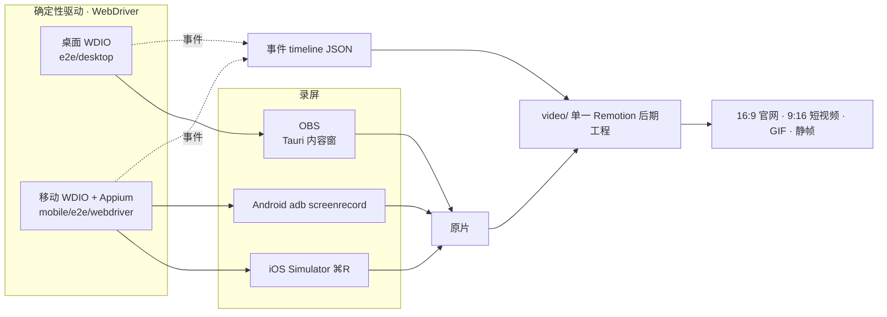
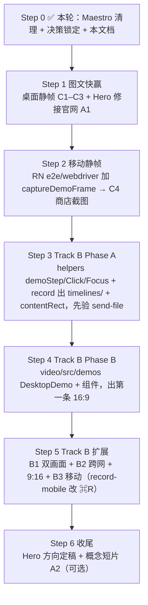

# Demo 素材生产台账与施工计划

> 状态：计划稿（2026-07-14 定）
>
> 目标：把"要产出哪些官网/文档/社媒/商店素材、用哪条轨道、按什么顺序建"讲清楚。
>
> 与 [`demo-postproduction-design.md`](./demo-postproduction-design.md) 的分工：那份讲**后期怎么做**
> （事件时间线 → Remotion 标注成片）；本文讲**产出什么、谁负责、先做什么**。

## 1. 三条生产轨道

一个素材"用视频还是图文"，本质是选下面哪条轨道。三条各有气质、成本、真实度，可混用。

| 轨道 | 形态 | 适合 | 成本 | 真实度 |
| --- | --- | --- | --- | --- |
| **A · 合成动效** | Remotion 纯手绘（`HeroLoop` 这种） | Hero、抽象概念（加密/路径择优/MCP 拓扑） | 中 | 低（"不是真 app"） |
| **B · 真实录屏 + 事件标注** | 真实 UI 录屏 + timeline 光圈/镜头/字幕 | 旗舰功能演示（发送、配对、MCP 驱动传输） | 高（需建后期层） | 高 |
| **C · 真实 UI 静帧 → 图文** | `captureDemoFrame` 静帧 + 标题/标注卡 | 官网功能区、文档教程、README、商店截图 | 低（管线已在） | 高 |

**取舍原则**：默认走 C（快、真实、覆盖多数渠道）；只给最值得"动起来"的旗舰流程投 B；Hero 与抽象概念用 A。

## 2. 两端统一：WebDriver 驱动 + 单一后期工程

关键架构决策（本轮敲定）：

- **两端都用 WebDriver 确定性驱动**：桌面 WDIO（`e2e/desktop`）、移动 WDIO + Appium-XCUITest
  （`mobile/e2e/webdriver`）。移动端 **Maestro 已废弃并清理**，不再作为 UI 自动化入口。
- **只有一个后期工程**：桌面仓库的 `video/`（Remotion）。移动端**不建独立后期工程**，只产原片，
  原片喂进同一个 `video/`，复用相同的事件 timeline schema。
- 好处：一套语义标注 API、一套 Remotion 组件、一套 timeline，桌面和移动共用。



## 3. 录制方式

| 端 | 录制手段 | 现状 | 待改 |
| --- | --- | --- | --- |
| 桌面 | OBS（只采 Tauri 内容窗）+ WDIO ready/go 门控 | `record-desktop-demo.mjs` 已跑通，manifest 含 `sourceTrimMs` | 增 `timelines/` + `contentRect`（Phase A） |
| iOS | **Simulator 系统 File→Record Screen（⌘R）** | `record-mobile-simulator.mjs` 现在用 `simctl io recordVideo` | **改为 ⌘R 路线**；⌘R 是 GUI 动作，需处理启停/存盘位置（osascript 触发或手动 bracket） |
| Android | `adb screenrecord` | 已实现 | 保持 |

### 3.1 Demo 夹具（隐私安全、可复现 · 已实现）

录制读的是真实 app 状态，直接录会把真实设备名 / peer ID / 配对码入镜（违反 §6）。解决方案是
**非破坏性数据目录覆盖 + 可复现 seeder**：

- **`SWARMDROP_DATA_DIR`**（`src-tauri/src/host/paths.rs`，**仅 debug build 生效**）：设置后 identity /
  device_config / SQLite 全落到该目录，真实用户 profile 零接触；未设置时走平台默认目录，release 永不启用。
- **`seed_demo_profile`**（`crates/core/examples/seed_demo_profile.rs`）：复用 app 的 `PairedDeviceInfo`
  结构 + libp2p 生成**合法假 PeerId**（否则 `file_keychain` 反序列化会因非法 PeerId 整份退化为空），
  写入一组通用名设备（本人设备 / 协作者 / 待确认 / 临时）。

```bash
FIXTURE=e2e/desktop/build/demo-profile
SWARMDROP_DATA_DIR="$FIXTURE" cargo run -p swarmdrop-core --example seed_demo_profile
# 全量（OBS 视频）：
SWARMDROP_DATA_DIR="$FIXTURE" node e2e/desktop/scripts/record-desktop-demo.mjs desktop-home
# 只出静帧（跳过 OBS）：追加 --no-record；复用已构建二进制：追加 --skip-build
```

> macOS 已验证：WDIO 经 `tauri-plugin-wdio` 嵌入式 provider（报告为 `webkit`）驱动 app，
> desktop-home 对空 fixture 与 6 台通用设备的 seeded fixture 均出干净静帧、全绿；真实 profile 全程未触碰。

### 3.2 从录制到成片（Phase A + B 已实现）

事件驱动后期整条链已跑通，产出首条 16:9 标注成片：

1. **标注 + 录制**：demo spec 用 `demoStep/demoClick/demoFocus`（`helpers.ts`）标记镜头，
   `record-desktop-demo.mjs` 产原片 + `timelines/*.json`（含 `sourceTrimMs` + 校准的 `contentRect`）。
2. **导入**：`prepare-demo-assets.mjs` 把原片转进 `video/public/demos/`（strip 音轨，忽略提交），
   时间线转进 `video/src/demos/data/`（可提交，无隐私）。
3. **成片**：`remotion render … DesktopDemo` → 1920×1080 MP4。`DesktopDemo` 分层：背景 →
   镜头层（`DemoSource` 裁黑边 + `ClickSpotlight`）→ 字幕层（`DemoCaption`），镜头 `FocusCamera`
   带 clamp 防背景空洞，全程 `useCurrentFrame()` 驱动、禁 CSS 动画。

```bash
FIXTURE=e2e/desktop/build/demo-profile
SWARMDROP_DATA_DIR="$FIXTURE" cargo run -p swarmdrop-core --example seed_demo_profile
SWARMDROP_DATA_DIR="$FIXTURE" node e2e/desktop/scripts/record-desktop-demo.mjs desktop-home
node video/scripts/prepare-demo-assets.mjs desktop-home
pnpm --dir video exec remotion render src/index.ts DesktopDemo out/desktop-demo.mp4
```

首条成片（desktop-home 设备中心导览：字幕 + 两处镜头聚焦 + 复制配对码点击光圈）已逐帧核对：
黑边裁净、字幕在安全区、点击光圈对齐目标、数据全为虚构 fixture。9:16 变体 / 更多 demo 复用同一套
组件与时间线 schema（Phase C）。

### 3.3 真实传输录制（iOS 真机 · 路径已验证）

在线设备 / 发送 / 收件箱场景**不 seed 假数据**，用真实第二节点（用户定）——设备在线状态是纯运行时
P2P 状态、无法 seed，故此路唯一可行。隐私门槛放宽：**只需脱敏设备名**（两端改通用），其余真数据 OK。

- **已验证可跑**：移动端增量构建（`cd ../../mobile && pnpm exec expo run:ios --device "iPhone 17"`，
  用 RN 自己的 pnpm 10.x，避开桌面 pnpm 11 忽略 `pnpm` 字段导致的 no-TTY purge 坑）→ 装到 iPhone 17 sim →
  Maestro 驱动 onboarding（设备名设 "iOS Demo" 脱敏）→ 启动节点 → "运行中"、LAN 可发现。
- **成片编排**：`record-transfer-demo.mjs`（`record:transfer`）双端驱动——桌面 `lan-transfer.demo.ts`
  （发现→配对→发送→成功）+ 移动 `accept-transfer.e2e.ts`（Appium/XCUITest），OBS 录桌面 + simctl 录移动，
  ready/go/done/close 信号文件同步。
- **待补的编排点**：① 移动侧 Appium 需 **WebDriverAgent**（未构建；首个 Appium 会话会自动构建）；
  ② orchestrator 的 `SWARMDROP_E2E_DEVICE_NAME` 兼作"找名为该值的 sim"，我的 sim 名是 "iPhone 17"，
  需 `SWARMDROP_IOS_UDID=<udid>` 覆盖；③ 桌面走 fixture 需传 `SWARMDROP_DATA_DIR` +
  `SWARMDROP_DESKTOP_IDENTITY_FILE` 指向 fixture；④ 移动 spec 默认 reset 重装（会自行 onboarding）。

```bash
SWARMDROP_IOS_UDID=<sim-udid> \
SWARMDROP_DATA_DIR=e2e/desktop/build/demo-profile \
SWARMDROP_DESKTOP_IDENTITY_FILE=e2e/desktop/build/demo-profile/dev-identity.json \
node e2e/desktop/scripts/record-transfer-demo.mjs --skip-build
```

## 4. 资产台账

### 4.1 图文（Track C — 优先铺）

| # | 素材 | 端 | 画幅 | 来源 | 状态 |
| --- | --- | --- | --- | --- | --- |
| C1 | 功能区 5 张（跨网络 / E2E 加密 / 零配置配对 / AI-MCP / 断点续传） | 桌面 | 横 | `captureDemoFrame` + 补拍 | 静帧管线已在 |
| C2 | 发送流程分步图文（选设备→拖文件→发送→完成） | 桌面 | 横 | `send-file` / `lan-transfer` demo 已有帧 | 现成 |
| C3 | 收件箱 / 断点续传图文 | 桌面 | 横 | `inbox` demo 已有帧 | 现成 |
| C4 | 应用商店截图 6–8 张 | iOS/Android | 竖 | **RN `e2e/webdriver` 加 `captureDemoFrame`** | 待接（原走 Maestro，已废） |
| C5 | 移动功能区 / 教程图文（可选） | 移动 | 竖 | 同 C4 | 可选 |

### 4.2 旗舰视频（Track B — 需建后期层）

| # | 素材 | 端 | 画幅 | 编排难点 |
| --- | --- | --- | --- | --- |
| B1 | **AI/MCP 驱动一次真实传输**：Agent 经本地 MCP `send_files` → 另一台设备落盘/收件箱弹出 | 桌面 + agent 窗口 | 16:9 + 9:16 | **双画面**（agent 侧 + 接收侧）；`DemoSource` 目前只设计单轨，需扩画中画/分屏 → 见待决策 D2 |
| B2 | **跨网络端到端加密传输**：不同网络设备打洞直连、密文传输、连接类型可见 | 桌面 ↔ 另一端 | 16:9 + 9:16 | **真实跨网双机**本地难复现 NAT → 见待决策 D1 |
| B3 | **移动端接收**旗舰（手机收到 + inbox） | 移动 | 9:16 | 复用 `record-mobile-simulator`（⌘R/adb）原片 + 同一 timeline schema |

### 4.3 合成（Track A）

| # | 素材 | 画幅 | 状态 |
| --- | --- | --- | --- |
| A1 | Hero 循环（蜂群互联 + 三张功能卡） | 16:9 20s 无声 | **已成 80%**；待修功能卡描述里字面 `\n` 不换行、并接进官网 `<video>`（`docs/public/hero/` 已有成片但 `docs/src` 未见引用） |
| A2 | 概念解释短片（加密 / 路径择优）（可选） | 竖/横 | 未做 |

## 5. 施工顺序



- Step 1–2 **不依赖任何待建代码**，可立即产出多数渠道所需图文。
- Step 3–4 对应 design 文档的 Phase A / Phase B，是投入最大的一段。
- Step 5 对应 design 文档 Phase C（多画幅 + 多端复用）。

## 6. 隐私与素材治理

沿用 [`demo-postproduction-design.md` §6](./demo-postproduction-design.md)：

- fixture 用通用设备名 / 通用文件名 / 虚构内容，禁止把开发者姓名、邮箱、真实路径写进可录制界面或字幕。
- 原片、中间片段、自动生成的 timeline 都在 `build/` 或 `video/public/demos/`，默认忽略提交。
- 只有审核过的最终成片、封面、不含隐私的编辑计划可提交。发布前逐帧检查首帧/点击帧/字幕帧/末帧。

## 7. 待决策清单

| ID | 决策 | 选项 | 影响 |
| --- | --- | --- | --- |
| **D1** | B2 跨网双机怎么摆 | ① 真双机 ② 桌面 + iOS 模拟器分连不同网络 ③ "半真"：单机同网，靠连接类型徽章讲清路径 | 决定 B2 录制编排与可信度 |
| **D2** | B1 MCP 双画面怎么合 | ① `DemoSource` 扩多轨画中画 ② 左右分屏 | 决定 Remotion 后期组件的复杂度 |
| **D3** | Hero 方向 | ① 保持合成抽象 ② 塞一段真实 UI 镜头"落地" | 关系到与 PRODUCT.md 反面参考"渐变 hero"的张力，收尾时定 |

D1/D2 到 Step 5 再拍板，不阻塞 Step 1–4。
