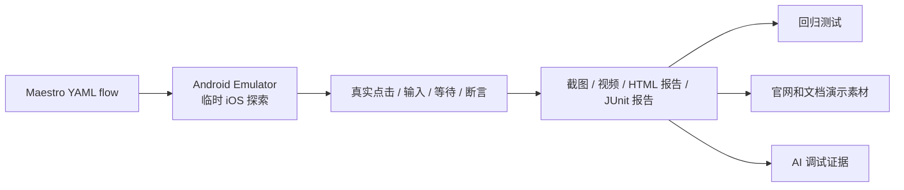
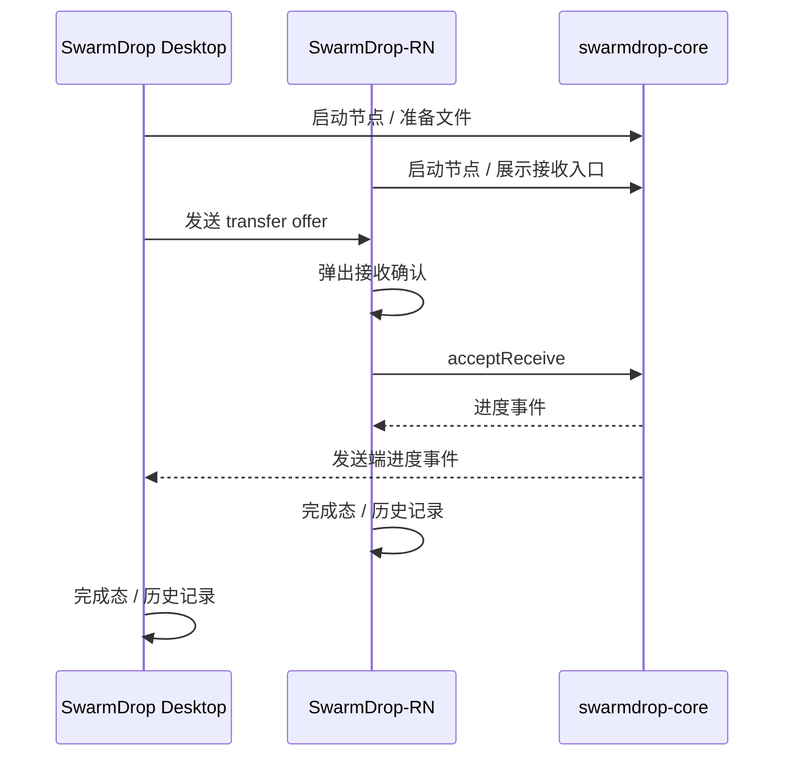
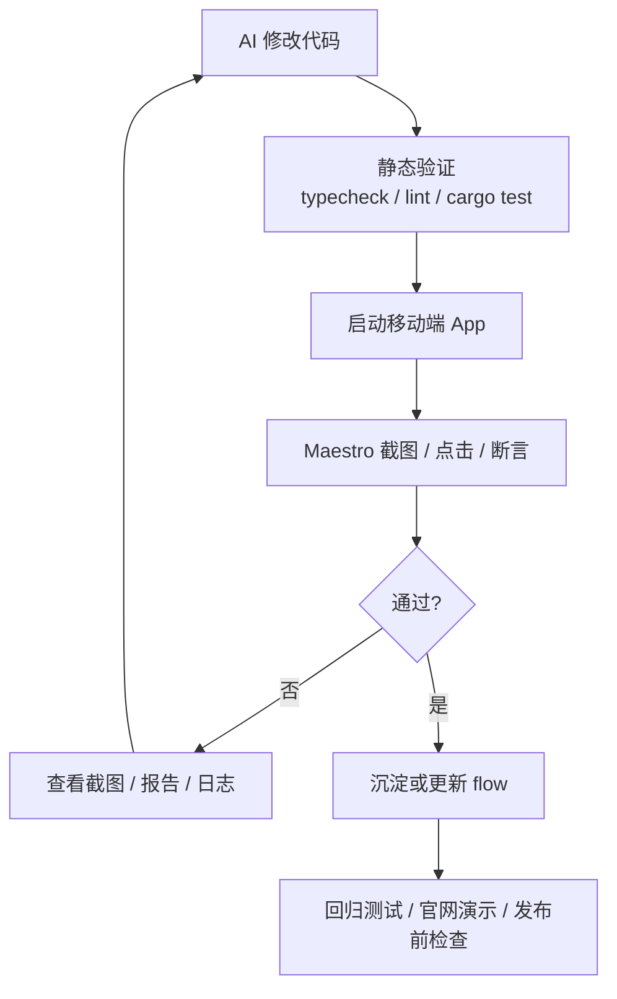
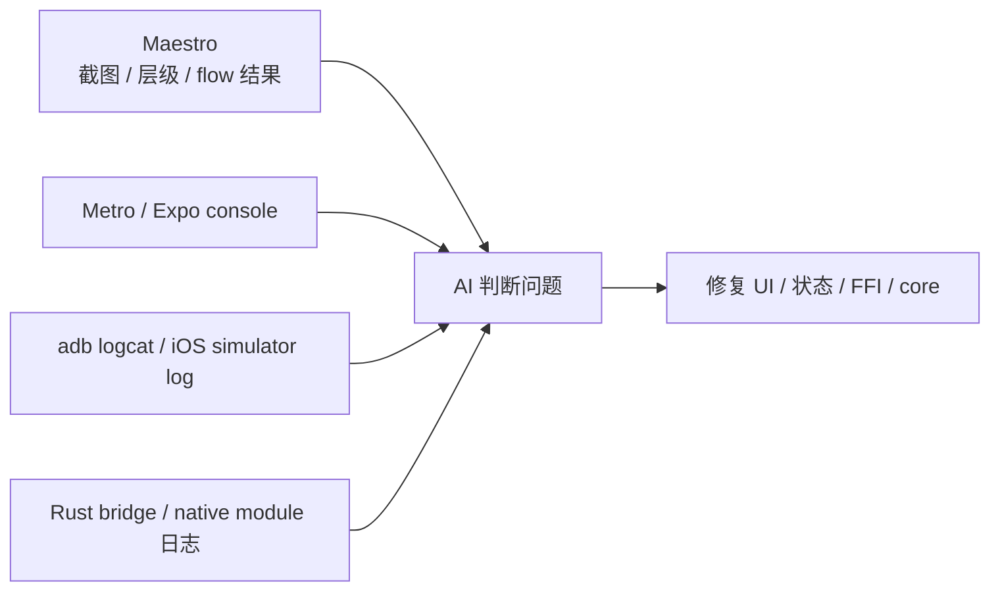
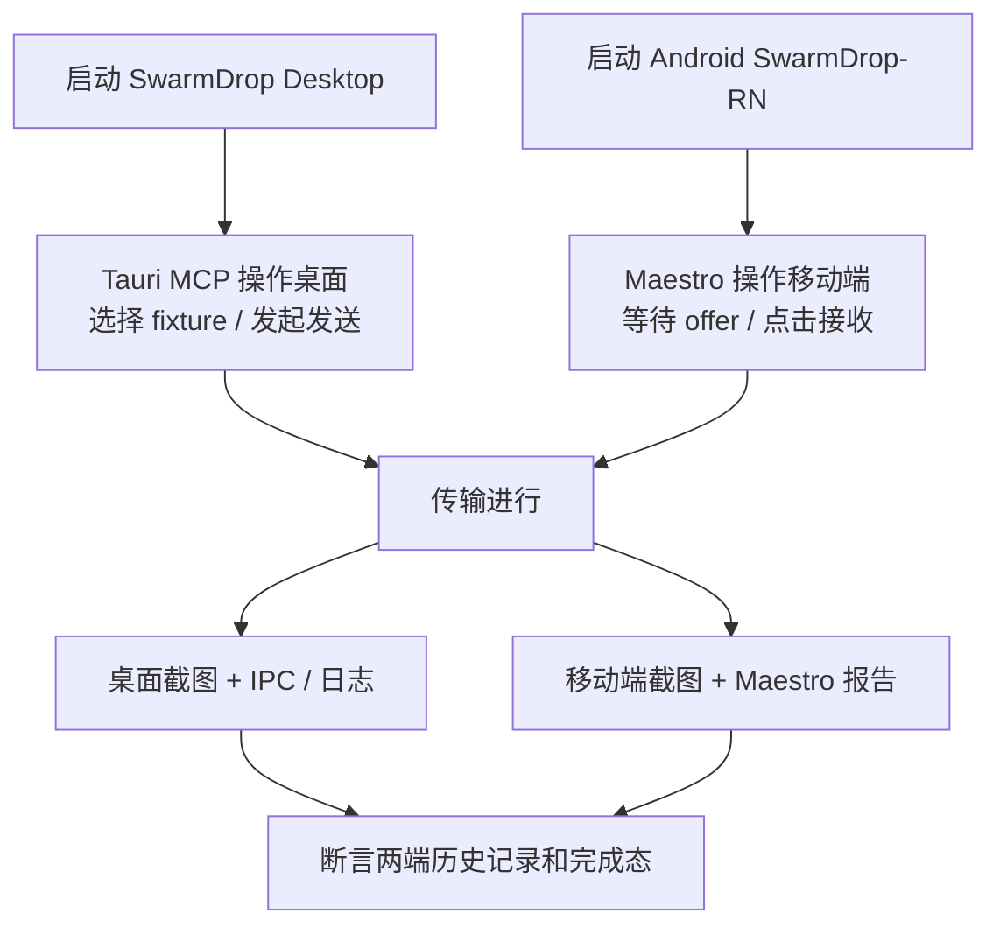

# 别再只靠手点手机了：用 Maestro 给 SwarmDrop-RN 补上 AI 可执行的移动端验证

最近在做 SwarmDrop 和 SwarmDrop-RN 的联调时，我遇到一个很现实的问题：

> 文件传输应用不是一个按钮能不能点的问题，而是两台设备之间的真实状态能不能对上。

如果只是临时看一下界面，手动打开模拟器、点几下、看一眼日志当然最快。但一旦这些路径变成日常开发的一部分，手测就开始变得不可靠：设备状态不一致、权限弹窗不一样、截图没有留档、每次改 UI 都要重新点一遍，AI 改完代码之后也只能靠日志猜画面是否正确。

我之前在 `../ratatui-kit/dev-notes/blog/2026-06-15-terminal-recording-from-zero.md` 里写过一篇 VHS 文章，核心观点是：

> 不要把录屏当成临时操作，而要把它当成可以重复生成的工程产物。

这篇文章想把同一个思路搬到移动端。主角是 [Maestro](https://docs.maestro.dev/)：一个用 YAML 描述移动端操作流程，并能生成截图、录屏、报告的 UI 自动化工具。对 SwarmDrop-RN 来说，它不只是 E2E 测试框架，更是一块 AI 开发验证资产。

当前项目的落地边界已经明确：Android 单端 smoke 和临时 UI 探索仍可使用 Maestro；iOS 26 / Expo SDK 56 / RN 0.85 Fabric 下，长期 selector 流程和双端传输改用 WebdriverIO + Appium XCUITest。iOS 官网素材也由同一个 Appium 会话录屏，避免 Maestro 与 WebDriver 同时占用 XCTest。

## 先看这条链路

在终端项目里，VHS 把 `.tape` 变成 GIF / MP4 / WebM。到了移动端，Maestro 做的是类似的事情：



这条链路重要的地方不在于“能自动点按钮”，而在于它把一次移动端验证变成了文本资产：

- flow 可以提交到仓库；
- 设备、截图、报告路径可以约定；
- UI 改了可以重跑；
- AI 可以根据截图和 view hierarchy 修正自己的改动；
- 官网演示不再依赖一次性手工录屏。

这和 VHS 的价值非常像，只是 VHS 面向终端，Maestro 面向移动 App。

## 为什么 SwarmDrop-RN 特别需要它

SwarmDrop-RN 是一个 P2P 文件传输应用。核心体验不是单页 UI，而是一串跨端状态：



这类路径只靠单元测试和类型检查不够。Rust core 单测能证明协议和文件写入语义，TypeScript typecheck 能证明调用形状大体正确，但它们都不能回答这些问题：

- Android 权限弹窗有没有挡住按钮；
- iOS 文件选择器回来后节点有没有被误关；
- 接收 offer 的 sheet 有没有出现；
- 暂停后 UI 是否进入 `paused`；
- 恢复后历史记录是否刷新；
- SAF `content://` 目录下写文件是否真的成功；
- 发送端和接收端的进度是否同时进入完成态。

这些问题过去只能手测。Maestro 的价值，就是把这类“必须看见 App 画面”的验证变成可执行流程。

## Maestro 在 AI 开发中的位置

它不是替代已有测试，而是补上移动端交互和视觉验证层。

| 层级 | 工具 | 验证什么 |
|---|---|---|
| Rust core | `cargo test` | 传输协议、断点续传、文件写入语义 |
| TS / RN | `pnpm typecheck`, `pnpm lint` | 类型、组件和状态层基本正确性 |
| Native build | `expo run:android`, `expo run:ios` | 原生桥、uniffi、权限配置能否编译运行 |
| 移动端交互 | Maestro | 用户路径、截图、录屏、失败产物、多设备回归 |
| 桌面端交互 | Tauri MCP Bridge | 桌面窗口、DOM、IPC、日志和截图 |

最终想形成的是这样的 AI validation loop：



没有 Maestro 时，AI 很容易停在 `pnpm typecheck` 成功的位置。引入 Maestro 后，它能继续检查真实设备画面：按钮是否被遮挡、文案是否还在、列表是否刷新、弹窗是否出现。

## 安装和 MCP 配置

安装 Maestro CLI：

```bash
curl -fsSL "https://get.maestro.mobile.dev" | bash
```

确认版本和设备：

```bash
maestro --version
maestro list-devices
```

Codex MCP 可以这样接：

```toml
[mcp_servers.maestro]
command = "maestro"
args = ["mcp"]
```

如果启动 Codex 的环境里找不到 `maestro`，就把 `command` 改成绝对路径：

```toml
[mcp_servers.maestro]
command = "/Users/yexiyue/.maestro/bin/maestro"
args = ["mcp"]
```

Maestro MCP 给 AI 的关键能力包括：

- `list_devices`：查看可用 Android / iOS / Web 设备；
- `inspect_screen`：读取当前界面的 view hierarchy；
- `take_screenshot`：获取当前屏幕截图；
- `run`：执行 inline YAML 或仓库里的 flow；
- `open_maestro_viewer`：打开可交互的设备 Viewer。

如果说 CLI 是长期回归入口，那么 MCP 就是 AI 的临场调试入口。

## SwarmDrop-RN 的第一个 flow

SwarmDrop-RN 的 Android package 和 iOS bundle identifier 都是：

```text
com.yexiyue.swarmdrop
```

最小启动验证可以这样写：

```yaml
appId: com.yexiyue.swarmdrop
name: SwarmDrop launch smoke
---
- launchApp
- assertVisible: "SwarmDrop"
- takeScreenshot: launch
```

这条 flow 还不能证明业务正确，但它能证明三件事：

1. App 能在设备上启动；
2. Maestro 能连接并操作它；
3. 截图产物能正常生成。

第一步先追求闭环，不要一上来覆盖完整传输。

## 截图、报告和日志

建议把 Maestro 产物固定到 `build/maestro-*`，不要散落在默认目录：

```bash
maestro test \
  --test-output-dir build/maestro-results \
  --debug-output build/maestro-debug \
  --format html-detailed \
  --output build/maestro-report.html \
  .maestro/smoke
```

几个产物的职责：

| 产物 | 位置 | 用途 |
|---|---|---|
| screenshots / videos | `--test-output-dir` | 看失败画面和关键视觉状态 |
| `commands-*.json` | `--test-output-dir` 或 `--debug-output` | 复盘 Maestro 实际执行了什么 |
| `maestro.log` | `--debug-output` | 查 Maestro 执行日志 |
| HTML / JUnit report | `--output` | 本地查看或接 CI |

要注意：Maestro 的日志主要是测试执行日志，不等价于完整 RN JS console、Android `logcat` 或 iOS simulator log。

实际调试 SwarmDrop-RN 时，最好把几类信息放在一起看：



## 录制官网演示

Maestro 可以把独立 flow 录成 MP4：

```bash
maestro record --local .maestro/demo/send-file.yaml build/swarmdrop-send-file.mp4
```

建议始终使用 `--local`。这样录制在本机完成，不需要把原始屏幕和 flow 输出交给远端渲染。录制有最长时长限制，所以 demo flow 要短，最好控制在 30 到 60 秒内。

对于 SwarmDrop 的 iOS 双端传输素材，不再用 Maestro 录制。请使用现有的 `pnpm --dir e2e/desktop record:transfer`：
桌面端由 OBS 录制 Tauri 窗口，移动端由 WebDriver/Appium 的 `startRecordingScreen` / `stopRecordingScreen`
录制纯设备画面，并且只有桌面端和移动端都进入成功状态后才结束。

这里也要分清两种 flow：

| flow | 目标 | 写法 |
|---|---|---|
| smoke | 发布前回归 | 断言明确，失败敏感 |
| demo | 官网/文档素材 | 节奏干净，数据漂亮，画面稳定 |

例如 smoke flow 可以很硬：

```yaml
appId: com.yexiyue.swarmdrop
name: Transfer history smoke
---
- launchApp
- tapOn:
    id: transfer-tab
- assertVisible: "传输"
- takeScreenshot: transfer-history
```

demo flow 可以更像分镜：

```yaml
appId: com.yexiyue.swarmdrop
name: Demo receive file
---
- launchApp
- waitForAnimationToEnd
- takeScreenshot: demo-home
- tapOn:
    id: receive-action
- waitForAnimationToEnd
- takeScreenshot: demo-receive
```

同一条用户路径可以有两个版本：一个负责抓 bug，一个负责展示产品。

## 多设备和双端传输

Maestro 支持指定设备：

```bash
maestro --device emulator-5554 test .maestro/smoke/onboarding.yaml
```

也支持启动本地设备：

```bash
maestro start-device --platform android
maestro start-device --platform ios
```

但 SwarmDrop-RN 的完整业务不是单设备 flow，而是双端编排。推荐从简单到复杂：

| 阶段 | 组合 | 目标 |
|---|---|---|
| 1 | Android 单端 | onboarding、设置、传输历史、权限弹窗 |
| 2 | iOS 单端 | 通过 WebDriver/Appium 验证和录屏，Maestro selector 暂不作为稳定 gate |
| 3 | Desktop + Android | 桌面发送、移动端接收 |
| 4 | Android + Desktop | 移动端发送、桌面接收 |
| 5 | Android + iOS | 移动端之间配对和传输 |

完整的 Desktop + Android 验证可以拆成这样：



不要一开始就追求一个 Maestro flow 编排完整双设备传输。当前 iOS 双端传输由外层 orchestrator 串联：桌面端和移动端都由 WebDriver 操作，桌面端用 OBS 录制，移动端用 Appium 录制，并分别等待成功状态。

## 让 flow 稳定的项目约定

Maestro 能不能好用，很大程度取决于 App 是否给自动化留了稳定入口。

### 给关键元素加 testID

不要依赖中文文案做长期选择器。文案会改、会国际化，`testID` 更稳定。

建议命名：

```tsx
<Pressable testID="home-send-button" />
<Pressable testID="home-receive-button" />
<Pressable testID="pairing-code-copy-button" />
<Pressable testID="transfer-accept-button" />
<Text testID="runtime-status-label" />
```

Maestro 中使用：

```yaml
- tapOn:
    id: home-send-button
- assertVisible:
    id: runtime-status-label
```

### 准备测试 profile

传输类测试最怕状态污染。建议未来提供测试 profile：

```text
SWARMDROP_E2E=1
```

它可以控制：

- 固定设备名；
- 固定测试目录；
- 首次启动跳过非关键 onboarding；
- 使用 fixture 文件；
- 清空历史记录；
- 使用测试用 pairing key / identity；
- 禁用非必要动画或缩短超时。

### 准备 fixture 文件

至少保留几类：

```text
fixtures/
  small.txt
  unicode-文件名.txt
  nested/a/b/readme.md
  large-20mb.bin
```

这些文件要用于传输、暂停、恢复、历史记录、目录结构和 SAF 接收路径验证。

### 标明环境约束

参考 VHS 文章里的思路，演示和测试资产都应该说明自己依赖什么环境：

| flow | 环境 | 原因 |
|---|---|---|
| onboarding | 模拟器 | 不依赖外设 |
| settings | 模拟器 | 可稳定重跑 |
| receive-private-dir | 模拟器 | 走应用私有目录 |
| receive-saf-downloads | 真机或指定 Android 模拟器 | 依赖 SAF picker |
| photo-picker | 真机/模拟器视情况 | 权限和相册数据不稳定 |
| background-transfer | 真机 | 后台限制和保活更接近真实 |

## 推荐的目录结构

```text
.maestro/
  smoke/
    onboarding.yaml
    settings.yaml
    pairing-code.yaml
    transfer-history.yaml
  demo/
    send-file.yaml
    receive-file.yaml
  README.md

dev-validation/
  fixtures/
    small.txt
    unicode-文件名.txt
    large-20mb.bin
```

第一批 flow 不要太多，先让最短路径跑通：

1. `smoke/onboarding.yaml`：App 可启动，首次设置路径可走完；
2. `smoke/settings.yaml`：设置页和基础偏好可访问；
3. `smoke/pairing-code.yaml`：配对码入口可用；
4. `smoke/transfer-history.yaml`：历史页空态和列表态稳定；
5. `demo/receive-file.yaml`：官网或文档演示素材。

## 最后

我以前在终端项目里用 VHS，是为了让“会动的界面”变成可重复生成的文档素材。SwarmDrop-RN 现在需要的是同一种能力，只是对象换成了移动 App。

对 AI 开发来说，这件事尤其重要。AI 不缺写代码的能力，缺的是改完之后能不能真的看到产品状态、操作用户路径、留下证据并继续修。

Maestro 补上的就是这块：

- flow 是文本，可以版本管理；
- 截图和录屏是证据，可以给 AI 看；
- 报告是回归入口，可以接 CI；
- demo 是产品素材，可以上官网；
- 多设备能力是基础，可以逐步走向真实传输验证。

先不用追求覆盖所有传输场景。选一个最短的移动端 smoke flow 跑通，让 AI 能看见手机画面，再慢慢把 SwarmDrop 的关键路径沉淀进去。

## 参考资料

- ratatui-kit VHS 文章：`../ratatui-kit/dev-notes/blog/2026-06-15-terminal-recording-from-zero.md`
- [Maestro MCP Server](https://docs.maestro.dev/get-started/maestro-mcp)
- [Maestro reports and artifacts](https://docs.maestro.dev/maestro-flows/workspace-management/test-reports-and-artifacts)
- [Maestro record your Flow](https://docs.maestro.dev/maestro-flows/workspace-management/record-your-flow)
- [Maestro specify and start devices](https://docs.maestro.dev/maestro-flows/flow-control-and-logic/specify-and-start-devices)
