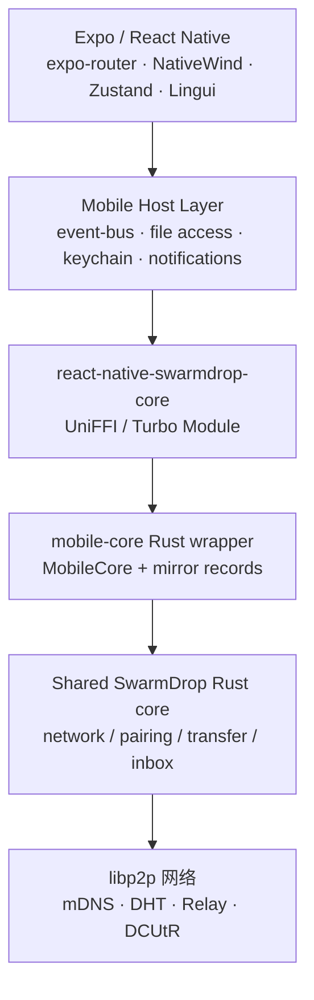
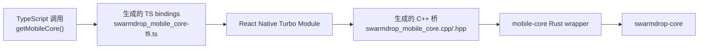
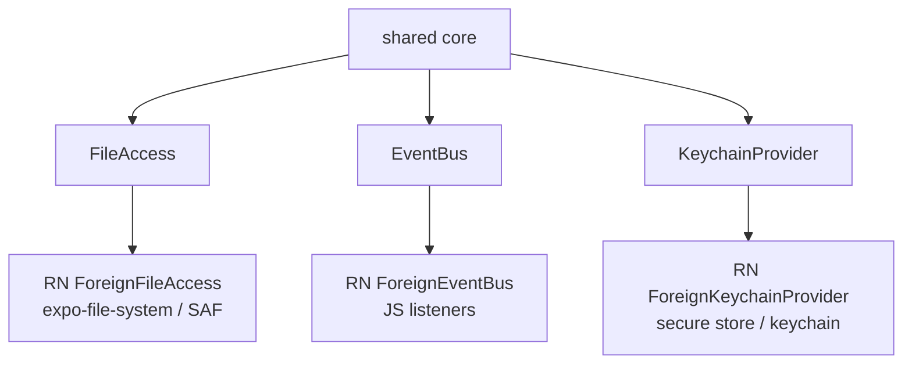
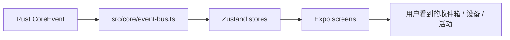
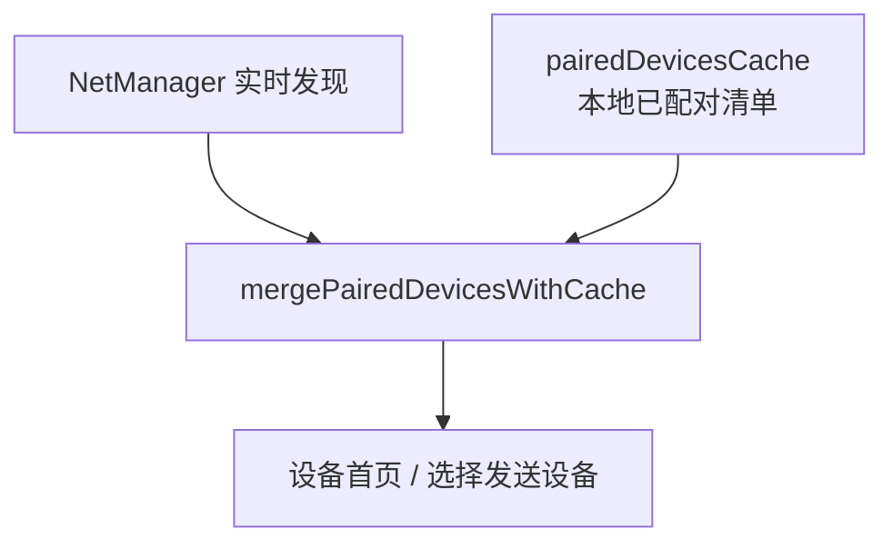
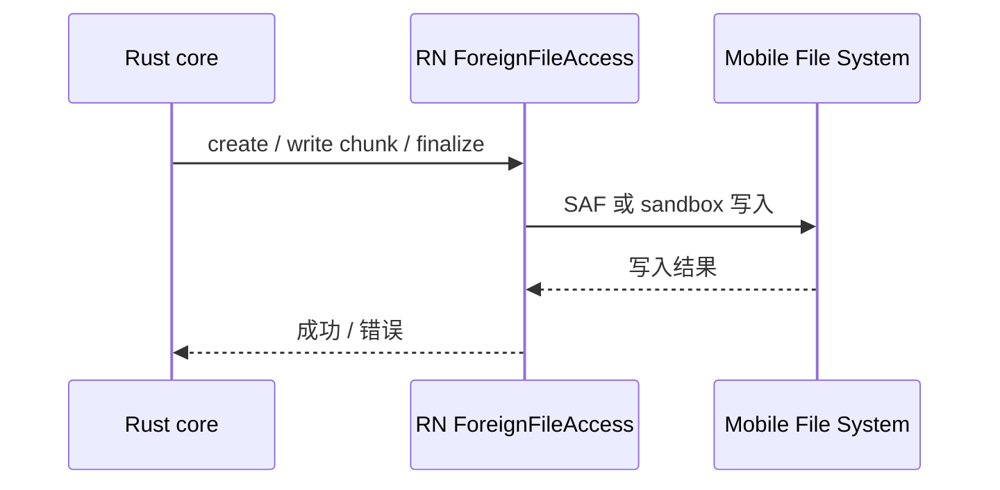
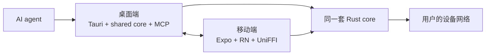

# SwarmDrop Mobile 架构：把同一条可信数据通道放进口袋

桌面端已经能把文件跨网络、端到端加密地送到另一台设备。那手机端要做什么？

不是简单复制一个桌面 UI，也不是另起炉灶写一套移动协议。SwarmDrop Mobile 的目标是：

> 让 Android 和 iOS 成为同一条 SwarmDrop 数据通道里的平等节点，让手机可以接收、发送、保存、恢复和展示传输结果，同时继续复用桌面端已经验证过的 Rust core。

这篇文章面向第一次接触 SwarmDrop-RN 的开发者，也面向想快速了解项目的人。它会讲清楚移动端如何设计、解决了什么问题，以及为什么它和桌面端是一个整体。

> 桌面端配套文章见 SwarmDrop 仓库的 [SwarmDrop 桌面端架构](https://github.com/swarm-apps/SwarmDrop/blob/develop/dev-notes/blogs/swarmdrop-desktop-architecture.md)。两篇文章讲的是同一条可信数据通道的两种宿主形态。

## 手机端难在哪里

如果只看产品表面，手机端好像只是“接收桌面发来的文件”。实际工程里要处理的事情多得多：

- React Native 要调用 Rust P2P core；
- Android 要通过 SAF 写到用户选择的目录；
- iOS 有 sandbox、Share Extension、后台限制；
- 文件传输期间 App 可能退到后台；
- 配对设备既有实时发现状态，也有本地信任缓存；
- UI 不能把底层协议暴露给用户；
- 桌面端协议变化后，移动端不能漂移成另一套语义。

所以 SwarmDrop-RN 的核心不是“移动端页面”，而是一个跨语言、跨平台、跨仓库的边界设计。

## 总体架构

移动端分成三层：

每一层都尽量只做自己的事：

- `src/app/` 负责路由和屏幕；
- `src/components/` 负责可复用 UI；
- `src/stores/` 负责移动端状态投影；
- `src/core/` 负责 host 能力，比如事件、文件访问、通知、路径；
- `packages/swarmdrop-core/` 负责把 Rust core 暴露给 RN；
- 真正的传输、配对、网络和数据库语义仍来自桌面主仓的 shared core。

这就是移动端最重要的架构原则：**UI 是移动的，协议不是移动重写的。**

## UniFFI 桥接：移动端的脊柱

graphify 图谱里，移动端最高度连接的两个节点是：

- `NativeSwarmdropMobileCore`
- `NativeModuleInterface`

这不是偶然。SwarmDrop-RN 的关键难点就在这里：把 Rust core 稳定地接到 React Native。

`mobile-core` 不是业务重写层，它更像一层翻译器：

- 把 RN 可以理解的类型映射到 core 类型；
- 把 core 事件转换成移动端事件；
- 把文件访问、keychain、event bus 这些平台能力以 trait 的形式注入；
- 保证 shared core 不需要知道 Expo、Tauri、Android 或 iOS。

这一层让移动端和桌面端共享协议，同时避免把移动平台细节污染到 core。

## Host trait：平台差异留在边界上

共享 Rust core 不直接读手机文件系统，也不直接调用系统 keychain。它只依赖抽象能力：

这套设计解决了一个长期维护问题：如果 core 直接依赖移动平台，桌面端会被迫引入无关复杂度；如果移动端完全重写 core，又会产生协议漂移。

现在的边界是：

- core 负责“传输应该如何发生”；
- RN host 负责“在手机上如何读写文件、如何发通知、如何存密钥”。

这也是 SwarmDrop-RN 能和桌面端保持同一产品语义的关键。

## 状态层：移动端消费投影，而不是自己拼协议

移动端 UI 不应该自己拼装“传输历史”和“当前状态”。它消费 shared core 给出的投影：

- transfer projection；
- device list；
- paired device cache；
- inbox item；
- runtime state；
- pairing event。

这种投影优先的方式有两个好处：

1. UI 不需要理解底层 actor、chunk、checkpoint 的所有细节；
2. 桌面端和移动端可以用同一套 transfer semantics，只是展示方式不同。

例如移动端收件箱不是“状态说明页”，而是手机上的内容库：最近收到的文件、图片、视频、文本、异常、已归档记录，都应该像用户自己的内容一样可浏览、可打开、可分享。

## 设备配对：实时发现 + 本地信任缓存

移动端和桌面端一样，需要处理“设备当前是否在线”和“设备是否已配对”这两个不同事实。

实时发现来自运行中的 P2P 节点；已配对设备来自本地 keychain/cache。两者不能互相覆盖。

这解决了一个很常见的移动端体验坑：节点刚启动时，如果某台已配对设备还没被实时发现，UI 不能把它从“已配对设备”里闪没。用户关心的是“这是不是我的设备”，在线状态只是它的当前属性。

## 文件保存：手机不是桌面文件系统

桌面端保存文件很直接：路径、目录、权限都比较稳定。手机端不一样。

Android 需要面对 SAF、`content://`、临时 URI 权限、前台服务；iOS 需要面对 sandbox、App Group、Share Extension 和后台挂起。SwarmDrop-RN 的策略是让 RN host 承担这些平台细节，core 只通过 `FileAccess` 读写抽象 chunk。

这样做的好处是：传输协议仍然保持跨端一致，移动端只在边界上处理“手机到底怎么存文件”。

## 通知和后台：平台边界要诚实

移动端不能假装自己拥有桌面端一样的后台能力。

Android 可以通过前台服务提高长期传输的稳定性；iOS 深后台无法可靠维持 libp2p socket，也不会为了“纯 P2P 文件传输”引入 APNs 服务器。这不是 bug，而是平台边界。

SwarmDrop-RN 的设计是：

- Android 用通知和 foreground service 支撑运行中节点和传输进度；
- iOS 优先保证前台和刚退台体验；
- 不为了“看起来在线”而引入中心服务器；
- 所有后台能力都必须服务于用户可见的传输，而不是偷偷常驻。

这种诚实边界对一个隐私工具很重要。我们宁愿清楚告诉用户平台限制，也不引入一套破坏产品原则的云端兜底。

## 和桌面端如何组成一个产品

桌面端文章里把 SwarmDrop 描述为“可信数据通道”。移动端就是这条通道的随身节点。

桌面端更像工作台：拖拽文件、管理收件箱、给 AI agent 提供 MCP 工具、处理复杂批量任务。

移动端更像随身入口：接收文件、系统分享、保存到手机目录、用通知承接长任务、让手机成为 P2P 网络中的一台真实设备。

两端共享的是：

- 设备身份；
- 配对语义；
- 端到端加密；
- transfer projection；
- resumable transfer；
- 收件箱和活动模型；
- 同一套 Rust core 的协议事实。

这让 SwarmDrop 不是“桌面 App + 手机遥控器”，而是一组可以互相传递数据的本地优先设备。

## 为什么这个架构值得关注

SwarmDrop-RN 有几个有意思的工程点：

- 用 UniFFI / Turbo Module 把 Rust P2P core 带到 React Native；
- 不重写移动版协议，而是共享桌面端核心；
- 用 host trait 把平台差异隔离在边界；
- 用 projection 让 UI 消费稳定业务事实；
- 同时考虑 Android SAF、通知、前台服务、iOS Share Extension 等移动平台约束；
- 和桌面端 MCP 能力形成 “AI agent 在桌面发起，手机真实接收” 的闭环。

如果你对 React Native、Rust、P2P、端到端加密、本地优先工具或 AI agent 基础设施感兴趣，SwarmDrop-RN 是一个很适合研究和参与的项目。

如果这个方向打动你，欢迎给 SwarmDrop 和 SwarmDrop-RN 点一个 Star。我们想做的不是又一个传文件按钮，而是一条真正属于你自己设备的可信数据通道。
