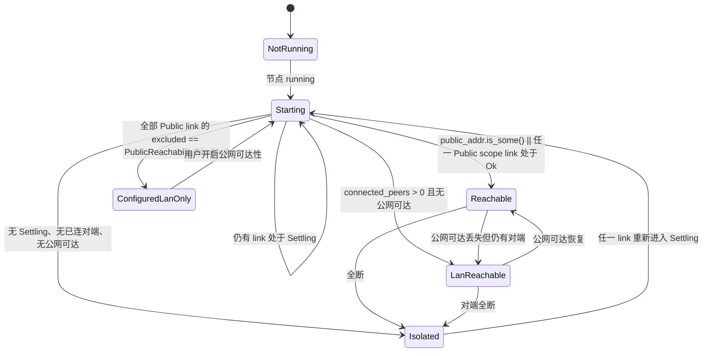

## Context

同一个「引导节点」概念在系统里有四份互不同步的表示：`BootstrapCandidate.health`（粘性、无错误文本）、`RelayState`（内核权威三态 + `last_error`，只覆盖 relay 维度）、`DeviceManager.peers`（有连接事实但 `is_swarmdrop_agent` 把 bootstrap 过滤掉）、`NetworkStatus` 的 7 个压扁标量。这不是重构留下的碎片，是**同一个建模错误的四次显影**。

`InfraRoles { relay, kad_server }`（`crates/net/src/endpoint.rs:295-305`）从内核第一天起就是两个正交 bool。本仓自建的 `47.115.172.218` 恰好两者兼任，于是上层一路把它当成一个东西。`connection-panel.tsx:186-192` 的注释已经诚实地记下了这个合并决定——**那条注释在 UI 层成立，在领域层不成立**。

模型未收敛的最强证据（逐条核实）：

| 写入点 | roles | scope |
|---|---|---|
| `crates/core/src/runtime.rs:139` | `InfraRoles::bootstrap()`（kad+relay） | — |
| `crates/core/src/network/config.rs:85-92` | `kad_and_relay()` | 硬编码 `Public` |
| `crates/core/src/network/manager.rs:186-189` | `{kad_server:false, relay_server:true}` | `infer(addrs)` |
| `crates/core/src/network/event_loop.rs:145-155` | `kad_and_relay()` | `Lan` |
| `crates/core/src/infra/supervisor.rs:138-158` | 候选表写 `kad_and_relay()`，即时接线只给 `{kad:true, relay:false}` | 硬编码 `Public` |

五个写入点，四种组合。没有一个作者在偷懒——他们都在**替一个不存在的默认值做决定**。

**分离部署不是「将来会塌」，是「现在靠巧合站着」。** 纯 kad 引导节点在当前代码里就是黑洞：`wants_reservation`（`supervisor.rs:71-74`）要求 `relay_server` → 不进收敛环；`ensure_relay` 只在 `roles.relay` 时写 relays map（`actor.rs:345-346`）→ `watch_relays` 里没有条目；拨号失败只有一行 `debug!("infra peer dial skipped")`（`actor.rs:355`）。它能工作，仅仅因为今天所有候选都恰好带 relay 角色。

## Goals / Non-Goals

**Goals:**

- 让「引导节点」在领域层有唯一表达，消灭五个写入点的四种角色组合与三种 scope 拼法。
- 三端能回答同一组问题：这条连上了吗 / 为什么没连上 / 我现在对外可达吗 / 不可达时该点哪。**统一的是信息模型与状态语义，不是像素。**
- 运行时增删引导节点即时生效，取消「加引导节点需重启节点」。
- 修掉四个被同一建模错误掩盖的数据面缺陷（失效 relay hint、闸门绕过、scope 覆写翻转、NAT 恒「未知」）。

**Non-Goals:**

- 不删 `DiscoveryMode`（另立 change）。本轮**禁止基于它写任何新逻辑**——`InfraExclusion` 因此不含 `LanOnlyMode` 变体，这样它什么时候被删都不影响本轮成果。
- 不把 `public_reachability` / `auto_discover_lan_helpers` 改成运行时可写。
- 不下发重试轮数或倒计时。
- 不改 `connected_peers` / `discovered_peers` 的口径。
- 不做独立的连通性探测 API（理由见决策 4）。
- 不引入 `NodeCapabilities` 跨 IPC 类型（理由见决策 7）。

## Decisions

### 决策 1 — 聚合根是 `InfraLink`（关系），不是 `InfraNode`（节点）

领域语言里真正存在的东西是**本机与某个远端之间的一段基础设施关系**。节点是关系的对端，不是聚合根。这个转换一次性解决三件事：角色正交、期望/观测分离、以及「同一 NodeId 既是设备又是中继」的重叠。

```rust
// crates/core/src/infra/link.rs（新）
// 零存储读模型：每次 build 现场 join 三个权威源，与 build_network_status 同体例。
// 观测值不落任何持久结构，所以「粘死」在物理上不可能发生。
pub struct InfraLink {
    // ── 意图侧｜权威源 = BootstrapCandidateManager ──
    pub peer_id: NodeId,
    pub addrs: Vec<Addr>,
    pub sources: Vec<BootstrapCandidateSource>,
    pub roles: CandidateRoles,
    pub scope: CandidateScope,
    pub first_seen: DateTime<Utc>,
    pub last_seen: DateTime<Utc>,
    /// 只有 sources 全为 HostConfigured 时为 true（见决策 8）
    pub removable: bool,

    // ── 观测侧｜权威源 = Endpoint 的两条 watch ──
    pub connected: bool,          // watch_conns，只覆盖「已建立」
    pub rtt_ms: Option<u64>,
    /// None = 本 link 在内核里没有 relay 轨道（无角色，或被 excluded 拦下从未登记）
    pub relay: Option<RelayLinkState>,

    // ── 策略侧｜权威源 = InfraSupervisor ──
    pub ever_active: bool,
    /// 非 None ⇒ 当前不参与 relay 收敛。**这是「设置」不是「故障」**
    pub excluded: Option<InfraExclusion>,
}

#[serde(tag = "kind", rename_all = "camelCase")]
pub enum RelayLinkState {
    Connecting,
    Active { circuit_addr: Addr },
    Failed { last_error: String },   // 原文保留，三端唯一能说清「为什么」的字符串
}

#[serde(tag = "kind", rename_all = "camelCase")]
pub enum InfraExclusion {
    NotARelay,                    // roles.relay_server == false
    PublicReachabilityDisabled,   // scope == Public 且 public_reachability == false
}

pub fn build_infra_links<T>(shared: &SharedNetRefs<T>) -> Vec<InfraLink>;
```

**`Option<RelayLinkState>` 是全部要点。** `None` 读作「这段关系不承担该角色」，不是「状态未知」。分离部署时纯 kad bootstrap 出来 `relay: None`，UI 不会渲染一个永远 `Connecting` 的假中继行。角色正交在类型上被钉死，第六个写入点不可能再猜错。

**期望与观测住同一行——并置，不融合。** 两者生命周期不同（意图由用户显式增删，观测每秒翻转），但共享同一身份（`NodeId`），而用户唯一关心的正是两者的差：「我要它连上，它连上了吗」。拆成两个类型再让 UI join，只是把 join 挪到三个表现层各做一遍——那正是今天 7 个标量的病因。要守的纪律是**在同一类型里保持两侧可分辨**：上半段只由意图路径写，下半段只由观测源现算，读模型零存储。

**替代方案：`Reach { Idle, Dialing, Connected, Unreachable }` + `DhtRole { Seeded, NotInRoutingTable }`。否决。** 内核无观测面——`watch_conns` 只在 `ConnectionEstablished`/`Closed` 发布，在途拨号存在 actor 私有的 `self.dials`，`ConnInfo`（`endpoint.rs:35-41`）只有 `path/addr/rtt`；map 里没条目与「从没试过」完全同形；kad 只处理 `OutboundQueryProgressed`，没有 `RoutingUpdated`，`Dht` 句柄无路由表查询面，`kad.add_address` 是 fire-and-forget。`Seeded` 会是恒真常量，正撞 `DESIGN.md:645-649`「permanently zero 的计数器比没有更糟」。

### 决策 2 — 删 `CandidateHealth`，理由是数据面缺陷而不是「UI 撒谎」

`CandidateHealth` 进不了 `NetworkStatus`（`network/mod.rs:9` 只是 re-export），所以「health 让 UI 撒谎」**不成立**。真正的理由是它唯一的非平凡消费者：`presence/supervisor.rs:452-471` 的 `relay_hints()` 按 `RelayReady` 过滤，产出的 `RelayHint` 写进 DHT `OnlineRecord` 供对端拨号。

而 health 在四条路径上不回写：
- `cancel_relay_reservation`（`actor.rs:840-853`）**刻意不发** `RelayReservationLost`（注释：避免上层把用户取消误判成故障）
- `handle_remove_infra_peer`（`actor.rs:515-556`）同样静默摘 listener
- `set_relay_failed` 的 `actor.rs:499 / 770 / 796 / 811` 与 `1019` 的 `OutgoingConnectionError` 都不发 Lost

后果：**本机在公共 DHT 上发布失效的 relay hint，对端拿去拨号必然失败，日志无痕。**

⚠️ **验收测试不能用 `ListenerClosed` 路径**——`event_loop.rs:57-60` 与 `actor.rs:1118-1119` 是同一原子点，那条测试今天是绿的。会红的是 `cancel_relay_reservation` 与 `OutgoingConnectionError` 两条。

### 决策 3 — 保留 `NetworkRuntimeConfig.bootstrap_nodes`，改为角色降级

**替代方案：删掉它 + 删 `runtime.rs:136-147` 的启动注册，全走 intent。否决。**

`runtime.rs:136-147` 是 HostConfigured 引导节点唯一**无条件**的内核登记点，用 `InfraRoles::bootstrap()`，不看 `public_reachability`。删掉后唯一入环判据是 `wants_reservation`（`supervisor.rs:71-74`）+ tick 的 `continue`（`:194-196`）→ `public_reachability=false` 时 `add_infrastructure_peer` **一次都不会被调用** → kad 路由表拿不到公网种子 → `dht.bootstrap()`（`presence/supervisor.rs:528`）与在线记录发布全塌。救援路径也断（`learn_candidate` 由 `PeerIdentified` 触发，需要先有连接）。

而 `config.rs:24-27` 明写两开关**正交**。用户以为关的是「别让我被动可达」，实际会关掉「跨网还能不能找到人」。同理否决 `wants_reservation → wants_convergence`。

**采用：角色降级。** `runtime.rs:139` 从 `InfraRoles::bootstrap()` 降为 `{ kad_server: true, relay: false }`——与 `learn_candidate`（`supervisor.rs:150-158`，注释「即时 kad 接线；reservation 交给 tick 按 `public_reachability` 决策」）**完全一致**。这一刀顺手修一个既有漏洞：今天 `public_reachability=false` 时启动仍以 `relay:true` 注册公网 bootstrap，**绕过了闸门**。

`EndpointProfile::registers_infra()`（`runtime.rs:61-63`）保留——它 gate 的是「浏览器没有内置引导」，仍然对。

### 决策 4 — 连通性测试 = 「提交前同步校验」+「加进去看它变成什么」，不做独立探测

`Endpoint::connect` 有三个副作用使它不适合当探测原语：
1. `record_addr`（`actor.rs:882-884`）把候选地址**永久**写进 address_book 与 swarm，无 TTL、无上限、无失败回滚；清理入口 `remove_infrastructure_peer` 会断连 + 清 kad + 关 listener，对「只是测了一下」是核武器。
2. 已连接时直接返回既有连接快照（`actor.rs:874-878`）——所以 Web 现在那颗「测试连通性」对**已连上的**内置节点**永远绿**。一个不可能失败的测试比没有测试更坏。
3. `connect` 走直连而 relay 的实际用法是 reservation，两条链路不同，测通了也不代表 relay 能用。

**采用两段：**

- **提交前同步校验（零网络成本、100% 确定）**：multiaddr 可解析 + 含 `/p2p/` + peer id 合法 + **transport 匹配本端能力** + 与已有条目（含内置）去重。第三条今天完全没有，而它是 Web 端最容易踩的（粘一条 `/tcp/` 进浏览器）。能力来源是内核新增的 `Endpoint::supported_transports()`——**部署配置是地址清单，能力是内核事实，两件事**，不在 shared-view 建第四份。
- **提交后由收敛环给答案**：`ensure_infra_intent` 同步返回，supervisor 最迟 1s 起第一轮，状态在拨号超时内落定。测的就是后续收敛走的同一条链路。

**Web 删「测试连通性」UI 入口但保留 `WebNode.connect` 导出**——`web-connection-control` spec 有整条 SHALL 覆盖它的 `AbortSignal` 语义与「有限时间内 settle」不变量，删导出要改 spec 不划算；在 spec 补一句「该方法不用于 relay 可达性判定」即可。

**替代方案：新增 `NetEvent::InfraDialFailed` 替 `actor.rs:355` 那行 debug。否决。** `actor.rs:353` 的 `swarm.dial(...)` 用默认 `PeerCondition`，peer 已连接或已有在途拨号时**同步**返回 `Err(DialPeerConditionFalse)`——本仓两处（`:506` 注释、`:926-931`）明确当正常路径。实现它会让一台连得好好的 kad-only bootstrap 周期性向 UI 推「拨号失败」。真失败是异步的 `OutgoingConnectionError`（`:992`），且 `:1012` 用 `infra_relay_peers` 筛选下发对象。

### 决策 5 — 推送复用 watch 轨；前置补丁是全案性价比最高的一刀

`run_event_loop` 的 select（`event_loop.rs:241-243, 261-266`）**只订了 `addrs_watcher` 与 `nat_watcher`**。relay 状态今天只经 `RelayReservationAccepted` / `RelayReservationLost` 两个边沿推，而 `Connecting` 与 `Failed{last_error}` **没有对应 NetEvent**。这就是为什么桌面/移动至今看不到「正在连接」、永远拿不到 `last_error`；Web 是三端唯一做到的，正因为它直接订 `relays_changed()` 绕过了 core 这一层。

三行补丁：

```rust
let mut relays_watcher = shared.endpoint.watch_relays();
...
Some(_) = relays_watcher.updated() => { publish_network_status(&shared, ...).await; }
```

不会造成风暴：`set_relay_state` 用 `send_if_modified` 做了值相等去重（`actor.rs:559-570`，注释明说动机就是避免放大成 JS 重渲染），supervisor 走 2s→75s 退避而非每 tick 重发。

**同刀收敛 `PingSuccess` 的全量 publish**（`event_loop.rs:66-72` 已有 TODO 自陈）——`ping_interval = 30s`，5 个已连 peer ≈ 每 6 秒一次全量 `NetworkStatus` + `Device[]`；移动端还要过 uniffi callback 跨 JNI/Swift 边界。下一刀要往 `NetworkStatus` 挂 `Vec<InfraLink>`，那条 TODO 从「可选优化」升级为「必做前置」。

### 决策 6 — `NetworkStatus` 只增不删；判定留 Rust，shared-view 只收状态机

**替代方案：删 7 个派生标量。否决。** 实测消费者：

| 字段 | 消费者 |
|---|---|
| `relay_ready` | `src-tauri/src/mcp/tools.rs:205,227,235`（MCP agent 面 schema）+ `crates/core/tests/infra_reconcile.rs:146,156,176`（唯一覆盖双向收敛的断言载体） |
| `lan_helper_count` / `candidate_sources` | `crates/core/tests/e2e_lan_helper.rs:201,203,346` |
| `bootstrap_connected` | 口径是扫全部已连 peer 的 agent 前缀（`device_manager.rs:338-346`），与候选表是**不同集合**（候选表有 `MAX_LEARNED_CANDIDATES=4` 与 `usable_public_addrs` 非空两道闸）。改成派生会静默翻转这一位 |

且 `bootstrap-candidate-discovery` spec 把其中 4 个逐条 SHALL 死。**采用：5 个在 Rust 内部改为从 `Vec<InfraLink>` 派生（事实源收敛到一处），线上契约不动；`bootstrap_connected` 与 `discovered_peers` 保持现实现。** 删除留给独立 change，且预期它是空的。

**替代方案：可达性判定下沉 `packages/shared-view`。否决。** `public_reachable` 的规则（`manager.rs:329-336`：AutoNAT 外部地址 **OR** 任一 `Public` scope relay 持活跃 reservation）含 `CandidateScope` 这条领域知识（`candidates.rs:29-38` 的 `infer` 注释明写「混合地址候选会绕过 `public_reachability` 闸门，这是有意的」）。抬进 TS 等于把闸门规则复制一份；且 `crates/web` 是**第四个消费者**（生成 invite 时判本机可达），TS 包救不到它。

**shared-view 只收两个纯函数**：`deriveInfraLinkState(link, nowMs)` 与 `summarizeNodeHealth(status, links, nowMs) -> { level, msgId, cta }`，**只返回 msgId 不返回文案**（`packages/shared-view/README.md:24-27` 的 `formatTransferRate` 判例）。移动端的「网络状况 良好/受限」合成（`network.tsx:97-112`）**删除而不上移**——它不满足该包判据 2（至少两端在用）与判据 3（输出跨端一致），且规则里含 `discoveryMode` 分支而那个轴要删。

**替代方案：`Reachability { PublicDirect | ViaRelay | LanOnly | Unreachable }` 单枚举。否决。** 直达与中继在领域里**并存且分别下发**（`presence/supervisor.rs:610-623` 的 `classify_announce_addrs` 分两组进 `OnlineRecord`）。压成互斥四选一，UI 就再也说不出「直连地址有了、但中继全挂了」这句退避期最常见的话。

**顺序不可反**：`DESIGN.md` 契约（L2）先立 → shared-view（L1）才有资格收 → 三端表现层（L3）。

### 决策 7 — 平台退化靠契约，不靠字段

**替代方案：`NodeCapabilities { nat_probe, lan_discovery, socket_listen, can_serve_relay }` 跨 IPC 类型。否决。** mDNS 不是编译期能力而是**运行时退化**：`crates/net/src/behaviour/mod.rs:108-120` 在 `mdns::tokio::Behaviour::new` 失败时只 `warn!` 然后 `Toggle::from(None)`（注释点名 iOS 的 mDNSResponder 占用、容器/无线网卡缺组播接口），而 `Toggle` 的实际启用状态在 `Endpoint` 上**没有 accessor**。`impl From<EndpointProfile> for NodeCapabilities` 会在一台绑不上 5353 的原生机器上报 `lan_discovery: true`。

**采用**：「这一格该不该渲染」由 `DESIGN.md` 的 Degradation 段规定，各端表现层自知自己是什么端（Web 的 page 本来就只在 Web 跑）。

| 概念 | 桌面/移动 | Web（wasm） | 处理 |
|---|---|---|---|
| `nat_status` | 真值 | autonat **编译期不存在** → 恒 `Unknown` | 整格不渲染 |
| `discovered_peers` | mDNS 真值 | 无 mDNS → 恒 0 | 整格不渲染 |
| `listen_addrs` | socket 监听地址 | 语义不同（reservation 后出现 circuit 地址） | 标题分叉：「监听地址」/「可达地址」 |
| `sources = MdnsLanHelper` / `scope = Lan` | 有 | 恒不出现 | 分组自然为空，不特殊化 |
| `relay` / `rtt_ms` | 有 | **信息最完整**（relay 是浏览器唯一入口） | 无需特殊化 |

**Web 刻意不接 `NetworkStatus`**（它今天零消费），改用 `infra_links()` + `infra_changed()`。给它一个用不上的聚合只会制造一排假状态。

### 决策 8 — 只有 `HostConfigured` 来源的 link 给移除入口

`remove_infrastructure_peer` 的契约是「**立刻断开**与该节点的全部连接（含中止在途拨号）」（`endpoint.rs:311-316`，`actor.rs:850-853` 的 `disconnect_peer_id`，`infra-peer-lifecycle` SHALL）。今天不伤人是因为「基础设施」与「设备」两层不重叠。

重叠之后（LAN Helper 就是另一台开了 `provide_lan_helper` 的 SwarmDrop 桌面，判据 `is_swarmdrop_agent && has_capability(LAN_HELPER)`，`event_loop.rs:124-135`），在一台既是已配对设备又是 LAN Helper 的机器上点「移除中继」会**掐断正在跑的文件传输**；而且 `MdnsLanHelper` 来源的候选下一次 identify 会被 `maybe_register_lan_helper`（`event_loop.rs:143-155`）原样 upsert 回来——**点了没反应，还把传输搞挂**。

**契约必须写死：基础设施是关系的角色，不是节点的类别。** 同一 NodeId 可同时出现在两层，重叠时设备卡加一枚「也是我的中继」标记。不写死这条，三端一定会各自实现成互斥列表。

**替代方案：`connected_peers` 口径改为排除候选表里的节点。否决**——用户的另一台电脑会因为帮了忙而从设备页消失。
**替代方案：`DeviceManager` 分类从白名单（`is_swarmdrop_agent`）改黑名单（查 intent store）。否决**——fail-open：`PeerConnected` 先插 `agent_version: None`，identify 完成前每个对端闪进设备列表；且 `learn_candidate` 的两条 return（`supervisor.rs:130-137`）使未纳管 bootstrap 永久漏进。

### 决策 9 — scope 由 `upsert` 内部单点推断

`upsert` 对 roles 是 `|=` 累加、对 scope 是**直接覆盖**（`candidates.rs:151-154`），而三个调用方给三种 scope。于是一个既被用户手填（含私网地址 → `infer` 出 `Lan`）又被 identify 认出的节点，scope 会在 `Lan/Public` 之间**翻转**，而 `wants_reservation` 直接吃 scope → 收敛环时进时出。

**采用**：scope 不再由调用方传，改由 `upsert` 内部按合并后的全部地址 `CandidateScope::infer` 计算。一次消灭三种拼法 + 覆盖翻转。副作用：`config.rs:110-125` 的 `host_configured_candidate_is_loaded_in_lan_only_mode` 用 `/ip4/127.0.0.1/`，scope 从 `Public` 变 `Lan`，断言要跟着改。

### 决策 10 — 状态机

**单条 `InfraLink`：**

```mermaid
stateDiagram-v2
    [*] --> Absent: 节点未运行 / 候选未进表
    Absent --> Classify: 候选进表（upsert）

    state Classify <<choice>>
    Classify --> SeedOnly: roles.relay_server == false
    Classify --> Excluded: excluded == Some(PublicReachabilityDisabled)
    Classify --> Settling: 进收敛环

    SeedOnly --> Absent: 候选被移除
    Excluded --> Settling: 用户开启公网可达性
    Excluded --> Absent: 候选被移除

    Settling --> Ok: RelayState::Active
    Settling --> Settling: Connecting / Failed 翻转（退避期内）
    Settling --> Unreachable: 已见 Failed 且 now - first_seen >= GRACE
    Unreachable --> Ok: RelayState::Active
    Unreachable --> Unreachable: 继续退避重试（吸收翻转）
    Ok --> Lost: RelayState 离开 Active
    Lost --> Ok: 恢复
    Ok --> Absent: 节点停止 / 候选移除
    Lost --> Absent: 同上
    Unreachable --> Absent: 同上
```

- `SeedOnly`：「DHT 种子」。**没有失败态**——内核无 relay 轨道。UI 中性，只说角色，不给状态点。
- `Excluded`：**说的是设置，不是故障**。中性色，CTA = 改设置（**不得**是「重试」）。
- `Settling`：中性 +「正在连接…」。**绝不显示成功色**。
- `Lost`：`ever_active == true` ⇒ **不吃宽限**，立刻警示 + 原因。与 `Settling` 的区别就是这一位。

**宽限判据（三条件，缺一不可）**：`!ever_active` ∧ 已观测到至少一次 `Failed` ∧ `now - first_seen >= GRACE(10s)`。

「已见 Failed」这个锚是必须的：native 拨号超时 30s > 任何合理的 GRACE，纯定时器会在首次拨号还在飞的时候就宣布失败。反过来只看「已见 Failed」而无 GRACE，则首次拨号偶发失败（如先试 IPv6）而第二次 2s 后成功时会闪一下红。两个条件互补。

`ever_active` 在**手动重启节点时清零**——重启本就是用户在说「再试一次」，显示「正在连接」是诚实的，真坏也就 10s 后再变红。

⚠️ `ever_active` 与 `first_seen` 都是**有明确清除条件的显式记忆**，与被否决的 sticky `CandidateHealth`（忘了更新）不是一回事。**不下发 `attempts` / `next_attempt_at`**：`infra-peer-lifecycle` 与 `web-connection-control` 双重 SHALL NOT，且 `next_attempt_at: n0_future::time::Instant`（`supervisor.rs:36`）跨 IPC 不可序列化，算成 `retry_in_ms` 在推送模型下立刻过期。

**整体网络健康（结论层那一句话）：**



| 态 | 结论层文案（msgId） | 色 | CTA |
|---|---|---|---|
| `NotRunning` | 「节点未运行」 | 中性 | 启动节点 |
| `Starting` | 「正在连接网络…」 | 中性 | 无 |
| `Reachable` | 「跨网络的设备可以连到你」 | 成功 | 无 |
| `LanReachable` | 「只有同一网络里的设备能连到你」 | **中性**（不是警示——对多数家用用户完全够用） | 无 |
| `ConfiguredLanOnly` | 「你关闭了公网可达性，跨网络的设备找不到你」 | 中性 | 去设置 |
| `Isolated` | 「连不上任何网络，检查引导节点」 | 警示 | 打开诊断层 |

**报警三条件（缺一不可）**：非配置造成 ∧ 过宽限 ∧ 确实挡住了用户此刻的动作。今天移动端的 `NetworkHint`（`network.tsx:543-568`）三条都不满足。

**可达性提示贴着动作走**：`public_reachable == false` **不产生全局横幅**，而在生成邀请 / 配对入口处升级为阻断级就地提示（「这份邀请里没有你的地址，异地设备用不了」）。Web 今天已写出正确那句，但藏在诊断折叠里、而它影响的动作在另一个页面。

**「部分节点连不上」不是降级**：两条引导节点连上一条，后果与连上两条完全一样。`1/2` 是诊断层的事实，常驻位不得因此报警——否则会训练用户忽略状态色。

### 决策 11 — 两层披露，不是四层

**替代方案：常驻 / 连接 / 基础设施 / 本机 四层。否决。** 用户要开三次才看得全；`PRODUCT.md:14` 的四类用户三类不是极客，`:42` 原则 3 明写「不堆砌引导层级」。「已连对端列表」在设备页已有，弹窗里再摆是同一句话说两遍。

- **结论层**（常驻）：状态点+词 · 一句可达性**后果句**（不是「良好/受限/可达」这类无主语形容词）· 已配对 N·在线 M（可点进设备页）· 至多一个 CTA
- **诊断层**（一个 details，默认折叠）：引导节点逐条（状态 · 归因 · **原样 `last_error` + 复制按钮**）+ 本机真值（节点 ID / 可达地址 / NAT / 监听地址 / 身份位置）

运行时长降级进诊断层（它回答不了用户的任何问题）。设置页「引导节点」区 = 诊断层的可编辑版本。

`last_error` 原样不翻译：翻译后的串贴进 issue 反而没用；Web 已有先例且注释写明理由（「排查时用户要贴的就是这一句」），只是今天缺复制按钮——正好同时违反 `theme-and-styling.md:507`「要么可复制、要么别长得像可点」。

⚠️ 引用要收紧：`DESIGN.md:314`「No build may drop a slot because the layout is tight」写在 **Device Card Contract 的信息位表下**，管的是设备卡 slot。它是类比不是直接判例——所以**新契约必须与实现同 PR 落地**（`CLAUDE.md:390` 的「三端信息分层一致」已被证伪，就是「先写断言、实现没跟上」的产物）。

## Risks / Trade-offs

- **[刀 4 改变 Web 的 kad 查询路径] → 缓解**：`ensure_infra_intent` 给 Web 补上 `kad_server: true`（今天是 `false`，能进路由表纯属 `learn_candidate` 经 identify 兜住的意外）。浏览器 kad 查询将全跑在 relay circuit 上，路径与今天不同。**必须真机验证 presence 宣告不退化**（`QuorumFailed` 是已知旧伤，不要误判成新回归）。
- **[uniffi 边界的隐藏工作量被低估] → 缓解**：`mobile-core` 全目录**零 chrono**，跨 uniffi 的时间一律转 `i64`；`MobileNetworkStatus`（`network.rs:96-190`）是**手写镜像 + 穷尽解构 drift guard**，不是 codegen 免费产物。新增三个镜像类型 + 两处时间转换 + RN 侧接线，写进 tasks 而非「跟着改即可」。
- **[往 `NetworkStatus` 挂数组放大推送成本] → 缓解**：必须先做刀 1 的 `PingSuccess` 收敛；候选数量级是个位数（`MAX_LEARNED_CANDIDATES=4` + host 配置几条）。
- **[删 `CandidateHealth` 时验收测试选错路径会绿灯放行] → 缓解**：明确禁用 `ListenerClosed` 路径，改用 `cancel_relay_reservation` 与 `OutgoingConnectionError` 两条。
- **[`GRACE=10s` 与 `ever_active` 清零策略未经实机验证] → 缓解**：两者都是单点常量/单个 bool，实机调整成本低；在 shared-view 的纯函数里，有单测覆盖。
- **[契约先立、实现没跟上（本仓已有前科）] → 缓解**：`DESIGN.md` 的 Node Status Contract 与刀 10–12 同 PR 合入，不单独提前。
- **[「重启节点」无在途传输防护] → 缓解**：本轮在加更多重启触发点之前先补防护。`use-node-restart.ts:31-35` 直接 `stopNetwork()` 无任何检查，`StopNodeSheet` 的红字也不提「正在传的文件会中断」。

## Migration Plan

无数据迁移（读模型零存储）。Web 端新增 localStorage 持久化，存 **custom + removed 两个集合而非 merged 快照**——后者在新版本更换内置地址时会把老用户永久压住，故障形态是「升级后突然连不上」且无法自查。

回滚：刀 1–3、5–6 是 core 内部改动，`git revert` 即可；刀 7–8 是纯新增 IPC，回滚不影响既有命令；刀 10–12 是表现层，可单独回滚而不影响后端。刀 4 涉及 Web 行为变化，真机验证不过则单独回滚该刀（其余刀不依赖它的行为，只依赖它的 API 更名）。

## Open Questions

1. **`GRACE` 的最终取值与 `ever_active` 清零策略需实机确认。** 当前定 10s + 手动重启清零，理由见决策 10，但「重启后变回安静的『正在连接…』是否会被读成修好了」只能实机看。
2. **「引导节点」三端统一叫什么。** 桌面配的是 kad bootstrap、Web 配的是 relay，自建的 `47.115.172.218` 兼任两角。`connection-panel.tsx:186-192` 已论证「对用户是同一件事」，但那条论证住在代码注释里拦不住第四个人——是否升进 `DESIGN.md` 作为专有名词。三份 catalog 已实测漂移（`Bootstrap Nodes` / `Bootstrap nodes` / 「公网引导」/「引导节点」）。
3. **要不要加第五条机器门禁 `pnpm check:network-copy`**（校验三份 catalog 都覆盖 shared-view 导出的那组 msgId）。本仓已有四条同体例脚本，但每条都有维护成本。
4. **`DiscoveryMode` 的最终去向**（本轮明确不做，但决定它是删还是重新实现会影响下一轮）。附带事实：Web 硬编码 `DiscoveryMode::LanOnly`（`node.rs:293-297`）注释描述的机制（「跳过内置 bootstrap 免得空拨刷屏」）在 core 里已不存在，今天没出事只因 Web 传的 `bootstrap_nodes` 是空的。
