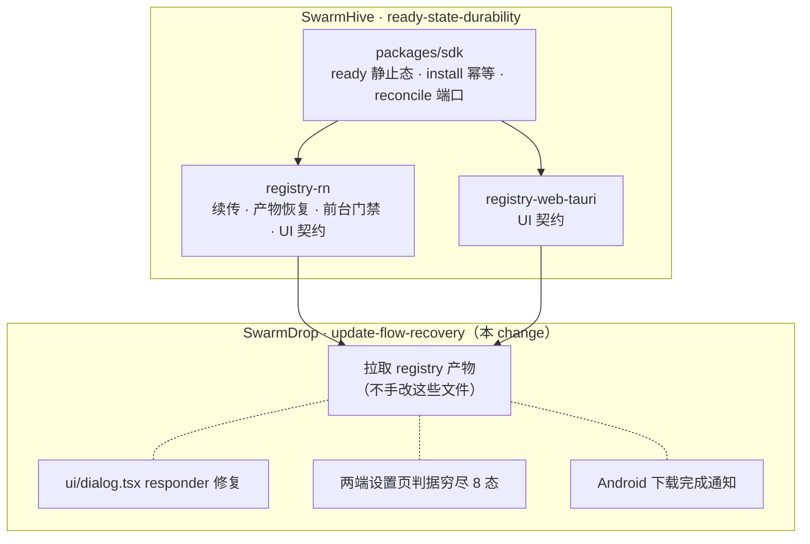

# Design — update-flow-recovery

## 与上游的分工



判断一个文件归谁的判据很硬：**头注释里有「由 `@swarmhive-rn` registry 分发」声明的，一律
不在本仓改**。就地改会在下次拉取时被静默覆盖，且改动不会回流给其它 app —— 这条教训已经
在 `harden-rn-apk-downloader` 里付过一次学费（registry 给每个新 app 发了一个不设防的下载器）。

---

## D1：responder 抢占 —— 为什么修在本仓而不是提 issue

`@rn-primitives/dialog` 的 `Content`：

```js
function onStartShouldSetResponder() { return true; }   // 恒真
// ...
<Component onStartShouldSetResponder={onStartShouldSetResponder} {...props} />
```

它的目的正当：挡住弹窗内部的点击穿透到 `Overlay`（`Overlay` 的 `onPress` 会关闭弹窗）。
问题在实现方式 —— touch **start** 就抢 responder，等于宣布「这一片的所有手势都归我」。
Android 上 JS responder 一旦授予会触发 `blockNativeResponder`，原生 `ScrollView` 的滚动
就此失效。

三个可选修法：

| 方案 | 评价 |
|---|---|
| 提 upstream issue 等修复 | 正确但阻塞不了本次交付；`popover`/`select`/`tooltip` 四个包都要改 |
| 在 `ReleaseNotesView` 外面套手势拦截 | 治标，且每个「弹层内可滚区域」都要套一遍 |
| **本仓 `ui/dialog.tsx` 覆写这个 prop** | 一处覆写，覆盖所有弹层内容；shadcn 式组件本就是「拷进仓库自己维护」的模型 |

选第三个。`{...props}` 排在 `onStartShouldSetResponder` **之后**，所以本仓传一个自己的
实现就能覆盖它 —— 不需要 patch node_modules。

覆写的语义：**只在手势不是滚动意图时才抢 responder**。最简形式是改用
`onMoveShouldSetResponder` 语义或直接不抢（让 `Overlay` 的 `onPress` 靠命中区域自然区分）。
`Overlay` 与 `Content` 在布局上本就是父子关系，`Content` 区域内的 press 事件不会冒泡到
`Overlay` 的 `onPress`（RN 的 `Pressable` 只响应落在自己边界内、未被子节点消费的触摸），
所以恒真的抢占本身可能就是多余的防御 —— 实现时先验证这一点，若确实需要防穿透，改成
`onStartShouldSetResponderCapture` 之外的、不阻断子节点的方式。

⚠️ 这个覆写影响**所有**弹窗内容，不只更新弹窗。改完要回归验证至少：更新弹窗的 release
notes、设备详情弹层、任何带 `ScrollView` 的 `AlertDialog`。

---

## D2：状态判据必须穷尽，不能推导

两端设置页现在的写法都是「挑几个状态特判，其余落 else」：

```ts
// mobile/src/app/settings/about.tsx —— 二元判据，ready 落进「已是最新」
const hasUpdate = status === "available" || status === "force-required";
```

```tsx
// src/routes/_app/settings/-about-section.tsx —— ready 与 downloading 并进同一个 disabled 按钮
case "downloading":
case "ready":
  return <button disabled>下载中...</button>;
```

两处都是同一个错误的两种形态：**把 8 态映射到 3~4 个 UI 分支，剩下的靠 default 兜底**。
只要新增或改变一个状态的语义，兜底分支就会开始说谎 —— 这次说的谎是「已是最新」。

改为对 `UpdateStatus` 做**穷尽 switch**，每个态一个明确分支，交给 TS 的
`satisfies never` / exhaustive check 兜底。8 个分支不多，而且它把「这个态该显示什么」这件事
从推导变成了查表。

`ready` 的分支内容（三端一致）：主按钮「立即安装」**可点**，副文案说明产物已就绪。

---

## D3：通知只做「下载完成」这一条

移动端已有 `src/core/notifier.ts`（高优先级渠道 + `ensureNotificationPermission` +
只检查不请求的变体）与 `foreground-service.ts`（保活 + 传输进度常驻通知）。加通知是接线，
不是新建能力。

**只发一条**：`ready` 且 app 不在前台时，发「新版本已下载，点击安装」。

- 点击通知 → 拉起 app → app 进前台 → 上游的 `useAutoInstall` 自动尝试一次 install →
  系统安装框正常弹出。整条路径不需要本仓写任何安装逻辑。
- 用户点通知触发的 Activity 启动是 Background Activity Launch 的**合法例外**
  （"activity started from a PendingIntent sent by the system"），这正是绕开本次故障的机制。

**不发**的三类：
- 下载进度通知 —— 前台服务的常驻通知已经被传输进度占用，再加一条更新进度是噪音；
  且下载本就不该霸占用户注意力（Play 的 flexible 模型同理）。
- 「有新版本可用」通知 —— 更新提示已有应用内弹窗，通知层重复劝说是打扰。
- iOS 任何通知 —— 应用内更新通道在 iOS 不存在（走 TestFlight / App Store）。

权限用**只检查不请求**的那个变体：更新通知不值得为它弹一次权限请求框；用户若已为配对/传输
授权过，直接复用。

---

## D4：spec 债务一次还清

`mobile-version-check` 描述的实现：Tauri 移动端 → fetch `latest.json` → 读 `mobile.android`
字段 → `tauri-plugin-opener` 跳浏览器下载 APK。

今天的实现：React Native + uniffi → SwarmHive endpoint（`checkUpdateAndroid`）→ 应用内下载
到 cache → `ACTION_VIEW` 交系统 PackageInstaller。

**没有一个环节还成立。** 保留它比删掉更有害 —— `/dev-workflow` 会把 `openspec/specs/` 当作
现行架构的事实加载，一份描述着不存在实现的 spec 会让后续开发按错误的模型动手。CLAUDE.md
开篇讲的正是这个教训（文档曾漂移出整整一个大版本）。

所以：整份 REMOVED，由 `mobile-updater` 取代。`force-update` 里「移动端…点击后跳转浏览器
下载 APK」那条 scenario 属于同一批债，顺手改掉（改动极小，不值得单独开 change）。

`desktop-updater` 的「下载完成后自动安装并重启」保留，但补上失败路径 —— 它现在写得像是
无条件成立的，而 Windows 上用户在 UAC 取消就不成立。

---

## 验收：故障复现路径

本 change + 上游 change 合并后，原始故障路径必须走通：

1. 有新版本 → 点「立即更新」→ 下载中
2. **熄屏**，等下载完成
3. 亮屏回到 app → 系统安装确认框自动弹出
4. 在系统框点「取消」→ 回到 app → 看到「已取消，可重试」+ **可点的**「立即安装」
5. 杀进程 → 重开 app → check 后**直接进 ready**（不重新下载）→ 可安装
6. 下载到一半杀进程 → 重开 → 再次下载**从断点继续**

以及本仓独有的两条：

7. 更新弹窗里的 release notes **能滚动**
8. `ready` 态下设置页显示「立即安装」，**不显示「已是最新」**
