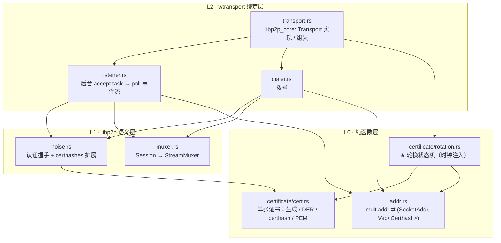
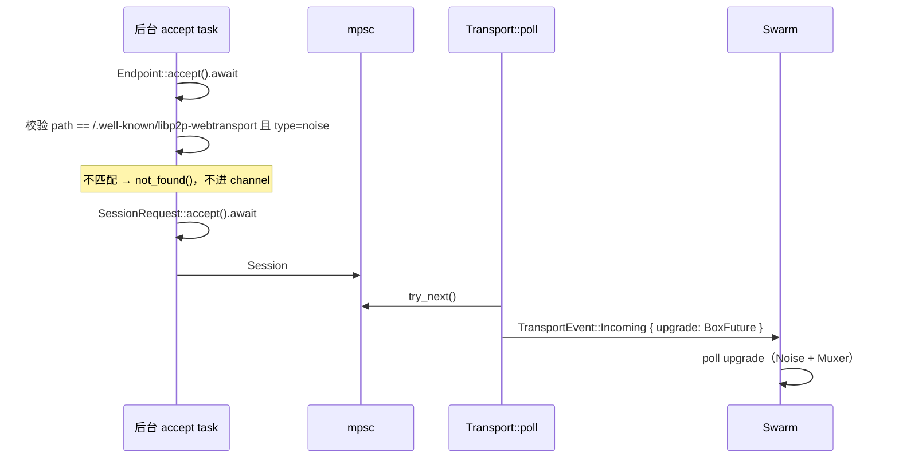

## Context

`rust-libp2p` 只有 `transports/webtransport-websys`（浏览器侧拨号，wasm），没有 native
listener——浏览器能拨、没人能接。上游 [PR #4348](https://github.com/libp2p/rust-libp2p/pull/4348)
是 mxinden 的 native 实现 draft（3 个 commit：transport + certhash 指纹 + 证书生成与过期），
自 2023-10 停滞，卡在「QUIC 与 WebTransport 想共用一个 UDP socket，当前 libp2p API 做不到」。
本 change 补的正是这个缺口，但**不追求共用 socket**（见 Non-Goals）。

本仓已有一个形态高度相似的先例：`crates/webrtc-p2p`（9088 行）。它同样是「自签名证书 +
certhash 进 multiaddr + 之后跑 Noise 认证」，同样不带 `swarmdrop` 前缀、零 swarmdrop 依赖、
计划 subtree split。本设计大量沿用它的分层与命名约定，**但刻意少一层**——原因见 Decision 3。

### 复杂度分布：这个 crate 的重心不在传输层

把两者摊开对比，是本设计的出发点：

| 维度 | `webrtc-p2p` | `webtransport-p2p` |
|---|---|---|
| 模式数 | 2（打洞 + direct），打洞要 signaling 状态机 + `NetworkBehaviour` | **1**——WebTransport 没有 NAT 穿透 |
| 建连协商 | SDP 构造、ICE、DTLS 角色、ufrag 学习 | **无**，QUIC 握手是库的事 |
| socket 复用 | 自写 1121 行 `UdpMux` | **无**，独占端口 |
| 子流 | DataChannel + 自做 framing + `init` 通道陷阱 | QUIC 流**本身就是流**，muxer 极薄 |
| 后端抽象 | 必须（native webrtc-rs / wasm `RTCPeerConnection` 毫无共同点） | **不需要**（浏览器侧用现成 crate） |
| 证书 | 一张，**永久不变**，生成一次存盘 | **两张，会过期，14 天轮换，通告地址随之变化** |

只有最后一行变复杂，而它引入了 `webrtc-p2p` 里完全不存在的维度：**时间**。

结论：**本 crate 的架构成败在证书生命周期子系统，不在传输层。** 传输层基本是把 wtransport
的 async API 翻译成 libp2p 的 poll API；证书那块才是有状态、有时钟、驱动外部可见行为
（通告地址）的真子系统。若它被塞进 `transport.rs` 当成几个字段，这个 crate 就写坏了。

### Spec 的硬约束（照抄，不凭记忆）

1. 地址：`/ip4/…/udp/…/quic/webtransport/certhash/<h1>/certhash/<h2>`（可多个 certhash；
   CA 签名证书时**不加** `/certhash`）
2. HTTP endpoint 固定 `/.well-known/libp2p-webtransport`，且 `?type=noise`
3. 证书有效期 ≤ 14 天、**禁 RSA**；首启生成两张（第二张从第一张过期日开始），过期后切换
   并再生成一张，同时更新通告地址
4. CONNECT 后客户端开的**第一条流**跑 Noise 握手，不等服务端响应即可开始
5. 服务端 MUST 在 `webtransport_certhashes` 扩展里带上当前 + 所有已通告的未来证书 hash；
   客户端逐一验证

---

## Goals / Non-Goals

**Goals:**

- 浏览器（Chrome / Firefox / Safari）能用自签名证书拨通 native listener，Noise 握手完成、
  PeerId 正确
- 证书跨过期自动轮换：既有连接不断、新连接用新证书、通告地址已更新
- 证书轮换逻辑**可在单元测试里推进时间**验证，不依赖真实时钟或等待 14 天
- crate 零 swarmdrop 依赖、公共 API 不出现 `wtransport` 类型，可 subtree split 独立发布
- native↔native 集成测试能进 CI（这是实现拨号的唯一理由）

**Non-Goals:**

- **不解决 bootstrap 地址稳定性问题**。通告地址随证书轮换而变（实际寿命 28 天，见
  Decision 5），bootstrap 因此**继续以 webrtc-direct 作为第一联系点**，WebTransport 只承担
  已能拿到新地址的那条链路。这是本 change 与提示词 §2① 的分界线。
- **不与 libp2p-quic 共用 UDP socket**。`wtransport` 不暴露底层 quinn `Endpoint`，且 QUIC
  用 libp2p TLS 扩展证书、WebTransport 用普通自签名 ECDSA 证书，rustls `ServerConfig` 本就
  不同。独占端口是本设计的既定前提。
- **不做 wasm target**。浏览器侧用现成的 `libp2p-webtransport-websys`。
- **不下线 webrtc-direct**。在 WebTransport 真机验证收益之前它是浏览器唯一可用入口。
- **不用 WebTransport datagram**。libp2p 子流语义要求可靠有序，datagram 无用武之地。
- 不新增应用层加密（QUIC-TLS 已加密，且会与 bao-tree 逐块验签冲突）。

---

## Decisions

### 1. 分层：L0 纯函数 → L1 libp2p 语义 → L2 wtransport 绑定

依赖严格单向，下层永不引用上层。这是 `webrtc-p2p` 的 `protocol → backend → swarm` 的同构
简化版：



| 层 | 依赖 `libp2p-core` | 依赖 `wtransport` | 做 IO | 可单测 |
|---|---|---|---|---|
| L0 `addr` | 仅类型 | 否 | 否 | ✅ 完全 |
| L0 `certificate` | 仅 `Multihash` | **是**（`Identity` 当证书容器） | 否 | ✅ 完全，含时间推进 |
| L1 `noise` | 是 | 否（泛型于流类型） | 是 | ✅ 用内存双工流 |
| L1 `muxer` | 是 | **是**（绑定其 `Connection` 与流类型） | 是 | 集成测试 |
| L2 `listener` / `dialer` / `transport` | 是 | 是 | 是 | 集成测试 |

> ⚠️ **落地更正（2026-08-12）**：本表原先把「依赖 wtransport」一列写成清一色的否，并据此
> 推出「换库的爆炸半径锁死在 L2 三个文件」，下面 Decision 2 与 Open Question 1 都拿它兜过底。
> **那不成立** —— `certificate` 借 `Identity` 当证书容器、`muxer` 直接绑流类型，两处都是刻意
> 的（自己重做容器没有收益；为唯一一个实现造 trait 是 YAGNI）。
>
> 真正成立的版本：**换库时决定「行为」的部分一行不用动** —— 轮换状态机、地址解析、Noise
> 语义都不认识 wtransport；要改的是证书容器层 + `muxer` + L2 三个文件，每处都有测试兜着。
> 结论（可以先选 wtransport）不变，论据的强度要照实降一档。

**`noise` 泛型于流类型**仍是关键：它只要 `AsyncRead + AsyncWrite`，因此 Noise 握手能用内存
双工流测 —— 包括那条**必须红过一次**的 certhash 负向用例。

目录：

```
crates/webtransport-p2p/src/
├── lib.rs            门面：pub use + 模块级设计文档
├── config.rs         Config / CertificateStore 端口
├── error.rs          Error
├── addr.rs           L0
├── certificate/
│   ├── mod.rs
│   ├── cert.rs       L0
│   └── rotation.rs   L0 ★
├── noise.rs          L1
├── muxer.rs          L1
├── listener.rs       L2
├── dialer.rs         L2
└── transport.rs      L2
```

**替代方案**：把证书塞进 `transport.rs`（像 `webrtc-p2p` 那样只有一个 `Certificate` 类型
挂在 `Context` 上）。否决——那是「证书永不变」才成立的形态，这里证书是有状态机的。

### 2. 底层库用 `wtransport` 0.7.1

三个候选逐条对照提示词 §2② 的验证点：

| 验证点 | `wtransport` 0.7.1 | `web-transport-quinn` 0.12.0 | `h3-webtransport` 0.1.2 |
|---|---|---|---|
| 自签名 ECDSA + 取 DER 算 certhash | ✅ `Identity::self_signed_builder().from_now_utc().validity_days(14).build()`，文档明写 ECDSA P-256；`Certificate::hash() -> Sha256Digest` 文档原话就是给 `serverCertificateHashes` 用 | ⚠️ `with_certificate(chain, key)` 只收现成 chain+key，生成要自己接 `rcgen` | — |
| 固定 HTTP endpoint 到 `/.well-known/libp2p-webtransport` | ✅ `SessionRequest::path()` / `authority()` / `headers()` + `accept()` / `not_found()` / `forbidden()` | ✅ `Request` deref 到 `ConnectRequest`，`ok()` / `reject(StatusCode)` | — |
| **轮换不断既有连接** | ✅ `Endpoint::reload_config(config, rebind)`，文档原话「Useful for e.g. refreshing TLS certificates without disrupting existing connections」 | ❌ 无对应 API | — |
| 维护状态 | 0.7.1 / 2026-04-26 | 0.12.0 / 2026-08-07 | 0.1.2 / **2025-05-06** |

选 `wtransport`：三条验证点它是唯一全中的，第三条尤其是证书轮换的硬前提——库不支持就得
自己在 quinn 上重做一层 h3 + 会话管理。两者底座相同（quinn 0.11 + rustls 0.23），与本仓
既有 QUIC 栈同源，不引入第二套 QUIC 实现。

**代价**：`wtransport` 不暴露底层 quinn `Connection`，拿不到 RTT / 丢包 / 拥塞窗口
（`web-transport-quinn` 的 `Request::conn()` 能）。本仓刚做完吞吐调研，这些数字将来可能有用
——列为 Open Question，由 Decision 7 的「类型不出公共 API」兜底：真要换，换的是 L2 三个文件。

### 3. 不做 `Backend` 抽象

`webrtc-p2p` 的 `Backend` trait 存在的唯一理由是 native / wasm 两套 WebRTC 栈毫无共同点。
WebTransport 没有这个问题——浏览器侧有现成的 `libp2p-webtransport-websys`（已在本仓 pin 的
fork 里，v0.6.0，依赖 `web-sys` 的 `WebTransport` + `libp2p-noise`）。

**本 crate 整个是 native-only。** wasm 双 target 门禁靠 `crates/net` 侧 cfg 分派解决：

```toml
# crates/net/Cargo.toml
[target.'cfg(not(target_family = "wasm"))'.dependencies]
webtransport-p2p = { path = "../webtransport-p2p" }

[target.'cfg(wasm_browser)'.dependencies]
libp2p-webtransport-websys = { workspace = true }
```

新 crate 完全不必编到 wasm，`./scripts/check-wasm.sh` 的覆盖面不变。

**替代方案**：给本 crate 加 wasm 门控并包一层 `webtransport-websys`。否决——为一个只有一个
实现的抽象污染整个 L1 层签名，是 YAGNI；而且浏览器侧本来就该直接用上游 crate，多包一层
只增加维护面。

### 4. 轮换状态机：纯逻辑 + 时钟注入

**这不是审美选择，是验收标准可测性的硬约束。** 验收标准里有一条「证书跨过期切换后，既有
连接不断、新连接用新证书、通告地址已更新」。若轮换逻辑内部读 `SystemTime::now()`，这条要么
等 14 天、要么改系统时钟、要么不测——而项目规则要求「新写的护栏测试必须红过一次才算有效」，
手测做不到这件事。

```rust
/// 一对证书的轮换状态机。
///
/// **纯逻辑**：不持有时钟、不做 IO、不认识 libp2p Transport。时间从 `advance` 的参数进来，
/// 于是「跨过期」在单元测试里就是推一下 `now`。
pub struct Rotation {
    current: Certificate,
    next: Certificate,
    /// 近期已退役的 hash。spec 建议 Noise 扩展里也带上它们。
    retired: VecDeque<Certhash>,
}

pub enum Advance {
    /// 未到期，什么都不用做。
    Idle,
    /// current 已过期：next 提升为 current，并已生成新的 next。
    /// 调用方要做两件事——回写持久化、更新通告地址。
    Rotated { retired: Certhash },
}

impl Rotation {
    /// 首启：生成两张，第二张从第一张过期日开始。
    pub fn bootstrap(now: SystemTime) -> Result<Self, Error>;
    /// 从持久化的多段 PEM 恢复。**只还原，不判过期** —— 修复只有 `advance` 一条路径，
    /// 两者职责因此不重叠（落地时去掉了草图里多余的 `now` 参数）。
    pub fn from_pem(pem: &str) -> Result<Self, Error>;
    pub fn to_pem(&self) -> String;

    /// 推进时钟。幂等：同一个 `now` 调多次只轮换一次。
    pub fn advance(&mut self, now: SystemTime) -> Result<Advance, Error>;

    /// 通告地址里那串 certhash：current 在前，next 在后。
    pub fn advertised(&self) -> Vec<Certhash>;
    /// Noise 扩展要上报的集合：current + next + 近期退役的。
    pub fn noise_certhashes(&self) -> HashSet<Multihash<64>>;
    /// 交给 wtransport 起监听 / reload 的那张。`pub(crate)`。
    pub(crate) fn server_identity(&self) -> wtransport::Identity;
}
```

时钟由 `Transport::poll` 顺带推进（决策②）：每次被 poll 调一次
`rotation.advance(SystemTime::now())`。零额外机制、没有需要管生命周期的 task。代价是空闲时
poll 频率不可控、证书可能晚换几分钟——在 14 天的尺度上无害，而 `webrtc-p2p` 那一轮的教训
正是「别把 transport 驱动和别的东西绑在额外的 task 上」。

### 5. 轮换天然映射到 `TransportEvent`，不发明新机制

`libp2p_core::TransportEvent` 本来就有 `NewAddress` / `AddressExpired`。证书轮换要表达的正是
这件事：

```
Rotation::advance() → Rotated
    ↓  Transport::poll 依次吐出
AddressExpired(/ip4/…/quic/webtransport/certhash/A/certhash/B)
NewAddress   (/ip4/…/quic/webtransport/certhash/B/certhash/C)
```

上层（identify、bootstrap 通告、`crates/net` 的地址收集）无需任何特殊处理，走的是与「网卡
插拔」完全相同的路径。

**由此得到一条对上层判断有实质影响的推论：通告地址的实际寿命是 28 天，不是 14 天。**

```
第 0 天    通告 [A, B]  ← 客户端记下
第 14 天   A 过期 → 通告 [B, C]
           客户端持旧地址拨 → 服务端实际用 B → B ∈ 客户端愿接受的 {A,B} → ✅ 连得上
第 28 天   B 过期 → 通告 [C, D]
           客户端持旧地址拨 → 服务端实际用 C → C ∉ {A,B} → ❌ 断
```

spec 要求同时通告两张，本质是给客户端一个整轮的宽限期。这不改变「bootstrap 清单要定期更新」
的性质，但把紧迫度从两周降到一个月。

### 6. 证书持久化走 `CertificateStore` 端口，格式用多段 PEM

`webrtc-direct` 是 `with_certificate_pem(String)`——启动时给一次即可，因为那张证书永不变。
**这里的证书会自己变，那个形态表达不了回写**，所以用端口：

```rust
/// 证书对的持久化端口。
///
/// 与 webrtc-direct 的单张 PEM 不同——这里的证书会随轮换改变，宿主不能只在启动时给一次，
/// 还必须能在轮换发生时被回写。
pub trait CertificateStore: Send + Sync + 'static {
    fn load(&self) -> Result<Option<String>, StoreError>;
    fn store(&self, pem: &str) -> Result<(), StoreError>;
}
```

三条理由：轮换由 crate 内部触发，需要回写通道；依赖倒置——trait 定义在本 crate、宿主实现，
crate 仍零 swarmdrop 依赖；与 `crates/host` 那 6 个端口是同一体例，评审心智一致。

**格式用多段 PEM，不自己发明。** 有效期本就编码在 X.509 里，无需额外元数据字段。`load` 回来
先 `advance(now)` 一次，过期的自然被换掉。

**写入失败不得中断服务**：只 `warn!`。证书在内存里是好的，连接照常；下次启动重新生成
（后果是 certhash 变，等价于「没持久化」，而不是「起不来」）。

### 7. `wtransport` 类型不出公共 API

`webrtc-p2p` 的 `certificate.rs` 顶部已把原则写好：包一层薄 newtype，目的是把 `webrtc` 类型
挡在公共 API 外，因为 crate 要独立发布、用户不该被迫依赖某个特定版本的 webrtc-rs。逐字适用。

这同时是「将来换成 `web-transport-quinn`」的前提——换库时爆炸半径锁在 L2 三个文件，
`Certificate` / `Rotation` / `Config` 的签名一个不动。

### 8. async accept loop → poll 风格 Transport 的桥接

`wtransport` 是 `Endpoint::accept().await → IncomingSession → SessionRequest → accept().await`，
`libp2p_core::Transport` 是 `poll(cx) -> Poll<TransportEvent>`。桥接方式：



两条边界：

- **后台 task 只做「接受连接」，不碰任何 libp2p 语义**。它不认识 PeerId、不跑 Noise。
  这样它的失败模式只有一种（endpoint 挂了），生命周期与 listener 一一对应。
- **Noise 握手放在 `upgrade: BoxFuture` 里交给 swarm 去 poll**，与 `webrtc-p2p` 一致。
  这自动满足提示词 §6 第一条「别把 transport 驱动和数据传输绑在同一个 task 上」——
  握手的驱动权在 swarm，不在我们的 task。

### 9. Noise 只认证不加密，且**不设 prologue**

握手完拿到 `PeerId` 后丢弃加密流（`channel.close()`），后续子流是 QUIC 上的明文——保密由
QUIC-TLS 承担。这与 `libp2p-webrtc-utils::noise` 的形态一致。

**但有一处关键差异不能照抄**：webrtc-direct 用 `libp2p-webrtc-noise:` + 双方 DTLS 指纹作
**prologue** 来绑定信道；WebTransport 用的是 **`webtransport_certhashes` Noise 扩展**，
**没有 prologue**。两者是同一目的的两种机制，混用会让握手在第一条消息就失败。

`libp2p-noise` 两侧都现成：

```rust
// 服务端（responder）：上报
noise::Config::new(&id_keys)?.with_webtransport_certhashes(rotation.noise_certhashes())
// 客户端（initiator）：验证 —— 传入「地址里那些 certhash」
noise::Config::new(&id_keys)?.with_webtransport_certhashes(addr_certhashes)
```

验证逻辑在 `libp2p-noise` 的 `io/handshake.rs` 内部：`Some` 时才校验，收到的集合必须覆盖
期望的全部。**故意给错 hash 时握手必须失败**——这是验收标准里唯一的负向测试，只测成功路径
等于没测。

### 10. Muxer 极薄

WebTransport session 的 bidi stream 直接就是 libp2p 子流：**无 framing、无 label、无 `init`
通道**（`webrtc-p2p` 那三个坑在这里都不存在）。

唯一的适配是 async trait 方言：`wtransport` 的 `SendStream` / `RecvStream` 实现 **tokio** 的
`AsyncRead`/`AsyncWrite`，libp2p 要 **futures** 的——经 `tokio_util::compat` 转。

`StreamMuxer` 的四个方法各自映射到 `Session::accept_bi` / `open_bi` / `close`，加一个
`FuturesUnordered` 承接进行中的 `accept_bi` future。

### 11. API 门面

比 `webrtc-p2p` 简单一档：没有 signaling 就没有 `Behaviour`，也就没有那个「两者必须注册进
同一个 Swarm，否则静默挂死」的坑。

```rust
let transport = webtransport_p2p::Transport::new(
    Config::new(id_keys)
        .with_certificate_store(Arc::new(FileCertificateStore::new(path)))
        .with_handshake_timeout(Duration::from_secs(20)),
)?;
```

`Config` 用 builder，与 `webrtc-p2p::Config` 同构。`Transport::new` 返回 `Result`——证书
加载/生成会失败，构造期失败远好过第一次 `listen_on` 时才炸。

### 12. 端口与地址

独占 UDP **4004**，bootstrap 现有 TCP 4001 / QUIC 4001 / WebRTC-Direct 4003 全部不动。两条
浏览器入口并存，可灰度对比吞吐后再决定是否下线 webrtc-direct（提示词 §9 明确要求不动它）。

监听地址形态照 `webrtc-p2p::addr` 的两分法：

- **listen 地址**不带 certhash（本机指纹由本机证书决定，写进去是冗余）：
  `/ip4/0.0.0.0/udp/4004/quic/webtransport`
- **通告地址**带全部 certhash：`/ip4/…/udp/4004/quic/webtransport/certhash/<cur>/certhash/<next>`
- 通配地址（`0.0.0.0` / `::`）**必须展开成具体网卡地址**，逻辑与
  `webrtc-p2p` 的 `announce_addrs` 一致（通配地址通告出去对端没法拨）

---

## Risks / Trade-offs

| 风险 | 缓解 |
|---|---|
| **真机瓶颈可能根本不在 CPU**——回环 270 vs 80 的差距外推不到跨网（回环瓶颈是 CPU，跨网通常是带宽与 RTT），真机那条 0.36–0.96 MB/s 走的还是打洞路径而非 direct | **动手前先做真机测量**（tasks 第一项，不写代码）。判据见 `dev-notes/research/2026-08-11-web-webrtc-throughput.md` §5。若瓶颈不在 CPU，整件事的收益预期要重估，本 change 应就地中止 |
| `wtransport` 拿不到 quinn `Connection`，无连接统计 | Decision 7 兜底：换 `web-transport-quinn` 的爆炸半径锁在 L2 三个文件。spike 阶段先验证 `pub use quinn` 是否留了口子 |
| `wtransport` 更新节奏慢于 `web-transport-quinn`（4 月 vs 8 月） | WebTransport 协议已定稿（Baseline 2026），不是需频繁跟版的领域；且同上，换库成本可控 |
| **通告地址 28 天后失效**，bootstrap 是第一联系点 | 本 change 明确不解决（Non-Goals）：bootstrap 继续以 webrtc-direct 作第一联系点 |
| 证书轮换的负向验证难做 | 时钟注入（Decision 4）让「跨过期」成为一次 `advance(now + 15 天)` 调用。**护栏测试必须红过一次才算有效**——先改坏实现确认测试会红 |
| 日志在生产里一条都不出现 | `EnvFilter` 按字符串前缀匹配，`webtransport_p2p` / `wtransport` / `quinn` 互不为前缀。三条都要进桌面与移动**两份独立**的 `DEFAULT_FILTER`，并照抄 `default_filter_passes_the_targets_we_depend_on` 那条断言测试。本仓已因此吃过三次亏 |
| Rust CI 只跑 ubuntu，Windows / macOS 编译问题要到打 tag 才暴露 | 存量问题，本 change 不解决；合入前本地跑一遍 macOS |
| 回环基准方差极大（webrtc-direct 实测 51–203 MiB/s） | 吞吐对比**至少取 6 次中位数**，单次数字不可比。基准建在 `Endpoint` 上，**不手写 `libp2p_core::Transport` 的 poll 循环**（测量装置复杂度一接近被测对象就成了主要误差源） |
| `crates/net` 的 `supported_transports` 漏改 | 那份清单与组装代码同文件（刻意的），加 transport 时不可能只改一边还看不见另一边。漏报会静默拒掉合法地址 |

---

## Migration Plan

分五步，前两步不写传输层代码：

1. **真机测量**（不写代码）。分离「打洞 vs direct」这个尚未分离的变量。结论若否定收益，
   到此为止。
2. **库 spike**：起一个 `wtransport` listener，实测 ① `reload_config` 是否真的不断既有连接、
   ② 能否拿到连接统计。两条都进 Open Questions 的答案。
3. **最小可用路径**：native listener + 浏览器拨号跑通一条 echo，证明「自签名证书 + certhash
   + Noise 认证」这条链闭合。此时**不接进 `crates/net`**。
4. **接入**：`crates/net/src/transport.rs` 加地址分派、bootstrap 加 4004 监听、
   `docs/app/app` 侧改用 `webtransport-websys` 拨号。
5. **证书轮换**：单独一步——它牵动通告地址与 Noise 扩展里的 hash 列表，与前四步的关注点
   正交。

**回滚**：任何一步失败都可以就地停止，webrtc-direct 全程未被触碰，浏览器入口不受影响。
第 4 步之后若要回滚，只需从 `crates/net` 摘掉分派 + bootstrap 停 4004 监听，客户端清单里的
WebTransport 地址会自然拨不通并回落到 webrtc-direct。

---

## Open Questions

> **落地后（2026-08-12）已回答三条，逐条标注。**

1. ~~**`wtransport` 能否拿到底层 quinn `Connection` 的统计？**~~ ✅ **能。**
   开 `quinn` feature 后 `Connection::quic_connection() -> &quinn::Connection`
   直接给底层连接（另有 `Connection::rtt()`）。选型时以为要放弃这项能力，实际只是默认关着
   —— Decision 2 的「代价」一栏因此可以划掉。已经由 `Muxer::quic_connection()` 转出。
2. **`reload_config` 的语义边界。** ⚠️ **一半已答。** 「不中断既有连接」已由
   `rotation_keeps_existing_connections_alive` 实证（轮换后老连接照常收发）；但「轮换那一
   瞬间正在 CONNECT 的客户端拿到哪张证书」仍未验 —— 那需要精确的时序注入，且失败后果
   （客户端重试一次）可接受，故不阻塞。
3. ~~**bootstrap 的证书存哪？**~~ ✅ 与 `identity.key` 同目录的 `webtransport.pem`，
   可经 `--webtransport-cert-file` / `SWARM_BOOTSTRAP_WEBTRANSPORT_CERT_FILE` 覆盖。
   写入走**原子写**（临时文件 + 设权限 + rename）—— 这个文件会被周期性重写，
   写到一半掉电会留下半截 PEM，下次启动解析失败 → 重新生成 → certhash 变。
4. ~~**是否需要在地址事件之外给宿主一个轮换通知？**~~ ✅ **不需要。** 持久化回写由 crate
   内部经 `CertificateStore` 完成，宿主无需知情。诊断需求由只读的
   `Transport::certificate_expires_at()` / `certhashes()` 满足，不改变事件模型。

---

## 落地后的实测（2026-08-12）

同机回环、同一 `Endpoint` 应用层、只换 transport，64 MiB × **6 次中位数**：

| transport | 中位数 | 区间 |
|---|---|---|
| TCP + Noise + yamux | 933 MiB/s | 927–1149 |
| **WebTransport** | **322 MiB/s** | 286–326（±7%） |
| QUIC | 266 MiB/s | 248–276 |
| WebRTC-direct | 72 MiB/s | 43.7–288（6.6 倍） |

比 proposal 预估的「上限对标 270」还高。两条结论各自独立：吞吐 ≈ 4.5×，且**方差小一个
数量级** —— 对「传大文件要多久」这类用户可感知的指标，后者可能更重要。

⚠️ **WebTransport 比裸 QUIC 还快 21% 这一点没查清**（理论上它是 QUIC + HTTP/3 一层）。
可能是 quinn 配置差异或 libp2p-quic 的 stream 包装层开销。别当已知结论引用。

⚠️ **Risks 表第一行的真机测量仍未做**，这组回环数字不能外推。
