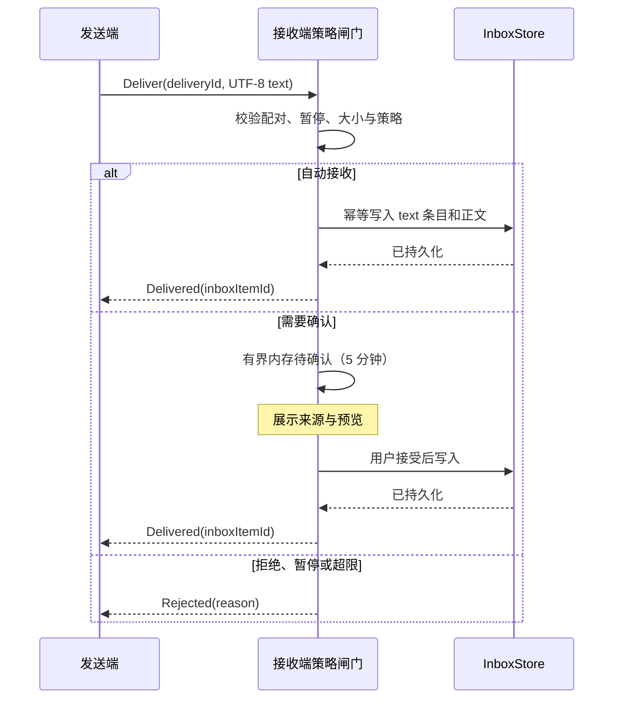
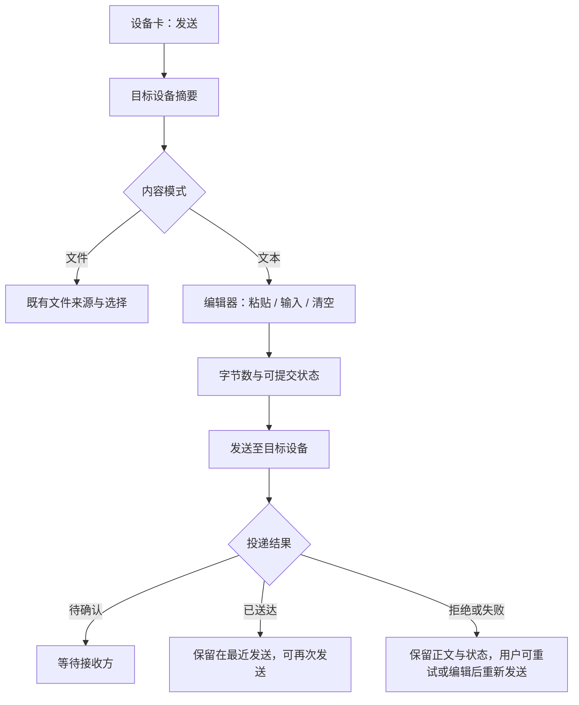

## Context

参见 [proposal.md](proposal.md)。仓库已经具备三端共享的配对身份、接收策略、传输控制面和 `InboxStore` 端口；`InboxContentKind` 也已预留 `text`。但现有发送路径从文件扫描、准备、分块传输和可恢复会话开始，收件箱详情也假定每个内容都有文件列表。直接把正文包装成 `.txt` 会把轻量文本拖进不必要的文件生命周期，并把“复制一段文字”的用户意图变成文件管理。

本文假定 `trusted-device-policies` 的策略评估已可供入站内容复用：已配对校验、暂停接收、来源信任等级、大小上限和 relay 自动接收许可都在正文持久化前裁决。三端为桌面 Tauri、React Native（经 UniFFI）和 Web/WASM；三者必须消费同一共享 core 语义，而非各自实现协议或存储规则。

## Goals / Non-Goals

**Goals:**

- 用一个独立、单请求的文本投递协议完成“设备定向发送 → 接收端安全裁决 → 持久化 → 送达回执”。
- 用统一的文本投递账本在两端保存正文和状态，使 SQL、移动与 IndexedDB 的行为一致且不依赖文件传输会话。
- 在同一发送信息架构内实现三端一致的文本模式，并把剪贴板权限和操作留在各宿主边界。
- 以明确的 64 KiB 上限、幂等投递 ID 和持久化后回执，约束内存、重试和用户可见状态。

**Non-Goals:**

- 不让文本接入文件准备、内容寻址、分块、暂停/续传、后台下载或文件传输活动历史。
- 不做持续剪贴板监听/同步、自动复制、富文本、图片/文件剪贴板、多人会话、离线队列或 MCP 文本发送工具。
- 不维护旧 wire、旧存储 DTO 或旧客户端的兼容层；本变更不改动既有文件传输能力。

## Decisions

### 1. 文本是独立的单次投递协议，不是文件传输的特殊文件

在 `crates/transfer` 定义单独、版本化的 typed RPC（概念上为 `TEXT_DELIVERY`），由 core 的协议路由与现有配对身份边界注册。请求含随机 UUID `delivery_id`、正文 UTF-8 字节和正文大小；响应只表达 `Delivered`、`Rejected { reason }`、`Expired` 或可本地化映射的失败类别。目标 peer 必须与已配对身份一致。

接收端的处理顺序如下：验证 peer 与正文 → 查询暂停和接收策略 → 自动接收时落库，或将最多 64 KiB 的正文放入有 TTL 的 `PendingTextDelivery` → 等待用户接受/拒绝 → 在单个持久化事务完成后回复。待确认项沿用当前 offer 的五分钟过期语义；未确认、拒绝和过期项只丢弃内存，绝不写收件箱。

这与把正文转成单文件 `text/plain` 相比，避免创建虚假的路径、校验和、文件浏览器和恢复语义；与聊天协议相比，它不引入会话、顺序、历史同步或离线投递。旧客户端未注册该协议时，发送端以“不支持文本投递”失败，不协商降级到文件或旧协议。

### 2. `delivery_id` 是收发对称的文本投递账本键

发送方在发起网络请求**前**写入 `TextDeliveryRecord`：随机 UUID `delivery_id`、方向、对端快照、正文、创建/更新时间、尝试次数和状态。接收方在接受后以同一键写入接收方向记录，并把它投影成 `text` Inbox 条目。发送方向记录属于 Outbox/最近发送，绝不进入 Inbox；接收方向的 Inbox 仍是用户收到内容的唯一入口。

成功重复请求返回原接收记录；同一键但正文或来源不匹配则是协议冲突，不能覆盖已有正文。用户对中断、超时或未知回执执行“重试”时复用原键与正文，因此“接收方已落库、回执恰好丢失”的场景不会创造第二条消息。用户编辑内容后选择“重新发送”则创建新的 `delivery_id`，保留原审计事实。

选择对称账本而不是只保存 Inbox，是因为发送失败后的重启恢复和幂等重试都需要一个持久化的发送事实；它仍比复用文件传输 session 简洁，因为没有 actor、分片、文件路径或恢复协议。所有重试都是用户显式动作，进程重启时的 in-flight 状态只恢复为“中断，可重试”，绝不在后台重复发送。

### 3. 收件箱用显式内容联合体承载文件或文本

将共享 `InboxItemDetail` 从“摘要加文件数组”的隐含模型收敛为显式内容联合体：`Files { entries }` 或 `Text { body }`。摘要保留 `content_kind`、来源快照、接收时间和正文的字节数，并为文本提供由领域规则裁剪的预览；接收 Inbox 项由对应的 `TextDeliveryRecord` 驱动，展示标题继续在 UI 侧按 locale 派生，不存入跨端展示字段。

原生 SQL 使用 `text_deliveries` 作为文本正文和状态的唯一载体，接收 Inbox 项一对一引用其 `delivery_id`；Web 的独立 IndexedDB 收件箱记录采用同等关系。创建、读取、软删除接收文本和清理正文由 `InboxStore` 与 `TextDeliveryStore` 协作完成；Outbox 的列表、重试和删除只经 `TextDeliveryStore`。Tauri command、UniFFI 和 WASM 只接收共享 DTO。此设计避免 nullable 文件数组/正文的组合状态，也保留未来 `Clipboard`、`Bundle` 等内容类型的清晰扩展点。

因为本变更明确不考虑兼容性，删除旧的“详情总有文件数组”的 DTO 和序列化形态，不实现双读、回填或旧数据迁移。存量持久化可随本次 schema 切换重建；文件收件箱的新版读写仍须完整保留。

### 4. 接收策略是唯一的内容许可入口

文本协议在 body 已完成格式校验后调用现有策略评估，不维护一份文本专用的允许名单。用于大小决策的值是 UTF-8 正文字节数；目录限制对文本不适用；relay 自动接收仍由策略决定。`AutoAccept`、`RequireConfirmation`、`Reject` 三个决策映射到文本投递的相同语义。

这样能保证“自己的设备可无打扰进入 Inbox、协作设备默认先确认、blocked 和暂停立即拒绝”的产品边界没有分叉。备选的“文本总自动接收”虽然快捷，但会让短消息绕过用户已经设置的接收信任关系。

### 5. UI 共享任务合同，保留宿主恰当的输入方式

三端都在既有设备卡“发送”入口之后展示同一顺序：目标设备摘要 → `文件 / 文本` 分段选择 → 正文编辑 → 当前字节数与上限 → 明确的粘贴/清空 → “发送至 {设备名}” → 真实回执；文本模式下还能展开与当前目标相关的最近发送/Outbox。`文件` 仍是默认模式，原有文件来源按钮原样保留；文本不是移动端的第五个来源按钮，也不进入常驻导航。

视觉沿用现有 Encrypted Workbench：中性背景、内容 panel 的克制玻璃层、平面控件、单一 teal 主强调色和语义状态色。文本编辑区域是本屏焦点；不新造装饰性卡片或渐变。三端使用同一条本地化文案语义，但按输入习惯微调：桌面支持快捷键提交，移动将发送固定在既有底部操作栏，Web 在安全上下文且用户手势内调用 Clipboard API。

文本 Inbox 详情以可选择、`pre-wrap` 等价的正文视图呈现，操作只保留复制和删除。正文不是代码块也不自动截断；列表只显示短预览以避免意外暴露。所有交互控件带可访问名称，状态以文字加语义色呈现，触控目标不小于 44 × 44。

### 6. 剪贴板是宿主服务，且总由用户手势驱动

发送编辑器只有用户点击“粘贴”才请求宿主读取；收件箱详情只有用户点击“复制”才写入。桌面继续仅调用 `src/lib/clipboard.ts` 的原生 plugin 封装；移动使用受用户动作触发的原生剪贴板 bridge；Web 只在安全上下文、用户手势内使用 Clipboard API，失败时保留浏览器原生粘贴和手动输入路径。

统一 `ClipboardPort` 形状（`readText` / `writeText` 及可分类错误）只在前端/宿主适配层暴露，不穿越到 core 或 wire。这样可以在不污染共享领域逻辑的情况下处理权限、浏览器能力和平台特性，也确保接收文本不会隐式覆盖用户现有剪贴板。

## Risks / Trade-offs

- **[确认期间正文暂留内存]** → 单条最多 64 KiB、待确认项有上限和五分钟 TTL；进程退出即丢弃且发送方得到未送达，不产生半条 Inbox 记录。
- **[纯文本可能承载敏感内容]** → 收发两侧都明确可见地保存正文；不在通知正文或列表中展示完整内容；不自动复制；用户删除记录时删除其本地持久化正文。
- **[回执丢失导致用户担心重复发送]** → Outbox 将其标成“送达状态未知、可重试”，重试复用 `delivery_id`，接收端以来源和正文绑定做幂等判定。
- **[后台重启意外重发敏感文本]** → 任何 in-flight 记录在启动时一律转为中断可重试，绝不自动联网重试。
- **[新 DTO 影响三端绑定和 MCP 的既有文件假设]** → 通过穷尽匹配和跨端 DTO 导出测试强制编译失败；本期明确删除不适用于文本的文件操作，不做静默空数组兼容。
- **[Web 剪贴板权限不稳定]** → 粘贴只是增强按钮；文本框始终支持键盘/系统原生粘贴，失败不丢正文。
- **[旧客户端不支持新协议]** → 发送页在能力不可用时给出明确错误，不使用文件伪降级，文件传输本身保持现有协议。
- **[正文预览可能泄露屏幕信息]** → 列表预览固定为短摘要；进入详情和复制都需显式操作。

## Migration Plan

1. 先落地共享协议、策略接入、`TextDeliveryStore`、收发对称账本和收件箱联合 DTO，再为 SQL、Web 和移动 core 同步实现唯一性约束与原子 Inbox 投影。
2. 同一变更中重新生成 desktop TypeScript bindings、UniFFI 与 WASM 导出，并在三端接入文本发送/Outbox/收件箱 UI；任一端未具备协议和存储实现时不得发布该能力。
3. 删除旧详情 DTO/持久化形态，不建立双写、回填或旧 wire fallback。发布版本整体切换；旧版本收到未知文本协议时只表现为不支持。
4. 回滚时撤回包含该协议和 schema 的整包版本；不尝试把新文本载荷降级写成文件或反向迁移至旧数据库。

## Open Questions

无。64 KiB、五分钟待确认窗口、收发对称的持久化账本、用户显式重试以及不做连续剪贴板同步均为本变更的有意取舍；后续若需要富内容或跨设备历史同步，应独立提案，而不是扩展本协议。
