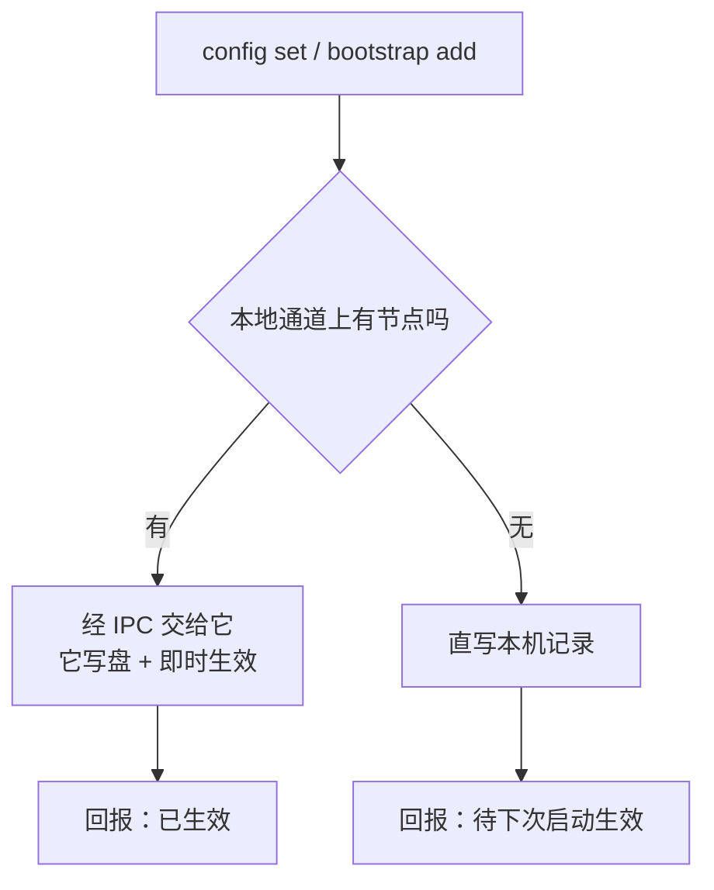

## Context

见 `proposal.md` 的 Why。这里只记实现要面对的现状：

- **设备名**已经有持久化与端口了（`crates/host` 的 `DeviceConfig` trait，CLI 侧实现是
  `JsonFileDeviceConfig`，落在数据目录的设备配置文件里）。缺的只是一个改它的入口，以及
  「有节点在跑时怎么改」——直写文件会让常驻节点的内存里那份变陈旧。
- **接收落点**在 `crates/cli/src/adapter/receive.rs`：`SWARMDROP_RECEIVE_DIR` 覆盖，否则
  `<下载目录>/SwarmDrop`。零持久化。那个模块的注释已经论证过「命令行宿主用环境变量而非
  配置文件做覆盖」，本变更不推翻它，只是在它下面补一层。
- **引导节点**是 `crates/cli/src/runtime/bootstrap_nodes.rs` 里的编译期常量数组，经
  `NetworkRuntimeConfig::bootstrap_nodes` 交给内核。三端已经有「自定义 + 内置」的完整模型
  与运行时意图接口（`bootstrap-node-settings` + `infra-link-status`），CLI 没接。
- **命令与常驻节点的关系**已有现成体例：`RecordAccess` / `DaemonAccess`——有节点就经本地
  通道复用它，没有就直读本机记录（`crates/cli/src/runtime/access.rs`）。新命令照着走。
- **设备表那条缺陷已实现修复**（`runtime/watch/{event,serve}.rs`），本文档只记它的判据。

## Goals / Non-Goals

**Goals:**

- 让第四个宿主在「可配置性」上与另外三端齐平，且不为此新造一套与它们不同的模型。
- 配置的读面足以驱动一个**别人写的**设置界面：值、来源、是否被覆盖、写入后是否已生效。
- 所有写入都不重启节点。

**Non-Goals:**

- 不做配置文件的手工编辑体验（`config edit`、注释、schema 导出）。命令面是唯一入口，
  文件格式是实现细节。
- 不把 CLI 的配置项塞进 `crates/host` 的端口。落点与引导清单是**宿主部署配置**，core 不
  认识它们，为它们扩端口会让移动端与桌面端也被迫实现两个用不上的方法。
- 不做配置的导入导出与多 profile。

## Decisions

### D1. 设备名留在既有端口，落点与引导节点进一个 CLI 私有配置文件

设备名经 `DeviceConfig` 端口读写（core 要用它——邀请串与配对请求都携带设备名），**不搬家**。
落点与引导节点新起一份 CLI 自己的配置，落在数据目录内。

**为什么不合并成一个文件**：`DeviceConfig` 是 core 的端口，四个宿主各有实现。把「接收落点」
「引导节点清单」加进去，移动端与桌面端就要实现两个它们用不上的方法——它们的这两项分别在
`receive-location` 与 `preferences-store` 里，语义也不同（移动端的落点是 SAF tree URI）。

**为什么不是每项一个文件**：三项以下、同一读写时机、同一生命周期，拆文件只增加原子写的
份数。CLI 私有的那份用一个文件。

**替代方案**：把 CLI 的配置也做成一个 `crates/host` 端口（`HostSettings`）。否决理由同上——
它会是一个只有一个实现者的端口，而端口的成本由所有实现者分摊。

### D2. 写入路径按「有没有节点」分叉，且分叉点只有一个

沿用 `RecordAccess` 的既有体例：



**有节点时必须走 IPC，不能直写**：常驻节点内存里持有设备名（identify 的 `agent_version`）
与 infra 意图。绕过它直写文件，磁盘与内存会分叉——用户改完名字，对端看到的还是旧的，而
文件里已经是新的，重启之后才「莫名其妙地」生效。这是本变更最容易写错的一处。

**无节点时不为了写入而拉起节点**：`cli-command-surface` 的「只有需要联网的命令才启动节点」
直接管到这里；`bootstrap-node-settings` 的新场景也把它写成了判据。

### D3. 引导节点是「内置 ⊖ removed ⊕ custom」，两个集合都持久化

合并规则固定为：

```
生效清单 = (内置清单 − removed) ∪ custom
```

- `bootstrap add <addr>`：若 `addr` 在内置清单里且在 `removed` 中，从 `removed` 移除；
  否则加入 `custom`。
- `bootstrap remove <addr>`：若 `addr` 在 `custom` 中，从 `custom` 移除；若它是内置的，
  加入 `removed`。

⚠️ **这两条不对称是必须的**：把「撤销一条内置项」实现成「把内置清单复制进 custom 再删一条」
会得到同一个已知故障——版本更新换掉内置地址时，老用户的 custom 里躺着一份旧地址快照，
新地址永远到不了他手上。`bootstrap-node-settings` 已经为 Web 端写过这条，CLI 照搬。

**允许清空到零条**：不设下限。只在局域网内用 SwarmDrop 是合理场景，而一个「至少留一条」的
下限会在用户想换掉全部内置节点时挡住他（他得先加后删，顺序错了就被拒）。代价是用户可能把
自己配到连不上公网——由 `status` 如实显示「无引导节点」承担，不由写入路径拦。

### D4. 落点的三层来源，以及「写了但不生效」必须说出来

优先级 `SWARMDROP_RECEIVE_DIR` → 持久化配置 → `<下载目录>/SwarmDrop`，环境变量保持最高。

**难点不在优先级而在告知**。一个设置界面拿到的如果只是「当前值」，它无法解释为什么用户
刚改的值没生效，用户会反复改那个输入框。所以结构化读面对每一项给出：

| 字段 | 含义 |
|---|---|
| `value` | 当前**生效**的值 |
| `source` | `env` / `config` / `default` |
| `configured` | 持久化配置里的值（没有则空）——`source == "env"` 时它就是那个被压住的值 |

写入时同理：结果要说清是「已生效」还是「已保存，但当前被环境变量覆盖」。

**替代方案**：环境变量存在时直接拒绝写入。否决——脚本里设了环境变量的机器上，用户就永远
配不了那台机器的默认值，而他很可能正是在为「以后不带那个环境变量跑」做准备。

### D5. 设备名的即时生效复用 core 的改名编排

`live-device-rename` 已经规定「改名编排收在 core，宿主不自行拼装」，并且它同时覆盖 identify
与配对面。CLI 有节点时经 IPC 调那条编排，**不自己拼** `agent_version`。

⚠️ 依赖 libp2p fork 的运行时 `agent_version` setter（上游 PR #6576，见 CLAUDE.md）。它已经
在本仓 pin 的分支里，所以这是既有能力而非新依赖；但**若将来切回官方 git 且 #6576 未合并，
这条会退化成「下次启动生效」**，届时要改的是回报的生效状态而不是悄悄重启节点。

### D6. 设备表的单一产出点（已实现）

订阅面上的设备表只能由「向节点现取 `DeviceFilter::Paired`」这一处产出。内核的
`CoreEvent::DevicesChanged` 降级为信号，与配对成功 / 解除配对 / 改名同列。

判据落在两个函数上：`affects_devices`（哪些内核事件触发现取）与 `produces_frame`
（一条事件会不会产出帧——`report_loss` 问它，而不是只问 `translate`）。两条护栏测试看守：
一条钉「内核那条事件不得被直接翻译，但仍要触发现取」，一条钉「它被丢弃时仍算截断」。

**为什么不是在翻译处过滤一下就好**：原实现**已经**在过滤（`paired_entries` 按 `is_paired`
筛）。过滤解决纯度，解决不了遗漏——被观测到的 peer 表里压根没有那台离线设备，再怎么筛也
筛不出来。这是本条最容易复发的误解，所以判据写成「来源」而不是「过滤」。

### D7. 插件侧（仓外）：设置页是一页多节，数据面按节按需取

`settings.section` 给的是一整页 + 设置面板左侧一行导航，`scope: root`，additive。组件拿到的
只有 `close()`，其余数据经 `inject` 面。

**每一节的数据都要 spawn 一个 `swarmdrop` 进程**（`invite list`、`inbox list`、`transfer list`
各一次），所以：

- 设置页 SHALL NOT 轮询。打开时取一次，用户点刷新时再取一次。
- 已经在长轮询里的那份（节点存活、设备表、配对台）继续复用，不重复取。

⚠️ **插件没法把 dsh 的设置面板打开到自己那一节**：`openSection` 只发给
`settings.onboarding` 条目，第三方拿不到。因此侧栏面板里的「收件箱」不能是一个跳转，它就地
展开最近几条；完整列表在设置页，由用户自己打开设置。

### D8. 分两批，边界是「依不依赖新 CLI 动词」

| 批 | 内容 | 依赖 |
|---|---|---|
| 1 | 节点与网络（全量监听地址）/ 设备 / 邀请清单与撤销 / 收件箱完整列表与导出 / 传输记录 / 关于 | 只用现有 CLI 动词，可先发 |
| 2 | 设备名、接收落点、引导节点三节 | 依赖本变更的 CLI 动词，随新 CLI 版本一起发 |

批 1 里**邀请清单与撤销**优先级最高：`pair-invite` 要求三端都提供它，而插件至今没有——
邀请 24 小时有效且会跨重启存活，泄露之后清点与撤销是唯一的止损手段。

## Risks / Trade-offs

- **用户把引导节点配到零条或全配错，从此连不上公网** → 写入前的同步校验只能挡格式错误，
  挡不住「地址对但那台机器没在跑」。缓解：`status` 与设置页如实展示每条的 `InfraLink` 状态
  （连接中 / 已就绪 / 连不上 + 原文错误），让用户自己看得出来；不设下限的理由见 D3。
- **有节点时的写入依赖本地通道，通道坏了写入就失败** → 这是刻意的：宁可失败也不要直写出
  一个与运行中节点分叉的值。失败信息要指出节点在跑但通道不通，而不是笼统的「保存失败」。
- **落点改了，正在进行的接收怎么办** → 已开始的会话继续用它开始时的落点，避免一次传输的
  文件散在两个目录。spec 只承诺「对此后收下的内容生效」。
- **`config` 与 `bootstrap` 两个新顶层名词让顶层帮助从 11 条变成 13 条** → 接受。替代方案
  （全塞进 `config`）的代价是集合被迫用整值写入表达，那是一个已知会咬人的模型（D3）。
- **设置页每节一个进程** → 打开设置页会在短时间内 spawn 三到四个 `swarmdrop`。可接受
  （每个都是毫秒级、只读本机记录、不启动节点），但**不能变成轮询**，见 D7。
- **插件与 CLI 版本错配**：用户升级插件但没升 CLI，设置页的批 2 那几节会调到不存在的动词。
  缓解：沿用 `--decide-from-stdin` 那次的做法——识别 clap 的 `unexpected argument`，给一句
  「这项需要 swarmdrop x.y.z 或更新的版本」，而不是把 usage 文本甩给用户。

## Migration Plan

- `swarmdrop config` / `bootstrap` 是纯新增，无迁移。
- 引导节点由常量改为「内置 + 增删」后，**没有做过任何增删的用户读到的清单与今天逐字相同**，
  且此后仍随版本更新——这是 D3 的合并规则直接保证的，不需要回填。
- 首次启动时自动派生的设备名保持不变；本变更只是给了它一个改的入口。
- 回滚：删掉两个新命令即可，配置文件留在数据目录里不影响旧版本（旧版本不读它）。
