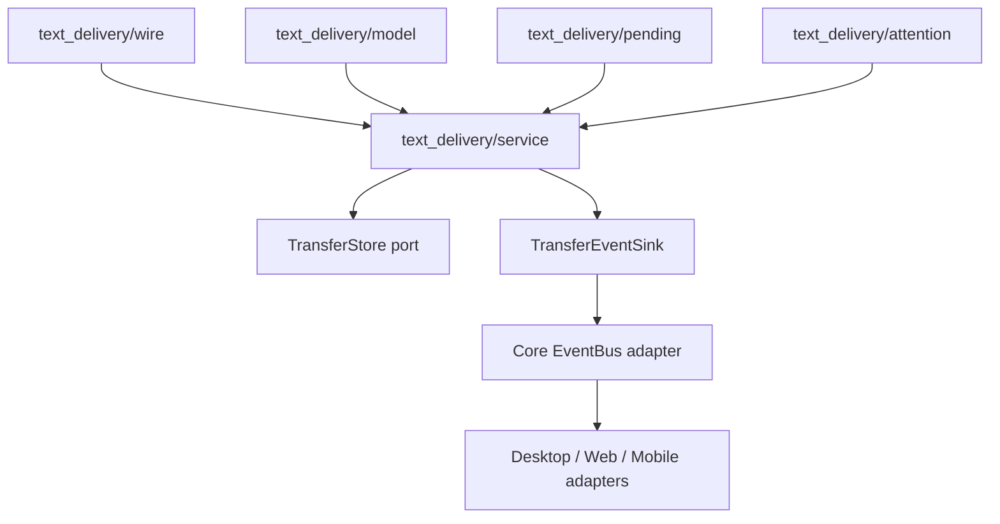

## Context

参见 [proposal.md](proposal.md)。现有文本投递在 `crates/transfer/src/text_delivery.rs`、`text_service.rs` 与 `protocol.rs` 间拆分，接收成功后只写入账本和收件箱；前端以约三秒轮询发现状态。文件传输已通过 `TransferEventSink → CoreEvent → EventBus` 跨越 core 与宿主边界，桌面也已有按窗口焦点发送原生通知的 host 适配器，但两条机制尚未用于文本。

桌面、Web 和 React Native 不能共享同一个渲染组件；`packages/shared-view` 是三端可共享的纯视图逻辑边界。当前桌面与 Web 各自实现文本发送表面，造成控件尺寸、信息层级和反馈语义漂移。

## Goals / Non-Goals

**Goals:**

- 文本在变为可处理或可查看之后，以有序、幂等的领域事件驱动宿主注意力。
- 让宿主通知成为 core 事件的边缘适配，而非把 Tauri、浏览器 API 或 UI 状态引入 transfer 域。
- 建立跨端可测试的文本视图契约，并由各宿主渲染为合适的桌面、Web 与移动布局。
- 将文本领域从 transfer crate 根目录的平铺文件收拢到内聚模块，缩小公共导出面。

**Non-Goals:**

- 不以 Service Worker、Push 服务或云端中继维持已关闭 Web 页面的 P2P 接收；Service Worker 仅在已有事件触发后展示通知，不能独立运行节点。
- 不在本 change 重构所有文件传输、session 或 inbox 模块；仅重组为本功能而变动的文本领域，其他平铺模块留待有独立行为目标的 change。
- 不增加移动系统后台通知、正文锁屏预览、自动剪贴板写入，或覆盖整个产品的 UI 一致性审计。

## Decisions

### 1. 以持久化后的 `TextDeliveryAttention` 领域事件作为唯一即时信号

文本服务在接收记录和对应收件箱投影已可读取后，发射只包含 `delivery_id`、来源快照和注意力种类（`confirmation_required` / `received`）的事件。待确认记录在持久化为待处理后发射；自动接收记录在正文与收件箱投影均成功写入后发射。状态机以 `(delivery_id, attention_kind)` 去重，并在事件投递失败时不回滚已持久化数据。

这样保证通知或面板永远能定位到真实数据，重连重复 RPC 不会生成通知风暴。前端事件消费负责即时失效 inbox 查询；定时读取仅作为启动、重连和事件遗漏后的协调，不再承担到达提醒。

考虑过让 UI 直接监听 pending 列表的轮询、或由持久化层直接调用通知 API。前者在后台会被浏览器节流且延迟不可预测，后者把宿主副作用倒灌进领域层；两者均不采用。

### 2. 确认队列与通知职责分开

核心只维护待确认投递的顺序、幂等 accept/reject 和过期处理；所有宿主共享“一个可见确认面板 + FIFO 后续队列”的体验规则。自动接收不会进入该队列，只发送收件箱刷新和非阻断反馈。

桌面 notifier 在接收注意力事件后检查窗口焦点：未聚焦时调用现有原生通知 plugin。通知正文固定为“来自 {device} 的一条文本”，绝不带文本预览；通知激活通过应用内深链/路由意图打开收件箱。通知失败仅记录可观测错误，不影响投递状态或确认队列。

这避免“弹窗 = 系统通知 = 待确认状态”三者相互耦合，也让通知权限、平台失败和窗口焦点不改变文本协议结果。

### 3. Web 只对存活页面提供显式授权后的浏览器通知

Web 通过一个窄的 `TextAttentionNotifier` 适配接口检查 `Notification` 支持、权限、`document.visibilityState` 与焦点。设置页中的用户点击是唯一调用 `Notification.requestPermission()` 的路径；正常事件处理绝不触发权限请求。事件发生于页面隐藏或失焦且权限为 `granted` 时创建浏览器通知，点击后聚焦/导航到 Inbox。页面可见时由应用内反馈处理。

页面关闭或节点不运行时，Web 不会收到 P2P 事件，因此没有通知承诺；下次节点运行后依靠收件箱同步呈现已持久化内容。考虑过用 Service Worker 解决该限制，但没有 Push 发送方时它不能接收新的网络事件，且会破坏本项目无服务端的边界，故不采用。

### 4. 以共享纯语义模型收敛 UI，而不强行共享组件

在 `packages/shared-view` 建立文本投递的纯 view-model、文案键和状态映射：内容类型选项、UTF-8 字节计数与 `KiB` 显示、发送记录状态、确认队列项和反馈动作均从这里导出。桌面、Web 与移动各自用本地 design tokens 渲染，保持可访问性和屏幕适配。

统一视觉契约为：紧凑、等宽的文件/文本分段控件；设备目标后依次显示编辑区、辅助动作、限制/状态、历史、主要提交动作；不把发送模式选择拉伸为容器全宽。移动可以把提交操作置于安全区底部，桌面/Web 可以置于固定命令区，但动作层级、名称和状态不得变化。

考虑过抽取跨 React DOM 与 React Native 的 UI 组件。其会把宿主布局、焦点与通知限制混入共享包，反而增加耦合，因此只共享纯逻辑和测试夹具。

### 5. 建立 text delivery 垂直模块边界

把根目录的 `text_delivery.rs` 与 `text_service.rs` 重组为下列领域模块，根 `lib.rs` 仅重导出有意公开的 API：

`wire` 只承载文本 RPC 类型与编解码边界，`model` 只承载记录及内容校验，`pending` 只负责并发安全的确认状态机，`service` 编排策略、持久化与 RPC，`attention` 只描述领域事件及去重键。公共存储端口仍位于 `store`，避免 text 模块反向拥有其他 transfer 域共享的端口。旧模块路径直接移除并更新调用方；本 change 接受该 source-level breaking change。

### 6. 测试围绕状态、边界和宿主适配分层

领域单测覆盖先持久化后发事件、重复 delivery、连续确认、accept/reject 竞争、超时与事件失败。属性/变异测试针对 pending 状态机和状态映射：例如删去去重、颠倒持久化与发射、允许两个可见确认项或将 `KiB` 计数改为字符数时，测试必须失败。适配层使用可控的焦点、可见性、权限与通知 fake，UI 测试覆盖键盘焦点、触摸可达性、降级分支及三端共享 fixture 的一致输出。

## Risks / Trade-offs

- [事件先于界面挂载而丢失即时反馈] → 启动、恢复焦点和进入 Inbox 时用持久化读取协调；即时事件不作为唯一数据源。
- [并发 accept/reject 或网络重试造成重复回答] → `pending` 持有原子状态转换和 delivery-id 幂等键；完成后只允许一个终局结果。
- [操作系统通知暴露敏感文本] → 所有后台通知使用泛化正文，正文只在已解锁的应用内确认或收件箱中显示。
- [浏览器权限或后台节流导致提醒不稳定] → 权限显式管理、仅将浏览器通知作为增益，不承诺关闭页面后的到达提醒。
- [共享视图包成为跨端样式耦合点] → 只共享纯数据、文案键与状态映射，不导出宿主组件或 CSS。

## Migration Plan

1. 将文本领域模块移动到新边界，并先以编译、单元测试和协议回归验证内部重组。
2. 增加事件到 core/宿主的端到端桥接，保留读取轮询作为协调回退；任何阶段均以持久化账本为恢复来源。
3. 分别接入桌面、Web、移动的前台注意力表面，再启用桌面原生通知和 Web 显式授权通知。
4. 以共享 fixture 收敛三端文本发送视图和本地化文案，完成视觉与可访问性回归。
5. 若需要回滚，停用宿主 attention adapter 并回退 UI 事件订阅；已持久化的文本、收件箱和既有 RPC 不受影响。由于本变更明确接受 source-level breaking module path，内部 Rust 调用不提供兼容 re-export。
