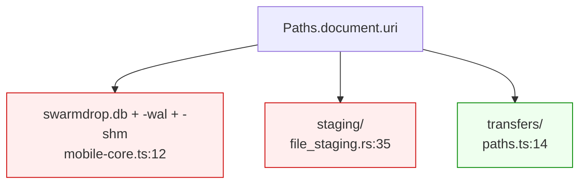

## Context

移动端把「应用私有数据」与「用户接收的文件」放在同一个目录下：



这一处纠缠同时造成两个后果。其一，接收落点继承了「私有」属性，于是系统 picker 选不到它——发送页的四个来源全部是系统 picker，收到的文件因此无法转发；`canOpenSaveFolder()` 也只能对 Android 私有目录返回 `false`，「打开文件夹」入口整个消失。其二，一旦想把接收区暴露给用户（iOS 只需两个 Info.plist 键），数据库与暂存半成品会**一并**暴露，用户可在「文件」App 里删除它们。

约束：

- `staging/` 不能挪到 cache（`file_staging.rs:33` 已论证：它要跨「中断 → 用户过几天再恢复」存活，而 cache 会被系统清理）
- Android 11+ 起 `Android/data/` 连系统文件管理器都不可达，用户可见落点只有 MediaStore 与 SAF 两条路
- expo-file-system 的 `Paths` 只暴露 `cache` / `bundle` / `document` / `appleSharedContainers`，没有 Application Support
- Safari 与 Firefox 的**任何版本**都不支持 `showDirectoryPicker`，只支持 OPFS
- 用户基数极小，明确接受破坏性变更，不做数据迁移

## Goals / Non-Goals

**Goals:**

- 接收落点在所有平台上恒为**用户可见位置**，且这一点是类型与流程共同保证的，而非约定
- 应用私有数据（db、staging）与用户文件在存储上彻底分离，各自归属清晰
- 消除 `save_dir` 的第三态，使两条 publish 路径成为平台判据而非运行时分流
- 引导流程可扩展：新增一个配置性步骤时，存量用户自动补跑，无需额外迁移代码
- 三端「从收件箱直接发送」共用同一条反向流，不引入新的传输概念

**Non-Goals:**

- 不做任何数据迁移、双写或回填
- 不引入 File System Access API，不追求 Web 端与桌面端落点同构
- 不改动传输协议、chunk 校验、续传语义或 `receive-staging-publish` 已确立的两阶段模型
- 不实现 Android MediaStore 落点（备选方案，理由见下）
- 不为「已接收文件」引入独立的文件源类型或新的 IPC 契约

## Decisions

### D1. `dataDir` 与 `saveDir` 是两个角色，按平台各自解析

二者当前是同一个值的两种用法。拆分后各自有独立判据：

| | 应用私有数据区 `dataDir` | 用户可见接收区 `saveDir` |
|---|---|---|
| 内容 | `swarmdrop.db`、`staging/` | 收到的文件 |
| iOS | `Library/Application Support/` | `Documents/`（经 Info.plist 暴露给「文件」App） |
| Android | `<internal>/files/`（不变） | 用户选定的 SAF tree |

Rust 侧完全不受影响：`MobileCore` 只认一个 `data_dir` 字符串，db 与 staging 都挂在它下面，换值即整体搬迁，`file_staging.rs` 零改动。

**为什么这是正确的切分**：两者的生命周期、可见性、备份策略、以及「用户删掉它意味着什么」全都不同。放在一起时，任何一方的可见性决策都会强加给另一方——这正是当前无法开启 iOS 文件共享的原因。

*备选*：保留同一目录，靠子目录约定隔离。否决——Info.plist 的暴露粒度是整个 Documents，子目录约定挡不住它。

### D2. 接收落点是三态，而不是「一个 URI 加一个回退」

`resolveReceiveLocation(): string` 当前的签名迫使它必须返回点什么，于是回退到私有目录——**孤岛是这个签名的必然产物**。改为显式三态：

```ts
type ReceiveLocation =
  | { status: "ready"; uri: string }
  | { status: "unconfigured" }          // Android 尚未选择
  | { status: "revoked"; previousUri: string }  // SAF 授权失效
```

三个分支都是真实领域状态，调用方必须穷尽处理（无 `default` 的 switch，新增变体在编译期报错）。`unconfigured` 与 `revoked` 分开是必要的：前者引导用户「选一个目录」，后者要说明「原目录不可用了」并给出原路径帮助用户找回。

*备选*：`string | null`。否决——`null` 无法区分「没选过」与「选过但失效了」，UI 只能给一句含糊的提示。

### D3. 平台判据只出现在两个地方，各自对应一个角色

新增 `mobile/src/core/receive-location.ts`，作为用户可见接收区的**唯一**入口：`getReceiveLocation()` / `pickReceiveLocation()` / `requiresUserChoice()`。私有数据区的平台分支留在 `paths.ts`。

`paths.ts` 现有的 `resolveReceiveLocation()` 与 `transfersInboxUri` 一并移除——路径拼接与「接收落到哪」是两件事，前者是纯函数，后者涉及用户偏好、系统授权与交互。

### D4. iOS 的 Application Support 路径走原生模块，不做字符串推导

从 `Paths.document.uri` 替换末段得到 Application Support 只需十行，但被否决：

- 它把「`Documents` 与 `Library/Application Support` 是兄弟目录」这一**实现细节**当成契约。iOS 容器布局历史上变更过，Apple 未承诺它稳定。
- 失败模式是静默的：路径算错就在一个不存在的位置建库，用户看到的是「数据全没了」，而非一条错误。
- iOS 上 **Application Support 目录默认不存在，必须显式创建**——推导方案很容易漏掉这一步，且漏掉后的表现同样是静默失败。

新增 `mobile/modules/app-paths`，调用官方 `FileManager.urls(for: .applicationSupportDirectory)` 并确保目录存在。与既有的 `content-share`、`lan-multicast` 同构；那两个只有 `android/`，这个只有 `ios/`，对称。

### D5. iOS 接收落点是 `Documents` 根，不套 `transfers/` 子目录

「文件」App 已提供 `On My iPhone / SwarmDrop` 这一层。再套一层用户看到的是 `SwarmDrop/transfers/`，是纯粹的冗余层级。`Documents` 在治本后**只存收到的文件**，其语义已经等同于 `transfers/`。

### D6. Android 走 SAF，不走 MediaStore

| | SAF | MediaStore.Downloads |
|---|---|---|
| 新原生代码 | **零**（`publishToTarget` 已走 content://） | 需自研模块 |
| 用户交互 | 选一次目录 | 无 |
| 落点 | 用户指定 | `Download/SwarmDrop/`（`RELATIVE_PATH` 仅为 hint） |
| 授权持久化 | expo-fs 的 `FilePickerContract.kt:48` 已调 `takePersistableUriPermission` | 不适用 |

选 SAF：它复用已有的整条 publish 路径，代价是一次目录选择——而这次选择本就该发生（「收到的文件放哪」是本应用的核心语义，用户理应回答一次）。MediaStore 的零交互优势不足以抵消一个新原生模块，外加 expo-fs 对 MediaStore content URI 的兼容性、`is_pending`、重名与续传语义都需要重新验证。

*保留记录*：若将来要做「零交互默认落点」，MediaStore 是唯一的路，且它与 SAF 可共存（LocalSend 即为此形态）。

### D7. 引导完成状态由前置条件派生，而非持久化一个布尔

`onboarding-store` 当前持久化 `hasOnboarded: boolean`。新增一个配置性步骤后，存量用户因该位已为 `true` 而永远跑不到新步骤——他们将卡在「没有接收目录、又不能回退私有目录」的死角。

改为：引导是一个**有序步骤列表**，每步带一个 `isSatisfied()` 判据；路由指向第一个未满足的步骤，全满足即进入主界面。

| 步骤 | 判据来源 |
|---|---|
| 欢迎 | `hasSeenIntro`（持久化——纯介绍性，无对应状态） |
| 设备名 | `preferences-store.deviceName != null` |
| 接收目录 | `getReceiveLocation().status === "ready"`（仅 Android 需要） |
| 就绪 | 身份加载完成（过场，无持久位） |

好处有二：完成状态与真实状态**不会漂移**（不再有「标记说完成了但目录没配」）；新增步骤对存量用户自动生效，无需迁移代码。

注意漂移只在「**未配置**」这一维上被消除——「配置在、目录却已失效」仍看不见，因为判据读的是未探活的快照（见「已知限制」L2）。另外设置页不提供「清空接收目录」（清了就收不了文件），所以不存在「用户清空后被领回引导」这条路径。

*备选*：持久化「已完成步骤 ID 集合」。否决——那仍是一份可与真实状态漂移的副本，只是漂移得更慢。

### D8. Web 端确立「OPFS 暂存 → 下载发布」，不引入 File System Access API

OPFS 的「私有」与移动端私有目录不是同一件事：它是浏览器配额存储，[规范上即定义为对用户不可见](https://developer.mozilla.org/en-US/docs/Web/API/File_System_API/Origin_private_file_system)。浏览器里「交付给用户」的平台惯例出口是下载，不是磁盘路径。

引入 FSA 的代价是硬性的：Safari 与 Firefox 的任何版本都不支持目录 picker，只支持 OPFS。要么维护两套 sink 实现（与本变更「消除第三态」的目标背道而驰），要么让这两家的用户失去接收能力。

因此 Web 端的形态与 `receive-staging-publish` 的两阶段模型同构：OPFS 是持有区，下载是发布出口。缺口补在两处 app 内能力上——批量导出，以及从收件箱直接转发。

### D9. 「从收件箱发送」复用已有反向流，不新增概念


这条路径（文件已定 → 挑设备）已经存在，服务于系统分享入口与「重新发送」。收件箱只是第三个来源。

移动端后端**零改动**：`foreign-file-access.ts:110` 的 `readSourceChunk` 是 `new File(sourceId).open(ReadOnly)`，对 `file://` 与 `content://` 一视同仁，把 `InboxFileEntry.localPath` 当作 `sourceId` 即可。

Web 端只需在注册文件源前多一次 `FileSystemFileHandle.getFile()`——它返回的正是 `register_batch` 已经接受的 `web_sys::File`，读 range 那条路径不动。

这也不与 `DESIGN.md` 的 **Send Entry Contract** 冲突：该契约约束的是「发送从设备开始」这条主路径与常驻导航入口，而收件箱转发是 file-first 的反向流，与系统分享入口同形。

### D10. 不迁移，且不静默降级

存量数据不搬、不双写、不回填。但「不迁移」不等于「不处理」：Android 存量用户不会重走引导，D7 的派生判据使他们自然落回接收目录选择步骤，而不是在接受传输时遇到一个无法解释的失败。

### D11. iOS 接收落点不设 `isExcludedFromBackup`

收到的文件是**用户数据**，不是可重新下载的缓存——SwarmDrop 是点对点的，源设备可能早已离线或删除了原文件，没有任何"重新获取"的途径。iCloud 备份因此是正确的默认行为，与 `Documents` 目录本身的语义一致。

代价是大文件会占用用户的 iCloud 配额。缓解方向是让占用**可见可控**（设置页展示接收区存储占用与清理入口），而不是替用户决定他的文件不值得备份。

*备选*：设 `isExcludedFromBackup`。否决——它把"省 iCloud 空间"这个用户自己该做的权衡，变成一个用户看不见也改不了的默认；且一旦设上，用户换机后收到的文件会静默消失，而他没有任何线索知道为什么。

## Risks / Trade-offs

**[SAF 授权失效]** `takePersistableUriPermission` 挡住了重启，但挡不住用户清除应用数据、删除目标目录、或在系统设置里撤销授权。失效时的表现是接受 offer 后静默失败。
→ 接受入站请求前对落点探活；失效即进入 `revoked` 态并引导重选，把原路径显示出来帮用户定位。

**[iOS Documents 进 iCloud 备份]** 收到一个 4GB 视频即占用用户 4GB iCloud 空间，App Store 审核历来对此有意见。
→ 已决（D11）：接受备份，不设 `isExcludedFromBackup`。缓解走「占用可见可控」——设置页需展示接收区存储占用与清理入口。

**[用户可删除接收目录内容]** 暴露给「文件」App 的直接后果是用户可以删掉收到的文件，而收件箱记录仍在。
→ 这是正确的所有权语义（文件归用户），已有的 `markFileMissing` 路径正是为此存在。本变更会显著提高它的触发频率，其文案与恢复路径需要复核。

**[Android 首启多一步]** 与「无账号、开箱即用」的产品定位有张力。
→ 这一步替代的是「收到文件却找不到它」的长期困惑；文案需说明这次选择的意义，而非只弹一个系统目录选择器。

**[存量用户数据丢失]** iOS 上 db 换家等于传输历史与收件箱清空；Android 上存量收件箱记录指向不可见的旧文件。
→ 已被明确接受（用户基数极小）。损失面比预估小：身份**与配对关系**都不在 SQLite 里——`mobile-core/src/keychain.rs:100` 的 `MobileKeychainAdapter` 同时实现 `PairedDeviceStore`，配对设备以 JSON 存于 keychain。因此升级后用户**不需要重新配对**，只丢传输历史与收件箱记录。

**[两个平台判据点]** `receive-location.ts` 与 `paths.ts` 各持一处 `Platform.OS` 分支。
→ 有意为之：它们对应 D1 拆出的两个角色。合并会把「用户交互」与「路径常量」重新缠在一起。

## D12–D14：审查发现的三处深度不足，已一并修掉

`/code-review` 与 `/simplify` 的分层审查指出，前面的决策只覆盖了「手动确认」这一条路径。
三处都已在本变更内补齐，而不是留成待办——它们缺的正是这次治本声称已经消除的那类沉默失败。

### D12. 自动接收也走落点判据，不再复制快照

`withHostSaveLocation` 曾把**当时的**全局落点抄进每台设备的 `defaultSaveLocation` 并持久化，
而自动接收在内核侧读那个存下来的字符串。于是换了目录之后，被设为「本人设备」的那些仍往
旧目录写；目录被删则在接受之后才失败。

改法是把「跟随宿主默认」变成一个真实的表达：`ReceivePolicyContext` 新增
`host_default_save_location`，策略里的落点为空即取宿主当下那一个；`IncomingTransferRuntime`
加同名方法，`TransferManager` 持有它，宿主经 `set_default_save_location`（uniffi）在节点启动
与用户改目录后推送。host 侧那份复制随之删除——**策略里留空从此是有含义的，不是缺失**。

三条测试钉住语义：跟随宿主默认、按设备覆盖优先、两者皆无才退回手动确认。

### D13. 探活结论对所有界面可见

`revoked` 曾只有一个生产者（接受入站请求）和一个消费者（那张面板）。设置页于是把一个已失效
的授权显示成正常的文件夹名——而那正是用户会去修它的地方；引导判据也看不见它，所以「完成状态
不与真实状态漂移」只对**未配置**成立。

现在探活结论存在模块内并经 `useSyncExternalStore` 广播，`getReceiveLocation` /
`useReceiveLocation` 都把它叠加到配置上；`useReceiveLocationWatch` 挂在根 layout，回前台重探
一次——目录是在应用外面被删的，那是唯一能捕捉到的时机。

### D14. Web 端转发也「发起前筛掉」

`send_inbox_files` 曾在第一个取不到的路径上整批失败，错误是一条没有文件名的 DOMException。
现在取不到的被跳过并记下，全部取不到才算失败；UI 经 `take_skipped_forward_paths` 取回并告诉
用户跳了几个。移动端由 `selectForwardable` 承担同一件事。

## Migration Plan

无数据迁移。部署即生效，用户可见后果：

1. **iOS** — 首次启动新版本时 `dataDir` 指向空的 Application Support：传输历史与收件箱为空。**身份与已配对设备均保留**（二者都在 keychain，见 `keychain.rs:100`），用户不需要重新配对。旧 `Documents/transfers/` 下的文件仍在磁盘上，且因文件共享已开启，用户能在「文件」App 里看到并自行处理。
2. **Android** — 引导判据未满足，用户被领回接收目录选择步骤。旧私有目录中的文件不可见亦不可达，存量收件箱记录将被标记为 missing。
3. **Web** — 无破坏性变更，只新增能力。

回滚：降级到旧版本可用（旧版本仍读旧路径），但新版本期间收到的文件不会出现在旧版本的收件箱里。

## Open Questions

1. **桌面端是否同步补「从收件箱发送」入口？** 桌面的落点本就用户可见，系统 picker 能选到，因此这是纯一致性收益。若补，`Received File Reuse Contract` 即为三端契约；若不补，契约需明确写出桌面的豁免理由。
